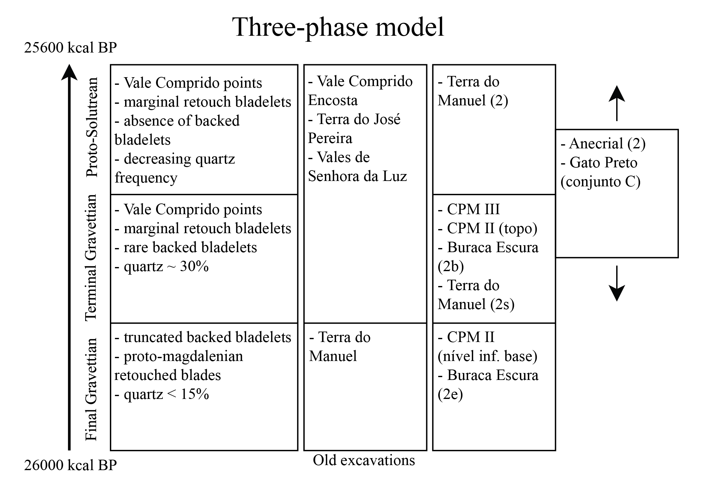
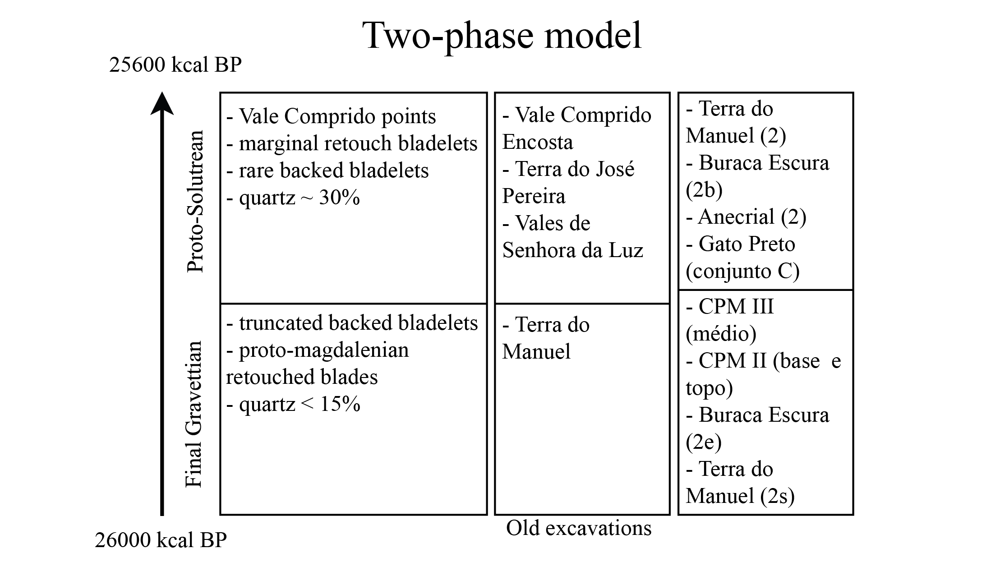

# Human adaptations at the start of the last glacial maximum

```{r date table setup, include=FALSE}
library(Bchron)
library(readr)
library(plyr)
library(dplyr)
library(kableExtra)

####
# Adapted from Marwick et al. 2017
dates <- read_csv("data/Dates (non cal).csv")
ages <- BchronCalibrate(ages=dates$`Age (BP)`,
                        ageSds=dates$SD,
                        calCurves=dates$Curve)
#summary(ages)
#plot(ages, withPositions=TRUE)
age_samples = lapply(ages, function(x) sample(x$ageGrid,size=2000,replace=TRUE,prob=x$densities))
df <- ldply(age_samples,quantile,prob=c(0.025,0.975))
dates_table <- dates[, c("Site",  "Level", "Lab. Ref",  "Age (BP)", "SD",
                         "Sample type")]
dates_table <- cbind(dates_table, df[,-1])
dates_table$`2.5%` <- round(dates_table$`2.5%`, 0)
dates_table$`97.5%`  <- round(dates_table$`97.5%`, 0)

row.names(dates_table) <- NULL

names(dates_table) <- c("Site",  "Level", "Lab. Ref",  "Age (BP)", "SD",
                        "Sample type", "Calibrated lower 95%", "Calibrated upper 95%")

```

## Paleoclimate, paleoenvironment and human adaptation models
The integration of paleoclimatic and paleoenvironmental data on archaeological studies can be traced to the last quarter of the twentieth century, especially in Portugal, which was also a result of the embryonic stage of research and methodologies developed until that moment [@cascalheira2010]. Nowadays, it is understood that there is the necessity of understanding the broader context and external pressures in order to understand human behavior and changes in the material culture, which is inevitably what is left behind [@holst2017; @thacker1996], especially when dealing with techno-complexes which are recognized as transitional climate-wise, such as the Proto-Solutrean [@almeida2000].

Some of the first attempts at reconstructing the paleoclimate in Portugal during the glacial era in the Upper Paleolithic were done by Roche [-@roche1971; -@roche1977], through the results obtained by the analysis of fauna in the Portuguese Estremadura. In this theory, the Iberian Peninsula did not go through dramatic climatic changes, unlike other areas in Europe, presenting instead milder conditions. This theory has since been subject to many critics [@zilhao1997; @almeida2000], through the postulation of harsher climatic conditions for the Iberian Peninsula during the Late Glacial.

Advances in paleoclimatic reconstruction, mainly from Greenland ice cores and deep-sea ice cores have allowed to understand the millennial scale oscillations within Marine Isotopic Stages (MIS) 4, 3 and 2 in better detail, and to obtain a solid chronology and understanding of the climatic conditions that characterized the later part of the Pleistocene [@cascalheiraandbicho2013].
During the Pleistocene, there were several climatic events that are nowadays understood as having had a significant impact on Western Europe, influencing most ecological aspects, from the environment and animal distribution, to human behavior, reflected on technology and territoriality patterns: the Dansgaard-Oeschger stadials (D-O stadials), sometimes associated with the formation of ice-rafted debris (IRD) layers in the ocean, named Heinrich events (HEs) [@cascalheiraandbicho2013; @heinrich1988].

The D-O stadials are described as rapid cyclical climatic changes, characterized in Greenland by oscillation between warmer and cooler moments. Within the D-O stadials, the term stadial is used to refer to the cold intervals, while the term interstadial is used to describe warmer periods [@sanchez-goni2010].

The HEs represent the expansion of polar water from the icebergs that broke off from the Laurentide Fenno-Scandinavian ice sheet and melted into the north Atlantic. These events have been detected in deep-sea cores by the presence of IRD, high percentages of polar water foraminifer (N. pachyderma), increase in magnetic susceptibility and decreases in sea surface temperatures [@fletcher2008; @goni2000; @sanchez-goni2010; @naughton2007]. Alike the D-O stadials, HE events are also periodical, with 6 identified HE events, occurring every 10-6 k years, since 63.2 ka, following the GICC05 chronology as applied by Sanchez-Goñi and Harrison [-@sanchez-goni2010], with durations as long as 3 k years and as short as 1.5 k.

These rapid climate changes, both D-O stadials and HEs are, as mentioned above, superimposed by longer-term climate patterns, the MIS which correspond to intervals of more (MIS 4 and 2) or less (MIS 3) permanent ice cover. Conventionally, MIS 4 is correlated with D-O 19, MIS 3 with D-O 17, while MIS 2 shows variable correlations, depending on the author, although the present study is adopting the consensus view that it corresponds to the boundary between D-O 4 and D-O 3 [@sanchez-goni2010]. Consequently, MIS 2 corresponds as well with the HE2 (which is associated with the D-O stadial 3), although the correlation of HE2 and the last glacial maximum (LGM) in truncated by the wide variety of dates shows for this event, with its onset sometimes superimposed by the start of HE2, or pushed later, starting at the middle of HE2 [@sanchez-goni2010]. Even so, there seems to an obvious correlation between the HE2 and the LGM, the latter having a wider temporal extension [@bradtmoller2012].

```{r echo=FALSE}
climate_table <- tibble(Items = c("MIS","LGM", "D-O Stadials", "Heinrich events"),
                    Text_1 = c(" ", " ", "GS 9", "HE 4"),
                    Text_2 = c(" ", " ", "GS 5", "HE 3"),
                    Text_3 = c("MIS 2", "?", "GS 3", "HE 2"))

knitr::kable(head(climate_table), booktabs = TRUE, col.names = c("Cultural transition","Mousterian-Aurignacian", "Aurignacian-Gravettian", "Gravettian-Solutrean"), caption = "Correspondence between cultural transitions, MIS stages, LGM, D-O Stadials and Heinrich events, following data from Sanchez-Goñi and Harrison (2010), Bradtmöller et al. (2012) and Cascalheira and Bicho (2013).") %>%
  kable_styling(position = "center")
```

Understanding HE events becomes even further complex, when understanding that certain HEs may show some internal variability, as is the case with HE2 and HE1 on the western Iberian coast, each with two identified phases: a first phase with increase in N. pachyderma percentages and presence of IRD, which suggest a decrease of sea surface temperatures, follow by a phase where polar foraminifera percentages decrease, suggesting a wider seasonal variability in sea surface conditions [@turon2003; @naughton2007].

This climatic variability is not only felt at a chronological level, through phases, but also at a geographic level, where land conditions (achieved by the analysis of pollen samples within the cores) seem to have been different in northern Iberia and southwestern Iberia as show the recovered cores in the southwestern area off Portugal: SU81-18 [@turon2003], SO75-6KL [@boessenkool2001]; and to the north western Iberia, off Galicia: MD99-2331 and MD03-2697 [@naughton2007]. In conjunction with other climate-proxy data, such as the Greenland ice cores, palynological studies, charcoal studies and faunal analysis, these records have allowed for the characterization of the paleo-climatic conditions of Western and Southern Iberia during the Pleistocene [@goni2000; @cascalheiraandbicho2013].

Records indicate that during HEs, and with particular severity in the HE2, Western and Southern Iberia must have experienced abrupt environmental changes, which altered the location, abundance and availability of resources for the communities of hunter-gatherers [@cascalheiraandbicho2013].

Regarding vegetation, the data from sites with archaeological layers dated to the HE2 time-span (e.g. Lapa do Anecrial) show that steppe landscapes and open pine woodlands prevailed. Meanwhile, a diversity of species was maintained by the existence of refuge zones, as warm-adapted vegetation became constrained in those areas, possibly located near the coast or in sunlit slopes of protected areas [@gonzalez-samperiz2010].

Pollen analysis from deep-sea cores show, for north western Iberia (cores MD99-2331 and MD03-2697), the existence of two periods, marked by the dominance of herbaceous communities (shrubs and grasses), along with a Pinus forest reduction, which indicate a land climate which was cold and humid. The second part of HE2 however, is characterized by Pinus forest expansion, hinting for less cold conditions [@naughton2007]. For southwestern territory (core SU81-18), pollen analysis show the expansion of semi-desert shrubberies, which suggest increased dry conditions during the full extension of the HE2, although, unlike results for northern Iberia, Pinus forests don’t seem to have decreased [@turon2003]. Alike the data obtained from archaeological sites, pollen analysis from cores shows the presence of a variety of deciduous trees and shrubs (Quercus, Corylus and Alnus), corroborating the idea of north and southern Iberia as refugium zones for temperate-climate species [@turon2003].

Faunal analysis, specifically micro-fauna, shows that these changes in habitats were followed by a change in animal incidence, with the increase of steppe adapted species, although warmer-adapted ones continued to appear in the archaeological record [@almeida2000]. The results for mammalian fauna analysis show a dominant pattern for pronounced resilience of most animal species in the archaeological records, with a few fluctuations in the presence of wild boar which may represent environmental responses to the rapid climate changes [@haws2012]. Brugal and Valente [-@brugal2007] also report mammalian fauna differences within the HE2, with a wider extinction of local carnivores, while herbivore frequency remains mostly the same, with large shifts in their spatial distribution.

Thus, despite results clearly showing that the HE2 caused abrupt modifications in the landscape and climate of Western and Southern Iberia [@cascalheiraandbicho2013], this territory still functioned as a refuge even during the colder periods [@gomez2007], in sheltered areas scattered throughout the landscape [@schmidt2012].

As mentioned above, these abrupt climate changes also impacted the communities of hunter-gatherers, which is visible in the archaeological record through the intensification and diversification in the technology and economy of lithic assemblages [@cascalheiraandbicho2013]. In fact, there has been a significant amount of proposals suggesting a full synchronism between the onset of each Upper Paleolithic technocomplex and the occurrence of the most severe climate impacts [@cascalheiraandbicho2013]. Bradtmöller et al. [-@bradtmoller2012] suggests a direct relationship between three of the HEs (4, 3 and 2), and the substitution of Neanderthals populations and emergence of Aurignacian, emergence of Gravettian and Solutrean, respectively. Based on the theoretical framework of Panarchy [@holling2002], the authors propose the Repeated Management Model (RRM), where the HEs are understood as the main climatic triggers for population turnover, through the breakdown of communication networks and cultural traditions which were subsequently reorganized under different socio-cultural conditions [@bradtmoller2012].

In this framework, the rapid climatic changes brought by the HE2 were the trigger for the reorganization of human groups after the Gravettian, which led to the development of the Solutrean, marked by harsh conditions onset by the LGM, where a technological continuum with clear succession between the two technocomplexes is seen, at least in Iberia [@bradtmoller2012]. However, this model and the correspondence of cultural tradition replacements with HEs and environmental changes doesn’t account for the Proto-Solutrean, possibly identifying it as either part of the Gravettian or Solutrean, which in a way, reflects the current understanding of the Proto-Solutrean as a transitional stage between the two technocomplexes, failing to recognize the technocomplex as an independent unit. 

It seems, however, that in order to fully understand the impact of the Heinrich 2 event and possibly the LGM on the communities of hunter-gatherers, and the replacement of the Gravettian technocomplex by the Solutrean, the Proto-Solutrean needs to be understood and regarded as an independent unit, as a means to understand its role in the RRM. This issue has been addressed by Cascalheira and Bicho [-@cascalheiraandbicho2013], where within the RRM, the authors suggest the Proto-Solutrean as a moment of creative destruction [@holling2001], which allowed the separation from the Gravettian cultural system to the development of a new structure, the Solutrean. There is however, the need for more data and dates in order to understand how the many different pieces fit together in this framework.

As such, the Proto-Solutrean stands as a technocomplex of essential importance to understanding human adaptations to climatic and environmental changes within the Upper Paleolithic.

## Proto-Solutrean: origins and the Portuguese model
Cultural horizons within the archaeological record have been traditionally defined through the characteristics and typologies of lithic materials, which are those preferentially preserved. The same is true for the Upper Paleolithic sequence, which in Europe was the result of several archaeological campaigns in Southwestern France, whose stratigraphic organization and sequence became the reference model throughout the continent [@zilhao1997].

Following this paradigm, the transition between the Gravettian and Solutrean was, for most of the second half of the twentieth century, based on the stratigraphy of Laugerie-Haute, in France, and thus defined in a four stage process: Perigordian VII, Aurignacian V, Proto-Solutrean, Lower Solutrean. This succession of stages was understood as the substitution of human people and culture through processes of diffusion and migration, a paradigm present in the archaeological thought previous to the 1960s, and which changed drastically with the development of New Archaeology. This new theorical framework allowed the traditional cultural horizon sequences to be understood as the result of technological development, which didn’t necessarily imply the substitution of people [@zilhaoetal1999]. The impact of these new frameworks can be seen, for example, in the interpretation of the Perigordian VII, the first stage in the Gravettian-Solutrean transitional process. Nowadays, it is known that the Perigordian VII is, in fact, the final stage of the Gravettian [@zilhao1997].

Aurignacian V, meanwhile, has been a slightly more complicated subject. Its identification was based on the presence of thick-nosed endscrapers, a technological characteristic that represented the presence of Aurignacian communities, and thus, moments of population substitution and migration in the site [@zilhao1997; @almeida2000]. Part of the problem was also that this level was only known in one site in France.

The study of materials from old excavations by Manuel Heleno in Rio Maior (Portuguese Estremadura), and new archaeological works in the same region, in the 1980s revealed assemblages from the Upper Paleolithic, some with levels of similar chronologies and typological characteristics which parallel those of Laugerie Haute. These projects allowed one of the most complete descriptions of the Upper Paleolithic occupations in Portugal, and the understanding of the Gravettian-Solutrean transition in more detail, including the problematic Aurignacian V [@zilhao1994; @almeida2000].
The Proto-Solutrean has thus been described as a transitional techno-complex from Gravettian to Solutrean technologies, through a process of local development, and synchronous to all of the Southwestern Europe (Aquitaine, Pyrenees, Languedoc and Iberian Peninsula) [@zilhaoetal1999].

In total, 9 sites with either Proto-Solutrean assemblages or transitional characteristics were identified in the Portuguese Estremadura area (although not all have been dated). Table X shows the dates for Proto-Solutrean occupations throughout Portugal, including the sites analysed in this study.

```{r echo=FALSE}
knitr::kable(dates_table, booktabs=TRUE, caption = "Summary of radiocarbon dates from Portuguese Proto-Solutrean. Adapted from Zilhão (1997), Cascalheira and Bicho (2013), Belmiro (2018) and Benedetti et al. (2019). Calibration curves are IntCal13 and Marine13, using OxCal 4.1.7 (online).") %>% 
  column_spec(1, bold = T) %>% 
  kable_styling(position = "center")
  
```

This set of dates from sites such as Anecrial, Terra do Manuel (layer 2s), Alecrim, Buraca Escura (layer 2e) and Lagar Velho (since other dates show either values which look like outliers or have extremely high standard deviations) place the transition as happening between 26 kcal BP and 25.4 kcal BP, although the traditional model sets the higher boundary to 25.6 kcal BP, where the lowest boundary represents the Final Gravettian and the highest the Proto-Solutrean [@zilhao1997; @zilhaoetal1999], without the existence of an intermediate phase (Lower Solutrean) between the Proto-Solutrean and the Middle Solutrean [@cascalheiraandbicho2013].

This chronology is based on the understanding of Gravettian-Solutrean transition through several phases, each with its technological characteristics and patterns, for which two models have been suggested: the Two-stage model and Three-stage model [@zilhao1994; -@zilhao1997; @zilhaoetal1999].
```{r fig.cap="Three-phase model for Gravettian to Proto-Solutrean transition, with site and archaeological level correlated with each phase. Adapted from Zilhão (1997). Model dates calibrated with curve IntCal13, using OxCal 4.1.7 (online)", out.width = '100%', echo=FALSE}

```
```{r fig.cap="Two-phase model for Gravettian to Proto-Solutrean transition, with site and archaeological level correlated with each phase. Adapted from Zilhão (1997). Model dates calibrated with curve IntCal13, using OxCal 4.1.7 (online)", out.width = '100%', echo=FALSE}

```

The Two-stage model starts with a Final Gravettian stage, characterized by a moderate use of quartz (~15%), production of truncated backed bladelets and proto-magdalenian retouch blades, where we find Terra do Manuel (old excavations and layer 2s), CPM III, CPM II and Buraca Escura (layer 2e) [@zilhao1997]. The second stage is the Proto-Solutrean, frequently characterized by a high percentage of quartz use (~30%), rare presence of backed bladelets and presence of “lamelas de retoque marginal”, and the production of Vale Comprido points, the techno-complex’s index fossil [@zilhaoetal1995; @zilhao1997; @almeida2000]. For the production of these tools, the Proto-Solutrean shows three different operative sequences: one destined to the production of Vale Comprido points, through the removal of elongated blanks with convergent profiles and thick platforms; another destined to the production of blades, of Gravettian tradition; and another for the production of bladelets, probably obtained through the exploitation of thick endscapers. Proto-Solutrean phase assemblages were identified in Vale Comprido – Encosta, Terra do José Pereira, Vales da Senhora da Luz (although there is the absence of Vale Comprido points in the assemblage), Terra do Manuel (layer 2), Buraca Escura (layer 2b), Anecrial (layer 2) and Gato Preto (group C) [@zilhao1997].

(Vale comprido points, drawings or photos)

In this model, the “Aurignacian V”, is understood as a functional facies, related to specialized occupations and production activities within the techno-complex, through the observation of the coexistence of prismatic core exploitation and carenated core exploitation, both for the extraction of blades and bladelets, thus showing the latter exploitation was not an independent system as thought at Laugerie Haute [@zilhaoetal1995; @zilhao1997]. In fact, Zilhão [-@zilhao1994; -@zilhao1997] has questioned the stratigraphic reality of  “Aurignacian V” from Laugerie-Haute, interpreting it as only a typology separation due to poor stratigraphic integrity.

The Three-stage model maintains the first Final Gravettian stage and its defining characteristics, but divides the following Proto-Solutrean stage in two. As such, there is an intermediate stage characterized by the intensive use of quartz (~30%), which corresponds to Laugerie Haute’s “Aurignatian V”, migrating the assemblages from Terra do Manuel (layer 2s), CPM III, CPM II and Buraca Escura (layer 2b) to this phase, with a third stage, the Proto-Solutrean, where quartz use diminishes and there is an important presence of carenated elements for the production of bladelets, where we find Terra do Manuel (layer 2). In this model, the Vale Comprido points and associated operative sequence may appear in either of the last two stages, although it is probable it was developed during the transition to the intermediate stage [@zilhao1997].

In this model, other sites Terra do José Pereira, Vales da Senhora da Luz, Anecrial and Gato Preto cannot be completely attributed to the intermediate or Proto-Solutrean phase, the latter two due to the specialized character of their occupations as referred by Zilhão [-@zilhao1997], while Vale Comprido is referred as an assemblage representative of the full consummation of the transition into the Proto-Solutrean.

Regarding the intermediate stage, Almeida [-@almeida2000] interprets the diagnostic Aurignacian thick-nosed endscrapers as carenated cores, with no correlation to the Aurignacian techno-complex, suggesting instead the substitution of the term Aurignacian V for Terminal Gravettian. Following previous works [@almeida2000; @cascalheiraandbicho2013; @benedettietal2019], when referring to the “Aurignacian V”, whether as a functional facies (Two-stage model) or as an intermediate stage (Three-stage model), the present study will apply the term Terminal Gravettian instead.

One of the main differences between these models mentioned above is connected to the lithic assemblage’s internal variability. In this case, the Three-stage model diminishes this internal variability by attributing chronological significance to the Terminal Gravettian [@almeida2000]. In this case, assemblages which, on the case of the Three-Phase model, seem to float between the Terminal Gravettian and Proto-Solutrean, for the lack of necessary information for the group attribution, while the Two-phase, because it accepts a bigger deal of internal variability but also limits the number of options, guarantees a specific phase can be attributed to all sites.

However, in the last decades, the Three-Phase model has been the most accepted, and the Terminal Gravettian phase is nowadays well characterized technologically in Estremadura as a moment of chronological significance [@almeida2000], even if from a chronographic perspective, it lacks irrefutable evidence as shown by Cascalheira and Bicho [-@cascalheiraandbicho2013], for which the authors present two causes: all available radiocarbon dates, spreading through the entire HE2 and covering the Proto-Solutrean’s time-span, come from sites whose assemblages are attributed to the Terminal Gravettian (with exception of Vale Boi); absolute ages of sites with a strong Vale Comprido component remain unknown.

Although this has been explained by some authors [e.g.,@aubryetal2011; @zilhao2013]) as the result of strong erosive processes affecting the archaeological sites during the HE2, other authors [@haws2012] fail to recognize such an extensive erosion.

Regardless of what model is accepted, the Proto-Solutrean, from the beginning of its transitional stage, stands as a techno-complex with technological innovations, reflected in the manufacture of Vale Comprido points and a complete operative sequence for their production, but marked by a high degree of technological variability in their lithic assemblages [@zilhao1997; @zilhaoetal1999; @almeida2000].

This variability has been interpreted as a technological race in response to the environmental modifications taking course during the HE2 has been suggested by Cascalheira and Bicho [-@cascalheiraandbicho2013]. The authors suggest that, in order to correspond to the external pressures, there may have been the need to diversify the economical strategies in use until the moment. The high exploitation of quartz, for example, formerly a secondary raw material, and the use of similar reduction strategies between quartz and chert, might represent one such economical response. The same possibly applies to the use of unprecedented raw materials for specific products, as is the case of the Proto-Solutrean levels in Vale Boi, where there is the presence of dolerite, used mainly in the manufacture of Vale Comprido points [@marreiros2009; @belmiro2018]. Likewise, alterations recorded in territoriality patterns for the Proto-Solutrean, which can be interpreted has extensive regional networks, may also be related to modifications in the landscape that occurred during the HE2 [@cascalheiraandbicho2013].

These technological and behavioural changes, when understood under the light of the Repeated Management Model previously discussed [@bradtmoller2012] and Panarchy [@holling2002], might be understood as moments of release and restructuration led by external pressures, in this case, climate changes [@cascalheiraandbicho2013].

Thus, following this framework, the Proto-Solutrean reveals itself as a moment of “creative destruction” [@holling2001], with moments of rupture and consolidation of technological innovations and social structures. In other words, the Proto-Solutrean might be understood as the moment where Gravettian cultural traditions were reconfigured to best adapt to climatic and landscape alterations, setting grounds for the emergence of another phase – the Solutrean [@cascalheiraandbicho2013].

However, despite the existence of a rather comprehensive knowledge about the techno-complex in the Portuguese Estremadura, which has allowed for a better understanding of the impacts of HE2 in hunter-gatherer communities and the emergence of the Solutrean, there is still the need for further studies, in order to fill existing gaps. One of these gaps is the concentration of data regarding this techno-complex in the Estremadura, whereas the Proto-Solutrean is still fairly unknown in other places throughout Southwestern Europe, in the case of Portugal, with only one site in the south (image x). Another issue, which has been mentioned already, is connected to the absence of absolute datings for Proto-Solutrean contexts, which limits the chronological definition of the techno-complex, and thus the testing of which transition model (if any) applies best [@cascalheiraandbicho2013].

Addressing these issues, through the study of Proto-Solutrean lithic assemblages from other areas in the Southwestern European territory, from sites with good stratigraphic preservation which allow absolute dating and accurate spatial tracking, will certainly help further understand this techno-complex, its patterns, stage transitions and possible regional variations.
