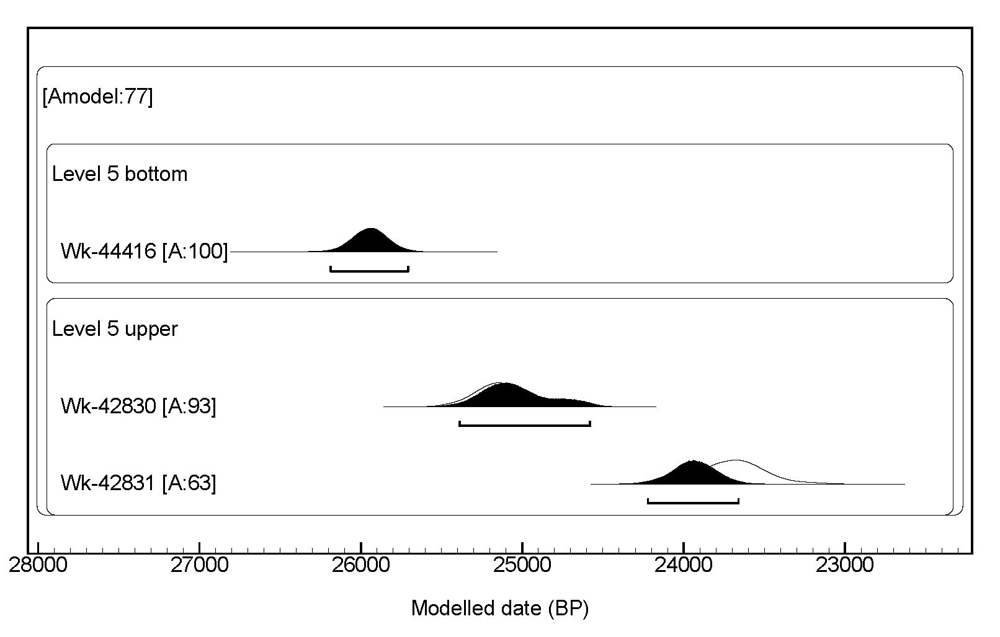

# Archaeological sites

```{r vbcontext setup, include=FALSE}
library(readr)
library(dplyr)
library(knitr)
library(kableExtra)
library(tidyr)
```
## Location and geological context

### Vale Boi

Vale Boi is an open-air site and rockshelter, located on the western coast of Algarve (Portugal), near a small homonymous village, within the municipality of Vila do Bispo (Figure \@ref(fig:vbmap)). The site is situated in a small valley that runs south to the Atlantic coast, about 2 km distance, relatively open, with a natural boundary to the east and bordered by a limestone hill through all its extension. This hill is marked, at specific points, by limestone exposures that form rock shelters with faces facing west or southwest (Figure \@ref(fig:vbphoto))[@bicho2003; @cascalheira2010; @cascalheiraetal2008].

The site extends for more than 10 000 $m^2$ on the slope of this valley, which is marked by a series of steps that run parallel to the river, possibly the result of Middle Pleistocene fluviatile erosion [@bicho2003].

The geologic context of Vale Boi is marked by heterogeneity. In the north, there are schist and greywacke formations from the Carboniferous. In the south, Triassic and Jurassic dolomite and limestone formations, which are gradually covered by Holocene dunes further into the coastal area, until near St. Vincent’s cape where they appear uncovered once again, along with small occurrences of chert [@verissimo2004].

```{r vbmap, fig.cap="Vale Boi. Location.",fig.align='center', out.width = '60%', echo=FALSE}

knitr::include_graphics("figure/vale_boi_map.png")

```

```{r vbphoto, fig.cap="Vale Boi. Topographic plan, schematic profile and general view, with location of the excavation loci. After Cascalheira et al. (2017).", fig.align='center', out.width = '60%', echo=FALSE}


```

### Lapa do Picareiro

Lapa do Picareiro is a cave site on the west facing slope of Serra d’Aire, a limestone massif north of the Tagus River valley and Lisbon, Portugal (Figure \@ref(fig:lpmap)) [@benedettietal2019; @bicho2006]. The massif is underlain by the Serra d’Aire formation, a thick-bedded limestone of the Middle Jurassic age [@carvalho2018]. The Serra d’Aire is part of a large limestone province (Maciço Calcário Estremenho), which accounts for several Palaeolithic occupations, both cave and open-air sites [@almeida2000; @benedettietal2019].

The interior of the chamber is about 11 x 14 m, and has more than 10 m of coarse sedimentary infill in inclined beds, derived from roof collapse, gravity flows and fine sediment infiltration (Figure \@ref(fig:lpcave)) [@benedettietal2019]. The cave opening is marked by the existence of a large limestone cone of stone blocks [@bicho2006] while the sediment inside the cave consists of smaller and angular limestone clasts in a matrix of fine sediment [@benedettietal2019].

```{r lpmap, fig.cap="Lapa do Picareiro. Location.", fig.align='center', out.width = '60%', echo=FALSE}

knitr::include_graphics("figure/picareiro_map.png")

```

```{r lpcave, fig.cap="Lapa do Picareiro. Generalized cross section showing surface topography, shape of the cave, and area excavated into sedimentary fill. After Benedetti et al. (2019).", fig.align='center', out.width = '60%', fig.pos="H", echo=FALSE}


```

## Research history, stratigraphy and human occupation

### Vale Boi

Vale Boi was firstly discovered as the result of a multidisciplinary project (A ocupação Humana Paleolítica do Algarve) developed in 1996, led by Nuno Bicho and funded by the Fundação para a Ciência e Technologia (FCT). The goal of this project was to characterize the regional Paleolithic and Epipaleolithic, building an absolute chronology for the pre-historic sequence in the Algarve, motivated by the lack of known Paleolithic sites in this region [@cascalheira2010]. Through ground reconnaissance and the opening of test pits, the project focused on the areas with higher potential for Paleolithic occupations (specifically in what concerns to topography, access to natural resources such as fresh water, proximity to raw materials, proximity to specific geologic units) [@bicho2003]. Sixty-five archaeological sites were identified, 7 with identifiable gravettian, solutrean and magdalenian occupations, from which Vale Boi offered the best results [@cascalheira2010]. For this reason, the site has been systematically excavated and has had several funded projects (*e.g.* “A importância dos recursos aquáticos no Paleolítico do Algarve” and “História de dois mares: ecologia do Paleolítico Superior em Vale Boi”).

The archaeological interventions started in 2000, with the opening of several units on the Slope area, where there was a significant concentration of archaeological materials at the surface, and where the topography seemed adequate for the preservation of in situ materials [@bichoetal2010]. From 2002 onwards, some of these excavation units were expanded, aiming to identify the extension of the site [@cascalheira2013].

In 2003, new excavation units were open on the west and east limits of the site, which led to the excavation of another two areas, the Shelter and the Terrace, that would be incrementally expanded through the following years.

In 2012, a new 8 $m^2$ area was open in the Terrace (rows H and I), to understand the stratigraphic sequence in more detail and assess the existence of older cultural horizons, from the early Upper Paleolithic.

Vale Boi shows a variety of human occupations, distributed across the three main areas, which have been interpreted differently in terms of functionality: Slope, Shelter, and Terrace (Figure \@ref(fig:vbphoto)).

#### Slope

In this area, three moments of occupation have been identified, although the first layer seems to be very altered, with only the presence of sorted, small lithics and no associated fauna. This layer corresponds to a magdalenian occupation. The other levels, however, seem to be in situ, since there were faunal remains in anatomical position, the presence of stacked, well preserved shells and general horizontal disposition of the materials, without size sorting, which often happens through pluvial action [@bicho2003].

The solutrean occupation is characterized by bigger lithics than those found in the layer above, abundant animal bones and shells, with relatively less rabbit than the layer below. This layer is also marked by a moment of geological discontinuity through the presence of a large number of limestone blocks and pebbles (which are probably related to the start of the LGM, and where proto-solutrean materials were found, including a Vale Comprido point [@cascalheira2010].

Bellow the discontinuity, there is a gravettian occupation, with a more significant number of artifacts, specifically a high number of ornaments of *Littorina obtusata* and deer teeth, as well as at least 12 identified bone tools [@cascalheira2010].

This area has been interpreted as a midden, the result of waste produced by several human activities, such as the production and maintenance of lithic artifacts, preparation of food, and carcass treatment [@bicho2003].

#### Shelter

The occupation levels in this area were located under blocks of limestone, which collapsed from the rockshelter ceiling, and where occupations of magdalenian, solutrean, and gravettian chronologies have been identified across four distinct litho-stratigraphic units.

A small combustion structure was identified in this area, within the solutrean layers. This structure was circular, with around 50 cm of diameter, formed by limestone pebbles and blocks. The area around the fireplace was marked by calcination, where several artifacts were found with thermal alterations [@cascalheiraetal2008].

The Shelter has been interpreted as a residential space, differing from the previous area, especially in the representation of the stone tool reduction sequences, the preservation of the bones, which are less fragmented, the diversity of shells used as ornaments and the presence of a decorated schist plaque. This seems to point towards the use of the shelter as a daily camping area [@cascalheira2010].

#### Terrace

As previously mentioned, excavations in the Terrace area started in 2003. The identification of two human occupation levels and a possible limestone block pavement led to the area’s expansion, in the following year, towards the south and western boundaries. This expansion allowed the identification of a hut pavement attributed to the Early Neolithic based on the recovered ceramics and lithic materials [@carvalho2008].

Excavations on the Pleistocene levels of the area started in 2004/05 [@cascalheira2010; @marreiros2009], intending to find Paleolithic habitat structures [@cascalheiraetal2008], and allowed the identification of two different layers, marked by an intermediate moment of geologic discontinuity. While the upper layers showed materials attributed to the Solutrean, the bottom levels allowed the identification of a gravettian occupation [@cascalheira2010; @marreiros2009]. In this latter horizon, in 2007, a combustion structure was identified, adjacent to the north wall. This structure was characterized by an ovoid shape, achieved by the combination of small limestone blocks with what seemed a larger repurposed block, and was full of burnt organic remains as well as large quantities of charcoal, in association with lithic materials [@cascalheira2010].

Thus, the excavation in this area (units J, K and L) allowed for the identification of 4 layers: layer 1, marked by ceramics and possibly disturbed by agricultural works; layer 2, characterized by the neolithic occupation mentioned above; layer 3, which corresponds to several solutrean occupation levels; and layer 4, with two human occupations attributed to the gravettian technocomplex [@marreiros2009].

After 2012, the Terrace area was expanded, with the opening of two new rows, H and I (in a total of 8 $m^2$). Since then, six layers have been identified (Table \@ref(tab:vbstrat)) containing the description of their sediment characteristics and associated cultural horizons). In some of these layers, lateral sediment variations were identified, which were coded in the field through the concatenation of a letter to the layer number (*e.g.* 4E). In many of these cases, the isolation of this vertical variation did not show any patterns in terms of spatial concentration of materials, although in others, like the 4E facies, the subdivision of the layer correlated with the spatial distribution of Vale Comprido technology.

In the new area, layers 1 and 2 continue to represent holocene levels, with the first layer being possibly disturbed by agricultural processes. Layer 2, with a thickness of 25-30 cm, in concordance with the excavations prior to 2005, shows a neolithic occupation.

Layer 3 has a silt and clay matrix sediment, with some inclusions and showing interruptions of limestone clast depositional episodes, although there is the constant presence of fauna and lithic artifacts. As mentioned above, the different material and cultural characteristics within the same geologic package led to the subdivision of the layer in layer 3A, attributed to an epipaleolithic occupation, and 3B, assigned to the Solutrean.

Layer 4 is very similar to layer 3. However, it is separated from it by a gravel level. Similarly to layer 4, these layers have been subdivided regarding different degrees of sediment compaction and/or concentration of organic materials, showing two differing cultural horizons: Solutrean and Proto-Solutrean (limited to layer 4E).

Layer 5 has a dark coloration and a silt and clay matrix characterized by an intense presence of organic elements, frequently calcinated. There is the presence of a proto-solutrean horizon within the top levels, although occupation intensity seems to diminish with depth (see Chapter 5).

Finally, layer 6 is very similar to the previous layer, although it shows the presence of a larger quantity of small and medium-sized limestone clasts. A gravettian horizon has been attributed to this layer, but the analysis of the materials is currently in progress.
\  

```{r layertable, include=FALSE}

layers_table <- read_csv("data/VBlayers_table.csv")
layers_table <- layers_table %>%
  na.omit()

```

```{r vbstrat, echo=FALSE}

knitr::kable(head(layers_table [1:2], 6),  booktabs = TRUE, caption = "Vale Boi terrace identified layers with sediment description.") %>% 
  column_spec(1, bold = T) %>% 
  kable_styling(font_size = 9) %>% 
  column_spec(2, width = "12cm") %>%
  column_spec(1, width = "2cm") %>% 
  kable_styling(latex_options = "hold_position")

```

\  

Regarding layers 4E and 5, although they are indeed layers with different sedimentary packages, they show similar technological and archaeological patterns, which led to the conclusion they were the same cultural horizon (the opposite, one single layer with different cultural horizons is equally present in the Terrace, as seen with the epipaleolithic and solutrean occupations of layer 3). 

These layers, 4E and 5, are vertically contiguous, separated by a relatively flat surface covered by large limestone blocks. Unlike what was expected, however, these levels did not reveal a gravettian assemblage with characteristics similar to previous years [@marreiros2009], but rather materials with patterns similar to those expected in a proto-solutrean assemblage (the most noticeable of all being the Vale Comprido points and blanks). The context was dated using a charcoal sample to c. 24.7-25.3 ka cal BP, and a shell sample to c. 23.7-24.1 ka cal BP (Table \@ref(tab:protodates)).

The bottom spits of layer 5, on the other hand, show a relatively dense concentration of *Littorina littoreia*, an unprecedented shell species at the site, and often associated with colder waters, having a high freezing tolerance [@murphy1979; @clarke2000]. This context was dated through a shell sample, showing dates ranging between the 26-26.3 ka cal BP, which corresponds to the first half of the HE 2 [@sanchez-goni2010].

Figure \@ref(fig:spatialvbfig) represents the vertical distribution of all piece-plotted lithics in the Terrace, rows H and I. One of the most noticeable features is the vertical constraint in the distribution of dolerite pieces, mostly concentrated on Layer 4E and upper levels of Layer 5, coinciding also with the higher concentration of lithic materials in these layers. Likewise, the presence of Vale Comprido points is also associated with the Layer 4E and the top levels of Layer 5 [@belmiro2017], which seems to occur around 25 ka cal BP (Figure \@ref(fig:c14VB)). The WK-44416 date seems to show that, at least from around c. 26 ka cal BP, the site was occupied even if with lower intensity, a date that falls onto the Final Gravettian/Proto-Solutrean or Final Gravettian/Terminal Gravettian transition in the traditional models [@zilhao1997].

```{r c14VB, echo = FALSE, fig.cap = "Vale Boi. Radiocarbon results for layers 5 and 4. The results presented are modeled dates based on a Bayesian model (Ramsey 2009) using all dates available for the straitgraphic sequence of the Terrace area. All dates were calibrated using the IntCal13 and Marine13 curves (Reimer et al. 2013), using a regional Delta value of 265+/- 107 in the case of marine shells. The Oxcal script bayesian model is provided as online supplementary materials.", fig.align= 'center', out.width = '60%'}



```

\  

\  

The radiocarbon results represented on figure \@ref(fig:c14VB) seem to show that there are three distinct chronological moments within layer 5. Given the horizontal distribution of the dates from upper layer 5, it may seem, however, that the dates which fall onto the c. 24 ka cal BP are intrusions from the upper layer.

```{r spatialvbfig, fig.cap="East profile stratigraphy in the Terrace area (above) and distribution of all tridimensionally coordenated lithics in the new excavation area until 2017 (under). Lithis from layers 4E and 5 are coloured in black. Blue crosses represent dolerite artefacts and stars mark the provenance of each radiocarbon date: A - WK-42830; B - WK-42831; C - WK-44416.", fig.align='center',out.width = '80%', echo=FALSE, fig.pos="H"}

knitr::include_graphics("figure/SpatialanalysisVB.png")

```

### Lapa do Picareiro

Lapa do Picareiro was first investigated during the 1950s by Marques, and then in 1964 by Fernandes Gomes and Gil Andrade, who excavated the cave and opened a test pit. Although the results have never been published, it is known that finds included several human remains associated with decorated pottery [@bicho2006; @bichoetal2000; @haws2004; @zilhao1997b].

Two decades after, in 1988, the site was revisited by João Zilhão and members of the STEA (Sociedade Torrejana de Espeleologia e Arqueologia). This visit resulted in the identification of several archaeological levels in the profiles from previous interventions, and the recovery of some archaeological finds that suggested the existence of an Upper Paleolithic context in the site [@haws2004; @zilhao1997b]. One of these archaeological finds was a Vale Comprido point, found at the base of the test pit, by the cave wall [@zilhao1997b]. Despite the finds, these interventions did not include excavations.

The site was re-examined once again in 1994 by Nuno Bicho. This intervention confirmed the suspicion that the site was occupied during the Upper Paleolithic, with at least two occupations and deposits that seemed to extend much deeper [@haws2004].

From 1994 to 2001, the site was systematically excavated by Nuno Bicho and his team as part of an interdisciplinary project [@bicho2006; @bichoetal2000], which revealed 19 stratigraphic levels, 6 of which had archaeological occupations dated to the Magdalenian [@haws2004].

These excavations were then resumed in 2005, under the direction of Jonathan Haws, which continue to the present day [@holst2017]. 40 stratigraphic levels have been identified to a depth of 10 m [@benedettietal2019], encompassing all the traditional Upper Paleolithic technocomplexes, as well as Middle Paleolithic levels.

Lapa do Picareiro shows a long sequence of occupations, from the Middle Palaeolithic, Upper Palaeolithic, Epipaleolithic, Neolithic and Bronze Age, the latter three mostly focused in the front of the cave, and adjacent outside areas [@benedettietal2019; @bicho2006].

The palaeolithic finds were, so far, recovered from two main areas: the main chamber and a niche in the rear wall. The main chamber shows a sequence of middle to upper palaeolithic occupations, centered on units E7 to F8 [@benedettietal2019]. The main feature in this area is a large magdalenian hearth in level F/G with associated lithics and a large quantity of fauna, which was interpreted as a particular purpose occupation for processing animal carcasses [@bicho2006]. The niche finds, concentrated in units XX9 to ZZ11, present a series of smaller, stacked hearths, radiocarbon dated to the Magdalenian, Solutrean, Proto-Solutrean and Terminal Gravettian [@benedettietal2019].

The large hearth and associated features are the only areas where human activity disturbed the sedimentary sequence. In all other areas, human activity is limited to thin hearths in association with sporadic lithic concentrations and modified bones. These periods of occupation appear in the sedimentary sequences as alternated with moments of culturally sterile faunal occupation [@benedettietal2019]. Thus, human activity at the site might be understood as several discontinuous occupations inside the cave throughout the late Middle and Upper Palaeolithic, which intensified through the latter with a significant peak during the Magdalenian.

Table \@ref(tab:lpstrat) (Appendix A), adapted from Benedetti et. al [-@benedettietal2019], shows the complete description of all currently identified levels in the site and, whenever existent, associated lithic assemblages. From the 34 levels described in the table, 23 show human occupations or association with a lithic assemblage, and 20 of these can be attributed to the Upper Paleolithic:

Magdalenian occupations are divided into Late Magdalenian (levels E-J) and Early Magdalenian (levels K-L). Late magdalenian levels show a base brown color matrix and internal variability in terms of sediment, with variation between small to large clasts, and abundance of charcoal and bone fragments to few bones only. Early magdalenian levels show less variability, displaying a dark brown color matrix, and friable sediment with small to medium clasts and few bones.

Solutrean occupations occur in levels O, R, and S (level P showing neither bone fragments nor a lithic assemblage), maintaining a brown color matrix but varying between dark to light. The sediment is friable, composed of small to medium clasts, with the frequent presence of charcoal and bones.

Level T, approximately 50 cm thick, has a dark brown color matrix, with the presence of medium to large clasts and boulders, abundant charcoal and bones. The sediment is reddish and muddy in the lower half. This level is comprised of several lithic assemblages which have been attributed to differing technocomplexes: Solutrean in the upper level; Proto-Solutrean in the middle portion of T; and Terminal Gravettian in the lower portion of the level [@benedettietal2019].

The terminal gravettian occupation was also identified in level U, a ~15 cm thick layer with a brown color matrix and, near the rear wall, a reddish muddy matrix that resembles lower T sediment. It has small to medium clasts and includes several lenses with abundant small animal bones and bone fragments.

Levels V, W, and X were associated with gravettian occupations, all three showing a dark brown matrix, with variation between muddy and fine sediment, all with the abundant presence of small animal bones. Levels BB, DD, and FF (each intercalated with culturally sterile levels), varying between a dark brown and reddish-brown color matrix, have an associated early upper paleolithic lithic assemblage.

An aurignacian occupation is present in level GG, characterized by a dark brown color matrix, and a slightly hard to very hard sediment matrix, with the presence of calcite cement, bones, and bone fragments.

The stratigraphic sequence, as mentioned before, shows an alternation between faunal occupations, rich in bones and bone fragments, and clearly defined cultural horizons. This is explained by the continuous long-term accumulation of sediments, a result of the cave setting and cave morphology. These factors not only allowed continuous deposition but also contributed to the preservation of fauna and lithics. The sequence also shows good stratigraphic integrity, without the presence of bioturbation in its interior (signs of bioturbation by the action of roots are only present at the entrance of the cave) [@benedettietal2019].

#### Levels U and T

The physical distinction between level U and the lower portion of T is hard to make near the niche. In this area, both levels show similar reddish muddy sediment and the presence of animal bones in level T increases. As such, in this area, the attributed level to the recovered artifacts was T/U instead.

Layer T/U is about 15 cm thick, with the presence of possible combustion features and distinct activity areas. The recovered artifacts show a rich faunal assemblage, with a high presence of red deer, though ibex presence is also important, and a superabundance of rabbit bones. A few bone tools were also found. Other recovered artifacts also include a perforated marine shell and a perforated red deer canine tooth (Figure \@ref(fig:teeth)).

The niche area was where most of the lithic assemblage from these levels was found. As shown in image \@ref(fig:spatialut), there is an apparent concentration of lithics, comprised mostly of quartz and rock crystal, and some chert, all raw materials appearing mostly in the shape of bladelets.

\  

```{r teeth, fig.cap="Lapa do Picareiro - Layer U and lower T. Perforated red deer canine teeth. After Haws et al. (2019).", out.width = '80%', echo=FALSE, fig.align='center'}

knitr::include_graphics("figure/LP_teeth.jpg")

```

\begin{landscape}
```{r spatialut, fig.cap="Lapa do Picareiro. Spatial distribution of all plotted artefacts from levels T-U (in grey), lithic artefacts in colours and shapes refering to raw material and class. After Haws et al. (2019).", out.width = '80%', fig.align='center', echo=FALSE}

knitr::include_graphics("figure/LPspatial.jpg")

```
\end{landscape}

For U and lower T, radiocarbon dates (Figure \@ref(fig:c14LP)), all obtained from charcoal samples, show results of c. 27-26 cal ka BP, except for one of lower T dates which presents a result of c. 25-24 cal ka BP.

The middle part of T shows the presence of circular concentrations of charcoals, about 10-15 cm thick, which have been interpreted as hearths. Aside from these features, there is a high frequency of animal bones, following the same species patterns as level U and lower T (although these results are preliminary).

The lithic assemblage in this portion of level T is found in two areas: an accumulation of lithics surrounding the hearths and other scattered pieces in the same spits as the hearths but in different units. This assemblage is mostly comprised of chert, also with the presence of quartz and rock crystal, in the form of bladelets and flakes. Although the presence of traditionally-defined Vale Comprido points is not completely attested, there are several blanks which seem to resemble this type of technology, in the form of convergent elongated blanks.

The dates for middle T (Figure \@ref(fig:c14LP)), obtained from charcoal and bone samples, provided results of c. 25-24 ka cal BP, with one date presenting a range of c. 23.4-23.6 ka cal BP.

There is a clear separation between the two groups, one composed of levels U and lower T, and the other of middle T. This is particularly evident on the spatial dispersion of lithics and other artifacts shown on Figure \@ref(fig:spatialut), where there is an accumulation on the bottom left, correspondent to the U/T levels, and another aggregation in the middle portion, to the right, ranging from 20-40 cm of depth difference between the groups.

The patterns in the lithic assemblages also indicate a clear difference between the groups: the high frequency of quartz/rock crystal bladelets of U/T shows a marked difference from the middle T, where chert frequencies are higher, and there is a more balanced frequency of bladelets and flakes.

Finally, the dates for both U/T and middle T strengthen further the separation between the occupations, showing a gap of c. 2 k years between the assemblages, and placing the U/lower T occupation somewhere around 27-26 cal ka BP and the middle T occupation at c. 25-24 cal ka BP.

These clear spatial, raw-material and chronological differences, while maintaining some technological similarities, seem to be consistent with the Three-phase model developed for the evolution of the Proto-Solutrean in the Estremadura (see Chapter 2), where there are two distinct moments with chronological relevance which cannot be better explained by the existence of a functional facies.

However, the dates are not in concordance with the models developed for the Proto-Solutrean in the Portuguese Estremadura [@zilhao1997]. The lower depth group, which has been determined as Terminal Gravettian, shows some concordance with dates for other sites (*e.g.* Lagar Velho) placing these occupation in the transition between the Final Gravettian/Terminal Gravettian. The dates associated with the highest quantity of chert, however, seem to extend the supposed proto-solutrean chronological range to much younger dates (leaving out WK-37655c and UGAMS-23727, which show significant chronological differences from the other dates), placing it at the 24.5 ka cal BP.

```{r c14LP, echo = FALSE, fig.cap = "Lapa do Picareiro. Radiocarbon results for layers U and T. The results presented are modeled dates based on a Bayesian model (Ramsey 2009) using all dates available for the stratigraphic sequence of the cave. All dates were calibrated using the IntCal13 curve (Reimer et al. 2013). The Oxcal script bayesian model is provided as online supplementary materials.", fig.align= 'center', out.width = '60%'}

knitr::include_graphics("figure/c14_LP.png")

```

## Excavation methodology

Both sites were mapped using a 1x1 m alphanumeric grid system, creating a combination of lettered and numbered rows, which correspond to the excavation units. The deposits were excavated by natural litho-stratigraphic units, subdivided into 5 and 10 cm spits for Vale Boi and Lapa do Picareiro, respectively.

Within each spit, the 3D location of all artifacts with dimensions superior to 2 cm is recorded with a Total Station, except for small complete artifacts, such as ornaments, complete bones or small bladelets, which are always recorded despite their size.

All pieces have a sequential Identification Number (ID) by unit. This ID is given by the software EDM where all the contextual information of the artifact is recorded (layer, spit, unit, and code), which is then associated with the materials through pre-printed labels. Each label has an ID, site designation and a barcode which allows access to artifact information in the lab. The same type of label is used for the materials recovered from the sieves that correspond to all materials found in each 10 l bucket of sediment for Vale Boi and each artificial spit for Lapa do Picareiro. In Vale Boi, the association with Total Station data is made by measuring a coordinate in the center of the excavated area from where the sediment is coming from. 

All sediment is sieved using 3 mm mesh grids in the case of Vale Boi. At Lapa do Picareiro sieves with 2 mm and 4 mm meshes are used. The latter is sorted in the field, while the smaller sieve sediment is taken to the laboratory for water screening, in order to recover small bones or other types of artifacts like lithic chips.