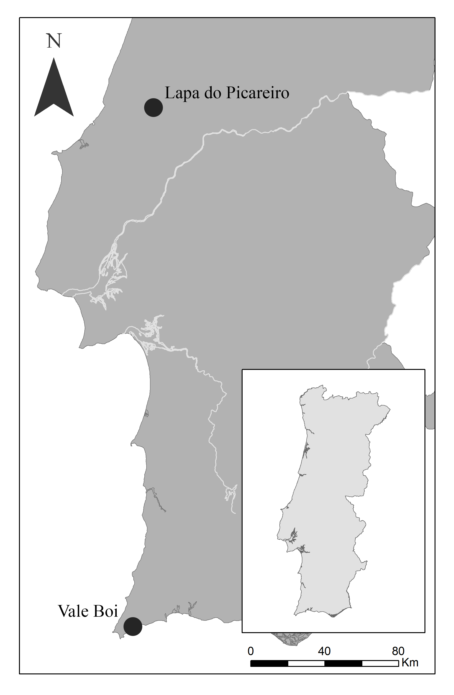
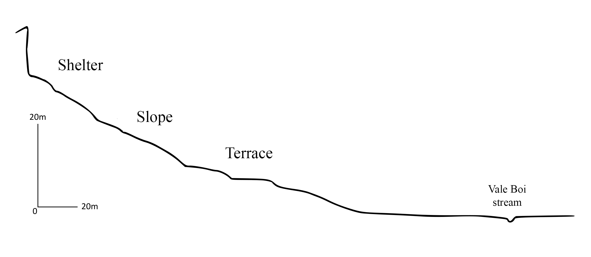

# Vale Boi

```{r vbcontext setup, include=FALSE}
library(readr)
library(dplyr)
library(knitr)
library(kableExtra)
library(tidyr)
```

## Localization and geologic context
Vale Boi is an open-air site and rockshelter, located on the western coast of Algarve (Portugal), near a small homonymous village, within the municipality of Vila do Bispo. The site is situated in a small valley that runs south to the Atlantic coast, about 2 km distance, relatively open, with a natural boundary to the East and bordered by a limestone hill through all its extension. This hill is marked, at specific points, by limestone exposures that form rock shelters with faces facing west or southwest (Bicho et al. 2003; Cascalheira et al. 2008; Cascalheira 2010).

```{r vbmap, fig.cap="Location of Vale Boi and Lapa do Picareiro archaeological sites.",fig.align='center', out.width = '50%', echo=FALSE}

```

The site extends for more than 10 000 m2 on the slope of this valley, which is marked by a series of steps that run parallel to the river, possibly the result of Middle Pleistocene fluviatile erosion (Bicho et al. 2003).

```{r vbphoto, fig.cap="Archaeological site of Vale Boi.",fig.align='center', out.width = '50%', echo=FALSE}
knitr::include_graphics("figure/VB_site.jpg")
```

The geologic context of Vale Boi is marked by heterogeneity. In the north, there are schist and greywacke formations from the Carboniferous, and in the south, Triassic and Jurassic dolomite and limestone formations, which are gradually covered by Holocene dunes further into the coastal area, until near St. Vincent’s cape where they appear uncovered once again, along with small occurrences of chert (Veríssimo 2004).
	
## Archaeological works
Vale Boi was firstly discovered as the result of a multidisciplinary project (A ocupação Humana Paleolítica do Algarve) developed in 1996, led by Nuno Bicho and funded by the Fundação para a Ciência e Technologia (FCT), with the goal of characterizing the regional Paleolithic and Epipaleolithic, building an absolute chronology for the pre-historic sequence in the Algarve, and motivated by the lack of known Paleolithic sites in this region (Cascalheira 2010). Through ground reconnaissance and the opening of test pits, the project focused on the areas with higher potential for Paleolithic occupations (specifically in what concerns to topography, access to natural resources such as fresh water, proximity to raw materials, proximity to specific geologic units) (Bicho et al. 2003). Sixty-five archaeological sites were identified, 7 with identifiable Gravettian, Solutrean and Magdalenian occupations, from which Vale Boi offered the best results (Cascalheira 2010). For this reason, the site has been systematically excavated and has had several funded projects (e.g. “A importância dos recursos aquáticos no Paleolítico do Algarve” and “História de dois mares: ecologia do Paleolítico Superior em Vale Boi”).

The archaeological interventions started in 2000, with the opening of several units on the slope area, where there was a significant concentration of archaeological materials at the surface, and where the topography seemed adequate for the preservation of in situ materials. From 2002 onwards, some of these excavation units were expanded, aiming to identify the extension of the site (Cascalheira 2013).

In 2003, new excavation units were open on the west and east limits of the site, which led to the excavation of another two areas, the Shelter and the Terrace, that would be incrementally expanded through the following years.

In 2012, a new 8 square meters area was open in the Terrace (rows H and I), to understand the stratigraphic sequence in more detail, and assess the existence of older cultural horizons, from the early Upper Paleolithic.

## Excavation methodology
The site is mapped using a 1x1 m alphanumeric grid system, creating a combination of lettered and numbered rows, which correspond to the excavation units. The deposits were excavated by natural litho-stratigraphic units, subdivided into 5 cm spits.

Within each spit, all artifacts with dimensions superior to 2 cm are coordinated three-dimensionally with a Total Station, except for small complete artifacts, such as ornaments, complete bones or small bladelets, which are always recorded despite their size.

All pieces have a sequential identification number (ID) by unit. This ID is given by the software EDMWin where all the contextual information of the artifact is recorded (layer, spit, unit, and code), which is then associated with the materials through pre-printed labels. Each label has an ID, site designation and a barcode which allows accessing artifact information in the lab. The same type of label is used for the materials recovered from the sieves that correspond to all materials found in each 10 L bucket of sediment retrieved at the moment of the excavation, plotted at the center of the excavated area. These buckets, after full, are sieved near the excavation area, using 3 mm mesh grids, and then the recovered materials are associated with the respective label.

## Human occupation 
Vale Boi shows a variety of human occupations, distributed across three main areas, which have been interpreted differently in terms of functionality: Slope, Shelter, and Terrace (fig x).

```{r fig.cap="Vale Boi area scheme.", out.width = '100%', echo=FALSE}

```

### Slope
In this area, three moments of occupation have been identified, although the first layer seems to be very altered, with only the presence of sorted, small lithics and no associated fauna. This layer corresponds to a Magdalenian occupation. The other levels, however, seem to be in situ, since there were faunal remains in anatomical position, the presence of stacked, well preserved, shells and general horizontal disposition of the materials, without size sorting, which often happens through pluvial action (Bicho et al 2003).

The Solutrean occupation is characterized by bigger lithics than those found in the layer above, abundant animal bones and shells, with relatively less rabbit than the layer below. This layer is also marked by a moment of geological discontinuity through the presence of a large number of limestone blocks and pebbles (which are probably related to the start of the Last Glacial Maximum, and where Proto-Solutrean materials were found, including a Vale Comprido point (Cascalheira 2010).

Bellow the discontinuity, there is a Gravettian occupation, with a more significant number of artifacts, specifically a high number of ornaments of Littorina obtusata and deer teeth, as well as at least 12 identified bone tools (Cascalheira 2010).

This area has been interpreted as a midden, the result of waste produced by several human activities, such as the production and maintenance of lithic artifacts, preparation of food, and carcass treatment (Bicho et al 2003).

### Shelter

The occupation levels in this area were located under blocks of limestone, which collapsed from the rockshelter ceiling, and where occupations of Magdalenian, Solutrean, and Gravettian chronologies have been identified across four distinct litho-stratigraphic units.

A small combustion structure was identified in this area, within the Solutrean layers. This structure was circular, with around 50 cm of diameter, formed by limestone pebbles and blocks. The area around the fireplace was marked by calcination, where several artifacts were found with thermal alterations (Cascalheira et al 2008).

The shelter has been interpreted as a residential space, differing from the previous area, especially in the representation of the stone tool reduction sequences, the preservation of the bones, which are less fragmented, the diversity of shells used as ornaments and the presence of a decorated schist plaque, thus pointing towards the use of the shelter as a daily camping area (Cascalheira 2010).

## Terrace: Stratigraphy and layers 4E and 5
As previously mentioned, excavations in the Terrace area started in 2003. The identification of two human occupation levels and a possible limestone block pavement led to the area’s expansion, in the following year, towards the south and western boundaries. This expansion allowed the identification of a hut pavement attributed to the Early Neolithic based on the recovered ceramics and lithic materials (Carvalho 2008).

Excavations on the Pleistocene levels of the area started in 2004/05 (Marreiros 2009; Cascalheira 2010), intending to find Paleolithic habitat structures (Cascalheira et. al 2008), and allowed the identification of two different layers, marked by an intermediate moment of geologic discontinuity. While the upper layers showed materials attributed to the Solutrean, the bottom levels allowed the identification of a Gravettian occupation (Cascalheira 2010; Marreiros 2009). In this latter horizon, in 2007, a combustion structure was identified, adjacent to the north wall. This structure was characterized by an ovoid shape, achieved by the combination of small limestone blocks with what seemed a larger repurposed block, and was full of burnt organic remains as well as large quantities of charcoal, in association with lithic materials (Cascalheira 2010).

Thus, the excavation in this area (units J, K and L) allowed for the identification of 4 layers: layer 1, marked by ceramics and possibly disturbed by agricultural works; layer 2, characterized by the Neolithic occupation mentioned above; layer 3, which corresponds to several Solutrean occupation levels; and layer 4, with two human occupations attributed to the Gravettian technocomplex (Marreiros 2009).

After 2012, the Terrace area was extended, with the opening of two new rows, H and I (in a total of 8 m2). Since then, six layers have been identified (table X containing the description of their sediment characteristics and associated cultural horizons). In some of these layers, lateral sediment variations were identified, which were coded in the field through the concatenation of a letter to the layer number (e.g. 4E). In many of these cases, the isolation of this vertical variation did not show any patterns in terms of spatial concentration of materials, although in others, like the 4E facies, the subdivision of the layer correlated with the spatial distribution of Vale Comprido technology.

In the new area, layers 1 and 2 continue to represent Holocene levels, with the first layer being possibly disturbed by agricultural processes, while layer 2, with a thickness of 25-30 cm, in concordance with the excavations prior to 2005, shows a Neolithic occupation.

Layer 3 has a silt and clay matrix sediment, with some inclusions and showing interruptions of limestone clasts depositional episodes, although there is the constant presence of fauna and lithic artifacts. As mentioned above, the different material and cultural characteristics within the same geologic package led to the subdivision of the layer in 3A, attributed to an Epipaleolithic occupation, and 3B, assigned to the Solutrean.
Layer 4 is very similar to layer 3. However, it is separated from it by a gravel layer. Similarly to layer 4, these layers have been subdivided regarding different degrees of sediment compaction and/or concentration of organic materials, showing two differing cultural horizons: Solutrean and Proto-Solutrean (limited to layer 4E).

Layer 5 has a dark coloration and a silt and clay matrix characterized by an intense presence of organic elements, frequently calcinated. There is the presence of a Proto-Solutrean horizon within the top levels, although occupation intensity seems to diminish with depth (see Chapter XXX).

Finally, layer 6 is very similar to the previous layer, although it shows the presence of a larger quantity of small and medium-sized limestone clasts. A Gravettian horizon has been attributed to this layer, but the analysis of the materials is currently in progress.

```{r layertable, include=FALSE}
layers_table <- read_csv("data/VBlayers_table.csv")
layers_table <- layers_table %>%
  na.omit()
```

```{r layerstable, echo = FALSE}
knitr::kable(head(layers_table [1:2], 6),  booktabs = TRUE, caption = "Vale Boi terrace identified layers with sediment description.") %>% 
  column_spec(1, bold = T) %>% 
  kable_styling(latex_options=c("scale_down")) %>% 
  column_spec(2, width = "12cm") %>%
  column_spec(1, width = "2cm") %>%
  row_spec(2, background = "#F2F2F2") %>% 
  row_spec(4, background = "#F2F2F2") %>% 
  row_spec(6, background = "#F2F2F2")
```

Regarding layers 4E and 5, although they are indeed layers with different sedimentary packages, they show similar technological and archaeological patterns, which led to the conclusion they were the same cultural horizon (the opposite, one single layer with different cultural horizons is equally present in the Terrace, as seen with the Epipaleolithic and Solutrean occupations of layer 3). These layers, 4E and 5, are vertically contiguous, separated by a relatively flat surface covered by large limestone blocks. Unlike what was expected, however, these levels did not reveal a Gravettian assemblage with characteristics similar to previous years (Marreiros 2009), but rather materials with patterns similar to those expected in a Proto-Solutrean assemblage (the most noticeable of all being the Vale Comprido points and blanks). The context was dated using a charcoal sample to c. 24.7-25.3 kcal BP, and a shell sample to c. 23.7-24.1 kcal BP.

The bottom spits of layer 5, on the other hand, show a relatively dense concentration of Littorina littoreia, an unprecedented shell species at the site, and often associated with colder waters, having a high freezing tolerance (Murphy 1979). This context was dated through a shell sample, showing dates ranging between the 26-26.3 kcal BP, which corresponds to the first half of the HE2  (Sanchez-Goñi and Harrison 2010).


(Date figure)

Figure X represents the vertical distribution of all piece-plotted lithics in the Terrace, rows H and I. One of the most noticeable features is the vertical constraint in the distribution of dolerite pieces, mostly concentrated on layer 4E and upper levels of 5, coinciding also with the higher concentration of lithic materials in these layers. Likewise, the presence of Vale Comprido points is also associated with the top levels of layer 4E and 5 (Belmiro in press), which coincide with the dates that range from c. 23.7 to 24.7 ka cal BP (lower calibrations). As mentioned in Chapter XXX, these dates seem to fall outside the timeframe for the Proto-Solutrean as defined by Zilhão (1997) for the Portuguese Estremadura, extending it as much as nearly 2 ka years, and thus, hinting that the Proto-Solutrean at Vale Boi might have either happened later or lasted longer than has been argued for Central Portugal. The WK-44416 date, however, seems to show that, at least from around c. 26 ka cal BP, the site was occupied even if at a lower intensity, a date that falls onto the Final Gravettian/Proto-Solutrean or Final Gravettian/Terminal Gravettian transition in the traditional models (Zilhão 1997).

```{r spatialvbfig, fig.cap="East profile stratigraphy in the Terrace area (above) and distribution of all tridimensionally coordenated lithics in the new excavation area until 2017 (under). Lithis from layers 4E and 5 are coloured in black. Blue crosses represent dolerite artefacts and stars mark the provenance of each radiocarbon date: A - WK-42830; B - WK-42831; C - WK-44416.", out.width = '100%', echo=FALSE}
knitr::include_graphics("figure/SpatialanalysisVB.png")
```
