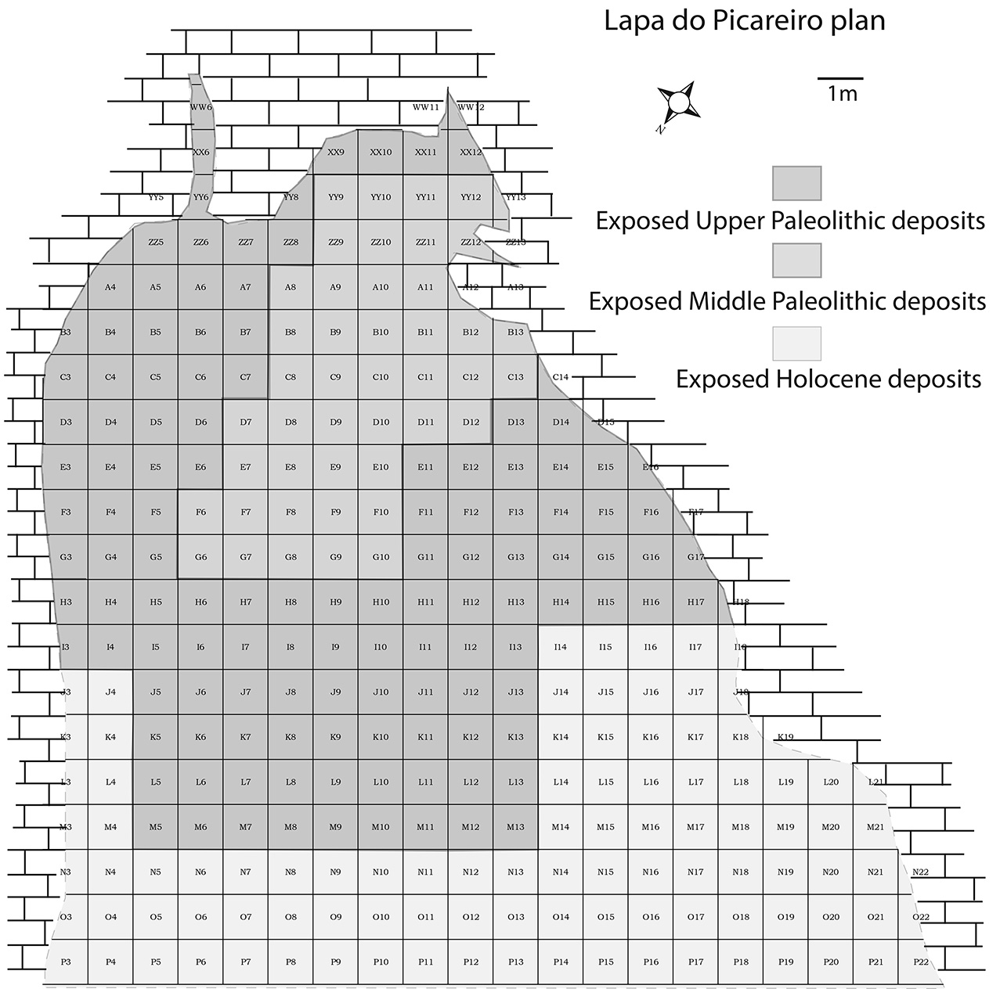
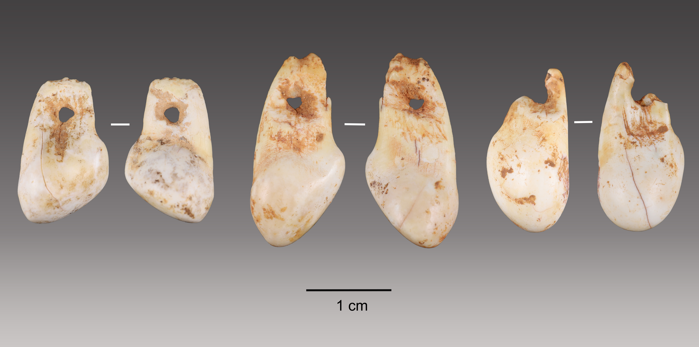
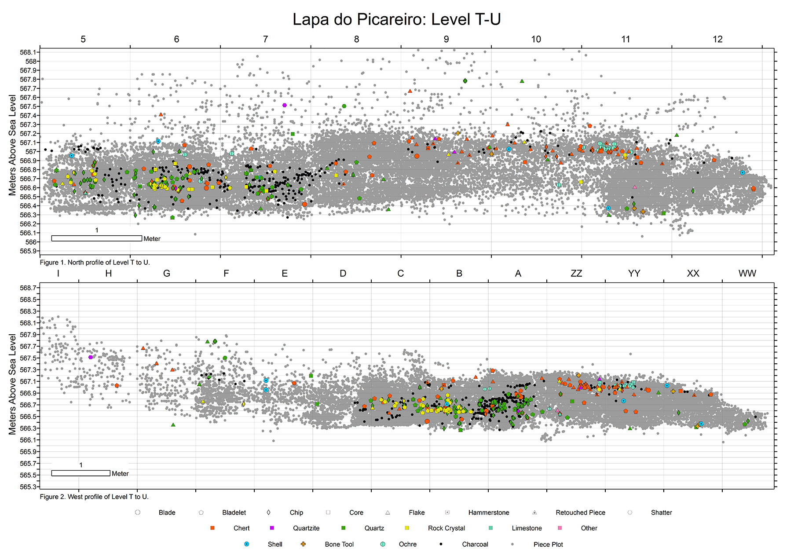

# Lapa do Picareiro
```{r LP setup, include=FALSE}
library(readr)
library(dplyr)
library(knitr)
library(kableExtra)
library(tidyr)
```

## Localization and geologic context
Lapa do Picareiro is a cave site on the west facing slope of Serra d’Aire, a limestone massif north of the Tagus River valley and Lisbon, Portugal [@benedettietal2019; @bicho2006]. The massif is underlain by the Serra d’Aire Formation, a thick-bedded limestone of the Middle Jurassic age [@carvalho2018]. The Serra d’Aire is part of a large limestone province (Maciço Calcário Estremenho), which accounts for several Palaeolithic occupations, both cave and open-air sites [@almeida2000; @benedettietal2019].

The cave appears to have an epigenetic origin, formed by infiltration of meteoric water through the overlying bedrock leading to the dissolution of the main chamber and roof collapse which formed the cave entrance [@benedettietal2019]. The interior of the chamber is about 11 x 14 m, and has more than 10 m of coarse sedimentary infill in inclined beds, derived from roof collapse, gravity flows and fine sediment infiltration [@benedettietal2019]. The cave opening is marked by the existence of a cone of large limestone stone blocks [@bicho2006] while the sediment inside the cave consists of smaller and angular limestone clasts in a matrix of fine sediment [@benedettietal2019].

```{r fig.cap="Lapa do Picareiro generalized cross section showing surface topography, shape of the cave, and area excavated into sedimentary fill (Benedetti et al, 2019).", out.width = '100%', echo=FALSE}

```

## Archaeological works
Lapa do Picareiro was first investigated during the 1950s by Marques, and then in 1964 by Fernandes Gomes and Gil Andrade, who excavated the cave and opened a test pit. Although the results have never been published, it is known the finds included several human remains associated with decorated pottery (Bicho 2000; Bicho 2006; Haws 2003; Zilhão 1997b).

Two decades after, in 1988, the site was revisited by João Zilhão and members of the STEA (Sociedade Torrejana de Espeleologia e Arqueologia). This visit resulted in the identification of several archaeological levels in the profiles from previous interventions, and the recovery of some archaeological finds that suggested the existence of an Upper Paleolithic context in the site (Haws 2003; Zilhão 1997b). One of these archaeological finds was a Vale Comprido point, found at the base of the test pit, by the cave wall (Zilhão 1997b). Despite the finds, these interventions did not include excavations.

The site was re-examined once again in 1994, by Nuno Bicho. This intervention confirmed the suspicion that the site was occupied during the Upper Paleolithic, with at least two occupations with deposits that seemed to extend deeper (Haws 2003).

From 1995 to 2001, the site was systematically excavated by Nuno Bicho and his team as part of an interdisciplinary project (Bicho 2000), which revealed 19 stratigraphic levels, 6 of which had archaeological occupations dated to the Magdalenian (Haws 2003).

These excavations were then resumed in 2005, under the direction of Jonathan Haws, which continue to the present day (Holst 2017), with 40 stratigraphic levels having been identified to a depth of 10 m (Benedetti et al. 2019), across which all the traditional Upper Paleolithic technocomplexes, as well as Middle Paleolithic levels, were identified.

## Excavation methodology
The cave is mapped using a 1 X 1 m alphanumeric grid system corresponding to the excavation units. The stratigraphy is subdivided into natural litho-stratigraphic layers and 10 cm artificial spits within these.

	As in the case of Vale Boi, all artifacts and bones larger than 2 cm are piece-plotted with a Total Station, which records the spatial information (X, Y and Z coordinates), level, unit, spit, type of material and excavator, and attributes a sequential identification number (ID) to the piece, generated by the software EDMWin. This ID is unique, composed of the unit information and a sequential number within the unit, pre-printed in labels with site information (LP), ID (Unit and sequential number) and a barcode, which are then stored with the plotted artIfact. This barcode or ID allows accessing all of the piece’s information in the laboratory.

```{r fig.cap="Lapa do Picareito unit plan grid.", out.width = '100%', echo=FALSE}

```

Sediment recovered from the excavation is sieved through two mesh screens (2 mm and 4 mm). The latter is sorted in the field, while the smaller screen sediment is taken to the laboratory for water screening, in order to recover small bones or other types of artIfacts like lithic chips.

Any archaeological material recovered in the screens, or found during the excavation while being inferior to 2 mm, is placed inside a screen bag. To the screen bag is attributed an ID label at the start of each spit, with coordinates taken on the center of the unit, and corresponding to any material (small or unplotted) recovered in the 10 cm below coordinates within that 1 X 1 m square/unit.

## Human occupation and stratigraphy
Lapa do Picareiro shows a long sequence of occupations, from the Middle Palaeolithic, Upper Palaeolithic, Epipaleolithic, Neolithic and Bronze Age occupations, the latter mostly focused in the front of the cave, and adjacent outside areas (Benedetti et al. 2019; Bicho et al. 2006).

The Palaeolithic finds were, so far, recovered from two main areas:  the main chamber and a niche in the rear wall. The main chamber shows a sequence of Middle to Upper Palaeolithic occupations, centered on units E7 to F8 (Benedetti et al. 2019). The main feature in this area is a large Magdalenian hearth in level F/G with associated lithics and a large quantity of fauna, which was interpreted as a particular purpose occupation for processing animal carcasses (Bicho et al. 2006). The niche finds, concentrated in units XX9 to ZZ11, present a series of smaller, stacked hearths, radiocarbon dated to the Magdalenian, Solutrean, Proto-Solutrean and Terminal Gravettian (Benedetti et al. 2019).

The large hearth and associated features are the only areas where human activity disturbed the sedimentary sequence. In all other areas, human activity is limited to thin hearths in association with sporadic lithic concentrations and modified bones. These periods of occupation appear in the sedimentary sequences as alternated with moments of faunal occupation, culturally sterile (Benedetti et al. 2019). Thus, human activity at the site might be understood as several occupations inside the cave throughout the late Middle and Upper Palaeolithic, which intensified through the latter with a significant peak during the Magdalenian.

(stratigraphy complete table)

Table X, adapted from Benedetti et. al (2019), shows the complete description of all currently identified levels in the site and, whenever existent, associated lithic assemblages. From the 34 levels described in the table, 23 show human occupations or association with a lithic assemblage, and 20 of these can be attributed to the Upper Paleolithic:

Magdalenian occupations are divided into Late Magdalenian (levels E-J) and Early Magdalenian (levels K-L). Late Magdalenian levels show a base brown color matrix and internal variability in terms of sediment, with variation between small to large clasts, and abundance of charcoal and bone fragments to few bones only. Early Magdalenian levels show less variability, presenting a dark brown color matrix, and friable sediment with small to medium clasts and few bones.

Solutrean occupations occur in levels O, R, and S (level P showing neither bone fragments nor a lithic assemblage), maintaining a brown color matrix but varying between dark to light. The sediment is friable, composed of small to medium clasts, with the frequent presence of charcoals and bones.

Level T, approximately 50 cm thick, has a dark brown color matrix, with the presence of medium to large clasts and boulders, and abundant charcoal and bones. The sediment is reddish and muddy in the lower half. This level is comprised of several lithic assemblages: Solutrean in the upper level; Proto-Solutrean in the middle portion of T; and Terminal Gravettian in the lower portion of the level (Benedetti et al. 2019).

The Terminal Gravettian occupation was also identified in level U, a ~15cm thick layer with a brown color matrix and, near the rear wall, a reddish muddy matrix that resembles lower T sediment. It has small to medium clasts and includes several lenses with abundant small animal bones and bone fragments.

Levels V, W, and X were associated with Gravettian occupations, all three showing a dark brown matrix, with variation between muddy and fine sediment, all with the abundant presence of small animal bones.
Levels BB, DD, and FF (each intercalated with a culturally sterile level), varying between a dark brown and reddish-brown color matrix, have an associated Early Upper Paleolithic lithic assemblage, with internal sediment variability but the frequent presence of bone fragments and small to medium clasts.

An Aurignacian occupation is present in level GG, which presents a dark brown color matrix, and a slightly hard to very hard sediment matrix, with the presence of calcite cement, bones, and bone fragments.

The stratigraphic sequence, as mentioned before, shows an alternation between faunal occupations, rich in bones and bone fragments, and clearly defined cultural horizons, which is explained by the continuous long-term accumulation of sediments, a result of the cave setting and cave morphology. These factors not only allowed continuous deposition but also contributed to the preservation of fauna and lithics. The sequence also shows good stratigraphic integrity, without the presence of bioturbation in its interior (signs of bioturbation by the action of roots are only present at the entrance of the cave) (Benedetti et al. 2019).


## Levels U and lower T
The physical distinction between level U and the lower portion of T is hard to make near the niche. In this area, both levels show similar reddish muddy sediment and the presence of animal bones in level T increases. As such, in this area, the attributed level to the recovered artifacts was T/U instead.

Layer T/U is about 15 cm thick, with the presence of possible combustion features and distinct activity areas. The recovered artifacts show a rich faunal assemblage, with a high presence of red deer, though ibex presence is also important, and a superabundance of rabbit bones. A few bone tools were also found. Other recovered artifacts also include a perforated marine shell and a perforated red deer canine tooth.


```{r fig.cap="Level U and lower T perforated red deer canine teeth.", out.width = '100%', echo=FALSE}

```

```{r fig.cap="Spatial distribution of all plotted artefacts from levels T-U (in grey), lithic artefacts in colours and shapes refering to raw material and class.", out.width = '100%', echo=FALSE}

```

The niche area was where most of the lithic assemblage from these levels was found. As shown in image X, there is an apparent concentration of lithics, comprised mostly of quartz and rock crystal, and some chert, all raw materials appearing mostly in the shape of bladelets.

For U and lower T, the dates (table), all obtained from charcoal samples, show results of c. 27-26 cal ka BP, except for one of lower T dates which presents a result of c. 25-24 cal ka BP.

(T and U dates table)

The middle part of T shows the presence of circular concentrations of charcoals, about 10-15 cm thick, which have been interpreted as hearths. Aside from these features, there is a high frequency of animal bones, following the same species patterns as level U and lower T (although these results are preliminary).

The lithic assemblage in this portion of level T is found in two areas: an accumulation of lithics surrounding the hearths and other scattered pieces in the same spits as the hearths but in different units. This assemblage is mostly comprised of chert, with the presence of quartz and rock crystal, in the form of bladelets and flakes. Although the presence of traditionally-defined Vale Comprido points is not completely attested, there are several blanks which seem to resemble this type of technology, in the form of convergent elongated blanks.

The dates for middle T (table), obtained from charcoal and bone samples, provided results of c. 25-24 kcal BP, with one date presenting a range of c. 23.4-23.6 kcal BP.

There is a clear separation between the two groups, one composed level U and lower T, and the other of middle T. This is particularly evident on the spatial dispersion of lithics and other artifacts shown on figure X, where there is an accumulation on the bottom left, correspondent to the U/T levels, and another aggregation in the middle portion, to the right, ranging from 20-40 cm of depth difference between the groups.

The patterns in the lithic assemblages also indicate a clear difference between the groups: the high frequency of quartz/rock crystal bladelets of U/T shows a marked difference from the middle T, where chert frequencies are higher, and there is a more balanced frequency of bladelets and flakes. In this case, the U/T assemblages shows patterns which can be attributed to the Terminal Gravettian (Almeida 2000; Benedetti et al. 2019), the intermediate phase described by the three-stage model for the Proto-Solutrean, while the middle T assemblage shows patterns best explained by the Proto-Solutrean phases of the model (Zilhão 1997a).

Finally, the dates for both U/T and middle T strengthen further the separation between the occupations, showing a gap of c. 2 k years between the assemblages, and placing the Terminal Gravettian occupation somewhere around 27-26 cal ka BP and the Proto-Solutrean occupation at c. 25-24 cal ka BP, with at least dates widening this range to c. 23 cal ka BP.

These clear spatial, raw-material and chronological differences, while maintaining some technological similarities, are consistent with the three-phase model developed for the evolution of the Proto-Solutrean in the Estremadura, where there are two distinct moments with chronological relevance which cannot be better explained by the existence of a functional facies.

However, the dates are not in concordance with the models developed for the Proto-Solutrean in the Portuguese Estremadura (Zilhão 1997). The lower depth group, which has been determined as Terminal Gravettian, shows concordance with dates for other sites (e.g. Lagar Velho) placing these occupation in the transition between the Final Gravettian/Terminal Gravettian. The dates associated with the highest quantity of chert, however, seem to extend the Proto-Solutrean chronological range to much younger dates (leaving out WK-37655c and UGAMS-23727, which show signifcant chronological differences from the other dates), placing it at the 24 ka cal BP, similarly to Vale Boi.