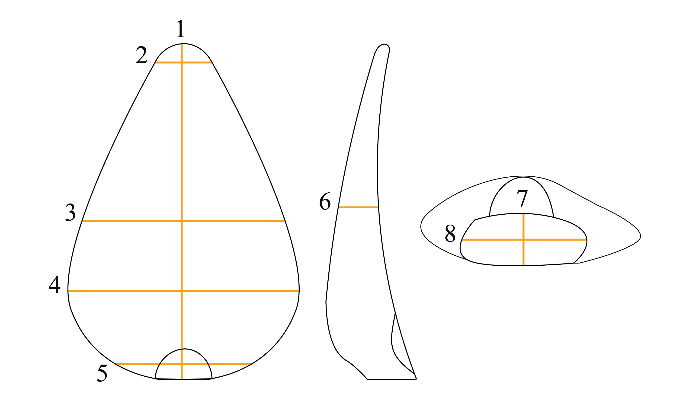

# Methodology
```{r methodology setup, include=FALSE}
library(readr)
library(dplyr)
library(knitr)
library(kableExtra)
library(tidyr)
```
## Attribute analysis
In order to understand the multiple causes for lithic variation, such as raw material properties or local adaptations, researchers are increasingly adopting sophisticated methods of lithic analysis, then linking that data to explanatory theories of human behavior [@scerri2014]. Examples of such studies are those by @brantingham2001, who apply a geometric and mathematical model to understand Levallois core morphology, or @dibble2009, that through platform attributes try to understand flake variability.

Despite the existence of several different concepts in quantitative analysis, the basic units of analysis continue to be the technological attributes [@scerri2014]. These attributes are measurable (e.g. length, width or thickness) and observable (e.g. platform type or cross section type) proxies for understanding lithic shape and production methods [@inizan1999]. Following certain paradigms, like referred above, they can be quantified in different ways, such as diversity, mechanical relationships, shapes and reduction sequences, in order to better understand lithic assemblages [@scerri2014] and the role that lithics played in past adaptations over time and space [@foley2003]. 

The application of attribute analysis does have some caveats, linked mainly to how such attributes are interpreted by the archaeologist and their actual contribution to the understanding of an assemblage’s variability [@dibble2008; @scerri2014]. Nonetheless, this approach was chosen for the present study, for the recognized benefits such as flexibility (resolution and amount of information recovered) and broadness of utility [@tostevin2012].

The application of this methodology, which aims to recover morphological and metrical attributes of technological classes, has been present in pre-historical European contexts since the 1970s [@bicho1992]. In Portugal, this methodology has been applied by @bicho1992 who characterized Rio Maior’s Upper Paleolithic lithic assemblages, @zilhao1997 for the Upper Paleolithic archaeological sites of Estremadura or @almeida2000, who associated attribute analysis with refitting to characterize the Terminal Gravettian of the Estremadura.

Regarding the latter approach, refitting, despite allowing a precise description of the sequences of knapping operations from the beginning of the knapping sequence to the final desired products, has too many caveats for its application in the present study [@tostevin2012]. Often, assemblages may not gather the requisites which are necessary for the application of this methodology such as adequate contextual preservation or presence of complete in situ knapping sequences or the investigators may not have either the time or space for it. Additionally, one or two totally refitted nodules may or may not be representative of the dominant operative sequence, especially in situations where there is high internal variability [@tostevin2012]. Regarding the sites in this study, Vale Boi's layer 5 and 4E assemblage shows a high degree of variability, and Lapa do Picareiro’s U to middle T assemblage shows a truncated reduction sequence (due to site function and high altitude location). Given the aforementioned problematics, the present study used only an attribute analysis approach without refits.

All artefacts and their technological and morphological attributes were recorded using two different databases, thus dividing the analysis in two phases: basic and complete attribute-based analysis.
In both cases, data collection was done through E4, a software developed by Dibble and McPherron (2003), available for download at http://www.oldstoneage.com/software/default.shtml. The software allows the user to program a database file which filters variables through conditions, defined by previous choices and attributes, which allows for better control of the database and homogeneous results. After recording, all information is gathered in one single database in an Access type output.
The basic analysis (appendix X) was applied to all of Vale Boi’s quartz artefacts (layers 5 and 4E), since all lithics from the same assemblage in other raw-materials (e.g. chert and greywacke) had been previously analyzed with the same database  [*vide*, @belmiro2018]. This database consists of a reduced set of variables which allow for the general classification of metric and morphologic characteristics of the artefacts, as well as the identification of raw material preference and preferential use. These main variables were: 1) raw material; 2) technological class, following the traditional criteria for lithic technological analysis [@andrefsky1998; @bicho2011; @debenath1994; @inizan1999]; percentage of cortex [@bicho2011]; weight and mesial thickness, maximum width and maximum length. Retouched pieces were classified into wider groups regarding their morphologies and retouch type, following the typologies defined by @sonneville-bordes1956,  adapted by @zilhao1997 for the Portuguese Estremadura.

The complex analysis was applied to Vale Boi complete cores, debitage products and retouched pieces. Only pieces which were complete were chosen for this stage for two main reasons: 1) the collection is well preserved, with high percentages of complete cores and blanks (~80%), guaranteeing that the sample is representative; 2) only complete pieces gather all the necessary attributes for a thorough analysis. The same database was applied to the whole assemblage of Lapa do Picareiro, given its small sample size.

The several attributes analysed in this database follow those present in specialized literature, such as @brezillon1968 and @tixier1980, paired with the methodologies used in Upper Paleolithic lithic attribute analysis works, such as @bicho1992,  @zilhao1997 or @almeida2000. 

The complete Data Dictionary with all variables, attributes, values and description, with reference to the consulted literature can be found in Appendix X.

Regarding cores, the following variables were registered: section, type of platform and number of platforms, core morphology, following the types defined by @bicho1992 and @brezillon1968, percentage of cortex, types and number of extracted products (with maximum, proximal, mesial and distal measurements of the final extraction) and reason for abandonment. When cores showed more than one face, a dominant debitage face was established, which allowed for the orientation of the artefact and recording of some of the variables (e.g. measurements of final extraction).

For debitage products and EMNP, their technological class, morphology, section and profile were recorded, following the definitions by @zilhao1997. Other determined attributes were the presence of lipping and type of platform, according to @inizan1999, percentage of cortex and amount of dorsal extractions (> 5 mm). Retouched pieces were classified into wide groups as applied in the simple database, following once again the typologies defined by @sonneville-bordes1956, adapted by @zilhao1997 for the Portuguese Estremadura. 

Regarding the technological classes, the values recorded were core, blank, retouched piece and core preparation product following traditional analysis criteria [@andrefsky1998; @bicho2011; @debenath1994; @inizan1999], but collapsing both flakes and elongated blanks in a single category. The difference between flake and elongated blank is traditionally defined by a ratio between length and width measurements. Elongated blanks are defined as products whose length is equal or greater than twice their width [@bicho2011; @tixier1980]. Very frequently, this ratio is blurred, resulting in elongated flakes or short elongated blanks, which may result in incorrect classifications. In understanding both flakes and elongated blanks as a whole, without prior classification, and using the measurements recorded if needed, we achieve the same results without the need to find classification mistakes and without delving into typologies which may not have any real technological significance. The same methodology was applied regarding the definition of bladelet and blade. As traditionally defined, bladelets are elongated blanks with maximum width of 12 mm, whereas blades are elongated blanks with more than 12 mm of width or more than 50 mm of length [@tixier1963]. For the present study, this typological differentiation was not applied during the analysis, since it may be achieved, if needed, with the recorded measurements. 

The measurements were registered equally for debitage products and cores as shown in figure \@ref(fig:metric), which included the measurement of the platform angle according to @dibble1997,  with the goal of understanding platform morphology, which, according to the author, may offer a better understanding of lithic technological variability.  In this case, the variation in exterior platform angle, platform depth and angle of blow seem to explain flake size, and the variation of the exterior platform angle seems to have an impact on flake shape as well, both of which have implications in understanding the employment of different strategies for preferential size of blank products [@dibble1997; @dibble2009; @leader2017; @linetal2013].

```{r metric, fig.cap="Registered measurements scheme for debitage products and cores. Legend: 1- Maximum length; 2- Distal width; 3- Mesial width; 4- Maximum width; 5- Proximal width; 6- Mesial thickness; 7- Platform thickness; 8- Platform width.", out.width = '100%', echo=FALSE}

```

Finally, although raw material had been previously analysed in the simple attribute analysis, quartz artefacts were subdivided regarding raw material quality. When analysing the quartz lithic collection, it was apparent that fracture patterns and product morphology differed greatly between quartz and other raw materials and even within types of quartz. In fact, it is understood that applying the same analysis variables to all raw materials, especially quartz, may not be the most appropriate methodology, since different technological solutions might be applied to materials which react differently to knapping [@beardsell2013]. Despite this, creating a different database or establishing different analysis attributes for quartz would result in different issues and problems that would require further testing and experimenting. Thus, in order to understand possible preferential uses or mechanical constraints of quartz, this raw material was analysed with the same attributes as other raw materials, but further classified regarding its quality. In fact, @almeida2000 stated that, for the Terminal Gravettian, raw material quality, namely the quartz, resulted in specific behaviours and different technological patterns. By defining quartz quality and understanding the collection through this added variable, it was our goal to better comprehend the cultural horizon in its fullest, and allow comparison to other studies, in which similar variables were considered. 

Quartz quality was defined by grain size: coarse quality was applied to every quartz artefact that displayed large and visible grains (>0.5 mm); medium quality was applied whenever the grains were visible but small (<0.5 mm); fine quality was defined by the absence of visible grains; and rock crystal was applied whenever there was the absence of visible grains, but where the minerals were translucent.  

## Data analysis
After data collection, the databases, for both Vale Boi and Lapa do Picareiro, were imported into R environment, where the information was processed through the creation of descriptive statistical analysis. This and the writing of this thesis were done in RStudio, an open source integrated development environment (IDE) for R, which can be downloaded at https://rstudio.com, also with resource to RMarkdown, which allows the production of fully reproducible documents (downloaded at https://rmarkdown.rstudio.com) Following the goal for transparent science and reproducible results, the script programmed for this analysis, as well as all the raw data used can be consulted online through the following DOI (https://osf.io/7hz52/). To produce those files the procedures described by @marwick2017 for the creation of research compendiums to enhance the reproducibility of research were followed. A list with all R packages used in the analysis is also present in Appendix X. To enable maximum re-use, the code is released under the MIT license, data as CC-0, and figures as CC-BY [for more information see, @marwick2018].
