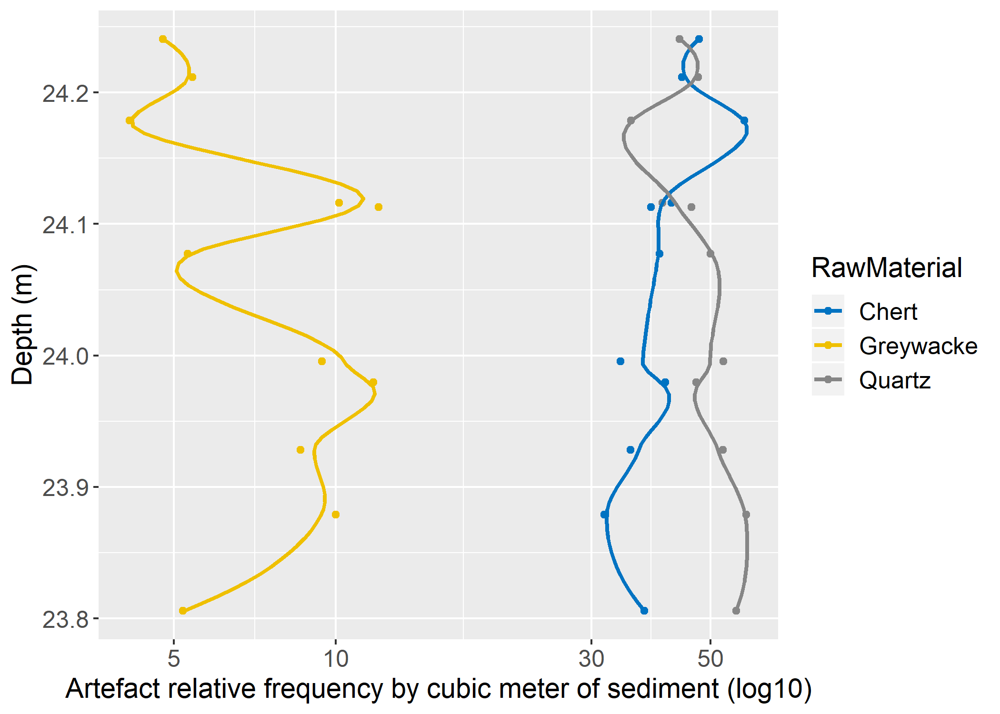

# Results


```{r VB_analysis_setup, include=FALSE}

knitr::opts_chunk$set(echo = FALSE, warning=FALSE)

# Call packages
library(readr)
library(dplyr)
library(stringr)
library(tidyr)
library(knitr)
library(tab)
library(ggplot2)
library(FactoMineR)
library(factoextra)
library(RcmdrMisc)
library(IDPmisc)
library(forcats)
library(kableExtra)
library(float)
library(janitor)
library(ggpubr)
library(ggExtra)

# Read df
context <- read_csv("data/context.csv") #Field DB
xyz <- read_csv("data/xyz.csv") #Field DB
lithics <- read_csv("data/Basedados_VB.csv") #Analysis DB

# Df cleaning and uniformizing
cols_to_concat <- c("Unit", "ID")
context$ID <- str_squish(context$ID) #remove empty spaces from ID field
xyz$ID <- str_squish(xyz$ID) #remove empty spaces from UNIT field

# Concatenate ID and UNIT variables in one single variable (e.g. A6-100)
context <- context %>%
  unite_(col='id', cols_to_concat, sep="-", remove=FALSE) %>%
  select(id, Spit, Level, Code) %>%
  distinct(id, .keep_all = TRUE)

xyz <- xyz %>%
  dplyr::rename(Unit = UNIT) %>%
  unite_(col='id', cols_to_concat, sep="-", remove=FALSE) %>%
  filter(Suffix == 0) %>%
  select(id, X, Y, Z) %>%
  distinct(id, .keep_all = TRUE)

# Classify complete blanks (into flake or elongated) according to W and L ratio
lithics <- lithics %>%
  dplyr::rename(Unit = UNIT) %>%
  unite_(col='id', cols_to_concat, sep="-", remove=FALSE) %>% 
  mutate(elong = MaxWidth*2-Length) %>% 
  mutate(BlankType = case_when(
    Class == "Blank" & elong > 0 ~ "Flake",
    Class == "Blank" & elong <= 0 ~ "ElongatedProd")) %>% 
  select(-elong)

# Join both tables and (optionally) write csv with final result
field_data <- full_join(xyz, context, by = "id")

# Join field and lithic tables
dataset <- left_join(lithics, field_data, by = "id")

# Force transform 'dataset' into a data.frame
dataset <- as.data.frame(dataset)

# Attribute phase based on depth (Z)
dataset <- dataset %>% 
  mutate(Phase = case_when(
    Z > 24.1 ~ "Phase 2",
    Z < 24.1 ~ "Phase 1"))


```

```{r lp_analysis_setup, include=FALSE}
lithicslp <- read_csv("data/Basedados_LP.csv")
xyzlp <- read_csv("data/xyzlp.csv")
cols_to_concat <- c("UNIT", "ID")
xyzlp$ID <- str_squish(xyzlp$ID)

lithicslp <- lithicslp %>% 
  dplyr::rename("UNIT" = "X5") %>% 
  unite_(col='ID', cols_to_concat, sep="-", remove=FALSE)

xyzlp <- xyzlp %>%
  unite_(col='ID', cols_to_concat, sep="-", remove=FALSE) %>%
  filter(SUFFIX == 0) %>%
  select(ID, X, Y, Z) %>%
  distinct(ID, .keep_all = TRUE)

# Classify complete blanks (into flake or elongated) according to W and L ratio
lithicslp <- lithicslp %>%
  mutate(elong = MaxWidth*2-Length) %>% 
  mutate(BlankType = case_when(
    Class == "Blank" & elong > 0 ~ "Flake",
    Class == "Blank" & elong <= 0 ~ "ElongatedProd")) %>% 
  select(-elong)

datasetlp <- left_join(lithicslp, xyzlp, by = "ID")

datasetlp <- as.data.frame(datasetlp)

# Attribute phase based on depth (Z)
datasetlp <- datasetlp %>% 
  mutate(Phase = case_when(
    Z >= 566.9 | Level == "T1" | Level == "T2" | Level == "T3" | Level == "T4" | Level == "T5" ~ "Proto-Solutrean",
    Z < 566.9 | Level == "T6" | Level == "T7" | Level == "T8" | Level == "U" | Level == "U1" ~ "Terminal Gravettian"))

```


## Assemblages

### Vale Boi
As mentioned in previous chapters, the lithic assemblage analysed in this study comes from layers 4E and 5 in the Terrace area, which correspond to the Proto-Solutrean human occupations. The present study only considered materials from units H, I and J, which resulted from the 2012 onwards excavations.

Artefact distribution throughout layers 4E and 5 confirms an interesting pattern already evidenced in previous works (e.g. Belmiro 2018). As seen on figure X, the distribution of artefacts (excluding chips), shows a concentration of materials in the first 6 spits (which correspond to the first 3 spits of layer 4E and first 2 spits of layer 5). This concentration gradually diminishes throughout level 5 down to the base of the layer.

Within this artefact distribution, no concentrations of specific raw materials are apparent. This is particularly important for the subsequent assemblage analysis, since the Proto-Solutrean is, as mentioned in Chapter 2, on the three-phase model, described as having a moment of intense quartz use, followed by a moment of quartz use reduction.

```{r spatialdistributionVB, fig.cap="Spatial distribution of lithic artefacts (without chips) by raw material, on unit H.", echo=FALSE}

# Setup filters for graph
spatial <- dataset %>% 
  filter(Code != "Bucket") %>% 
  filter(Class != "Chip") %>% 
  filter(Unit%in%c("H18","H19","H20","H21")) %>% 
  filter(Y > 1) %>% 
  filter(Z < 25) %>% 
  filter(Z > 1) 

# Plot graph
spatial %>%   
mutate(RawMaterial = factor(RawMaterial, levels = c("Quartz", # order y axis
                                                      "Chert", "Greywacke", "Chalcedony",
                                                      "Dolerite", "Other"))) %>%
  ggplot(aes(Y, Z, colour = RawMaterial)) +
  geom_point() +
  theme_minimal() + 
  theme(legend.title = element_blank()) + 
  theme(axis.title = element_text(size = 10, vjust = -1)) + 
  scale_color_manual(values = c("#FFCC00", "#FF9933", "#993300", 
                                "#660000", "#CC6666", "#333333")) 

```

However, when calculating the percentages of greywacke, chert and quartz and their relative frequencies  by cubic meter of sediment (fig X) and plotting them by depth, there are significant differences in raw material distribution across time. From around 24.1 m upwards, there is a shift in quartz and chert frequencies, the latter increasing more than 10% and quartz dropping from c. 50% to nearly 30%. Greywacke frequencies follow closely those of quartz.

This shift seems to be associated with other significant changes in the archaeological record, such as the abovementioned increase in the amount of lithic materials in top Layer 5 and Layer 4e, but also the appearance of Vale Comprido technology (image X). Furthermore, these two moments are stratigraphically correlated with two different chronological horizons, the first dated to c. 26 kcal BP at c. 23.9 m depth and associated with higher frequencies of quartz use, and the second dated to c. 24.7 kcal BP at around 24.1 m depth, associated with higher frequencies of chert and decrease in quartz use.

```{r debitage_dispersion, fig.cap="Complete debitage dispersion by depth", include = FALSE}

# Calulate spit volumes
cols_to_concat <- c("Level", "Spit")

buckets_by_spit <- context %>%
  filter(Level %in% c("4E", "5", "5B", "5C") & Code == "BUCKET" & !Spit %in% c("limp_corte", "profile", " ", NA)) %>%
  unite_(col='depth', cols_to_concat, sep=".", remove=FALSE)

buckets_by_spit$depth <- str_replace(buckets_by_spit$depth, "B", "")
buckets_by_spit$depth <- str_replace(buckets_by_spit$depth, "C", "")

spit_vol <- buckets_by_spit %>%
  dplyr::group_by(depth) %>%
  dplyr::count(Code) %>%
  mutate(spit_vol = (n*10)/1000)

# Calculate average depth of spits

spit_depths <- field_data %>%
  filter(Level %in% c("4E", "5", "5B", "5C") & !Spit %in% c("limp_corte", "LIMP_CORTE", "profile", " ", NA, "0")) %>%
  unite_(col='depth', cols_to_concat, sep=".", remove=FALSE)

spit_depths$depth <- str_replace(spit_depths$depth, "B", "")
spit_depths$depth <- str_replace(spit_depths$depth, "C", "")

spit_aver_depths <- spit_depths %>%
  dplyr::group_by(depth) %>%
  dplyr::summarise(avg = mean(Z)) %>%
  mutate_if(is.numeric, format, 3)

## Data classes per spit

cols_to_concat <- c("Level.y", "Spit")

lithics_by_spit <- dataset %>%
  filter(Level.y %in% c("4E", "5", "5B", "5C") & !Spit %in% c("limp_corte", "profile", " ", NA)) %>%
  select(id, Z, Spit, Level.y, Code, Class, ChipQuantity, RetouchedPieceTypology, PieceCompleteness, RawMaterial) %>%
  unite_(col='depth', cols_to_concat, sep=".", remove=FALSE)

lithics_by_spit$depth <- str_replace(lithics_by_spit$depth, "B", "")
lithics_by_spit$depth <- str_replace(lithics_by_spit$depth, "C", "")

#Debitage by spit


cols_to_concat <- c("Level.y", "Spit")


rm_by_spit <- dataset %>%
  filter(Level.y %in% c("4E", "5", "5B", "5C") & !Spit %in% c("limp_corte", "profile", " ", NA)) %>%
  select(id, Z, Spit, Level.y, Code, RawMaterial, QuartzQuality, Class) %>%
  unite_(col='depth', cols_to_concat, sep=".", remove=FALSE) %>% 
  filter(Class %in% c("Blank","Core","RetouchedPiece"))

rm_by_spit$depth <- str_replace(rm_by_spit$depth, "B", "")
rm_by_spit$depth <- str_replace(rm_by_spit$depth, "C", "")


rm_by_spit <- rm_by_spit %>% 
  dplyr::group_by(depth) %>%
  dplyr::count(RawMaterial) %>%
  mutate(freq = n / sum(n)*100)

quartz_by_spit <- rm_by_spit %>%
  filter(RawMaterial %in% c("Quartz"))

chert_by_spit <- rm_by_spit %>% 
  filter(RawMaterial %in% c("Chert"))

grey_by_spit <- rm_by_spit %>% 
  filter(RawMaterial %in% c("Greywacke"))

quartz_by_spit$spit_vol <- spit_vol$spit_vol[match(quartz_by_spit$depth, spit_vol$depth)]
quartz_by_spit <- quartz_by_spit %>%
  mutate(artifacts_by_cubic_meter = n/spit_vol)
quartz_by_spit$spit_aver_depth <- spit_aver_depths$avg[match(quartz_by_spit$depth, spit_aver_depths$depth)]
quartz_by_spit$spit_aver_depth <- as.numeric(as.character(quartz_by_spit$spit_aver_depth))

chert_by_spit$spit_vol <- spit_vol$spit_vol[match(chert_by_spit$depth, spit_vol$depth)]
chert_by_spit <- chert_by_spit %>%
  mutate(artifacts_by_cubic_meter = n/spit_vol)
chert_by_spit$spit_aver_depth <- spit_aver_depths$avg[match(chert_by_spit$depth, spit_aver_depths$depth)]
chert_by_spit$spit_aver_depth <- as.numeric(as.character(chert_by_spit$spit_aver_depth))

grey_by_spit$spit_vol <- spit_vol$spit_vol[match(grey_by_spit$depth, spit_vol$depth)]
grey_by_spit <- grey_by_spit %>%
  mutate(artifacts_by_cubic_meter = n/spit_vol)
grey_by_spit$spit_aver_depth <- spit_aver_depths$avg[match(grey_by_spit$depth, spit_aver_depths$depth)]
grey_by_spit$spit_aver_depth <- as.numeric(as.character(grey_by_spit$spit_aver_depth))


rm_by_cubic_meter <- bind_rows(quartz_by_spit, chert_by_spit, grey_by_spit)

rm_by_cubic_meter <- filter(rm_by_cubic_meter, spit_vol > 0.10) # removes low volumetric levels

# Plot

rm_cubic_meter <- ggplot(rm_by_cubic_meter, (aes(spit_aver_depth, freq, colour = RawMaterial))) +
  geom_point() +
  stat_smooth(span = 0.5, se = FALSE) +
  xlab("Depth (m)") +
  ylab("Artefact relative frequency by cubic meter of sediment (log10)") +
  theme(axis.text=element_text(size=12),
        axis.title.x = element_text(size = 14),
        axis.title.y = element_text(size = 14),
        legend.text = element_text(size= 12),
        legend.title = element_text(size = 14)) +
  scale_y_log10()+
  coord_flip() +
  scale_color_manual(values = c("#FFCC00", "#FF9933", "#993300", 
                                "#660000", "#CC6666", "#333333"), name = "Raw Material")

ggsave(path = "figure", filename = "rm_cubic_meter.png", plot = rm_cubic_meter, width = 7, height = 5, dpi = 300, )

```

```{r fig.cap="Complete debitage dispersion by depth", out.width = '100%', echo=FALSE}

```

As such, and given these chronological, density and raw material preference differences, it was decided that the assemblage would be analysed through its division in two analytical units, to better understand any possible technological differences: Lower 5, including all artefacts with Z values under 24.1; Upper 5/4E, including all artefacts with Z values of 24.1 and above. The value 24.1  was chosen for two reasons: 1) it is where the density of lithic materials seems to start; 2) its where the frequencies of quartz and chert start to shift beyond the already observed through the stratigraphic record of layers 5.

A total of 26711 pieces were analysed, 11094 from Lower 5 group and 15609 from Upper 5/4E, although most of these were chips (70.62% from Lower 5 and 65.8% from Upper 5/4E), followed by shatters, which make up c. 21.4% and c. 24.5% of the groups respectively.

For Lower 5, cores and debitage products represent a cumulative frequency of 7.95%, whereas debitage debris represents 92% of the total assemblage. For Upper 5/4E debitage products represent nearly 10% of the group assemblage, while debris represent 90%. These extremely high debris numbers can be mostly attributed to quartz, which may be explained not only by its knapping on the site, but also by its breakage patterns (especially when coarse), which might produce more waste than other raw materials.

Regarding debitage, blanks are the most represented class for both groups, with 1476 identified pieces, 4.5% for Lower 5 and 6.18% for Upper 5/4E, followed by blank fragments with an absolute count of 248 for Lower 5 and 336 for Upper 5/4E. Throughout the analysis, 167 retouched pieces were identified, 55 on Lower 5, representing 0.5% of the group, and 112 on Upper 5/4E, with a frequency of 0.72%, while retouched piece fragments composed a much smaller number (n = 7 for Lower 5 and n = 16 for Upper 5/4E).

Cores are also relatively frequent within the assemblage, with an absolute count of 123 cores, 46 for Lower 5 and 77 for Upper 5/4E, while core fragments are, alike the classes already referenced, in much smaller numbers (n = 11 and n = 16, respectively).


```{r general_table_VB, echo=FALSE}


### General table Lower 5
db_phase1 <- dataset %>% 
  filter(Phase=="Phase 1")

table1 <- db_phase1 %>% 
  select(RawMaterial, Class) %>% 
  filter(Class != "Chip") %>% 
  group_by(RawMaterial) 


chip_table1 <- db_phase1 %>% 
  filter(Class == "Chip") %>%
  select(RawMaterial, ChipQuantity) %>% 
  na.omit() %>% 
  dplyr::group_by(RawMaterial) %>% 
  dplyr::summarise(ChipQuantity = sum(ChipQuantity)) %>% 
  tidyr::spread(RawMaterial, ChipQuantity) %>% 
  mutate(Class = "Chip") %>% 
  select(Class,Quartz, Chert, Greywacke, 
         Dolerite, Chalcedony, Other)

general_table1 <- table(table1$Class, table1$RawMaterial)
general_table1 <- as.data.frame.matrix(general_table1)
general_table1 <- general_table1 %>% 
  select(Quartz, Chert, Greywacke, 
         Dolerite, Chalcedony, Other) %>% 
  tibble::rownames_to_column()
general_table1 <- dplyr::rename(general_table1, "Class" = "rowname")
general_table1 <- union(general_table1, chip_table1)


general_table1 <- general_table1 %>% 
  mutate("Quartz (%)" = paste0(round(100 * Quartz/sum(Quartz), 2), "%")) %>% 
  mutate("Chert (%)" = paste0(round(100 * Chert/sum(Chert), 2), "%")) %>% 
  mutate("Greywacke (%)" = paste0(round(100 * Greywacke/sum(Greywacke), 2), "%")) %>% 
  mutate("Dolerite (%)" = paste0(round(100 * Dolerite/sum(Dolerite), 2), "%")) %>% 
  mutate("Chalcedony (%)" = paste0(round(100 * Chalcedony/sum(Chalcedony), 2), "%")) %>% 
  mutate("Other (%)" = paste0(round(100 * Other/sum(Other), 2), "%")) %>% 
  select("Class", "Quartz", "Quartz (%)", "Chert", "Chert (%)", "Greywacke", "Greywacke (%)", "Dolerite",
         "Dolerite (%)", "Chalcedony", "Chalcedony (%)", "Other", "Other (%)") %>% 
  dplyr::rename("Quartz (n)" = "Quartz", "Chert (n)" = "Chert", "Greywacke (n)" = "Greywacke", "Dolerite (n)" = "Dolerite",
                "Chalcedony (n)" = "Chalcedony", "Other (n)" = "Other") %>% 
  adorn_totals(where = "col", name = "Total") %>% 
  mutate("Total (%)" = paste0(round(100 * Total/sum(Total), 2), "%")) %>% 
  adorn_totals(where = "row", name = "Total")


### General table for Upper 5/4E

db_phase2 <- dataset %>% 
  filter(Phase=="Phase 2")

table2 <- db_phase2 %>% 
  select(RawMaterial, Class) %>% 
  filter(Class != "Chip") %>% 
  group_by(RawMaterial) 


chip_table2 <- db_phase2 %>% 
  filter(Class == "Chip") %>%
  select(RawMaterial, ChipQuantity) %>% 
  na.omit() %>% 
  dplyr::group_by(RawMaterial) %>% 
  dplyr::summarise(ChipQuantity = sum(ChipQuantity)) %>% 
  tidyr::spread(RawMaterial, ChipQuantity) %>% 
  mutate(Class = "Chip")
chip_table2$Dolerite=0
chip_table2$Other=0
chip_table2 <- chip_table2 %>%
  select(Class,Quartz, Chert, Greywacke, 
         Dolerite, Chalcedony, Other)

general_table2 <- table(table2$Class, table2$RawMaterial)
general_table2 <- as.data.frame.matrix(general_table2)
general_table2 <- general_table2 %>% 
  select(Quartz, Chert, Greywacke, 
         Dolerite, Chalcedony, Other) %>% 
  tibble::rownames_to_column()
general_table2 <- dplyr::rename(general_table2, "Class" = "rowname")
general_table2 <- union(general_table2, chip_table2)


general_table2 <- general_table2 %>% 
  mutate("Quartz (%)" = paste0(round(100 * Quartz/sum(Quartz), 2), "%")) %>% 
  mutate("Chert (%)" = paste0(round(100 * Chert/sum(Chert), 2), "%")) %>% 
  mutate("Greywacke (%)" = paste0(round(100 * Greywacke/sum(Greywacke), 2), "%")) %>% 
  mutate("Dolerite (%)" = paste0(round(100 * Dolerite/sum(Dolerite), 2), "%")) %>% 
  mutate("Chalcedony (%)" = paste0(round(100 * Chalcedony/sum(Chalcedony), 2), "%")) %>% 
  mutate("Other (%)" = paste0(round(100 * Other/sum(Other), 2), "%")) %>% 
  select("Class", "Quartz", "Quartz (%)", "Chert", "Chert (%)", "Greywacke", "Greywacke (%)", "Dolerite",
         "Dolerite (%)", "Chalcedony", "Chalcedony (%)", "Other", "Other (%)") %>% 
  dplyr::rename("Quartz (n)" = "Quartz", "Chert (n)" = "Chert", "Greywacke (n)" = "Greywacke", "Dolerite (n)" = "Dolerite",
                "Chalcedony (n)" = "Chalcedony", "Other (n)" = "Other") %>% 
  adorn_totals(where = "col", name = "Total") %>% 
  mutate("Total (%)" = paste0(round(100 * Total/sum(Total), 2), "%")) %>% 
  adorn_totals(where = "row", name = "Total")
  
```

```{r general1, fig.cap="General table Lower 5.", echo=FALSE}
knitr::kable(head(general_table1[1:15], 12), booktabs=TRUE,caption="Technological class by raw material for Lower 5.") %>% 
  column_spec(1, bold = T) %>% 
  kable_styling(latex_options = "scale_down") %>% 
  kableExtra::landscape()
```


```{r general2, fig.cap="General table Upper 5/4E.", echo=FALSE}
knitr::kable(head(general_table2[1:15], 12), booktabs=TRUE,caption="Technological class by raw material for Upper 5/4E.") %>% 
  column_spec(1, bold = T) %>% 
  kable_styling(latex_options = "scale_down") %>% 
  kableExtra::landscape()
```

### Lapa do Picareiro
As previously discussed, the present assemblage, corresponding to layers U and T, seems to originate from two different moments of occupation of the cave, which were identified based on spatial distribution and raw material patterns, also having different dates for each of the moments. These patterns have been identified as Terminal Gravettian and Proto-Solutrean phases within the Proto-Solutrean transition model. 

As such, and given the patterns, although the assemblage was analysed as a whole, for the statistic descriptive and multivariate analysis, the assemblage was separated into two groups: U/Lower T, which included all artefacts with depths inferior to 566.9 m or from levels U or T8 to T6 (Haws et al. 2019); Middle T, including all artefacts with depths equal or superior to 566.9 m of depth, or from the top 5 spits of level T. Any other artefact in the assemblage, which did not have a depth value or level was not considered in these results, since it lacked the needed information to contextualize its technological attributes.
	
The assemblage is composed of 376 pieces (with identifiable provenance), 196 from the U/Lower T phase and 180 from the Middle T group. In both phases, debitage waste is mostly composed of chips, which represent 49.4% of the U/Lower T group and 37.2% of the Middle T group. Alike Vale Boi, these values for debitage waste can be mostly explained by quartz, possibly related to the breakage patterns of this raw material.
	
The second most present class for both groups are blanks, which represent 14.2% of the U/Lower T group and 37.2% of the Middle T group, followed by blank fragments (13.7% and 15.5% respectively).Retouched pieces have relatively small frequencies, representing 3% in U/Lower T and 2.7% in Middle T. Cores have a frequency of 1% in the U/Lower T group (n=2) and 2.7% in the Middle T (n=5) and there is the presence of 1 core preparation product in the U/Lower T group.

```{r general_table_LP, echo=FALSE}

## General table for U/Lower T
db_phaseTG <- datasetlp %>% 
  filter(Phase == "Terminal Gravettian")

table_TG <- db_phaseTG %>% 
  select(RawMaterial, Class) %>% 
  filter(Class != "Chip") %>% 
  group_by(RawMaterial) 

chip_table_TG <- db_phaseTG %>% 
  filter(Class == "Chip") %>%
  select(RawMaterial, ChipQuantity) %>% 
  na.omit() %>% 
  dplyr::group_by(RawMaterial) %>% 
  dplyr::summarise(ChipQuantity = sum(ChipQuantity)) %>% 
  tidyr::spread(RawMaterial, ChipQuantity) %>% 
  mutate(Class = "Chip") %>% 
  select(Class,Quartz, Chert, Other)

general_table_TG <- table(table_TG$Class, table_TG$RawMaterial)
general_table_TG <- as.data.frame.matrix(general_table_TG)
general_table_TG <- general_table_TG %>% 
  select(Quartz, Chert, Other) %>% 
  tibble::rownames_to_column()
general_table_TG <- dplyr::rename(general_table_TG, "Class" = "rowname")
general_table_TG <- union(general_table_TG, chip_table_TG)

general_table_TG <- general_table_TG %>% 
  mutate("Quartz (%)" = paste0(round(100 * Quartz/sum(Quartz), 2), "%")) %>% 
  mutate("Chert (%)" = paste0(round(100 * Chert/sum(Chert), 2), "%")) %>% 
  mutate("Other (%)" = paste0(round(100 * Other/sum(Other), 2), "%")) %>% 
  select("Class", "Quartz", "Quartz (%)", "Chert", "Chert (%)", "Other", "Other (%)") %>% 
  dplyr::rename("Quartz (n)" = "Quartz", "Chert (n)" = "Chert", "Other (n)" = "Other") %>% 
  adorn_totals(where = "col", name = "Total") %>% 
  mutate("Total (%)" = paste0(round(100 * Total/sum(Total), 2), "%")) %>% 
  adorn_totals(where = "row", name = "Total (RM)")

## General table for Middle T
db_phasePR <- datasetlp %>% 
  filter(Phase == "Proto-Solutrean")

table_PR <- db_phasePR %>% 
  select(RawMaterial, Class) %>% 
  filter(Class != "Chip") %>% 
  group_by(RawMaterial) 

chip_table_PR <- db_phasePR %>% 
  filter(Class == "Chip") %>%
  select(RawMaterial, ChipQuantity) %>% 
  na.omit() %>% 
  dplyr::group_by(RawMaterial) %>% 
  dplyr::summarise(ChipQuantity = sum(ChipQuantity)) %>% 
  tidyr::spread(RawMaterial, ChipQuantity) %>% 
  mutate(Class = "Chip") %>% 
  select(Class,Quartz, Chert, Other)

general_table_PR <- table(table_PR$Class, table_PR$RawMaterial)
general_table_PR <- as.data.frame.matrix(general_table_PR)
general_table_PR <- general_table_PR %>% 
  select(Quartz, Chert, Other) %>% 
  tibble::rownames_to_column()
general_table_PR <- dplyr::rename(general_table_PR, "Class" = "rowname")
general_table_PR <- union(general_table_PR, chip_table_PR)

general_table_PR <- general_table_PR %>% 
  mutate("Quartz (%)" = paste0(round(100 * Quartz/sum(Quartz), 2), "%")) %>% 
  mutate("Chert (%)" = paste0(round(100 * Chert/sum(Chert), 2), "%")) %>% 
  mutate("Other (%)" = paste0(round(100 * Other/sum(Other), 2), "%")) %>% 
  select("Class", "Quartz", "Quartz (%)", "Chert", "Chert (%)", "Other", "Other (%)") %>% 
  dplyr::rename("Quartz (n)" = "Quartz", "Chert (n)" = "Chert", "Other (n)" = "Other") %>% 
  adorn_totals(where = "col", name = "Total") %>% 
  mutate("Total (%)" = paste0(round(100 * Total/sum(Total), 2), "%")) %>% 
  adorn_totals(where = "row", name = "Total (RM)")

```

```{r generalTG, echo=FALSE}
## Plot Tables
### U/Lower T table
knitr::kable(head(general_table_TG[1:9], 9), booktabs=TRUE,caption="Technological class by raw material (U/Lower T phase).") %>% 
  column_spec(1, bold = T) %>% 
  kable_styling(latex_options = "scale_down")
```

```{r generalPR, echo=FALSE}
### Middle T table
knitr::kable(head(general_table_PR[1:9], 7), booktabs=TRUE,caption="Technological class by raw material (Middle T phase).") %>% 
  column_spec(1, bold = T) %>% 
  kable_styling(latex_options = "scale_down")
```

## Raw materials

Raw material use and availability, specifically abundance and quality, stand as important factors for understanding the organization of technology, as it may affect decisions regarding tool design and conservation of such tools [@andrefsky1994], as well as mobility and niche expansion [@cascalheira2013]. This quality is connected to both the raw material’s fracture mechanics and their intrinsic mineral characteristics, such as the size of their grain, homogeneity [@andrefsky1994] or even hardness [@kempson2011], which allow the knapper predictability over the outcome (Andresfsky 2005).

As such, there are a number of stones which are constant throughout the archaeological record for having the necessary properties described above. Stones or minerals characterized by high frequencies of silica, such as chert or quartz, allow for good fracture predictability, while other materials with less homogeneity may progressively result in less predictable characteristics (Andresfsky 2005). Thus, despite the raw material variability within the pre-historical archaeological record, linked to its availability and geomorphological contexts of the sites, the selection is often coherent regarding fracture mechanics, where predictable conchoidal fractures are preferred [@inizan1999; @tixier1980] (Andrefsky 2005).

This pattern is also observable in Vale Boi. Previous studies have shown that, throughout most levels of human occupation in Vale Boi, chert, quartz and greywacke (all three characterized by a conchoidal fracture, although greywacke is often coarse and more unpredictable) were the most frequently used [@bichoetal2012; @cascalheira2010; @marreiros2009] (Pereira et al 2016), these being available at a regional and local scale . Although their presence is documented throughout the archaeological levels, each occupation might differ in the frequency of their use, but following a pattern where chert is the primary raw material used for knapping [@cascalheira2010]. The preferential use of these raw materials is also reported for other sites in Portugal from the Upper and Middle Paleolithic [@almeida2000; @pereira2013; @zilhao1997].
The same patterns seem to generally apply to the present assemblages, both Vale Boi level 4E and 5, and Lapa do Picareiro for levels U and T, where quartz and chert are still the predominant raw materials (Vale Boi also showing high frequencies of greywacke and higher raw material variability), although in different frequencies from other layers.
Criteria used for raw material analysis focused on the identification of broader groups of stones and minerals (e.g. chert or quartz), based on their general observable characteristics, without focusing on the particular features within each raw material. As such, aside from quartz, no other raw material was subdivided by grain or colouration differences.


### Vale Boi

The raw materials identified in layers 4E and 5 in the present study were quartz (subdivided in rock crystal, fine, medium and coarse quality), chert, greywacke, dolerite, chalcedony, all other less represented raw materials having been collapsed in a variable named “Other”.


#### Quartz

Quartz is, unlike other raw materials in this study, a mineral (Inizan et al. 1999), characterized by either a smoky grey colouration or lack of colour, glassiness, hardness and conchoidal fracture (Haldar and Tisljar 2014).

The number of chips and shatter in quartz in the total assemblage are, as seen in table X, extremely high, both in its representativity within the raw material, where it represents nearly 94.2% for Lower 5 and 94% for Upper 5/4E of all quartz, and through the comparison of its absolute numbers with other raw materials.

Despite the low frequencies represented on the table, there is a large number of  blanks made in quartz (n=281 for Lower 5 and 438 for Upper 5/4E) compared to the rest of classes, as well as cores (n=18 for Lower 5 and n=32 for Upper 5/4E) and retouched pieces (n=15 for Lower 5 and n=34 for Upper 5/4E). These patterns are well represented in figure X, where the percentages of quartz (excluding shatter and chips), represent a great fraction of the total assemblage: more than 50% in the Lower 5 phase and around 45% in Upper 5/4E.

Alike other raw materials, most quartz does not show the presence of cortex, with nearly 95% of all materials having 0% cortex. When it is present, around 72% seems to come from cobbles or pebbles. These patterns are similar for both Lower 5 and Upper 5/4E.

As mentioned before, quartz was divided into groups regarding size of grain or, in case of rock crystal, regarding colouration as well. Analysing the artefact class frequency through the different identified types of quartz quality confirmed a pattern which was already expected: use of fine and medium quality quartz was mainly dedicated for the production of blanks (52.7% and 32.4% for Lower 5, and 50.9% and 29.7% for Upper 5/4E, respectively) and retouched products (66.7% and 26.7% for Lower 5, and 55.9% and 44.1% for Upper 5/4E). Alike coarse quality quartz, no retouched pieces were identified in rock crystal, this type of quartz having a small presence in the total assemblage. 


```{r quartz_quality_setup_vb, include=FALSE}

quartzp1 <- dataset %>% 
  filter(RawMaterial == "Quartz") %>% 
  filter(Phase=="Phase 1") %>% 
  filter(Class!="Chip") %>% 
  filter(Class!="Shatter") %>% 
  select(QuartzQuality, Class, Phase) %>% 
  na.omit()
quartzp1 %>% 
  mutate(QuartzQuality=factor(QuartzQuality, levels = c("RockCrystal","Fine","Medium","Coarse"))) %>% 
  mutate(Class=factor(Class, levels = c("Blank","BlankFrag","Core","CorePreparProd","RetouchedPiece"))) %>% 
  ggplot(aes(QuartzQuality)) +
  geom_bar(position =  "fill", aes(fill = Class)) + 
  scale_y_continuous(labels = scales::percent_format()) + 
  theme_minimal() + #type of theme
  labs(x = "Types of quartz quality (Lower 5)", y = NULL) +# change labels
  guides(fill=guide_legend(title=NULL)) + # remove legend title
  theme(axis.title.x = element_text(size = 10, vjust = -1)) + # x axis size
  scale_fill_manual(values = c("#FFCC00", "#CC6666", 
                               "#660000", "#FFCC99", "#333333", "#993300", "#FF9933", "#FF6600", "#FF9999"))

quartztab1 <- tabmulti(quartzp1, "Class", c("QuartzQuality"),
                      ymeasures = c("freq"),
                      p.include = FALSE,
                      n.headings = FALSE,
                      bold.varnames = TRUE,
                      bold.colnames = TRUE,
                      variable.colname = "Quartz quality")
quartztab1 <- as.data.frame(quartztab1)
quartztab1 <- quartztab1 %>% 
  select("Quartz quality", "Blank", "Core", 
         "CorePreparProd", "RetouchedPiece", "Overall") %>% 
  dplyr::rename("Total" = "Overall")


quartzp2 <- dataset %>% 
  filter(RawMaterial == "Quartz") %>% 
  filter(Phase=="Phase 2") %>% 
  filter(Class!="Chip") %>% 
  filter(Class!="Shatter") %>% 
  filter(Class!="BlankFrag") %>% 
  select(QuartzQuality, Class) %>% 
  na.omit()

quartztab2 <- tabmulti(quartzp2, "Class", c("QuartzQuality"),
                      ymeasures = c("freq"),
                      p.include = FALSE,
                      n.headings = FALSE,
                      bold.varnames = TRUE,
                      bold.colnames = TRUE,
                      variable.colname = "Quartz quality")
quartztab2 <- as.data.frame(quartztab2)
quartztab2 <- quartztab2 %>% 
  select("Quartz quality", "Blank", "Core", 
         "CorePreparProd", "RetouchedPiece", "Overall") %>% 
  dplyr::rename("Total" = "Overall")

quartzp2 %>% 
  mutate(QuartzQuality=factor(QuartzQuality, levels = c("RockCrystal","Fine","Medium","Coarse"))) %>% 
  mutate(Class=factor(Class, levels = c("Blank","BlankFrag","Core","CorePreparProd","RetouchedPiece"))) %>% 
  ggplot(aes(QuartzQuality)) +
  geom_bar(position =  "fill", aes(fill = Class)) + 
  scale_y_continuous(labels = scales::percent_format()) + 
  theme_minimal() + #type of theme
  labs(x = "Types of quartz quality (Upper 5/4E)", y = NULL) +# change labels
  guides(fill=guide_legend(title=NULL)) + # remove legend title
  theme(axis.title.x = element_text(size = 10, vjust = -1)) + # x axis size
  scale_fill_manual(values = c("#FFCC00", "#CC6666", 
                               "#660000", "#FFCC99", "#333333", "#993300", "#FF9933", "#FF6600", "#FF9999"))

```

```{r quartzquality1, echo=FALSE}

knitr::kable(quartztab1, booktabs=TRUE, caption = "Quartz quality by class (Lower 5).") %>% 
  column_spec(1, bold = T) %>% 
  kable_styling(latex_options = c("hold_position", "scale_down"))

```

```{r quartzquality2, echo=FALSE}

knitr::kable(quartztab2, booktabs=TRUE, caption = "Quartz quality by class (Upper 5/4E).") %>% 
  column_spec(1, bold = T) %>% 
  kable_styling(latex_options = c("hold_position", "scale_down"))

```

#### Chert
Chert, as defined by Haldar and Tisljar (2014), is a cryptocrystalline solid-silicon rock, characterized by sharp fractures, referred to as flint whenever it is “(…) used as artifacts, weapons and tools of prehistoric man.”

This raw material shows high frequencies of blanks (15.8% for Lower 5 and 19.5% for Upper 5/4E) when compared to every other class, excluding chips. These latter represent more than 50% of the chert, although at much smaller quantities than in quartz, with an absolute number of 649 chips for Lower 5 and 1158 for Upper 5/4E.

Although chert shows smaller numbers for blanks (n=171 for Lower 5 and n=407 for Upper 5/4E) and blank fragments (n=90 for Lower 5 and n=155 for Upper 5/4E) compared to quartz, there is a large quantity of cores which represent 2.1% of total chert in Lower 5 and 2% in Upper 5/4E, showing that both raw materials were expediently used in these layers. However, table X shows an obvious difference in ratio between chert blanks and quartz blanks between Lower 5 and Upper 5/4E, with the latter showing a higher ratio of chert blanks comparatively to Upper 5/4E. This can also be seen in figure X, where chert on Upper 5/4E shows a frequency of around 30% (excluding chips and shatter), thus being the second most used raw material, while on Upper 5/4E it represents almost 50%, a higher frequency than quartz, and thus becoming the first most used raw material in the group.

Regarding retouched pieces, these represent more than 3% of chert for both phases, a number far higher than those in other raw materials, thus showing chert, although less present than quartz in blanks (although barely in Upper 5/4E), might have been preferentially used for tools.

Regarding cortex, chert shows the biggest variability of cortex presence percentages in both phases, although there continues to be a clear dominance of debitage with 0% cortex, which was already expected, following the process of the knapping sequence, where only the first blanks removed from an unmodified block will be entirely cortical, showing increasingly less cortex for posterior removals (Andrefsky 2005). This variability in cortex presence is accompanied in variability of cortex types, with the presence of both cobble and outcrop sources, although almost 85% of cortex didn’t show enough characteristics to be identified with certainty.  


#### Greywacke
Greywacke is a variety of sandstone, often characterized by its hardness, dark colour and poorly sorted grains of quartz and feldspar (Haldar and Tisljar 2014). At Vale Boi, this raw material is highly heterogenous, with a wide variety of grain sizes and colourations.

It is best represented by debitage waste, with nearly 25% of shatter and around 70% of chips, for both Lower 5 and 2, with relatively low numbers for blanks (n=44 for Lower 5 and n=80 for Upper 5/4E) and cores (n=3 for Lower 5 and 1 for Upper 5/4E). The same applies for the retouched pieces, with an absolute number of 3 in the total assemblage, one of which is a Vale Comprido point in Upper 5/4E.

When the chips and shatter are removed, greywacke has a representation of less than 12% in the total assemblage (with a smaller frequency in Upper 5/4E), making it the third most used raw material in the assemblage, although with a wide difference in frequency when compared to chert and quartz.

Similarly to the other raw materials, there is, for both phases, the predominance of debitage without cortex, although there is a certain variability in cortex presence, even if in smaller frequencies than the observed in chert. Alike quartz, most cortex was identified as cobble.


#### Dolerite
Dolerite is a volcanic igneous rock, occurring mostly in dykes, varying between coarse and fine textures, and often having a dark, grey or greyish-green colouration (Haldar and Tisljar 2014; Wadley and Kempson 2011; Belmiro 2018). In the Algarve, its presence is registered in two main areas  : , and near Sagres, southwest of the Algarve, as outcrops within the Messejana fault (Belmiro 2018).

This raw material was first identified as jasper when excavating the levels referring to the Proto-Solutrean occupation of Vale Boi, in the terrace area (units J-L), prior to 2012 (Marreiros 2009), being characterized by a reddish-brown coloration and fine texture, with a conchoidal fracture. Despite this coloration, which is also present in jasper, a red coloured variety of chalcedony, the raw material was later identified as dolerite, and its colouration explained by the presence of a reddish patina which would have altered the original rock, by processes of iron mineral oxidation through contact with terra rossa (Belmiro 2018).

The analysis of a thin section obtained from a dolerite fragment from the present assemblage allowed the characterization of this raw material, through its visible features and petrography.

The reddish coloration was confirmed to be an exterior patina, no more than 1 mm thick, through the whole extension of the piece. The actual rock still displays a fine texture but with an opaque black coloration.

Results from the petrographic analysis done through the observation of the thin section using a polarizing microscope  revealed the presence of several minerals, such as feldspar, plagioclase, quartz, small quantities of silica, little presence of mica and iron oxide, which are in concordance with the mineral composition of dolerite or possibly hornfels (Wadley and Kempson 2011). Furthermore, the feldspar minerals showed the presence of ondulatory extinction, a deformation that takes place whenever certain minerals are exposed to high temperatures (Frost and Frost 2014), thus indicating that the raw material is highly metamorphized.

Regarding the differentiation between dolerite and hornfels, although these two rocks have different origins, the latter being of volcanic igneous origin, considered a contact metamorphic rock (Haldar and Tisljar 2014), they share enough physical and mineral characteristics (whenever the dolerite has a fine texture) to hinder their precise identification. Literature most often uses other methods to differentiate them, such as FTIR, XRF, by understanding not the mineral composition (which is essentially the same) but the ratio of components presence. This matter is further complexified by understanding that hornfels might originate from metamorphized igneous rocks, several sources of hornfels attributed to dolerite dikes (Wadley and Kempson 2011; Hallinan and Shaw 2017).

Given this difficulty, although the present analysis will use the term dolerite, for their reported similarities in terms of texture, grain size and fracture, further chemical studies need to be done in order to confirm whether the raw material is dolerite or possibly hornfels. Regarding the latter, there is also the presence of hornfels outcrops and rounded pebbles in the Algarve, near the southwestern coast , thus strengthening the hypothesis that this raw material, whether dolerite or hornfels, is local.

Understanding the interior look of dolerite allowed, during the second moment of analysis, to identify other products in the same raw material, which hadn’t previously been identified for the lack of the same reddish patina. This patina also appears throughout the assemblage, mostly on greywacke, although without forming the same thick layer visible on some dolerite pieces. This may be explained by the inherent mineral characteristics of this type of raw material.

The presence of this patina in several degrees of intensity, preferentially in dolerite (as a thick patinated layer) and greywacke, its presence in not only finished complete artefacts, but also flake fragments or shatter, and its occurrence also reported in the literature as a process frequently affecting raw materials like hornfels (e.g. Hallinan and Shaw 2017), suggests that it is, in fact, the result of geological and chemical processes affecting these raw materials. Its absence from other raw materials, like chert or quartz, may simply reflect the inherent mineral properties of these materials.

Dolerite is an unprecedented raw material in the site of Vale Boi, appearing only in layers 4E and 5 of the Terrace and Proto-Solutrean levels of the Slope area. The most striking characteristic of this raw material in Vale Boi is the low presence of chips or shatter (n=1 each), but instead high frequencies of blanks (50% in Lower 5 and 60.8% in Upper 5/4E) and blank fragments (16.6% in Lower 5 and 13% in Upper 5/4E). Upper 5/4E, unlike Lower 5 in which no dolerite retouched piece was identified, shows the presence of 5 retouched pieces, some of which are Vale Comprido points. In fact, this raw material seems to have been used preferentially at Vale Boi for the production of these types of points, a pattern already observed in previous works (Marreiros 2009), where three of five Vale Comprido points were identified as dolerite (or jasper originally).

The absence of cores, with only 1 core fragment identified in the Lower 5 group, and low quantity of debitage waste may be explained by the transportation of finished pieces or blanks, without carrying out knapping activities with this raw material at the site. This interpretation is, however, truncated by this study’s phase analysis. As the identification of the inner aspect of dolerite was only achieved at the start of the second phase, which as referred before, consisted of the analysis of all cores and debitage products with a wider database, shatter and chips were not revisited, thus not allowing for the possible identification of possible unpatinated dolerite within those classes, which might have been mistaken for fine grained greywacke. This caveat does not, however, seem to influence the patterns regarding blank and retouched piece frequency.   

#### Chalcedony
Chalcedony is a type of cryptocrystalline quartz, characterized by a waxy and glossy appearance, ranging from a variety of possible colourations (Haldar and Tisljar 2014), although white is the only present variety in the assemblage. The chalcedony in levels 4E and 5 can also be characterized by the presence of inclusions, making this raw material poorly homogeneous.

Results indicate it may have been mainly used for the production of blanks, which represent 37.5% of chalcedony in Lower 5 and 32.1% in Upper 5/4E, with a rather small representation of retouched pieces (n=2), which include a Vale Comprido point in the Upper 5/4E group. The presence of a core in Lower 5 may indicate the knapping of this raw material at the site, as well as the presence of shatter and chips, although in small numbers (less than 5 each for Lower 5 and n=15 each for Upper 5/4E).

Compared to other raw materials, chalcedony has the lowest frequencies of cortex, in both phases, with almost 100% of all artefacts (except shatter and chips) having 0% cortex, which, connected to its low representativity in the assemblage (figure X) might suggest the raw material was not frequently brought to the site and knapped for obtaining blanks and tools, possibly due to its poor quality and abundance of inclusions and flaws.


```{r rmvb, fig.cap="Raw material % per phase without chips or shatter.", echo=FALSE}
dfRM_vb <- dataset %>% 
  filter(Class!="Chip") %>% 
  filter(Class!="Shatter") %>% 
  drop_na(Phase)

dfRM_vb %>%
  mutate(RawMaterial = factor(RawMaterial, levels = c("Quartz", # order y axis
                                                      "Chert","Greywacke","Dolerite","Chalcedony","Other"))) %>% 
  ggplot(aes(Phase)) +
  geom_bar(position =  "fill", aes(fill = RawMaterial), width = 0.5) +
  scale_y_continuous(labels = scales::percent_format()) +
  theme_minimal() + #type of theme
  labs(x = "Raw Material", y = NULL) +# change labels
  guides(fill=guide_legend(title=NULL)) + # remove legend title
  theme(axis.title.x = element_text(size = 10, vjust = -1)) + # x axis size
  scale_fill_manual(values = c("#FFCC00", "#FF9933", "#993300", 
                               "#660000", "#CC6666", "#333333"))
```

```{r rmcortex, fig.cap="Cortex % by raw material, without chips and shatterfor Lower 5 and 2.", echo=FALSE}

dfRM_vb1 <- dfRM_vb %>% 
  filter(Phase=="Phase 1")
dfRM_vb2 <- dfRM_vb %>% 
  filter(Phase=="Phase 2")

RM_vb1 <- dfRM_vb1 %>% 
  select(RawMaterial, Cortex) %>% 
  na.omit() %>% 
  mutate(RawMaterial = factor(RawMaterial, levels = c("Quartz", # order y axis
                                                      "Chert", "Greywacke", "Chalcedony",
                                                      "Dolerite", "Other"))) %>% 
  mutate(Cortex = factor(Cortex, levels = c("0%", "1-30%", "31-60%", "61-99%",
                                            "100%"))) %>% # order x axis
  ggplot(aes(RawMaterial)) +
  geom_bar(position =  "fill", aes(fill = Cortex)) + 
  scale_y_continuous(labels = scales::percent_format()) + 
  theme_minimal() + #type of theme
  labs(x = "Lower 5", y = NULL) +# change labels
  guides(fill=guide_legend(title=NULL)) + # remove legend title
  theme(axis.title.x = element_text(size = 10, vjust = -1)) + # x axis size
  scale_fill_manual(values = c("#FF9933","#FFCC00", "#993300", 
                               "#660000", "#CC6666", "#333333")) # set colours

RM_vb2 <- dfRM_vb2 %>% 
  select(RawMaterial, Cortex) %>% 
  na.omit() %>% 
  mutate(RawMaterial = factor(RawMaterial, levels = c("Quartz", # order y axis
                                                      "Chert", "Greywacke", "Chalcedony",
                                                      "Dolerite", "Other"))) %>% 
  mutate(Cortex = factor(Cortex, levels = c("0%", "1-30%", "31-60%", "61-99%",
                                            "100%"))) %>% # order x axis
  ggplot(aes(RawMaterial)) +
  geom_bar(position =  "fill", aes(fill = Cortex)) + 
  scale_y_continuous(labels = scales::percent_format()) + 
  theme_minimal() + #type of theme
  labs(x = "Upper 5/4E", y = NULL) +# change labels
  guides(fill=guide_legend(title=NULL)) + # remove legend title
  theme(axis.title.x = element_text(size = 10, vjust = -1)) + # x axis size
  scale_fill_manual(values = c("#FF9933","#FFCC00", "#993300", 
                               "#660000", "#CC6666", "#333333")) # set colours

ggarrange(RM_vb1, RM_vb2,
          widths = c(8, 8),
          heights = c(10, 10),
          nrow = 2,
          common.legend = TRUE,
          legend = "right")

```

```{r cortextype, echo=FALSE}

dfRM3p1 <- dfRM_vb1 %>% 
  select(RawMaterial, Cortex, CortexType, CortexLocation)

cortextabp1 <- tabmulti(dfRM3p1, "RawMaterial", "CortexType",
                      p.include = FALSE,
                      n.headings = FALSE,
                      bold.varnames = TRUE,
                      bold.colnames = TRUE,
                      variable.colname = "Cortex attributes")

cortextabp1 <- as.data.frame(cortextabp1)

cortextabp1 <- cortextabp1 %>% 
  select("Cortex attributes", "Quartz", "Chert", 
         "Greywacke", "Overall") %>% 
 dplyr::rename("Total" = "Overall")

dfRM3p2 <- dfRM_vb2 %>% 
  select(RawMaterial, Cortex, CortexType, CortexLocation)

cortextabp2 <- tabmulti(dfRM3p2, "RawMaterial", "CortexType",
                      p.include = FALSE,
                      n.headings = FALSE,
                      bold.varnames = TRUE,
                      bold.colnames = TRUE,
                      variable.colname = "Cortex attributes")

cortextabp2 <- as.data.frame(cortextabp2)

cortextabp2 <- cortextabp2 %>% 
  select("Cortex attributes", "Quartz", "Chert", 
         "Greywacke", "Dolerite", 
         "Other", "Overall") %>% 
  dplyr::rename("Total" = "Overall")

```

```{r cortextab1, echo=FALSE}

knitr::kable(cortextabp1, booktabs=TRUE, caption = "Cortex type and localization by raw material (Lower 5).") %>% 
  column_spec(1, bold = T) %>% 
  kable_styling(latex_options = "scale_down")

```

```{r cortextab2, echo=FALSE}

knitr::kable(cortextabp2, booktabs=TRUE, caption = "Cortex type and localization by raw material (Upper 5/4E).") %>% 
  column_spec(1, bold = T) %>% 
  kable_styling(latex_options = "scale_down")

```


### Lapa do Picareiro
Comparatively to Vale Boi, Lapa do Picareiro shows less raw material variability, which might be explained by the lithology of the area, already explored in other works, showing similar raw material presence patterns [@almeida2000; @zilhao1997]. As such, during the analysis, the main raw materials identified were quartz and chert, with the sporadic occurrence of other raw materials, mainly comprised of quartzite.


#### Quartz
The number of chips in quartz, as seen on table X, is extremely high, representing nearly 60% of this raw material in both groups, although the other debitage waste class shows much smaller numbers (n=4 for U/Lower T and n=3 for Middle T). Comparatively, blanks are the second most present class in quartz, with a frequency of 20% (n=30) for the U/Lower T group, closely followed by blank fragments, which represent 15.2%, a relatively high fragmentation percentage compared to the total number of complete pieces. For the Middle T group, blanks and blank fragments show exactly the same frequencies, represing within quartz pieces 19%. Although in small numbers, quartz shows the highest number of cores (n=4, 2 in each group) from all raw materials, but a number of retouched pieces much smaller than the one in chert (n=1).

Despite the large quantity of chips, quartz is still well represented in its other classes, as seen in figure X, although in variable degrees, depending on the stage. While during the U/Lower T stage quartz (without chips) has a representativity of nearly 60% of the total assemblage, during the Middle T occupation this frequency drops to around 37%.

Regarding cortex, quartz shows frequencies as low as 6% for cortex presence on the U/Lower T group, 12.5% on the Proto-Solutrenan, being mostly composed of pieces without the presence of cortex. Whenever present, however, cortex reveals a cobble source for this raw material.

As mentioned before, quartz was also categorized regarding grain quality and colouration. For both the U/Lower T group and Middle T, it is possible to observe a majority of fine quality quartz and rock crystal for both cores and blanks, with barely any presence of medium and coarse quality quartz, the latter inexistent on the Middle T group. One observable difference between the two groups is in the percentages of rock crystal and fine quality: on the U/Lower T, fine quality quartz represents 56% of quartz, while rock crystal has a frequency of nearly 41%; for Middle T, these percentages change, as fine quality quartz represents 37%, against 54% of rock crystal. Finally, the identified retouched piece was made in fine quality quartz.

```{r quartz_quality_setup, include=FALSE}

quartzp1lp <- datasetlp %>% 
  filter(RawMaterial == "Quartz") %>% 
  filter(Phase=="Terminal Gravettian") %>% 
  filter(Class!="Chip") %>%
  select(QuartzQuality, Class, Phase) %>% 
  na.omit()
quartzp1lp %>% 
  mutate(QuartzQuality=factor(QuartzQuality, levels = c("RockCrystal","Fine","Medium","Coarse"))) %>% 
  mutate(Class=factor(Class, levels = c("Blank","BlankFrag","Core","RetouchedPiece"))) %>% 
  ggplot(aes(QuartzQuality)) +
  geom_bar(position =  "fill", aes(fill = Class)) + 
  scale_y_continuous(labels = scales::percent_format()) + 
  theme_minimal() + #type of theme
  labs(x = "Types of quartz quality (Terminal Gravettian)", y = NULL) +# change labels
  guides(fill=guide_legend(title=NULL)) + # remove legend title
  theme(axis.title.x = element_text(size = 10, vjust = -1)) + # x axis size
  scale_fill_manual(values = c("#FFCC00", "#CC6666", 
                               "#660000", "#FFCC99", "#333333", "#993300", "#FF9933", "#FF6600", "#FF9999"))

quartztab1lp <- tabmulti(quartzp1lp, "Class", c("QuartzQuality"),
                      ymeasures = c("freq"),
                      p.include = FALSE,
                      n.headings = FALSE,
                      bold.varnames = TRUE,
                      bold.colnames = TRUE,
                      variable.colname = "Quartz quality")
quartztab1lp <- as.data.frame(quartztab1lp)
quartztab1lp <- quartztab1lp %>% 
  select("Quartz quality", "Blank", "Core", "RetouchedPiece","Shatter", "Overall") %>% 
  dplyr::rename("Total" = "Overall")


quartzp2lp <- datasetlp %>% 
  filter(RawMaterial == "Quartz") %>% 
  filter(Phase=="Proto-Solutrean") %>% 
  filter(Class!="Chip") %>% 
  filter(Class!="BlankFrag") %>% 
  select(QuartzQuality, Class) %>% 
  na.omit()

quartztab2lp <- tabmulti(quartzp2lp, "Class", c("QuartzQuality"),
                      ymeasures = c("freq"),
                      p.include = FALSE,
                      n.headings = FALSE,
                      bold.varnames = TRUE,
                      bold.colnames = TRUE,
                      variable.colname = "Quartz quality")
quartztab2lp <- as.data.frame(quartztab2lp)
quartztab2lp <- quartztab2lp %>% 
  select("Quartz quality", "Blank", "Core", "Shatter", "Overall") %>% 
  dplyr::rename("Total" = "Overall")

quartzp2lp %>% 
  mutate(QuartzQuality=factor(QuartzQuality, levels = c("RockCrystal","Fine","Medium","Coarse"))) %>% 
  mutate(Class=factor(Class, levels = c("Blank","BlankFrag","Core","CorePreparProd","RetouchedPiece"))) %>% 
  ggplot(aes(QuartzQuality)) +
  geom_bar(position =  "fill", aes(fill = Class)) + 
  scale_y_continuous(labels = scales::percent_format()) + 
  theme_minimal() + #type of theme
  labs(x = "Types of quartz quality (Middle T)", y = NULL) +# change labels
  guides(fill=guide_legend(title=NULL)) + # remove legend title
  theme(axis.title.x = element_text(size = 10, vjust = -1)) + # x axis size
  scale_fill_manual(values = c("#FFCC00", "#CC6666", 
                               "#660000", "#FFCC99", "#333333", "#993300", "#FF9933", "#FF6600", "#FF9999"))

```

```{r quartzqualityTG, echo=FALSE}

knitr::kable(quartztab1lp, booktabs=TRUE, caption = "Quartz quality by class (Terminal Gravettian).") %>% 
  column_spec(1, bold = T) %>% 
  kable_styling(latex_options = "scale_down")

```

```{r quartzqualityPR, echo=FALSE}

knitr::kable(quartztab2lp, booktabs=TRUE, caption = "Quartz quality by class (Middle T).") %>% 
  column_spec(1, bold = T) %>% 
  kable_styling(latex_options = "scale_down")

```


#### Chert
This raw material is characterized by a high frequency of blanks (53.3% for U/Lower T and 63% for Middle T), with only a cumulative percentage of 24.4% and 15% for debitage waste, the U/Lower T and Middle T groups respectively, which might be related to chert’s breakage patterns, producing less waste than quartz. Likewise, blank fragments are also poorly represented comparatively to quartz, with an absolute count of 4 for U/Lower T and 9 for the Middle T phase, representing only 8.8% and 12.3% of the chert. Although there are few cores in chert (n=2), retouched pieces have a relatively high frequency within the raw material (11.1 on U/Lower T and 6.85% on Middle T), and as seen above, most of the retouched piece total, thus hinting this raw material might have been used preferentially for the manufacture of formal tools.

Regarding cortex, chert shows mostly products without cortex, a pattern further present in the Middle T group. Whenever cortex is present however, its source was indeterminate, although a few pieces allowed to track its source to outcrops.

Although chert was not firstly classified regarding its visible characteristics, throughout the analysis, it seemed apparent there were several groups with identical colours and grains, which might have belonged to the same nodule. As such, these groups were individualized posteriorly, adding a variable to the database called “ChertType” which included codes for each identified type of chert, which can be seen on table X.


```{r chert_setup, echo=FALSE}
## RM table
RMtable <- tibble("Chert Type" = c("RM1", "RM2", "RM3", "RM4", "RM5", "RM6", "RM7"),
                    Description = c("Fine grain, 2.5Y 7/6 and 6/6 (yellow and olive yellow) translucent color with opaque smoke-like patterns.
","Mostly 5YR 4/2 (dark reddish gray) and 4/3 (reddish brown) colouration, with 1mm 10YR 7/3 (very pale brown) dots and bigger 0.5 to 1 mm circular 10YR 7/2 (light gray) inclusions with coarser texture.
","Coarser texture, with veins and fog-like patterns with colour mix of 10YR 8/3, 7/3 (very pale brown), 7.5YR 7/3 (pink), 5YR 7/4 (pink) and 10YR 5/3 brown.
","Mostly 2.5Y 8/1 (white) with interior translucent areas.
","2.5Y 6/2 (light brownish gray), closer to cortex 10YR 8/2 and 8/3 (very pale yellow) with circular 0.5 mm marks of 10YR 7/2 /(light gray) and 5Y 5/1 (gray) dots.
","10YR 8/3 (very pale brown) on borders, center fog-like pattern with mix of 10YR 4/2,3/3 (dark brown), 2.5Y 6/3 (light yellowish brown) and 5/1 (gray).
","Stripped-like ondulating pattern with several tonalities: 5YR 7/3, 8/3 (pink), 6/6 (reddish yellow), 7/1 (light gray), with certain areas with 7.5YR 7/8 (reddish yellow).
"))

## Types of chert spatial analysis
spatialRM <- datasetlp %>% 
  filter(RawMaterial == "Chert") %>% 
  filter(Y > 1) %>%
  filter(Z > 1) %>% 
  select(ChertType,Z,Y) %>% 
  filter(ChertType %in% c("RM1","RM2","RM3","RM4","RM5","RM6","RM7"))

```

```{r cherttable, echo=FALSE}
knitr::kable(RMtable, booktabs=TRUE, caption = "Identified chert types. Description is mostly based on colours and colouration patterns, following the Munsel manual of color chart (Munsel Color (Firm) 2010).") %>% 
  column_spec(1, bold = T) %>% 
  column_spec(2, width = "10cm")
```


After its identification, it was attempted to refit the pieces in each group, but due to the high level of modification and edge damage of each piece, this was not possible. However, using the spatial data, each group was plotted in order to understand any spatial restriction or relationship that might help identify a specific knapping behaviour (fig X).

Although most groups seem to show no particular spatial restriction or pattern when plotted, RM6 seems to have a good concentration of materials, starting at depth 567 m, which corresponds to the second spit of what is considered the Middle T levels, matching also with the highest quantity of chert in the plot.


```{r chertspatial, fig.cap="Types of chert spatial dispersion", echo=FALSE}
spatialRM %>%
  ggplot(aes(Y, Z, colour = ChertType)) +
  geom_point() +
  theme_minimal() + 
  theme(legend.title = element_blank()) + 
  theme(axis.title = element_text(size = 10, vjust = -1)) +
  scale_color_manual(values = c("#FFCC99", "#CC3300", 
                                "#FFCC00", "#CC6666", "#FF99FF", "#333333", "#990099","#FFFFFF"))
```


```{r rmlp, fig.cap="Raw material % per phase without chips or shatter.", echo=FALSE}
dfRM_lp <- datasetlp %>% 
  filter(Class!="Chip") %>% 
  filter(Class!="Shatter") %>% 
  drop_na(Phase)

dfRM_lp %>%
  mutate(RawMaterial = factor(RawMaterial, levels = c("Quartz", # order y axis
                                                      "Chert","Other"))) %>% 
  ggplot(aes(Phase)) +
  geom_bar(position =  "fill", aes(fill = RawMaterial), width = 0.5) +
  scale_y_continuous(labels = scales::percent_format()) +
  theme_minimal() + #type of theme
  labs(x = "Raw Material %", y = NULL) +# change labels
  guides(fill=guide_legend(title=NULL)) + # remove legend title
  theme(axis.title.x = element_text(size = 10, vjust = -1)) + # x axis size
  scale_fill_manual(values = c("#FFCC00", "#FF9933", "#993300", 
                               "#660000", "#CC6666", "#333333"))
```

```{r cortexlp, echo=FALSE}

# Raw material %

#Raw material % without shatter
dfRM_TG <- dfRM_lp %>% 
  filter(Phase == "Terminal Gravettian")
dfRM_PR <- dfRM_lp %>% 
  filter(Phase=="Proto-Solutrean")

RM_TG <- dfRM_TG %>% 
  select(RawMaterial, Cortex) %>% 
  na.omit() %>% 
  mutate(RawMaterial = factor(RawMaterial, levels = c("Quartz", # order y axis
                                                      "Chert", "Other"))) %>% 
  mutate(Cortex = factor(Cortex, levels = c("0%", "1-30%", "31-60%", "61-99%",
                                            "100%"))) %>% # order x axis
  ggplot(aes(RawMaterial)) +
  geom_bar(position =  "fill", aes(fill = Cortex)) + 
  scale_y_continuous(labels = scales::percent_format()) + 
  theme_minimal() + #type of theme
  labs(x = "Raw materials (U/Lower T)", y = NULL) +# change labels
  guides(fill=guide_legend(title=NULL)) + # remove legend title
  theme(axis.title.x = element_text(size = 10, vjust = -1)) + # x axis size
  scale_fill_manual(values = c("#FF9933","#FFCC00", "#993300", 
                               "#660000", "#CC6666", "#333333")) # set colours

RM_PR <- dfRM_PR %>% 
  select(RawMaterial, Cortex) %>% 
  na.omit() %>% 
  mutate(RawMaterial = factor(RawMaterial, levels = c("Quartz", # order y axis
                                                      "Chert","Other"))) %>% 
  mutate(Cortex = factor(Cortex, levels = c("0%", "1-30%", "31-60%", "61-99%",
                                            "100%"))) %>% # order x axis
  ggplot(aes(RawMaterial)) +
  geom_bar(position =  "fill", aes(fill = Cortex)) + 
  scale_y_continuous(labels = scales::percent_format()) + 
  theme_minimal() + #type of theme
  labs(x = "Raw materials (Proto-Solutrean)", y = NULL) +# change labels
  guides(fill=guide_legend(title=NULL)) + # remove legend title
  theme(axis.title.x = element_text(size = 10, vjust = -1)) + # x axis size
  scale_fill_manual(values = c("#FF9933","#FFCC00", "#993300", 
                               "#660000", "#CC6666", "#333333")) # set colours

ggarrange(RM_TG, RM_PR,
          widths = c(8, 8),
          heights = c(10, 10),
          nrow = 2,
          common.legend = TRUE,
          legend = "right")

```

```{r cortextypelp, echo=FALSE}

cortex_TG <- dfRM_TG %>% 
  select(RawMaterial, Cortex, CortexType, CortexLocation)
cortex_tabTG <- tabmulti(cortex_TG, "RawMaterial", "CortexType",
                      p.include = FALSE,
                      n.headings = FALSE,
                      bold.varnames = TRUE,
                      bold.colnames = TRUE,
                      variable.colname = "Cortex attributes")
cortex_tabTG <- as.data.frame(cortex_tabTG)
cortex_tabTG <- cortex_tabTG %>% 
  select("Cortex attributes", "Quartz", "Chert", "Overall") %>% 
  dplyr::rename("Total" = "Overall")

cortex_PR <- dfRM_PR %>% 
  select(RawMaterial, Cortex, CortexType, CortexLocation)
cortex_tabPR <- tabmulti(cortex_PR, "RawMaterial", c("CortexType","CortexLocation"),
                      ymeasures = c("freq", "freq"),
                      p.include = FALSE,
                      n.headings = FALSE,
                      bold.varnames = TRUE,
                      bold.colnames = TRUE,
                      variable.colname = "Cortex attributes")
cortex_tabPR <- as.data.frame(cortex_tabPR)
cortex_tabPR <- cortex_tabPR %>% 
  select("Cortex attributes", "Quartz", "Chert", 
         "Other", "Overall") %>% 
  dplyr::rename("Total" = "Overall")

```

```{r cortextabtg, echo=FALSE}
knitr::kable(cortex_tabTG, booktabs=TRUE, caption = "Cortex type and localization by raw material (U/Lower T).") %>% 
  column_spec(1, bold = T) %>% 
  kable_styling(latex_options = "scale_down")
```

```{r cortextabpr, echo=FALSE}
knitr::kable(cortex_tabPR, booktabs=TRUE, caption = "Cortex type and localization by raw material (Proto-Solutrean).") %>% 
  column_spec(1, bold = T) %>% 
  kable_styling(latex_options = "scale_down")
```

## Technological analysis

### Cores

#### Vale Boi

Cores are composed of a total of 123 pieces, with 46 total pieces on Lower 5, and 77 on Upper 5/4E.

Regarding their morphological types, and excluding inform cores, which were not considered here because they do not possess all the recordable attributes, there seems to be the preference for single platform types of core, for most raw materials, and through both phases. Chert, however, seems to have most variety of core types, although Lower 5 shows a preference for prismatic, while Upper 5/4E as relatively similar percentages between most types of cores. Cores appear mostly with 1 to 3 cores faces on both phases.

The cores seem to have been used mainly for the extraction of flakes, which, on both phases, have the biggest percentages on main face core use, although blade scars also have relatively high  frequencies.

Most of the analysed core platforms are plain or cortical. On Upper 5/4E there is, however, a small frequency (3% and 18.5% respectively) of faceted platforms on quartz and chert. Platforms width and thickness means show smaller platforms for chert on both phases, while greywacke shows the biggest means for platform measurements.

This pattern is similar for core size, where chert and quartz exhibit the smaller means, although chert seems to have more elongated cores, on both phases, while greywacke and other raw materials have bigger dimensions. 

Regarding elongation, figure X shows wider range and higher elongation values for chert cores in both phases, although Upper 5/4E seems to have less elongated cores, in both chert and quartz. Other raw materials, including greywacke, show the lower values for elongation. Chert for both phases and quartz on Upper 5/4E seem to be skewed bellow, showing less flake elongation variability when regarding low elongation ratios.

Regarding flattening (figure X), calculated by dividing maximum width by thickness, greywacke and other raw materials show higher flattening values, with quartz and chert showing similar values for both phases, with flattening median values of around 1.5, fairly centered in between the second and third quartil.

```{r corebloxplot, fig.cap="Core elongation and flattening boxplots by Phase.", echo=FALSE}
coreB <- dataset %>% 
  filter(Class=="Core") %>% 
  mutate(CoreElongation=Length/MaxWidth) %>% 
  mutate(CoreFlattening=MaxWidth/Thickness) %>% 
  mutate(CoreConvergence=MedWidth/DistWidth) %>% 
  filter(RawMaterial!="Chalcedony") %>% ##filter out low representitivity 
  filter(RawMaterial!="Greywacke" | Phase!="Phase 2") %>% 
  filter(RawMaterial!="Other" | Phase!="Phase 1")

core_elongation <- coreB %>% 
  mutate(RawMaterial = factor(RawMaterial, levels = c("Quartz", "Chert","Chalcedony", 
                                                      "Greywacke", "Other"))) %>%
  ggplot(aes(x=RawMaterial, y=CoreElongation, colour = Phase)) + 
  geom_boxplot(outlier.shape = NA) +
  theme_minimal() + #type of theme
  theme(legend.title = element_blank()) +
  labs(x = " ", y = "Elongation") +
  theme(axis.title = element_text(size = 10, vjust = -1)) + # x axis size
  scale_color_manual(values = c("#5D939E", "#B0413E", 
                               "#660000", "#CC6666", "#333333"))+
  geom_point(pch = 21, position = position_jitterdodge(jitter.width = 0.2))


core_flattening <- coreB %>% 
  mutate(RawMaterial = factor(RawMaterial, levels = c("Quartz", "Chert","Chalcedony", 
                                                      "Greywacke", "Other"))) %>%
  ggplot(aes(x=RawMaterial, y=CoreFlattening, colour = Phase)) + 
  geom_boxplot(outlier.shape = NA) +
  theme_minimal() + #type of theme
  theme(legend.title = element_blank()) +
  labs(x = " ", y = "Flattening") +
  theme(axis.title = element_text(size = 10, vjust = -1)) + # x axis size
  scale_color_manual(values = c("#5D939E", "#B0413E", 
                               "#660000", "#CC6666", "#333333"))+
  geom_point(pch = 21, position = position_jitterdodge(jitter.width = 0.2))

ggarrange(core_elongation, core_flattening,
          widths = c(8, 8),
          heights = c(10, 10),
          nrow = 2,
          common.legend = TRUE,
          legend = "right")
```


#### Lapa do Picareiro
There are a total of 7 cores in the assemblage, 2 in the U/Lower T group and 5 in the Middle T, of which 2 are in chert and 2 in quartz.

Cores show a variability of types, ranging between single platform, prismatic and pyramidal for the Middle T group. These were mainly used to remove flakes, although on the Middle T group there are also frequent removals of mixed types of blanks. Platforms tend to be plain, although there is also the presence of dihedral platforms. Core faces seem to be in greater numbers on chert, for the Middle T group, with higher frequencies on 4 faces, while quartz varies between 1 face and 3.

In terms of measurements, chert seems to have the smallest means for core size, compared to others raw materials, showing, however, the highest elongation ratios (fig X). Regarding quartz cores, the differences between the U/Lower T phase and the Middle T phase are very obvious, with U/Lower T showing fairly more elongated cores with low flattening values, although these explicit differences may simply be the result of the small sample, which offered reduced internal assemblage variability.

```{r corebloxplotLP, fig.cap="Core elongation and flattening boxplots by Phase.", echo=FALSE}
coreB_LP <- datasetlp %>% 
  filter(Class=="Core") %>% 
  mutate(CoreElongation=Length/MaxWidth) %>% 
  mutate(CoreFlattening=MaxWidth/Thickness) %>% 
  mutate(CoreConvergence=MedWidth/DistWidth) %>% 
  filter(RawMaterial %in% c("Quartz", "Chert"))

core_elongation_LP <- coreB_LP %>% 
  mutate(RawMaterial = factor(RawMaterial, levels = c("Quartz", "Chert"))) %>%
  ggplot(aes(x=RawMaterial, y=CoreElongation, colour = Phase)) + 
  geom_boxplot(outlier.shape = NA) +
  theme_minimal() + #type of theme
  theme(legend.title = element_blank()) +
  labs(x = " ", y = "Elongation") +
  theme(axis.title = element_text(size = 10, vjust = -1)) + # x axis size
  geom_point(pch = 21, position = position_jitterdodge(jitter.width = 0.2))

core_flattening_LP <- coreB_LP %>% 
  mutate(RawMaterial = factor(RawMaterial, levels = c("Quartz", "Chert","Chalcedony", 
                                                      "Greywacke", "Other"))) %>%
  ggplot(aes(x=RawMaterial, y=CoreFlattening, colour = Phase)) + 
  geom_boxplot(outlier.shape = NA) +
  theme_minimal() + #type of theme
  theme(legend.title = element_blank()) +
  labs(x = " ", y = "Flattening") +
  theme(axis.title = element_text(size = 10, vjust = -1)) + # x axis size
  geom_point(pch = 21, position = position_jitterdodge(jitter.width = 0.2))

ggarrange(core_elongation_LP, core_flattening_LP,
          widths = c(8, 8),
          heights = c(10, 10),
          nrow = 2,
          common.legend = TRUE,
          legend = "right")
```


### Core preparation products

Core preparation products represent a small fraction of Vale Boi's total assemblage, with 1 in Lower 5 and 6 in Upper 5/4E.

Core preparation products are of two identified types, core fronts and core tablets (figure X), the individual of Lower 5 being a core tablet in quartz. For Upper 5/4E, however, most core preparation products are in chert (n=5) with one identified individual in quartz.

```{r corepreptype, echo=FALSE}
CP_table_1 <- dataset %>% 
  filter(Class=="CorePreparProd") %>% 
  filter(Phase=="Phase 1") %>% 
  select(RawMaterial, CorePreparProd) %>% 
  group_by(RawMaterial)

CP_table_2 <- dataset %>% 
  filter(Class=="CorePreparProd") %>% 
  filter(Phase=="Phase 2") %>% 
  select(RawMaterial, CorePreparProd) %>% 
  group_by(RawMaterial)

CP_table2 <- table(CP_table_2$CorePreparProd, CP_table_2$RawMaterial)
CP_table2 <- as.data.frame.matrix(CP_table2)
CP_table2 <- CP_table2 %>% 
  tibble::rownames_to_column() %>% 
  adorn_totals(where = "col", name = "Total") %>% 
  adorn_totals(where = "row", name = "Total") %>% 
  dplyr::rename("Core preparation product" = "rowname")

```

```{r coreprep, echo=FALSE}

knitr::kable(CP_table2, booktabs=TRUE, caption = "Core preparation products by raw material for Upper 5/4E.") %>% 
  column_spec(1, bold = T) %>% 
  kable_styling(latex_options = "scale_down")

```


### Flakes

#### Vale Boi
Flakes are composed of a total of 1474 pieces, 509 of those belonging to Lower 5 group, and 965 in Upper 5/4E group, a growth in number (not positively correlated to sediment weight) already expected by the general intensity of occupation and material density observed in the latter phase . Although there are generally more Flakes in quartz, it is obvious the difference in ratios between these two raw materials, when comparing Lower 5 to Upper 5/4E results.

```{r flakeboxplot, fig.cap="Flake elongation and flattening by phase and raw material.", echo=FALSE}
  
flakeB <- dataset %>%
  filter(BlankType=="Flake") %>%
  mutate(FlakeElongation=Length/MaxWidth) %>% 
  mutate(FlakeFlattening=MaxWidth/Thickness) %>% 
  select(Phase, RawMaterial, FlakeFlattening, FlakeElongation) %>% 
  filter(FlakeFlattening < 15) %>% # removing 3 outliers which pull the tails up distorting the graph 
  na.omit()

flake_elongation <- flakeB %>% 
  mutate(RawMaterial = factor(RawMaterial, levels = c("Quartz", "Chert", 
                                                      "Greywacke","Dolerite","Chalcedony", "Other"))) %>%
  ggplot(aes(x=RawMaterial, y=FlakeElongation, colour = Phase)) + 
  geom_boxplot() +
  theme_minimal() + #type of theme
  theme(legend.title = element_blank()) +
  labs(x = " ", y = "Elongation") +
  theme(axis.title = element_text(size = 10, vjust = -1)) + # x axis size
  scale_fill_manual(values = c("#FFCC00", "#FF9900", 
                               "#660000", "#CC6666", "#333333"))+
  scale_color_manual(values =c("#FF6666", "#330000")) 
#  geom_point(pch = 21, position = position_jitterdodge(jitter.width = 0.3))

flake_flattening <- flakeB %>% 
  mutate(RawMaterial = factor(RawMaterial, levels = c("Quartz", "Chert",   "Greywacke","Dolerite","Chalcedony", "Other"))) %>%
  ggplot(aes(x=RawMaterial, y=FlakeFlattening, colour = Phase)) + 
  geom_boxplot() +
  theme_minimal() + #type of theme
  theme(legend.title = element_blank()) +
  labs(x = " ", y = "Flattening") +
  theme(axis.title = element_text(size = 10, vjust = -1)) + # x axis size
  scale_fill_manual(values = c("#FFCC00", "#FF9900", 
                               "#660000", "#CC6666", "#333333"))+
  scale_color_manual(values =c("#FF6666", "#330000")) 
#  geom_point(pch = 21, position = position_jitterdodge(jitter.width = 0.3))

ggarrange(flake_elongation, flake_flattening,
          widths = c(8, 8),
          heights = c(10, 10),
          nrow = 2,
          common.legend = TRUE,
          legend = "right")
```

Regarding morphology, for Lower 5 Flakes seem to have mostly irregular shapes, with frequencies over 45% for most raw materials, followed by convergent and parallel shapes in lower frequencies (under 15%). Dolerite, unlike other raw materials, shows only convergent and parallel shapes even if with low representativity (n=3). Cross sections are mostly irregular and triangular, varying slightly in frequency regarding each raw material, with straight and curved profiles, these two types of profiles representing each more than 40% of chert Flakes. All raw materials, with exception of quartz, show high frequencies of straight profiles (over 40%), chert showing a similar percentage between straight and curved profiles (44.3% and 42.9% respectively). Quartz, however, has a frequency of 65% of straight profiles, showing much smaller frequencies for other types.

On Upper 5/4E, irregular shapes are still frequent, with frequencies over 25% on all raw materials, although convergent and parallel shapes show higher frequencies (over 20%) for quartz, chert and dolerite. Alike Lower 5, cross sections are mostly irregular (over 35% for most raw materials) or triangular (over 25% for all raw materials), and profile type show the same patterns and similar percentages as Lower 5.

Unidirectional scar patterns are dominant in both phases and all raw materials, with frequencies over 80%. Bidirectional patterns are slightly more relevant in chert (9.3%), and also in dolerite and chalcedony during Upper 5/4E. Dorsal patterns also show a dominance on both phases of 1, 2 and 3 scars for most raw materials, although chert shows the widest numbers and variety for higher scar counts.

Flakes have mostly plain platforms, although for certain raw materials, like quartz, there is a relevant  presence of crushed platforms (33.3% for Lower 5 and 35.9% for Upper 5/4E). Faceted platforms are present in both phases but in low frequencies, in chert for both Lower 5 (1.4%) and Upper 5/4E (2.4%), but in no other raw material. Platforms also mostly non-cortical (between 80% and 100% depending on raw material) in both phases.

Blank metrics, including platform measurements, show for Lower 5, the smallest means in chalcedony and dolerite, followed by chert and quartz, where greywacke mean values show bigger Flakes in this raw material. On Upper 5/4E, however, the smallest Flakes are in chert, followed by quartz and chalcedony, where dolerite mean values are fairly closer to those of greywacke, thus making these the Flakes with highest metric mean values.

Regarding elongation, quartz, chert and chalcedony show the highest values, although the latter raw material shows a bigger concentration of similar elongation flakes in the third quartil, thus showing less general elongation. Despite having similar elongation ranges in both groups, quartz shows relatively different medians, on Lower 5 showing a less variability in the lower quartil, while Upper 5/4E shows lower variability in the upper quartil, hinting at a bigger number of consistently elongated quartz flakes in Upper 5/4E. For chert, Upper 5/4E also seems to show higher elongation values for flakes, though once again, there is a wide range of variability within regarding elongation in the assemblage.

As for flattening, quartz shows very low values for flake flattening, compared to other raw materials, although the data also shows the existance of a wide variability within each raw material, with the existance of several outliers which fall from the statistical groupings and quartils. As such, it seems that for all raw materials, perhaps with the exception of quartz, flake flattening is extremely variable in the assemblage.


#### Lapa do Picareiro
There are a total of plotted 122 Flakes, 46 attributed to the U/Lower T group, more than 50% being in quartz, and 67 attributed to the Middle T group, its vast majority in chert. On both groups, attributes are very similar.

On the U/Lower T phase, for quartz, there seems to be the predominance of parallel shapes (36.8%), followed by convergent ones (26.3%). Chert, however, shows higher percentages for irregular (28.6%) and divergent (42.9%) shapes. Cross sections are mostly triangular for all raw materials (over 40%), although chert also shows high frequencies of trapezoidal cross sections (42.9%). Profiles are, for all raw materials, mostly straight (57.9% on quartz and 85.7% on chert) and terminations show relevant raw material differences, with quartz having bigger frequencies of feathered and hinged terminations (36.8% both) and chert having a frequency of 42.9% on pointed terminations. For all raw materials, there is the predominance of unidirectional dorsal patterns, high frequencies over 85%. Dorsal scars show higher frequencies for 2 and 3 scars on quartz (36.8% and 42.1% respectively), while other raw materials show higher frequencies for 3 dorsal scars only (42.9% on chert).

On the Middle T phase, quartz shows higher frequencies for irregular shapes (53.8%), followed by convergent ones (38.5%). Contrary to the patterns seen on the previous group, chert shows higher frequencies for parallel shapes (40.6%). For all raw materials, cross sections are predominantly triangular (over 40%) with straight profiles (over 50%) and feathered terminations for chert (40.6%), whereas quartz shows higher values for hinged terminations (46.2%) followed by feathered (38.5%). Alike the U/Lower T group, there is the predominance of unidirectional dorsal scar patterns (over 90% for all raw materials), with high frequencies for 2 dorsal scars in quartz (61.5%) and 2-3 dorsal scars in chert (34.4% both).

Regarding platforms, for both groups, they are mostly plain for all raw materials (over 40%), followed by relatively high values of crushed platforms in quartz, with the presence of 1 faceted platform for quartz and chert in each group. Chert on the Middle T group also shows dihedral platforms (18.8%). Platforms seem to have barely any cortex, for all raw materials in both groups.

Measurements, including platform width and thickness, show larger means for the chert flakes (19.5 mm width and 27.3 mm length), comparatively to the quartz ones (16.7 mm width and 21.8 mm length), for Lower 5 and for Upper 5/4E (chert with 17.2 mm width and 20.9 mm length, and quartz with 13 mm width and 16.3 mm length). There also seems to be a size difference between groups, with the U/Lower T flakes showing bigger means (although with high standard deviation values), while Middle T means show smaller values and smaller SD values, the only constant seeming to be the thickness of flakes on chert (5-5.3 mm), wich seem to show little variability (standard deviations of 3.1 for the U/Lower T group and 2.3 for the Middle T group).

```{r flakeattribute_setup, echo=FALSE}

blanksATlp <- datasetlp %>% 
  filter(BlankType=="Flake")
blanksAT1lp <- blanksATlp %>% 
  filter(Phase=="Terminal Gravettian")
blanksAT2lp <- blanksATlp %>% 
  filter(Phase=="Proto-Solutrean")

blank_tablep1lp <- tabmulti(blanksAT1lp, "RawMaterial", c("CrossSection", "BlankShape", 
                                                           "Profile", "BlankTip",
                                                           "PlatformType", "PlatformCortex", "PlatformWidth", "PlatformThickness",
                                                           "ScarCount", "ScarPattern"),
                        ymeasures = c("freq", "freq", "freq", "freq","freq","freq","mean","mean","freq","freq"),
                        p.include = FALSE,
                        n.headings = FALSE,
                        bold.varnames = TRUE,
                        bold.colnames = TRUE,
                        variable.colname = "Attributes")
blank_tablep1lp <- as.data.frame(blank_tablep1lp)
blank_tablep1lp<- blank_tablep1lp %>% 
  select(`Attributes`, `Quartz`, `Chert`, 
         `Other`)

blank_metp1lp <- tabmulti(blanksAT1lp, "RawMaterial", c("MaxWidth", "Length", "Thickness"),
                          ymeasures = c("mean", "mean", "mean"),
                          p.include = FALSE,
                          n.headings = FALSE,
                          bold.varnames = TRUE,
                          bold.colnames = TRUE,
                          variable.colname = "Measurements")
blank_metp1lp <- as.data.frame(blank_metp1lp)
blank_metp1lp <- blank_metp1lp %>% 
  select(Measurements, Quartz, Chert, Other)


blank_tablep2lp <- tabmulti(blanksAT2lp, "RawMaterial", c("CrossSection", "BlankShape", 
                                                           "Profile", "BlankTip",
                                                           "PlatformType", "PlatformCortex", "PlatformWidth", "PlatformThickness",
                                                           "ScarCount", "ScarPattern"),
                        ymeasures = c("freq", "freq", "freq", "freq","freq","freq","mean","mean","freq","freq"),
                        p.include = FALSE,
                        n.headings = FALSE,
                        bold.varnames = TRUE,
                        bold.colnames = TRUE,
                        variable.colname = "Attributes")
blank_tablep2lp <- as.data.frame(blank_tablep2lp)
blank_tablep2lp <- blank_tablep2lp %>% 
  select(`Attributes`, `Quartz`, `Chert`, 
         `Other`)

blank_metp2lp <- tabmulti(blanksAT2lp, "RawMaterial", c("MaxWidth", "Length", "Thickness"),
                          ymeasures = c("mean", "mean", "mean"),
                          p.include = FALSE,
                          n.headings = FALSE,
                          bold.varnames = TRUE,
                          bold.colnames = TRUE,
                          variable.colname = "Measurements")
blank_metp2lp <- as.data.frame(blank_metp2lp)
blank_metp2lp <- blank_metp2lp %>% 
  select(Measurements, Quartz, Chert, Other)

## cortex tab

cortexblank1lp <- tabmulti(blanksAT1lp, "RawMaterial", c("Cortex","CortexLocation"),
                      ymeasures = c("freq", "freq"),
                      p.include = FALSE,
                      n.headings = FALSE,
                      bold.varnames = TRUE,
                      bold.colnames = TRUE,
                      variable.colname = "Cortex attributes")
cortexblank1lp <- as.data.frame(cortexblank1lp)
cortexblank1lp <- cortexblank1lp %>% 
  select("Cortex attributes", "Quartz", "Chert", "Overall") %>% 
  dplyr::rename("Total" = "Overall")


cortexblank2lp <- tabmulti(blanksAT2lp, "RawMaterial", c("Cortex","CortexLocation"),
                      ymeasures = c("freq", "freq"),
                      p.include = FALSE,
                      n.headings = FALSE,
                      bold.varnames = TRUE,
                      bold.colnames = TRUE,
                      variable.colname = "Cortex attributes")
cortexblank2lp <- as.data.frame(cortexblank2lp)
cortexblank2lp <- cortexblank2lp %>% 
  select("Cortex attributes", "Quartz", "Chert", "Other", "Overall") %>% 
  dplyr::rename("Total" = "Overall")

```

```{r flakeboxplotLP, fig.cap="Flake elongation and flattening by phase and raw material.", echo=FALSE}
  
flakeB_LP <- datasetlp %>%
  filter(BlankType=="Flake") %>% 
  filter(RawMaterial %in% c("Quartz", "Chert")) %>% 
  mutate(FlakeElongation=Length/MaxWidth) %>% 
  mutate(FlakeFlattening=MaxWidth/Thickness) %>% 
  select(Phase, RawMaterial, FlakeFlattening, FlakeElongation) %>% 
  na.omit()

flake_elongation_LP <- flakeB_LP %>% 
  mutate(RawMaterial = factor(RawMaterial, levels = c("Quartz", "Chert", 
                                                      "Greywacke","Dolerite","Chalcedony", "Other"))) %>%
  ggplot(aes(x=RawMaterial, y=FlakeElongation, fill = Phase)) + 
  geom_boxplot() +
  theme_minimal() + #type of theme
  theme(legend.title = element_blank()) +
  labs(x = " ", y = "Elongation") +
  theme(axis.title = element_text(size = 10, vjust = -1)) + # x axis size
  scale_fill_manual(values = c("#FFCC00", "#FF9900", 
                               "#660000", "#CC6666", "#333333"))+
  scale_color_manual(values =c("#FF6666", "#330000"))

flake_flattening_LP <- flakeB_LP %>% 
  mutate(RawMaterial = factor(RawMaterial, levels = c("Quartz", "Chert",   "Greywacke","Dolerite","Chalcedony", "Other"))) %>%
  ggplot(aes(x=RawMaterial, y=FlakeFlattening, fill = Phase)) + 
  geom_boxplot() +
  theme_minimal() + #type of theme
  theme(legend.title = element_blank()) +
  labs(x = " ", y = "Flattening") +
  theme(axis.title = element_text(size = 10, vjust = -1)) + # x axis size
  scale_fill_manual(values = c("#FFCC00", "#FF9900", 
                               "#660000", "#CC6666", "#333333"))+
  scale_color_manual(values =c("#FF6666", "#330000"))

ggarrange(flake_elongation_LP, flake_flattening_LP,
          widths = c(8, 8),
          heights = c(10, 10),
          nrow = 2,
          common.legend = TRUE,
          legend = "right")
```

Regarding elongation (figure X), values between quartz and chert and even between groups seem to be fairly similar, all with elongation ratios which seem skewed above, thus showing less elongation variability above the 1.5 threshold. Flake flattening, however, shows more apparent differences between raw materials, with quartz showing lower flattening ratios than chert. Within chert, however, there also seems to be a difference in general flattening variability and interquartil skewness, showing a larger number of flakes with similar flattening values (at around 4).


### Elongated blanks

#### Vale Boi
There are a total of 219 elongated products in the assemblage (fig X), 82 of them being inserted in Lower 5, while 137 are inserted in Upper 5/4E. Comparatively to blanks, there seems to be a larger number of chert pieces (n=106), this number only changing in Lower 5, where quartz elongated blank numbers (n=44) supersede chert ones (n=31).

For both phases, however, elongated blank attributes are relatively similar, following the same general patterns.

```{r elongated_blank_setup, echo=FALSE}

elongAT <- dataset %>% 
  filter(BlankType=="ElongatedProd")
  
elongAT1 <- elongAT %>% 
  filter(Phase=="Phase 1") 
elongAT2 <- elongAT %>% 
  filter(Phase=="Phase 2")

#Elongated attribute table (all variables, by all raw materials)
elong_tablep1 <- tabmulti(elongAT1, "RawMaterial", c("CrossSection", "BlankShape", 
                                                           "Profile", "BlankTip",
                                                           "PlatformType", "PlatformCortex", "PlatformWidth", "PlatformThickness",
                                                           "ScarCount", "ScarPattern"),
                        ymeasures = c("freq", "freq", "freq", "freq","freq","freq","mean","mean","freq","freq"),
                        p.include = FALSE,
                        n.headings = FALSE,
                        bold.varnames = TRUE,
                        bold.colnames = TRUE,
                        variable.colname = "Attributes")
elong_tablep1 <- as.data.frame(elong_tablep1)
elong_tablep1 <- elong_tablep1 %>% 
  select("Attributes", "Quartz", "Chert", 
         "Greywacke", "Chalcedony", "Overall") %>% 
  dplyr::rename("Total" = "Overall")

#Elongated metrics (mean) by raw material
elong_metp1 <- tabmulti(elongAT1, "RawMaterial", c("MaxWidth", "Length", "Thickness"),
                          ymeasures = c("mean", "mean", "mean"),
                          p.include = FALSE,
                          n.headings = FALSE,
                          bold.varnames = TRUE,
                          bold.colnames = TRUE,
                          variable.colname = "Measurements")
elong_metp1 <- as.data.frame(elong_metp1)
elong_metp1 <- elong_metp1 %>% 
  select(Measurements, Quartz, Chert, Greywacke)

#Elongated attribute table (all variables, by all raw materials) - Upper 5/4E
elong_tablep2 <- tabmulti(elongAT2, "RawMaterial", c("CrossSection", "BlankShape", 
                                                           "Profile", "BlankTip",
                                                           "PlatformType", "PlatformCortex", "PlatformWidth", "PlatformThickness",
                                                           "ScarCount", "ScarPattern"),
                        ymeasures = c("freq", "freq", "freq", "freq","freq","freq","mean","mean","freq","freq"),
                        p.include = FALSE,
                        n.headings = FALSE,
                        bold.varnames = TRUE,
                        bold.colnames = TRUE,
                        variable.colname = "Attributes")
elong_tablep2 <- as.data.frame(elong_tablep2)
elong_tablep2 <- elong_tablep2 %>% 
  select("Attributes", "Quartz", "Chert", 
         "Greywacke", "Dolerite", "Chalcedony", 
         "Other", "Overall") %>% 
  dplyr::rename("Total" = "Overall")

#Elongated metrics (mean) by raw material
elong_metp2 <- tabmulti(elongAT2, "RawMaterial", c("MaxWidth", "Length", "Thickness"),
                          ymeasures = c("mean", "mean", "mean"),
                          p.include = FALSE,
                          n.headings = FALSE,
                          bold.varnames = TRUE,
                          bold.colnames = TRUE,
                          variable.colname = "Measurements")
elong_metp2 <- as.data.frame(elong_metp2)
elong_metp2 <- elong_metp2 %>% 
  select(Measurements, Quartz, Chert, Greywacke, Dolerite, Chalcedony, Other)

```

Regarding morphology, elongated blanks have mostly parallel and convergent shapes, on both phases, although Lower 5 shows wider raw material differences, where 63.6% of quartz has a parallel shapes whereas 51.6% of chert has convergent ones. Cross sections are mostly triangular, with straight profiles, although there are also high frequencies for curved profiles.

Scar patterns show an obvious tendency for unidirectional knapping strategies on all raw materials. For Lower 5, however, there is the presence of bidirectional scar direction on chert even if in low frequencies (12.9%), Upper 5/4E showing much lower values for this type of scar pattern, with 2% on quartz and 4% on chert. Scar count shows a tendency for 1 to 3 dorsal scars on both phases and all raw materials.

Elongated blanks on both phases seem to be obtained without platform preparation, since most platforms are plain, although quartz also shows crushed platforms. Only two faceted platforms were identified, in Upper 5/4E, on chert and dolerite. The general tendency for both phases is for the nonexistence of cortex on platforms, only certain raw materials showing complete cortical platforms, chert and greywacke on Lower 5 (9.7% and 16.7% respectively) and chert on Upper 5/4E (13.3%).

Finally, elongated products metrics, including platform measurements, show a tendency on both phases for smaller blanks on quartz, followed by chert, where greywacke, dolerite and chalcedony show the biggest blanks and widest platforms. On both stages, means for width, length and thickness for quartz and chert are around 9mm, 21-26mm, 5mm respectively, with higher standard deviation values for length, which is what seems to vary most in these blanks. Despite this, chert elongated blanks seem to show means which hint for higher elongation ratios than quartz.

When plotting width and length for elongated products, by raw material, there seems to be separated groups, for both phases, instead of a continuous dispersion, which may indicate separate production strategies and/or desired dimensions for products.

For Lower 5 there seems to be the existence of one single group for quartz, and two differing groups of width-length combinations for chert (Fig X), although the sample is small, possibly having an impact on the data dispersion. As such, this group in quartz might suggest the preference in Lower 5 for the production of small elongated blanks between 3-10 mm width and under 25 mm length, easily understood by the density curves. This group falls into the definition of bladelet, for the exception of a small quantity of pieces from the latter group, which, due to their width surpassing 12 mm width, are considered blades. Regarding chert, measurements are slightly more dispersed, allowing for the individualization of a wide group of smaller blanks, ranging between 2.5-12 mm width, peaking at around 10 mm, and 10-28 mm length peaking at around 20 mm, again mostly falling into the traditional definition of bladelets. The interpretation of the second group is further truncated by the small sample. The curves show not an increase in density, but instead a maintenance of the curve after a moment of drop, which might not represent a preference. Elongated products in this group have widths and lengths comprehended between 14-17 mm and 30-40 mm respectively, and can be classified as blades.

For Upper 5/4E, quartz continues to have a small sample that seems to show disperse concentrations of products, with a first group of small blanks between 2.5-6 mm width and under 20 mm length, and a second group ranging between 10-12.5 mm width and 20-30 mm length, both classified as bladelets. For quartz, there seems to be a wider dispersion without an obvious peak in the density curve, even within the two groups. For chert, there are three visible concentrations of elongated blanks, although with varying sample numbers on each group: one small group ranging between 2.5-5 mm width and 10-20 mm width, classifying as bladelets; an intermediate group and the best represented in terms of sample numbers, between 8-12.5 mm width and 15-30 mm length, classifying as bladelets with the exception of 2 pieces with slightly exceed the width bladelet limit; a group of larger blanks, with a small sample, ranging between 13-16 mm width and 30-42 mm length, traditionally classified as blades. Regarding the density curves, however, chert seems to peak between 7.5-10 mm width and 20 mm length, showing instead a unimodal curve and possibly, only one prefered width/length ratio with a wider dispersion.


```{r elongdisp1, fig.cap="Elongated product width and length dispersion by raw material (Lower 5).", echo=FALSE}

elong_disp1 <- elongAT1 %>% 
  filter(RawMaterial %in% c("Chert","Quartz","Greywacke")) %>% 
  mutate(RawMaterial = factor(RawMaterial, levels = c("Quartz",
                                                      "Chert", "Greywacke")))

disp_1 <- ggplot(elong_disp1, aes(MaxWidth, Length, color = RawMaterial)) +
  geom_point() +
  theme_minimal() + #type of theme
  labs(x = "Width", y = "Length") + # change labels
  theme(axis.title = element_text(size = 10, vjust = -1)) + # x axis size
  scale_color_manual(values = c("#FFCC00","#3399FF", "#FF6699", "#FF9933", "#993300", 
                               "#333333"))  # set colours

ggMarginal(disp_1, type = "density", groupColour = TRUE, groupFill = TRUE)


```

```{r elongdisp2,fig.cap="Elongated product width and length dispersion by raw material (Upper 5/4E).", echo=FALSE}
elong_disp2 <- elongAT2 %>% 
  filter(RawMaterial %in% c("Chert","Quartz","Greywacke")) %>% 
  mutate(RawMaterial = factor(RawMaterial, levels = c("Quartz",
                                                      "Chert", "Greywacke")))

disp_2 <- ggplot(elong_disp2, aes(MaxWidth, Length, color = RawMaterial)) +
  geom_point() +
  theme_minimal() + #type of theme
  labs(x = "Width", y = "Length") + # change labels
  theme(axis.title = element_text(size = 10, vjust = -1)) + # x axis size
  scale_color_manual(values = c("#FFCC00","#3399FF", "#FF6699", "#FF9933", "#993300", 
                               "#333333"))  # set colours

ggMarginal(disp_2, type = "density", groupColour = TRUE, groupFill = TRUE)

```


#### Lapa do Picareiro
There are a total of plotted 47 elongated blanks, 27 of which belong to the U/Lower T group, more than 50% on chert, and 20 to the Middle T group, also more than 50% on chert.

Technological attributes follow closely those already described in blanks, also showing little variation between the U/Lower T and the Middle T.

Elongated blanks show a majority of parallel shapes, followed by convergent, with triangular cross sections, straight profiles followed by curved, with the exception of quartz on the Middle T group, where curved profiles are more frequent. Dorsal scars are unidirectional, with 2 negatives for quartz and 2 to 4 negatives for chert.

Platforms are mostly plain, with no cortex, where quartz seems to have the smaller dimensions.

When plotting width and length for elongated blanks, for chert and quartz, there seems to be two groups of differing dimensions. Regarding the U/Lower T, there is a group of smaller blanks, ranging between 2-10 mm of width and 5-25 mm of length, thus falling into the traditional category of bladelet, and a larger group, although much more disperse and composed mostly of chert, with widths and length ranging between 13-26 mm and 40-60 mm respectively, which may be classified as blades. The density curves for width and length on chert, however, don't seem to show the relevant existance of two groups, with only a continuous increase in values within each variables.

For the Middle T there is also a group of smaller blanks, with width ranging the 3-10 mm width, although length values vary a lot more, going between the 5-30 mm, where  the higher values are made up mostly of chert. Even so, this group may be characterized through the traditional classification of bladelet. The second group is made up entirely of chert, although it has less blanks and is very disperse in terms of width, which is higher than 15 mm, and length, higher than 45 mm, also being characterized as blades. Once again, for chert, density curves seem to show a unimodal curve.

These patterns may represent differing production strategies for specific elongated blank sizes and ratios, although, given the altitude of the site, it might simply reflect the truncated reduction sequences present at the site, thus only showing the presence of two wide groups of small elongated blanks and larger elongated blanks. without the intermediate group which wasn't transported into the site.


```{r elongated_attribute_setup, echo=FALSE}

elongATlp <- datasetlp %>% 
  filter(BlankType=="ElongatedProd")
  
elongAT1lp <- elongATlp %>% 
  filter(Phase=="Terminal Gravettian") 
elongAT2lp <- elongATlp %>% 
  filter(Phase=="Proto-Solutrean")

#Elongated attribute table (all variables, by all raw materials)
elong_tablep1lp <- tabmulti(elongAT1lp, "RawMaterial", c("CrossSection", "BlankShape", 
                                                           "Profile", "BlankTip",
                                                           "PlatformType", "PlatformCortex", "PlatformWidth", "PlatformThickness",
                                                           "ScarCount", "ScarPattern"),
                        ymeasures = c("freq", "freq", "freq", "freq","freq","freq","mean","mean","freq","freq"),
                        p.include = FALSE,
                        n.headings = FALSE,
                        bold.varnames = TRUE,
                        bold.colnames = TRUE,
                        variable.colname = "Attributes")
elong_tablep1lp <- as.data.frame(elong_tablep1lp)
elong_tablep1lp <- elong_tablep1lp %>% 
  select("Attributes", "Quartz", "Chert", "Overall") %>% 
  dplyr::rename("Total" = "Overall")

#Elongated metrics (mean) by raw material
elong_metp1lp <- tabmulti(elongAT1lp, "RawMaterial", c("MaxWidth", "Length", "Thickness"),
                          ymeasures = c("mean", "mean", "mean"),
                          p.include = FALSE,
                          n.headings = FALSE,
                          bold.varnames = TRUE,
                          bold.colnames = TRUE,
                          variable.colname = "Measurements")
elong_metp1lp <- as.data.frame(elong_metp1lp)
elong_metp1lp <- elong_metp1lp %>% 
  select(Measurements, Quartz, Chert)

#Elongated attribute table (all variables, by all raw materials) - Upper 5/4E
elong_tablep2lp <- tabmulti(elongAT2lp, "RawMaterial", c("CrossSection", "BlankShape", 
                                                           "Profile", "BlankTip",
                                                           "PlatformType", "PlatformCortex", "PlatformWidth", "PlatformThickness",
                                                           "ScarCount", "ScarPattern"),
                        ymeasures = c("freq", "freq", "freq", "freq","freq","freq","mean","mean","freq","freq"),
                        p.include = FALSE,
                        n.headings = FALSE,
                        bold.varnames = TRUE,
                        bold.colnames = TRUE,
                        variable.colname = "Attributes")
elong_tablep2lp <- as.data.frame(elong_tablep2lp)
elong_tablep2lp <- elong_tablep2lp %>% 
  select("Attributes", "Quartz", "Chert","Overall") %>% 
  dplyr::rename("Total" = "Overall")

#Elongated metrics (mean) by raw material
elong_metp2lp <- tabmulti(elongAT2lp, "RawMaterial", c("MaxWidth", "Length", "Thickness"),
                          ymeasures = c("mean", "mean", "mean"),
                          p.include = FALSE,
                          n.headings = FALSE,
                          bold.varnames = TRUE,
                          bold.colnames = TRUE,
                          variable.colname = "Measurements")
elong_metp2lp <- as.data.frame(elong_metp2lp)
elong_metp2lp <- elong_metp2lp %>% 
  select(Measurements, Quartz, Chert)

```

```{r elongdisp1LP, fig.cap="Elongated product width and length dispersion by raw material (U/Lower T).", echo=FALSE}

elong_disp1_LP <- elongAT1lp %>% 
  filter(RawMaterial %in% c("Chert","Quartz")) %>% 
  mutate(RawMaterial = factor(RawMaterial, levels = c("Quartz",
                                                      "Chert")))

disp_1_LP <- ggplot(elong_disp1_LP, aes(MaxWidth, Length, color = RawMaterial)) +
  geom_point() +
  theme_minimal() + #type of theme
  labs(x = "Width", y = "Length") + # change labels
  theme(axis.title = element_text(size = 10, vjust = -1)) + # x axis size
  scale_color_manual(values = c("#FFCC00","#3399FF"))  # set colours

ggMarginal(disp_1_LP, type = "density", groupColour = TRUE, groupFill = TRUE)


```

```{r elongdisp2LP,fig.cap="Elongated product width and length dispersion by raw material (Middle T).", echo=FALSE}
elong_disp2_LP <- elongAT2lp %>% 
  filter(RawMaterial %in% c("Chert","Quartz","Greywacke")) %>% 
  mutate(RawMaterial = factor(RawMaterial, levels = c("Quartz",
                                                      "Chert", "Greywacke")))

disp_2_LP <- ggplot(elong_disp2_LP, aes(MaxWidth, Length, color = RawMaterial)) +
  geom_point() +
  theme_minimal() + #type of theme
  labs(x = "Width", y = "Length") + # change labels
  theme(axis.title = element_text(size = 10, vjust = -1)) + # x axis size
  scale_color_manual(values = c("#FFCC00","#3399FF"))  # set colours

ggMarginal(disp_2_LP, type = "density", groupColour = TRUE, groupFill = TRUE)

```

### Retouched tools

```{r retouched_setup, echo=FALSE}

retouch1 <- dataset %>% 
  filter(Class == "RetouchedPiece") %>%
  filter(Phase=="Phase 1") %>% 
  select(RawMaterial, RetouchedPieceTypology) %>% 
  group_by(RawMaterial)

retouch2 <- dataset %>% 
  filter(Class == "RetouchedPiece") %>%
  filter(Phase=="Phase 2") %>% 
  select(RawMaterial, RetouchedPieceTypology) %>% 
  group_by(RawMaterial)

retouch_table1 <- table(retouch1$RetouchedPieceTypology, retouch1$RawMaterial)
retouch_table1 <- as.data.frame.matrix(retouch_table1)
retouch_table1 <- retouch_table1 %>% 
  select(Quartz, Chert, Greywacke, 
        Chalcedony) %>% 
  tibble::rownames_to_column()
retouch_table1 <- dplyr::rename(retouch_table1, "Typology" = "rowname")

retouched_order <- c("Endscraper", "Dihedral Burin", "Burin on truncation", "Truncation", "Notch", "Denticulate", "Splintered piece", "Double backed bladelet", "Retouched blade", "Retouched bladelet", "Retouched flake", "Total")

retouch_table1 <- retouch_table1 %>% 
  mutate("Quartz (%)" = paste0(round(100 * Quartz/sum(Quartz), 2), "%")) %>% 
  mutate("Chert (%)" = paste0(round(100 * Chert/sum(Chert), 2), "%")) %>% 
  mutate("Greywacke (%)" = paste0(round(100 * Greywacke/sum(Greywacke), 2), "%")) %>% 
  mutate("Chalcedony (%)" = paste0(round(100 * Chalcedony/sum(Chalcedony), 2), "%")) %>% 
  select("Typology", "Quartz", "Quartz (%)", "Chert", "Chert (%)", "Greywacke", "Greywacke (%)", 
         "Chalcedony", "Chalcedony (%)") %>% 
  dplyr::rename("Quartz (n)" = "Quartz", "Chert (n)" = "Chert", "Greywacke (n)" = "Greywacke",
         "Chalcedony (n)" = "Chalcedony") %>% 
  adorn_totals(where = "col", name = "Total") %>% 
  mutate("Total (%)" = paste0(round(100 * Total/sum(Total), 2), "%")) %>% 
  adorn_totals(where = "row", name = "Total", fill = "100%") %>% 
  as_tibble() %>% 
  slice(match(retouched_order, Typology))

retouch_table2 <- table(retouch2$RetouchedPieceTypology, retouch2$RawMaterial)
retouch_table2 <- as.data.frame.matrix(retouch_table2)
retouch_table2 <- retouch_table2 %>% 
  select(Quartz, Chert, Greywacke, Dolerite,
        Chalcedony) %>% 
  tibble::rownames_to_column()
retouch_table2 <- dplyr::rename(retouch_table2, "Typology" = "rowname")

retouched_order2 <- c("Endscraper","Carinated endscraper","Perforator-endscraper","Perforator", "Dihedral Burin", "Burin on truncation", "Truncation", "Vale Comprido point", "Notch", "Denticulate", "Splintered piece","Backed bladelet","Backed bladelet parcial", "Retouched blade", "Retouched bladelet", "Retouched flake", "Total")

retouch_table2 <- retouch_table2 %>% 
  mutate("Quartz (%)" = paste0(round(100 * Quartz/sum(Quartz), 2), "%")) %>% 
  mutate("Chert (%)" = paste0(round(100 * Chert/sum(Chert), 2), "%")) %>% 
  mutate("Greywacke (%)" = paste0(round(100 * Greywacke/sum(Greywacke), 2), "%")) %>%
  mutate("Dolerite (%)" = paste0(round(100 * Dolerite/sum(Dolerite), 2), "%")) %>% 
  mutate("Chalcedony (%)" = paste0(round(100 * Chalcedony/sum(Chalcedony), 2), "%")) %>% 
  select("Typology", "Quartz", "Quartz (%)", "Chert", "Chert (%)", "Greywacke", "Greywacke (%)", "Dolerite", "Dolerite (%)",
         "Chalcedony", "Chalcedony (%)") %>% 
  dplyr::rename("Quartz (n)" = "Quartz", "Chert (n)" = "Chert", "Greywacke (n)" = "Greywacke", "Dolerite (n)" = "Dolerite",
         "Chalcedony (n)" = "Chalcedony") %>% 
  adorn_totals(where = "col", name = "Total") %>% 
  mutate("Total (%)" = paste0(round(100 * Total/sum(Total), 2), "%")) %>% 
  adorn_totals(where = "row", name = "Total", fill = "100%") %>% 
  as_tibble() %>% 
  slice(match(retouched_order2, Typology))

```


#### Vale Boi
As seen before, retouched pieces make up a small percentage of the assemblage, with 167 identified pieces, from which 55 can be inserted in the Lower 5 group (fig X), while 112 in the Upper 5/4E group (fig X).

Lower 5 is comprised of several typologies, from which a few stand out by their high numbers, such as retouched flakes, corresponding to 27% of total retouched pieces, mostly in chert, splintered pieces, with 25.4% of representativity, followed by notches with a frequency of 12.7%, both occurring in similar numbers in chert (n=6 and n=4 respectively) and quartz (n=8 and n=3).
There is also the presence of endscrapers (9.09%) and burins (7.27%), mostly on chert, although their frequencies in the total of retouched pieces isn’t very representative.

For Upper 5/4E, splintered pieces are still very frequent (24.1%), in both chert and quartz, followed by endscrapers which represent 22.3% of the total retouched piece number, most of them in chert, although it may be relevant to point out 2 are made of dolerite. Notches are, once again, the third most frequent retouched typology, with 11.6% representativity, though most are found in quartz. Every other typology has frequencies under 10%.

Upper 5/4E thus shows not only a larger number of retouched pieces, which might be the result of a bigger occupation intensity, but also a wider variety of typologies. As Lower 5 shows 11 different retouched piece types, Upper 5/4E shows 16 types, introducing 6 new different typologies, as the double backed blade of stage 1 doesn’t appear in the upper occupation.

One of these newly introduced retouched type is the Vale Comprido point, although only representing 5.3% of retouched piece total for Upper 5/4E. As mentioned before, Vale Comprido points have been identified as a Proto-Solutrean only technological solution, which may appear during the Proto-Solutrean in the Two-phase model, or during either the Terminal Gravettian or Proto-Solutrean in the Three-phase model. Thus, its presence in Upper 5/4E not only conforms to the data already presented for the Portuguese Estremadura (Zilhão 1997) it further strengths the separation of layers 4E and 5 in two moments of differing occupation.

The analysed Vale Comprido points have been identified in chert (n=1), greywacke (n=1), dolerite (n=3) and chalcedony (n=1, which makes up 100% of retouched pieces made in this raw material). In fact, dolerite had already been identified as a preferred means for making these products (Marreiros 2009), a fact only strengthened by the fact this raw material has more Vale Comprido points than any other, and only appears in one other typology, the endscraper. Comparatively, dolerite doesn’t seem to be used for the production of any retouched piece in stage 1. These shall be described into further detail in Chapter 7.4.6.

```{r retouchphase1, echo=FALSE}
knitr::kable(head(retouch_table1[1:11], 13), booktabs=TRUE, caption = "Lower 5 retouched piece typology by raw material.") %>% 
  row_spec(0, bold = T, align = "c") %>% 
  kable_styling(latex_options = c("hold_position", "scale_down")) %>% 
  kableExtra::landscape()

```

```{r retouchphase2, echo=FALSE}
knitr::kable(retouch_table2, booktabs=TRUE, caption = "Upper 5/4E Retouched piece typology by raw material.") %>% 
  row_spec(0, bold = T, align = "c") %>% 
  kable_styling(latex_options = c("hold_position", "scale_down")) %>% 
   kableExtra::landscape()

```


```{r LP_retouched_setup, echo=FALSE}

retouch1lp <- datasetlp %>% 
  filter(Class == "RetouchedPiece") %>%
  filter(Phase=="Terminal Gravettian") %>% 
  select(RawMaterial, RetouchedPieceTypology) %>% 
  group_by(RawMaterial)

retouch2lp <- datasetlp %>% 
  filter(Class == "RetouchedPiece") %>%
  filter(Phase=="Proto-Solutrean") %>% 
  select(RawMaterial, RetouchedPieceTypology) %>% 
  group_by(RawMaterial)

retouch_table1lp <- table(retouch1lp$RetouchedPieceTypology, retouch1lp$RawMaterial)
retouch_table1lp <- as.data.frame.matrix(retouch_table1lp)
retouch_table1lp <- retouch_table1lp %>% 
  select(Quartz, Chert) %>% 
  tibble::rownames_to_column()
retouch_table1lp <- dplyr::rename(retouch_table1lp, "Typology" = "rowname")

retouched_order3 <- c("Dihedral angle burin", "Notch", "Splintered piece", "Retouched flake")

retouch_table1lp <- retouch_table1lp %>% 
  mutate("Quartz (%)" = paste0(round(100 * Quartz/sum(Quartz), 2), "%")) %>% 
  mutate("Chert (%)" = paste0(round(100 * Chert/sum(Chert), 2), "%")) %>% 
  select("Typology", "Quartz", "Quartz (%)", "Chert", "Chert (%)") %>% 
  dplyr::rename("Quartz (n)" = "Quartz", "Chert (n)" = "Chert") %>% 
  adorn_totals(where = "col", name = "Total") %>% 
  mutate("Total (%)" = paste0(round(100 * Total/sum(Total), 2), "%")) %>% 
  adorn_totals(where = "row", name = "Total") %>% 
  as_tibble() %>% 
  slice(match(retouched_order3, Typology))

retouch_table2lp <- table(retouch2lp$RetouchedPieceTypology, retouch2lp$RawMaterial)
retouch_table2lp <- as.data.frame.matrix(retouch_table2lp)
retouch_table2lp <- retouch_table2lp %>% 
  select(Chert) %>% 
  tibble::rownames_to_column()
retouch_table2lp <- dplyr::rename(retouch_table2lp, "Typology" = "rowname")

retouched_order4 <- c("Concave truncation", "Vale Comprido point (?)", "Notch", "Retouched flake")

retouch_table2lp <- retouch_table2lp %>% 
  mutate("Chert (%)" = paste0(round(100 * Chert/sum(Chert), 2), "%")) %>% 
  select("Typology", "Chert", "Chert (%)") %>% 
  dplyr::rename("Chert (n)" = "Chert") %>% 
  adorn_totals(where = "col", name = "Total") %>% 
  adorn_totals(where = "row", name = "Total") %>% 
  as_tibble() %>% 
  slice(match(retouched_order4, Typology))

```


#### Lapa do Picareiro
The total number of retouched pieces which have spatial information, allowing the identification of phase is 11, of which 6 belong to the U/Lower T group and 5 on the Middle T.

As seen on table X, the U/Lower T shows 4 types of retouched piece typologies, the most present being the retouched flakes (of varied elongation ratios, n=3) all in chert, where the only quartz retouched piece is a splintered piece. From the retouched flakes, one shows similarities with the Vale Comprido point, although the platform/dorsal retouched as to thin the platform is questionable. 

For the Middle T group (table x), there is a smaller variety of retouched pieces, all in chert: a notch, retouched flakes (n=2), a truncation and possibly a Vale Comprido point.

```{r retouchTG, echo=FALSE}
knitr::kable(retouch_table1lp, booktabs=TRUE, caption = "U/Lower T retouched piece typology by raw material.") %>% 
  row_spec(0, bold = T, align = "c") %>% 
  kable_styling(latex_options = c("hold_position", "scale_down"))

```

```{r retouchPR, echo=FALSE}
knitr::kable(retouch_table2lp, booktabs=TRUE, caption = "Upper 5/4E Retouched piece typology by raw material.") %>% 
  row_spec(0, bold = T, align = "c") %>% 
  kable_styling(latex_options = c("hold_position", "scale_down"))

```

The analysis of retouched pieces at Lapa do Picareiro is, however, possibly truncated by the edge damage of the assemblage. In all levels, many pieces, both quartz and chert, although in wider quantities in the latter, show variable degrees of edge damage, from light to extensive. Although some edges were obviously damaged by, either trampling or impact by blocks, since there was no homogeneity in its distribution or directionality, some other edges show dubious marks. As such, the present study opted for a more reserved approach regarding the classification of retouch, understanding the caveats of the decision. Thus, retouched pieces, specially the retouched flakes, were only identified as such whenever they displayed homogeneous, localized and unidirectional retouch, which could not be mistaken for edge damage.


### Vale Comprido technology

```{r VC_setup, include=FALSE}
# Read df
VCdb <- read_csv("data/ValeComprido_table.csv") #Vale comprido points and blanks db

# Df cleaning and uniformizing
cols_to_concat <- c("Unit", "ID")
VCdb$ID <- str_squish(VCdb$ID) #remove empty spaces from ID field

# Classify complete blanks (into flake or elongated) according to W and L ratio
VCdb <- VCdb %>%
  dplyr::rename(Unit = UNIT) %>%
  unite_(col='id', cols_to_concat, sep="-", remove=FALSE) %>% 
  mutate(elong = MaxWidth*2-Length) %>% 
  mutate(BlankType = case_when(
    elong > 0 ~ "Flake",
    elong <= 0 ~ "ElongatedProd")) %>% 
  select(-elong)

# Force transform 'dataset' into a data.frame
VCdb <- as.data.frame(VCdb)

# Convert mm to cm + create new variables
VCdb <- VCdb %>% 
  mutate(LengthCM = Length/10) %>% 
  mutate(WidthCM = MedWidth/10) %>% 
  mutate(ThicknessCM = Thickness/10) %>% 
  mutate(PlatformWidthCM = PlatformWidth/10) %>% 
  mutate(PlatformThicknessCM = PlatformThickness/10) %>% 
  mutate(ElongationCM=LengthCM/WidthCM) %>% 
  mutate(VerticalConvexityCM=WidthCM/ThicknessCM) %>% 
  mutate(PlatformConvexityCM=PlatformWidthCM/PlatformThicknessCM) %>% 
  mutate(PlatformArea=PlatformWidthCM*PlatformThicknessCM) %>% 
  dplyr::rename(Type = ValeComprido) %>% 
  select(Site,RawMaterial, Type, BlankType, PlatformType, LengthCM, WidthCM, 
         ThicknessCM, ElongationCM, VerticalConvexityCM, PlatformThicknessCM, PlatformWidthCM, Class,
         PlatformConvexityCM, PlatformArea)

# Create groups based on site and type
VCdb <- VCdb %>% 
  mutate(Group = case_when(
    Site == "VB" & Class == "RetouchedPiece" ~ "VB - Points",
    Site == "LP" & Class == "RetouchedPiece" ~ "LP - Points",
    Site == "VB" & Type == "VCblank" ~ "VB - Blanks",
    Site == "LP" & Type == "VCblank" ~ "LP - Blanks"))

# Read Estremaduran DBs (Zilhão and Aubry 1995) + make plots using all data
### Width/Platform area
VC_plat3 <- read_csv("data/Fig.6_A.csv")
VC_widthxarea <- VCdb %>% 
  select(Group,WidthCM,PlatformArea)
## Calculate means f/ VB + LP
VC_widthxarea_mean <- aggregate(VC_widthxarea[, 2:3], list(VC_widthxarea$Group), mean)
VC_widthxarea_mean <- VC_widthxarea_mean %>% 
  dplyr::rename(Group = Group.1) %>% 
  select(Group, WidthCM, PlatformArea)
## Join tables
VC_widthxarea_all <- union(VC_widthxarea_mean, VC_plat3)

### Width/Platform convexity
VC_plat2 <- read_csv("data/Fig.6_B.csv")
VC_plat2 <- VC_plat2 %>% 
  select(Group,WidthCM,PlatformConvexityCM)
VC_widthxconvexity <- VCdb %>% 
  select(Group,WidthCM,PlatformConvexityCM)
## Calculate means f/ VB + LP
VC_widthxconvexity_mean <- aggregate(VC_widthxconvexity[, 2:3], list(VC_widthxconvexity$Group), mean)
VC_widthxconvexity_mean <- VC_widthxconvexity_mean %>% 
  dplyr::rename(Group = Group.1) %>% 
  select(Group, WidthCM, PlatformConvexityCM)
## Join tables
VC_widthxconvexity_all <- union(VC_widthxconvexity_mean, VC_plat2)

### Platform width/thickness
VC_platform <- read_csv("data/Fig.6_C.csv")
VC_platform <- VC_platform %>%
  select(Group,PlatformThicknessCM,PlatformWidthCM)
VCplatform <- VCdb %>% 
  select(Group,PlatformThicknessCM,PlatformWidthCM)
VCplatform <- VCplatform %>% 
  filter(Group %in% c("VB - Blanks", "LP - Blanks"))
VC_platform <- VC_platform %>% 
  filter(Group == "VCE - Blades")
## Join tables
VCplatform_all <- union(VCplatform,VC_platform)

```

```{r vca, fig.cap="Blank width and platform area of Vale Comprido points and blanks from Vale Boi, Lapa do Picareiro (present analysis) and Casal do Felipe, Vale de Porcos and Vale Comprido - Encosta (Zilhão and Aubry 1995).", fig.scap="Blank width and platform area of Vale Comprido points and blanks.", echo=FALSE}

VC_widthxarea_all %>% 
  ggplot(aes(x=WidthCM, y=PlatformArea)) +
  geom_point() +
  geom_text(aes(label=Group),hjust=1.1, vjust=0.2) +
  labs(x = "Width (cm)", y = "Platform Area (Width x Thickness) (cm)")


```

```{r vcb, fig.cap="Blank width and platform convexity of Vale Comprido points and blanks from Vale Boi, Lapa do Picareiro (present analysis) and Casal do Felipe, Vale de Porcos and Vale Comprido - Encosta (Zilhão and Aubry 1995)", fig.scap="Blank width and platform convexity of Vale Comprido points and blanks.", echo=FALSE}

VC_widthxconvexity_all %>% 
  ggplot(aes(x=WidthCM, y=PlatformConvexityCM)) +
  geom_point() +
  geom_text(aes(label=Group),hjust=1.1, vjust=0.2) +
  labs(x = "Width (cm)", y = "Platform Flattening (Width/Thickness) (cm)")
  
  
```

```{r vcc, fig.cap="Platform width and thickness of Vale Comprido points and blanks from Vale Boi, Lapa do Picareiro (present analysis) and Vale Comprido - Encosta (Zilhão and Aubry 1995).", fig.scap="Platform width and thickness of Vale Comprido points and blanks.", echo=FALSE}

VCplatform_all %>% 
ggplot(aes(x=PlatformWidthCM, y=PlatformThicknessCM,color=Group)) +
  geom_point(size = 1.5) +
  labs(x = "Platform Width (cm)", y = "Platform Thickness (cm)")

```


### Multivariate analysis
#### Vale Boi

```{r setup Multivariate analysis, include = FALSE}
# Subset classes for multivariate analysis. 
cores <- dataset %>%
  filter(Class == "Core") %>%  # Cores
  filter(RawMaterial%in%c("Chert","Quartz")) #Filter raw materials
blanks <- dataset %>% 
  filter(Class=="Blank") %>%  # Blanks
  filter(RawMaterial%in%c("Chert","Quartz")) #Filter raw materials
elong <- dataset %>% 
  filter(BlankType=="ElongatedProd") %>%  # Elongated products
  filter(RawMaterial%in%c("Chert","Quartz")) %>% # Filter relevant raw materials
  mutate(ElongType=case_when(MaxWidth<=12 ~ "Bladelet", 
                             MaxWidth>12 ~ "Blade")) # Separate elongated blanks into Bladelet or Blade
##Only used the 12mm width criterion since only 5 pieces have lengths >50mm, and all have width >12mm

# Core setup
cores <- cores %>% 
  mutate(CoreElongation=Length/MaxWidth) %>% 
  mutate(CoreFlattening=MaxWidth/Thickness) %>% 
  mutate(CoreConvergence=MedWidth/DistWidth) %>% 
  mutate(ScarToCoreLengthRatio=MainFaceScarLength/Length) %>% 
  mutate(ScarConvergence=MainFaceScarMedWidth/MainFaceScarDistWidth)
# Subset between chert and quartz for individual PCA once mutate is done
cores.c <- cores %>% 
  filter(RawMaterial=="Chert")
cores.q <- cores %>% 
  filter(RawMaterial=="Quartz")

# Blank setup
## Calculating variables
  # Platform flattening (Platform width/thickness)
  # Elongation (length/width)
  # Vertical convexity (width/thickness)
blanks <- blanks %>% 
  mutate(PlatformFlattening=PlatformWidth/PlatformThickness) %>% 
  mutate(Elongation=Length/MaxWidth) %>% 
  mutate(VerticalConvexity=MaxWidth/Thickness) 
## Calculate logs and create categories
  #Vertical convexity
  blanks$VerticalConvexityLog <- log10(blanks$VerticalConvexity)
  blanks$VerticalConvexityLog <- binVariable(blanks$VerticalConvexityLog, bins = 3, method = "natural", labels = c("low", "medium", "high"))
  #Elongation
  blanks$ElongationLog <- log10(blanks$Elongation)
  blanks$ElongationLog <- binVariable(blanks$ElongationLog, bins = 3, method = "natural", labels = c("low", "medium", "high"))
  #Platform flattening
  blanks$PlatformFlatteningLog <- log10(blanks$PlatformFlattening)


# Subset between chert and quartz for individual PCA once mutate is done
blanks.c <- blanks %>% 
  filter(RawMaterial=="Chert")
blanks.q <- blanks %>% 
  filter(RawMaterial=="Quartz")
## Grouping variables under .05 in "Others"
blanks.c <- blanks.c %>% 
  mutate(ScarPattern = fct_lump(ScarPattern, prop = 0.05)) %>% 
  mutate(PlatformType = fct_lump(PlatformType, prop = 0.05)) %>% 
  mutate(BlankShape = fct_lump(BlankShape, prop = 0.05)) %>%
  mutate(Profile = fct_lump(Profile, prop = 0.05)) %>% 
  mutate(CrossSection = fct_lump(CrossSection, prop = 0.05)) %>% 
  mutate(ScarCount = dplyr::recode(ScarCount, "0" = "0", "1" = "1", "2" = "2", "3" = "3", "4" = "4 or more", 
                                   "5" = "4 or more", "6" = "4 or more", "7" = "4 or more")) %>% 
  mutate(ScarCount = fct_lump(ScarCount, prop = 0.05))
#Quartz
blanks.q <- blanks.q %>% 
  mutate(ScarPattern = fct_lump(ScarPattern, prop = 0.05)) %>% 
  mutate(PlatformType = fct_lump(PlatformType, prop = 0.05)) %>% 
  mutate(BlankShape = fct_lump(BlankShape, prop = 0.05)) %>%
  mutate(Profile = fct_lump(Profile, prop = 0.05)) %>% 
  mutate(CrossSection = fct_lump(CrossSection, prop = 0.05)) %>% 
  mutate(ScarCount = dplyr::recode(ScarCount, "0" = "0", "1" = "1", "2" = "2", "3" = "3", "4" = "4 or more", 
                                   "5" = "4 or more", "6" = "4 or more", "7" = "4 or more")) %>%  
  mutate(ScarCount = fct_lump(ScarCount, prop = 0.05))

# Elongated blanks
## Calculating variables
  #Platform flattening (Platform width/thickness)
  # Elongation (length/width)
  # Vertical convexity (width/thickness)
elong <- elong %>% 
  mutate(PlatformFlattening=PlatformWidth/PlatformThickness) %>% 
  mutate(Elongation=Length/MaxWidth) %>% 
  mutate(VerticalConvexity=MaxWidth/Thickness)
## Calculate logs and create categories
  #Vertical convexity
  elong$VerticalConvexityLog <- log10(elong$VerticalConvexity)
  elong$VerticalConvexityLog <- binVariable(elong$VerticalConvexityLog, bins = 3, method = "natural", labels = c("low", "medium", "high"))
  #Elongation
  elong$ElongationLog <- log10(elong$Elongation)
  elong$ElongationLog <- binVariable(elong$ElongationLog, bins = 3, method = "natural", labels = c("low", "medium", "high"))
  #Platform flattening
  elong$PlatformFlatteningLog <- log10(elong$PlatformFlattening)
# Subset between chert and quartz for individual PCA once mutate is done
elong.c <- elong %>% 
    filter(RawMaterial=="Chert")
elong.q <- elong %>% 
    filter(RawMaterial=="Quartz")  
## Colapse variables inferior to .05 in "Other"
#Chert
elong.c <- elong.c %>% 
  mutate(ScarPattern = fct_lump(ScarPattern, prop = 0.05)) %>% 
  mutate(PlatformType = fct_lump(PlatformType, prop = 0.05)) %>% 
  mutate(BlankShape = fct_lump(BlankShape, prop = 0.05)) %>%
  mutate(Profile = fct_lump(Profile, prop = 0.05)) %>% 
  mutate(CrossSection = fct_lump(CrossSection, prop = 0.05)) %>% 
  mutate(ScarCount = dplyr::recode(ScarCount, "0" = "0", "1" = "1", "2" = "2", "3" = "3", "4" = "4 or more", 
                                   "5" = "4 or more")) %>% 
mutate(ScarCount = fct_lump(ScarCount, prop = 0.05))
#Quartz
elong.q <- elong.q %>% 
  mutate(ScarPattern = fct_lump(ScarPattern, prop = 0.05)) %>% 
  mutate(PlatformType = fct_lump(PlatformType, prop = 0.05)) %>% 
  mutate(BlankShape = fct_lump(BlankShape, prop = 0.05)) %>%
  mutate(Profile = fct_lump(Profile, prop = 0.05)) %>% 
  mutate(CrossSection = fct_lump(CrossSection, prop = 0.05)) %>% 
  mutate(ScarCount = dplyr::recode(ScarCount, "1" = "1", "2" = "2", "3" = "3", "4" = "4 or more", 
                                   "5" = "4 or more", "6" = "4 or more")) %>% 
  mutate(ScarCount = fct_lump(ScarCount, prop = 0.05))

```

````{r Core morphology, include = FALSE}
###Core morphology CM PCA
#Choose variables to include in PCA
varsCM <- c("Weight","CoreElongation","CoreFlattening","CoreConvergence","Phase")

##PCA cores in chert CMC
CMC <- cores.c[varsCM]
CMC.pca <- PCA(CMC,scale.unit = TRUE,quali.sup = 5, graph = TRUE)
        #Eigenvalues CMC
        eigCMC <- get_eigenvalue(CMC.pca)
        #Eigenvalues table CMC
        knitr::kable(eigCMC)

CMQ <- cores.q[varsCM]
CMQ.pca <- PCA(CMQ,scale.unit = TRUE,quali.sup = 5, graph = TRUE)
        #Eigenvalues CMQ
        eigCMQ <- get_eigenvalue(CMQ.pca)
        #Eigenvalues table CMQ
        knitr::kable(eigCMQ)

````

Core morphology is aimed to understand core form, reduction intensity and raw material quality and shape (Scerri et al. 2014).

The two dimensions in figure X explain 60.8% of total sample variance, where dimension 1 explains 33.1% and dimension 2 explains 27.7%. A summary of these dimensions, variables in each axis and description/interpretation may be found on table X.

Dimension 1 is represented by flatter cores with larger weight values in the positive loadings, negatively correlated to core elongation on the negative loadings. This means that bigger cores (using weight as a proxy for size) tend to be less elongated, and as the core loses its mass, shapes tend to elongate. This dimension seems to gain its statistical relevance from a group of weight driven variations, though this may be caused by a small number of high values.

Dimension 2 shows an inverse correlation between weight, on the negative loadings (although seemingly not very pronounced) with core elongation, convergence and flattening, that, on the positive loadings, seem to correlate positively. This might represent the reduction of total core volume and subsequential core shapping (Scerri et al. 2014).

Regarding phases, the assemblage from Upper 5/4E seems concentrated on the negative loadings of dimension 2, which might represent the assemblage is driven by morphological changes, between cores that are more elongated, convergent and flatter and some that are less elongated (Scerri et al. 2014). Despite this, core morphology variation between groups seems similar, although Lower 5 does show more weight driven variation than Upper 5/4E.

```{r fig.cap="Variable plot of the first and second components of the Core Morphology PCA on chert (CMC).", echo = FALSE}

fviz_pca_biplot(CMC.pca, col.var = "black", label = "var", habillage = as.factor(CMC$Phase)) +
  labs(title="Core Morphology in Chert") +
  theme(plot.title = element_text(hjust = 0.5))

```


```{r echo = FALSE}
CMCdomain <- tibble(Items = c("1","2", "Cumulative %"),
                    Text_1 = c("33.1%", "27.7%", "60.8%"),
                    Text_2 = c("Core flattening, Weight",
                               "Core convergence, Core flattening, Core elongation", " "),
                    Text_3 = c("Core convergence, Core elongation", 
                               " ", " "),
                    Text_4 = c("Tendency for flatter cores to be elongated, more convergent and heavier.", 
                               "Flatter cores associated with highter elongation racios and convergence. As these characteristics increase, weight reduces.", " "))

knitr::kable(head(CMCdomain), booktabs = TRUE, col.names = c("Dimensions","% variability", "+","-","Interpretation"), align = "lcll",
             caption = "Positive and negative principal component scores, Core Morphology PCA (CMC).") %>% 
  column_spec(3:5, width = "3cm") %>% 
  row_spec(0, bold = T, align = "c") %>% 
  kable_styling(position = "center", latex_options = "hold_position")

```

The two dimensions from core morphology in quartz (CMQ) explain 62.3% of sample variance.

Dimension 1, representing 32.9% of variance, shows on the positive loadings flatter and more convergent values, inversely correlated with core elongation, meaning that as cores become flatter and with higher values of convergence, they become less elongated.

Dimension 2, explaining 29.4% of variance, is dominated by the inverse correlation between weight (on the negative loadings) with core elongations, convergence and flattening (on the positive loadings), once again repeating the pattern already observed on chert, and which might represent the reduction of core volume through knapping.

Lower 5 is mostly represented on the positive loadings of dimension 2, meaning it is dominated by high scores in core elongation, convergence and flattening, while Upper 5/4E seems to be mostly located on the negative loadings. This might mean that cores in Lower 5 might be more elongated and smaller, with a variation better explained by morphology, whereas core variation from Upper 5/4E might be better explained by changes in mass than changes in convergence or flattening, although there seems to be some tendency for elongated cores in Upper 5/4E as well.

```{r fig.cap="Variable plot of the first and second components of the Core Morphology PCA on quartz (CMQ).", echo = FALSE}

fviz_pca_biplot(CMQ.pca, col.var = "black", label = "var", habillage = 5) +
  labs(title="Core Morphology in quartz.") +
  theme(plot.title = element_text(hjust = 0.5))

```

````{r echo = FALSE}
CMQdomain <- tibble(Items = c("1","2", "Cumulative %"),
                    Text_1 = c("32.9%", "29.4%", "62.3%"),
                    Text_2 = c("Core flattening, Core convergence",
                               "Core elongation, Core flattening, Core convergence", " "),
                    Text_3 = c("Core elongation", 
                               "Weight", " "),
                    Text_4 = c("Tendency for flatter cores to be elongated and convergent.", 
                               "Flatter cores associated with highter elongation racios and convergence. As these characteristics increase, weight reduces.", " "))

knitr::kable(head(CMQdomain), booktabs = TRUE, col.names = c("Dimensions","% variability", "+","-","Interpretation"), align = "lcll",
             caption = "Positive and negative principal component scores, Core Morphology PCA (CMQ).") %>% 
  column_spec(3:5, width = "3cm") %>% 
  row_spec(0, bold = T, align = "c") %>% 
  kable_styling(position = "center", latex_options = "hold_position")

```

```{r Core use setup, include=FALSE}

###Core use CU
#Choose variables to include in PCA
varsCU <- c("MainFacePlatformAngle","MainFaceScarLength","ScarToCoreLengthRatio","ScarConvergence",
            "Weight","CoreConvergence","Phase") ##removed main face scar direction to avoid NA

##PCA cores in chert CUC
CUC <- cores.c[varsCU]
CUC <- CUC %>% 
  na.omit()
CUC.pca <- PCA(CUC,scale.unit = TRUE,quali.sup = 7, graph = TRUE)
        #Eigenvalues CMC
        eigCUC <- get_eigenvalue(CUC.pca)
        #Eigenvalues table CMC
        knitr::kable(eigCUC)


##PCA cores in quartz CMQ
CUQ <- cores.q[varsCU]
CUQ.pca <- PCA(CUQ,scale.unit = TRUE,quali.sup = 7, graph = TRUE)
        #Eigenvalues CMQ
        eigCUQ <- get_eigenvalue(CUQ.pca)
        #Eigenvalues table CMQ
        knitr::kable(eigCUQ)


```

Core use domain aims to understand how knappers reduced cores using different techniques to shape them (Scerri et al. 2014). The first two components in the chert core use analysis explain a cumulative percentage of 53.5% of the assemblage's variability.

Dimension one (table X) explains 29.9% of the sample's variability. On the positive loadings there are the variables Core to length ratio, main face scar length, weight and mainface scar platform, negatively correlated to core convergence. This may represent that heavier cores are less convergent, with longer scars and bigger angle values. Using weight as a proxy for size, this may show that, as there is more reduction, and the cores become smaller, they also become more convergent, although blank length might become smaller as the angles reduce as well.

There seems to be some difference in phase dispersion. While Lower 5 individuals point towards less convergent cores, varying in weight, Upper 5/4E individuals shows highter values for convergence, also with some size variation.

Dimension 2 explains 23.6% of sample variability. Positive loadings show that, as overall variables increase, weight and main face platform angle decreases, which may be understood by core mass reduction through shaping (making them more or less convergent), which in turn creates smaller platform angles. In this dimension, Upper 5/4E shows a dispersed number of individuals in the negative loadings, hinting for a wider number of size driven individuals, although the biggest difference between phases seems to happen in regards to convergence and scar length/scar to core length ratio.

```{r fig.cap="Variable plot of the first and second components of the Core Use PCA on chert (CUC).", echo = FALSE}

fviz_pca_biplot(CUC.pca, col.var = "black", label = "var", habillage = 7) +
  labs(title="Core Use in Chert") +
  theme(plot.title = element_text(hjust = 0.5))

```

```{r echo = FALSE}
CUCdomain <- tibble(Items = c("1","2", "Cumulative %"),
                    Text_1 = c("29.9%", "23.6%", "53.5%"),
                    Text_2 = c("Scar to core length ratio, Main scar length, Weight, Main face P angle, Scar convergence",
                               "Core convergence, Scar to core length ratio, Main face scar length, Scar convergence", " "),
                    Text_3 = c("Core convergence", 
                               "Weight, Main face P angle", " "),
                    Text_4 = c("Less convergent cores appear associated with convergent and longer scars. Bigger core mass reduction seems related to convergent-shaped cores.", 
                               "As the core becomes more convergent, and scar convergence and length ratios increase, weight and angle decrease. As core mass reduces, the core become more shaped and convergent.", " "))

knitr::kable(head(CUCdomain), booktabs = TRUE, col.names = c("Dimensions","% variability", "+","-","Interpretation"), align = "lcll",
             caption = "Positive and negative principal component scores, Core Use PCA (CUC).") %>% 
  column_spec(3:5, width = "3cm") %>% 
  row_spec(0, bold = T, align = "c") %>% 
  kable_styling(position = "center", latex_options = "hold_position")

```
For quartz, the two dimensions in core use explain a cumulative 62% of variability, with dimension 1 representing 40.6% and dimension 2 representing 21.4% (table X), and thus, considerably less.

Dimension 1 shows a positive correlation between all variables, although with different representations. Core convergence, scar to core length ratio, main face platform angles and scar length all show high values in the positive loadings of Dim 1, which means there is an association between convergent cores and longer blanks.These values, however, might be influenced the the high percentage of represention a few invididuals seem to have, located on the further negative loadings of Dim 1, which are less convergent, with smaller and shorter scars. Despite those values, most individuals for both phases seem to be equaly located on the positive loadings or fairly close.

As for dimension 2, it shows a negative correlation between core convergence and scar convergence with weight, meaning that as weight reduces, cores become more convergent accompanied by more convergent scars as well, although these become smaller. Once again, this might represent core mass reduction through the shapping of the core. Upper 5/4E is better represented on the negative loadings of this dimension, showing a bigger quantity of heavier and less convergent individuals than Lower 5. 

```{r fig.cap="Variable plot of the first and second components of the Core Use PCA on quartz (CUQ).", echo = FALSE}

fviz_pca_biplot(CUQ.pca, col.var = "black", label = "var", habillage = 7) +
  labs(title="Core Use in Quartz") +
  theme(plot.title = element_text(hjust = 0.5))

```

```{r echo = FALSE}
CUQdomain <- tibble(Items = c("1","2", "Cumulative %"),
                    Text_1 = c("40.6%", "21.4%", "62%"),
                    Text_2 = c("Scar to core length ratio, Main scar length, Main face P angle",
                               "Core convergence, Scar to core length ratio", " "),
                    Text_3 = c(" ", 
                               "Weight, Main face P angle, Main face scar length", " "),
                    Text_4 = c("Convergent cores appear associated with convergent and smaller scars.", 
                               "As the core becomes more convergent, and scar length ratios increase, weight decreases. Might represent core mass reduction through core shapping.", " "))

knitr::kable(head(CUQdomain), booktabs = TRUE, col.names = c("Dimensions","% variability", "+","-","Interpretation"), align = "lcll",
             caption = "Positive and negative principal component scores, Core Use PCA (CUQ).") %>% 
  column_spec(3:5, width = "3cm") %>% 
  row_spec(0, bold = T, align = "c") %>% 
  kable_styling(position = "center", latex_options = "hold_position")

```

```{r Platform maintenance BP setup, include=FALSE}

###Platform maintenance BP
#Creating variable groups
varsBP <- c("PlatformFlatteningLog","ElongationLog", "PlatformType", "Cortex", "Phase") #Platform angle

#Platform maintenance in chert BPC
#Creating variable groups
BPC <- blanks.c[varsBP]
BPC <- BPC %>% 
  na.omit()
  BPC$PlatformFlatteningLog <- binVariable(BPC$PlatformFlatteningLog, bins = 2, method = "natural", labels = c("low", "high"))
  ### A few NAS that can only be deleted here. Grouping cannot happen without NAs deleted
#BPC MCA  
BPC.mca <- MCA(BPC, graph = FALSE,quali.sup = 5, method = "Burt")
      #Eigenvalues CMC
      eigBPC <- get_eigenvalue(BPC.mca)
      #Eigenvalues table CMC
      knitr::kable(eigBPC)


#Platform maintenance in quartz BPQ
BPQ <- blanks.q[varsBP]
  BPQ <- NaRV.omit(BPQ)
  BPQ$PlatformFlatteningLog <- binVariable(BPQ$PlatformFlatteningLog, bins = 2, method = "natural", labels = c("low", "high"))
  ### A few NAS that can only be deleted here. Grouping cannot happen without NAs deleted
#BPC MCA  
BPQ.mca <- MCA(BPQ, graph = FALSE,quali.sup = 5, method = "Burt")

        #Eigenvalues CMQ
        eigBPQ <- get_eigenvalue(BPQ.mca)
        #Eigenvalues table CMQ
knitr::kable(eigBPQ)


```

The platform maintenance (BP) domain aims to explore how knappers controlled platform dimensions or used platform faceting to control flake length (Scerri et al 2014). On chert, the two dimensions of platform maintenance (BPC) explain 43.2% of the samples variability. The decrease on cumulative percentages comparatively to cores might be explained by either the internal higher variability of flakes or the increase sample size.

Dimension 1 explains 25.9% of variance. Low elongation is correlated positively with high platform flattening, on the positive loadings, while high elongation is correlated with low flattening. This might indicate similar sized blanks might he controlled by how deep the knapper strikes into the platform (Scerri et al. 2014).  This dimension also shows the association of other types of platform preparation, winged and dihedral platforms with low elongation values, while plain platforms seem mostly associated with high elongation, although showing less contribution than other variables.

Dimension 2, which explains 17.3% of sample variance, show an association of medium elongation with crushed platforms, which may reflect atypical flakes, with unprepared production compared to either low elongation (which should represent flakes) and high elongation blanks. Comparatively, high and low elongation values show association with other types of platforms, which included faceted platforms.

For both dimensions, neither Lower 5 or 2 show particular differences, both showing equal internal variability regarding the variables chosen for the MCA.


```{r fig.cap="Variable plot of the first and second components of the blanks Platform Maintenance PCA on chert (BPC).", echo=FALSE}

fviz_mca_var(BPC.mca, col.var = "contrib",col.quali.sup = "Black",
             gradient.cols = c("#00AFBB", "#E7B800", "#FC4E07"), repel = TRUE) +
  labs(title="Platform maintenance in chert") +
  theme(plot.title = element_text(hjust = 0.5))

```

```{r  echo = FALSE}

BPCdomain <- tibble(Items = c("1","2","Cumulative %"),
                    Text_1 = c("25.9%", "17.3%", "43.2%"),
                    Text_2 = c("Low elongation, High P flattening, Winged platform, Dihedral platform, Other platform",
                               "High elongation, Low elongation, Other platform", " "),
                    Text_3 = c("High elongation, Low P flattening, Plain platform", 
                               "Medium elongation, Crushed platform", " "),
                    Text_4 = c("Similar sizes of blanks might he controlled by how deep the knapper strikes into the platform.", 
                               "High and low elongations seem to be controlled by specific types of platforms, while medium elongations are strongly correlated to crushed platforms.", " "))

knitr::kable(head(BPCdomain), booktabs = TRUE, col.names = c("Dimensions","% variability", "+","-","Interpretation"), align = "lcll", caption = "Positive and negative principal component scores, blank Platform Maintenance PCA (CUC).") %>% 
  column_spec(3:5, width = "3cm") %>% 
  row_spec(0, bold = T, align = "c") %>% 
  kable_styling(position = "center", latex_options = "hold_position")

```

Regarding platform maintenance on quartz (BPQ), the two main dimensions explain 54.4% of the sample.

Dimension 1, which explains 31% of variability, shows the association between high elongation scores and low flattening, although for quartz, other types of platforms seem to correlate positively as well. Low elongation is correlated with high platform flattening values, however, and with plain platforms although, once again, this variable seems to contribute less than others. These patterns may represent differences in platform preparation and platform striking to control blank shape between raw materials.

Dimension 2, representing 23.4% of variability, shows medium elongation values on the negative area, where high and low elongation are found on the positive axis, as well as other types of platform. This may reflect an intermediate blank with no particular preparation, while high elongation blanks are more often achieved with resource to specific platform types.

Alike on chert, Lower 5 and Upper 5/4E don’t show significant differences between each other, both represented at the centre of the MCA. 


```{r fig.cap="Variable plot of the first and second components of the blanks Platform Maintenance PCA on quartz (BPQ).", echo=FALSE}

fviz_mca_var(BPQ.mca, col.var = "contrib", col.quali.sup = "Black",
             gradient.cols = c("#00AFBB", "#E7B800", "#FC4E07"), repel = TRUE) +
  labs(title="Platform maintenance in Quartz") +
  theme(plot.title = element_text(hjust = 0.5))

```

```{r echo=FALSE}
BPQdomain <- tibble(Items = c("1","2", "Cumulative %"),
                    Text_1 = c("31%", "23.4%", "54.4%"),
                    Text_2 = c("High elongation, Low P flattening, Crushed platform, Other platform",
                               "High elongation, Low elongation, High P flattening, Other platform, Crushed platform", " "),
                    Text_3 = c("Low elongation, High P flattening, Plain platform", 
                               "Medium elongation, Low P flattening, Plain platform"," "),
                    Text_4 = c("Attempts to control length through platform flattening and platform type.", 
                               "High and low elongations seem to be controlled by specific types of platforms, while medium elongations are better correlated to low P flattening and plain platforms."," "))

knitr::kable(head(BPQdomain), booktabs = TRUE, col.names = c("Dimensions","% variability", "+","-","Interpretation"), align = "lcll", caption = "Positive and negative principal component scores, blank Platform Maintenance PCA (CUQ).") %>% 
  column_spec(3:5, width = "3cm") %>% 
  row_spec(0, bold = T, align = "c") %>% 
  kable_styling(position = "center", latex_options = "hold_position")

```

```{r Dorsal convexity BD setup, include=FALSE}

#Creating variable groups
varsBD <- c("ElongationLog","BlankShape","Profile","CrossSection","VerticalConvexityLog","Cortex", "Phase")

#Dorsal convexity in chert BDC
BDC <- blanks.c[varsBD]
BDC <- NaRV.omit(BDC)
BDC.mca <- MCA(BDC, graph = FALSE,quali.sup = 7, method = "Burt")

#Eigenvalues CMC
eigBDC <- get_eigenvalue(BDC.mca)
#Eigenvalues table CMC
knitr::kable(eigBDC)

#Dorsal convexity in quartz BPQ
BDQ <- blanks.q[varsBD]
BDQ <- NaRV.omit(BDQ)
BDQ.mca <- MCA(BDQ,graph = FALSE,quali.sup = 7, method = "Burt")

#Eigenvalues CMQ
eigBDQ <- get_eigenvalue(BDQ.mca)
#Eigenvalues table CMQ
knitr::kable(eigBDQ)


``` 

Dorsal surface convexity (BD) on chert shows a cumulative percentage of 39.8% for both principal dimensions, with dimension 1 representing 28.1% of sample variance, and dimension 2 representing 11.7%, much lower frequencies than the first.

Dimension 1 shows an association between high elongation, low vertical convexity, convergent and parallel shapes, triangular and trapezoidal cross sections and straight profiles. This may signify control of elongation through morphological characteristics or represent a reduction sequence for elongated blanks with preferential blank characteristics, as opposed to the negative loadings in this dimensions, which show low elongations correlated with irregular morphological attributes or other shapes.

Dimension 2, which as seen, explains much less variability, differentiates between two groups: a group with irregular attributes and a group with other attributes such as lenticular cross sections or “other” blank shapes, showing that there is a group of blanks, correlated with low elongation, which shows much more irregular characteristics than the other two identified blank groups.

There seems to exist a difference between phases, where Upper 5/4E is relatively centered, though pulling towards the negative dimension 1 axis, and thus towards the high elongation, convergent/parallel with triangular cross section blanks, and Lower 5 is further into the positive axis. This slight difference between phases might represent a difference in blank production between Lower 5 and Upper 5/4E, which might be understood as the result of the presence of Vale Comprido points in Upper 5/4E, which are represented by a specific type of elongated blanks with convergent shapes, absent from Lower 5.


```{r fig.cap="Variable plot of the first and second components of the blanks Dorsal Convexity PCA on chert (BDC).", echo=FALSE}

fviz_mca_var(BDC.mca, col.var = "contrib",col.quali.sup = "Black",
             gradient.cols = c("#00AFBB", "#E7B800", "#FC4E07"), repel = TRUE) +
  labs(title="Dorsal surface convexity in chert") +
  theme(plot.title = element_text(hjust = 0.5))

```


```{r echo = FALSE}
BDCdomain <- tibble(Items = c("1","2","Cumulative %"),
                    Text_1 = c("28.2%", "11.7%", "39.8%"),
                    Text_2 = c("Low elongation, Lenticular cross section, High vertical convexity, Other blankshape,
                              Blank shape irregular, Cross section irregular, Profile irregular",
                               "Lenticular cross section, High vertical convexity, Other blankshape"," "),
                    Text_3 = c("High elongation, Low vertical convexity, Convergent blankshape, Parallel blankshape, Triangular cross section,
                               Straight profile, Trapezoidal cross section", 
                               "Irregular blank shape, Irregular section, Irregular profile"," "),
                    Text_4 = c("Represents the production of elongated blanks with convergent or parallel shapes and triangular cross sections,
                               against other more variable groups of blanks with lower elongations.", 
                               "Group of variable blanks with high vertical convexity and variable attributes against a group of irregular blanks."," "))

knitr::kable(head(BDCdomain), booktabs = TRUE, col.names = c("Dimensions","% variability", "+","-","Interpretation"), align = "lcll", caption = "Positive and negative principal component scores, blank Dorsal Convexity PCA (BDC).") %>% 
  column_spec(3:5, width = "3cm") %>% 
  row_spec(0, bold = T, align = "c") %>% 
  kable_styling(position = "center", latex_options = "hold_position")

```

The two main dimensions in the dorsal surface convexity domain on quartz (BDQ) have explain 35.6% of the assemblage’s variability.
Dimension 1, which explains 23.6%, shows the association of high elongation, parallel shapes, triangular cross sections and low vertical convexities, in opposition to low elongation, more irregular blanks or with other attributes such as “other” blank shapes, high vertical convexities and lenticular cross sections.

Dimension 2 explains only 12% of variability, opposing, alike chert, a group of irregular blanks with the other group of “other” blank shapes, lenticular cross sections, high vertical convexities and low elongations. 

Once again, the association of these particular groups may show three similar types of products, with high elongation products having the same preferential attributes, although, on quartz, the difference between phases isn’t as obvious as with chert.
Accepting the combination of elongated blanks with convergent shapes a by-product of Vale Comprido operative sequences, the lack of relevance of that shape on this MCA and the lack of differentiation between phases might be result of the inexistence of these types of retouched products in quartz.

``` {r fig.cap="Variable plot of the first and second components of the blanks Dorsal Convexity PCA on quartz (BDQ).", echo=FALSE}

fviz_mca_var(BDQ.mca, col.var = "contrib",col.quali.sup = "Black",
             gradient.cols = c("#00AFBB", "#E7B800", "#FC4E07"), repel = TRUE) +
  labs(title="Dorsal surface convexity in quartz") +
  theme(plot.title = element_text(hjust = 0.5))

```

```{r echo = FALSE}
BDQdomain <- tibble(Items = c("1","2", "Cumulative %"),
                    Text_1 = c("23.6%", "12.1%", "35.6%"),
                    Text_2 = c("Low elongation, Lenticular cross section, High vertical convexity, Other blankshape,
                              Blank shape irregular, Cross section irregular, Profile irregular",
                               "Lenticular cross section, High vertical convexity, Other blankshape, Low elongation",
                               " "),
                    Text_3 = c("High elongation, Low vertical convexity, Parallel blankshape, Triangular cross section", 
                               "Irregular blank shape, Irregular section, Irregular profile",
                               " "),
                    Text_4 = c("Represents the production of elongated blanks with parallel shapes and triangular cross sections,
                               against other more variable groups of blanks with lower elongations.", 
                               "Group of variable blanks with high vertical convexity and variable attributes against a group of irregular blanks.",
                               " "))

knitr::kable(head(BDQdomain), booktabs = TRUE, col.names = c("Dimensions","% variability", "+","-","Interpretation"), align = "lcll", caption = "Positive and negative principal component scores, blank Dorsal Convexity PCA (BDQ).") %>% 
  column_spec(3:5, width = "3cm") %>% 
  row_spec(0, bold = T, align = "c") %>% 
  kable_styling(position = "center", latex_options = "hold_position")

```

```{r Core Exploitation CE setup, include=FALSE}

#Creating variable groups
    ##### NOT WORKING: CEC$ScarCount <- binVariable(CEC$ScarCount, bins = 6, method = "natural", labels = c("None", "1", "2", "3", "4", "5<"))
    #Scar count isn't recognized as categorical. Forcing that change
varsCE <- c("ScarPattern","Cortex","ElongationLog","ScarCount", "Phase")##"ScarCount" = Error in dimnames(res) <- list(attributes(tab)$row.names, listModa) : 
                                                    #length of 'dimnames' [2] not equal to array extent


#Core exploitation in chert BDC
CEC <- blanks.c[varsCE]
CEC <- CEC %>% 
  mutate(Cortex = dplyr::recode(Cortex, "0%" = "0%", "1-30%" = "1-30%", "31-60%" = "31-60%", "61-99%" = "More than 60%", "100%" = "More than 60%"))
  #Lump cortex variables 61-99% and 100% in "More than 60%" to get clearer patterns
CEC <- CEC %>% 
  na.omit()
CEC.mca <- MCA(CEC,graph = FALSE,quali.sup = 5, method = "Burt")
        #Eigenvalues CMC
        eigCEC <- get_eigenvalue(CEC.mca)
        #Eigenvalues table CMC
        knitr::kable(eigCEC)


#Core exploitation in quartz BPQ
CEQ <- blanks.q[varsCE]
CEQ <- CEQ %>% 
  mutate(Cortex = dplyr::recode(Cortex, "0%" = "0%", "1-30%" = "1-30%", "31-60%" = "31-60%", "61-99%" = "More than 60%", "100%" = "More than 60%"))
CEQ <- CEQ %>% 
  na.omit()
CEQ.mca <- MCA(CEQ,graph = FALSE, quali.sup = 5, method = "Burt")
        #Eigenvalues CMQ
        eigCEQ <- get_eigenvalue(CEQ.mca)
        #Eigenvalues table CMQ
        knitr::kable(eigCEQ)


```

Core exploitation (CE) aims to understand the way knappers rotated cores, in order to create different dorsal surface convexity patterns (Scerri et al. 2014). The two main dimensions in chert (CEC) show a cumulative percentage of 51.5%, explaining half of the sample’s variability. 

Dimension 1, which explains 37.8% of variability, shows the correlation between more than 60% cortex, no scars and other scar patterns (which most likely are mostly comprised by the variable “none”). These represent early stages of blank removal, with cortical blanks or very high indexes of cortex, thus showing no scars and no patterns. In opposition to this group, there is on the negative axis of dim 1 other more variable reduction stages or strategies, generally characterized by low percentages of cortex.

Dimension 2, which explains much less variability (13.7%), shows two different stages or strategies within the reduction sequence: correlation on the positive axis of dim 2 of bidirectional patterns on blanks with 3 to 4 or more dorsal scars, related with high elongation blanks;  correlation on the negative axis of dim 2 between low elongation blanks, with 1 or 2 dorsal scars and unidirectional dorsal patterns. The understanding of dim 2 is however truncated since both groups lack obvious individualization, with only a couple variables standing out with stronger correlations, such as bidirectional patterns with 4 or more dorsal scars, and presence of 1 dorsal scar with low elongation blanks.

Once again, there are no obvious differences between the phases, for either dimension.


```{r fig.cap="Variable plot of the first and second components of the blanks Core Exploitation PCA on chert (CEC).", echo=FALSE}

fviz_mca_var(CEC.mca, col.var = "contrib",col.quali.sup = "Black",
             gradient.cols = c("#00AFBB", "#E7B800", "#FC4E07"), repel = TRUE) +
  labs(title="Core exploitation in Chert") +
  theme(plot.title = element_text(hjust = 0.5))

```

```{r echo = FALSE}
CECdomain <- tibble(Items = c("1","2", "Cumulative %"),
                    Text_1 = c("37.8%", "13.7%", "51.5%"),
                    Text_2 = c("More than 60% cortex, Other dorsal pattern, 0 scar count",
                               "High elongation, 4 or more scar count, Bidirectional dorsal pattern",
                               " "),
                    Text_3 = c("4 or more scar count, 3 scar count, 2 scar count, 0% cortex, Unidirectional dorsal pattern, Bidirecional scar pattern", 
                               "More then 60% cortex, Unidirectional dorsal pattern, 2 scar count, Low elongation",
                               " "),
                    Text_4 = c("Associated with an earlier stage of production with more cortex against later stages of production", 
                               "Existance of a group of elongated products which show several negatives with bidirectional dorsal patterns 
                               against a group of less elongated, with 2 negatives and unidirectional dorsal patterns.",
                               " "))

knitr::kable(head(CECdomain), booktabs = TRUE, col.names = c("Dimensions","% variability", "+","-","Interpretation"), align = "lcll", caption = "Positive and negative principal component scores, blank Core Exploitation PCA (CEC).") %>% 
  column_spec(3:5, width = "3cm") %>% 
  row_spec(0, bold = T, align = "c") %>% 
  kable_styling(position = "center", latex_options = "hold_position")

```

On quartz (CEQ), the two main dimensions explain a cumulative percentage of 49.5%, where dimensions 1 explains 33.6%, and once again, dimension 2 explains a much smaller percentage (15.9%).

Dimension 1 shows the association of more than 60% cortex, “other” scar patterns (mostly comprised of variable “none”) and “other” scar count (comprised mostly of “0” values), representing, alike chert, an early moment of core reduction, in opposition to the other more advanced reduction stages.

Dimension 2 seems to differentiate as well two groups of differing reduction strategies, alike chert. There is the correction between high elongation with dorsal scar counts of 2 and 3, on the negative axis, while on the positive there is the association between 31-60%  and 1-30% cortex, dorsal scar counts of 1 and low elongations. This may represent an early stage of core reduction as well, where less elongated blanks still have cortex and have less scars, in comparison to a later stage of reduction, where the desired elongated products have more scars and much less cortex.

Regarding phases, both Lower 5 and Upper 5/4E seem very alike on quartz, almost completely overlapping at the centre of both dimensions axis.


```{r fig.cap="Variable plot of the first and second components of the blanks Core Exploitation PCA on quartz (CEQ).", echo=FALSE}

fviz_mca_var(CEQ.mca, col.var = "contrib",col.quali.sup = "Black",
             gradient.cols = c("#00AFBB", "#E7B800", "#FC4E07"), repel = TRUE) +
  labs(title="Core exploitation in Quartz") +
  theme(plot.title = element_text(hjust = 0.5))

```

```{r echo = FALSE}
CEQdomain <- tibble(Items = c("1","2", "Cumulative %"),
                    Text_1 = c("33.6%", "16%", "49.6%"),
                    Text_2 = c("More than 60% cortex, Other dorsal pattern, Other scar count",
                               "31-60% cortex, 1-30% cortex, Low elongation, 1 scar count",
                               " "),
                    Text_3 = c("1-30% cortex, 0% cortex, High elongation, Unidirectional dorsal pattern, 1 scar count", 
                               "High elongation, Other dorsal pattern, Other scar count, 3 scar count, 2 scar count",
                               " "),
                    Text_4 = c("Associated with an earlier stage of production with more cortex against later stages of production, with the
                               tendency for less presence of cortex, high elongation and unidirectional strategies.", 
                               "Existance of a group of elongated products which show several negatives with variable dorsal patterns 
                               against a group of less elongated blanks.",
                               " "))

knitr::kable(head(CEQdomain), booktabs = TRUE, col.names = c("Dimensions","% variability", "+","-","Interpretation"), align = "lcll", caption = "Positive and negative principal component scores, blank Core Exploitation PCA (CEQ).") %>% 
  column_spec(3:5, width = "3cm") %>% 
  row_spec(0, bold = T, align = "c") %>% 
  kable_styling(position = "center", latex_options = "hold_position")

```

```{r Elongated Attributes MCA setup, include=FALSE}

#Elongated products attributes
varsEA <- c("ScarPattern","BlankShape","BlankTip","Profile","ScarCount", "Cortex", "Phase", "ElongType")
#Chert
EAC <- elong.c[varsEA]
EAC <- EAC %>% 
  na.omit()
EAC.mca <- MCA(EAC, graph = FALSE, quali.sup = c(7, 8), method = "Burt")
#Eigenvalues CMC
eigEAC <- get_eigenvalue(EAC.mca)
#Eigenvalues table CMC
knitr::kable(eigEAC)


#Quartz
EAQ <- elong.q[varsEA]
EAQ <- EAQ %>% 
  na.omit()
EAQ.mca <- MCA(EAQ, graph = FALSE, quali.sup = c(7, 8), method = "Burt")
#Eigenvalues CMC
eigEAQ <- get_eigenvalue(EAQ.mca)
#Eigenvalues table CMC
knitr::kable(eigEAQ)


```

Since PCAs and MCAs on the domains shown on table X were applied to all blanks, which included the elongated blanks as well, instead of running them again on this particular sample, severely limiting the numbers and variability, instead some variables with impact on morphology were chosen, in order to understand morphological and technological patterns on elongated blanks. As such, the domain elongated blanks attributes (EA) was applied for chert (EAC) and quartz (EAQ) individually. For EA, two qualitative supplementary variables were considered: phase, as previous PCAs and MCAs; elongated blank type (bladelet and blade), in order to understand possible morphological preferences for each type, which might help understand whether there is the existence of two separate production strategies, or a continuous reduction of cores and thus blank size.

The two main dimensions of EAC explain 39% of the sample variability, dimension 1 explaining 20.2% and dimension 2 explaining 18.8%.
Dimension 1 shows a strong association between an earlier moment of reduction, with no dorsal scar patterns and 0 scars, differing from the rest of the products which belong to a later stage of reduction. This may be interpreted as the existence of dedicated elongated blank production strategies, which start with already elongated entirely cortical products.

Dimension 2 shows the association between pointed terminations, convergent shapes, straight profiles, unidirectional patterns and 1 to 2 dorsal scars on the negative axis, and the correlation between curved profiles, parallel shapes, 4 or more dorsal scars, steps and degète terminations and bidirectional patterns.

Regarding the supplementary loadings, there seems to be some similarity between Lower 5 and 2, although the biggest differences occur within the elongated blank type. While bladelets fall further into the negative axis of dim 2, closer to the unidirectional, convergent and pointed blanks, blades fall onto the positive axis of dim 2, showing more correlation to curved profiles and more variability in terms of attributes and dorsal scar counts, which may indicate that smaller products have more standardized attributes than larger elongated blanks.


```{r fig.cap="Variable plot of the first and second components of the Elongated product attributes PCA on chert (EAC).", echo=FALSE}

fviz_mca_var(EAC.mca, col.var = "contrib",col.quali.sup = "Black",
             gradient.cols = c("#00AFBB", "#E7B800", "#FC4E07"), repel = TRUE) +
  labs(title="Elongated blank attributes in chert") +
  theme(plot.title = element_text(hjust = 0.5))

```

```{r echo = FALSE}
EACdomain <- tibble(Items = c("1","2", "Cumulative %"),
                    Text_1 = c("20.2%", "18.8%", "39%"),
                    Text_2 = c("0 scar count, No dorsal pattern",
                               " 4 or more scar count, Degete blank shape, step termination, Bidirectional patterns",
                               " "),
                    Text_3 = c("4 or more scar count, Degete blank shape, Divergent blank shape, Step termination", 
                               "Pointed termination, Convergent blank shape, Straight profile, 2 scar count, Twisted termination,
                               Feather termination, Unidirectional dorsal pattern",
                               " "),
                    Text_4 = c("Existence of an earlier stage of production against a more variable set of elongated products.", 
                               "Existence of two groups: pointed terminations, convergent shapes, straight profiles, unidirectional aptterns; curved profiles, parallel shapes, 4 or more dorsal scars and bidirectional patterns",
                               " "))

knitr::kable(head(EACdomain), booktabs = TRUE, col.names = c("Dimensions","% variability", "+","-","Interpretation"), align = "lcll", caption = "Positive and negative principal component scores, Elongated product attributes PCA (EAC).") %>% 
  column_spec(3:5, width = "3cm") %>% 
  row_spec(0, bold = T, align = "c") %>% 
  kable_styling(position = "center", latex_options = "hold_position")

```

For quartz, the two main dimensions of EAQ explain 39.7% of the sample’s variability.

Dimension 1, which explains 23%, shows a strong association between bidirectional scar patterns and 4 or more dorsal scar counts, a strong correlation which has already been established on previous MCAs. Once again, the other group seems to show the correlation between the rest of the attributes. What these associations show, however, is also the inexistence of a strongly correlated early stage of reduction specifically for elongated blanks in quartz.

Dimension 2, representing 16.7% of variability,  shows the association between curved profiles, convergent shapes, pointed terminations with 3 dorsal scars on the positive axis, while the negative axis, although contributing less, shows the association between parallel shapes, 1 to 2 dorsal scars, straight profiles, feathered terminations, both axis seemingly sharing the unidirectionality of dorsal scar patterns.

Unlike chert, there is no great difference between Lower 5 and 2, neither between bladelets and blades, hinting to perhaps a continuous production strategy for both large and small elongated blanks, instead of two different sequences for the obtention of blades and bladelets.


```{r fig.cap="Variable plot of the first and second components of the Elongated product attributes PCA on quartz (EAQ).", echo=FALSE}

fviz_mca_var(EAQ.mca, col.var = "contrib",col.quali.sup = "Black",
             gradient.cols = c("#00AFBB", "#E7B800", "#FC4E07"), repel = TRUE) +
  labs(title="Elongated blank attributes in quartz") +
  theme(plot.title = element_text(hjust = 0.5))

```

```{r echo = FALSE}
EAQdomain <- tibble(Items = c("1","2", "Cumulative %"),
                    Text_1 = c("23%", "16.7%", "39.7%"),
                    Text_2 = c("Bidirectional dorsal pattern, 4 or more scar count",
                               "Bidirectional dorsal pattern, 4 or more scar count, Convergent shape, Pointed termination, Overshoot termination,
                               Degete termination, 3 scar count",
                               " "),
                    Text_3 = c("3 scar count, Curved profile, Convergent shape, Pointed termination, Overshoot termination", 
                               "1 scar count, 2 scar count, Parallel shape, Feather termination, Straight profile",
                               " "),
                    Text_4 = c("Existence of a group of elongated blanks with bidirecional pattern and several scars
                               without the presence of an early stage of reduction.", 
                               "Group of preferential association between curved profiles, convergent shapes and pointed terminations, and parallel shapes, straight profiles and feathered terminations, all with unidirectional patterns.",
                               " "))

knitr::kable(head(EAQdomain), booktabs = TRUE, col.names = c("Dimensions","% variability", "+","-","Interpretation"), align = "lcll", caption = "Positive and negative principal component scores, Elongated product attributes PCA (EAQ).") %>% 
  column_spec(3:5, width = "3cm") %>% 
  row_spec(0, bold = T, align = "c") %>% 
  kable_styling(position = "center", latex_options = "hold_position")

```

#### Lapa do Picareiro

```{r lp setup Multivariate analysis, include = FALSE}
# Subset classes for multivariate analysis. 
blankslp <- datasetlp %>% 
  filter(Class=="Blank") %>%  # Blanks
  filter(RawMaterial%in%c("Chert","Quartz")) #Filter raw materials
elonglp <- datasetlp %>% 
  filter(BlankType=="ElongatedProd") %>%  # Elongated products
  filter(RawMaterial%in%c("Chert","Quartz")) %>% # Filter relevant raw materials
  mutate(ElongType=case_when(MaxWidth<=12 ~ "Bladelet", 
                             MaxWidth>12 ~ "Blade")) # Separate elongated blanks into Bladelet or Blade
##Only used the 12mm width criterion since only 5 pieces have lengths >50mm, and all have width >12mm

# Blank setup
## Calculating variables
  # Platform flattening (Platform width/thickness)
  # Elongation (length/width)
  # Vertical convexity (width/thickness)
blankslp <- blankslp %>% 
  mutate(PlatformFlattening=PlatformWidth/PlatformThickness) %>% 
  mutate(Elongation=Length/MaxWidth) %>% 
  mutate(VerticalConvexity=MaxWidth/Thickness) 
## Calculate logs and create categories
  #Vertical convexity
  blankslp$VerticalConvexityLog <- log10(blankslp$VerticalConvexity)
  blankslp$VerticalConvexityLog <- binVariable(blankslp$VerticalConvexityLog, bins = 3, method = "natural", labels = c("low", "medium", "high"))
  #Elongation
  blankslp$ElongationLog <- log10(blankslp$Elongation)
  blankslp$ElongationLog <- binVariable(blankslp$ElongationLog, bins = 3, method = "natural", labels = c("low", "medium", "high"))
  #Platform flattening
  blankslp$PlatformFlatteningLog <- log10(blankslp$PlatformFlattening)


# Subset between chert and quartz for individual PCA once mutate is done
blanks.clp <- blankslp %>% 
  filter(RawMaterial=="Chert")
blanks.qlp <- blankslp %>% 
  filter(RawMaterial=="Quartz")
## Grouping variables under .05 in "Others"
blanks.clp <- blanks.clp %>% 
  mutate(ScarPattern = fct_lump(ScarPattern, prop = 0.05)) %>% 
  mutate(PlatformType = fct_lump(PlatformType, prop = 0.05)) %>% 
  mutate(BlankShape = fct_lump(BlankShape, prop = 0.05)) %>%
  mutate(Profile = fct_lump(Profile, prop = 0.05)) %>% 
  mutate(CrossSection = fct_lump(CrossSection, prop = 0.05)) %>% 
  mutate(ScarCount = dplyr::recode(ScarCount, "0" = "0", "1" = "1", "2" = "2", "3" = "3", "4" = "4 or more", 
                                   "5" = "4 or more", "6" = "4 or more", "7" = "4 or more")) %>% 
  mutate(ScarCount = fct_lump(ScarCount, prop = 0.05))
#Quartz
blanks.qlp <- blanks.qlp %>% 
  mutate(ScarPattern = fct_lump(ScarPattern, prop = 0.05)) %>% 
  mutate(PlatformType = fct_lump(PlatformType, prop = 0.05)) %>% 
  mutate(BlankShape = fct_lump(BlankShape, prop = 0.05)) %>%
  mutate(Profile = fct_lump(Profile, prop = 0.05)) %>% 
  mutate(CrossSection = fct_lump(CrossSection, prop = 0.05)) %>% 
  mutate(ScarCount = dplyr::recode(ScarCount, "0" = "0", "1" = "1", "2" = "2", "3" = "3", "4" = "4 or more", 
                                   "5" = "4 or more", "6" = "4 or more", "7" = "4 or more")) %>%  
  mutate(ScarCount = fct_lump(ScarCount, prop = 0.05))

# Elongated blanks
## Calculating variables
  #Platform flattening (Platform width/thickness)
  # Elongation (length/width)
  # Vertical convexity (width/thickness)
elonglp <- elonglp %>% 
  mutate(PlatformFlattening=PlatformWidth/PlatformThickness) %>% 
  mutate(Elongation=Length/MaxWidth) %>% 
  mutate(VerticalConvexity=MaxWidth/Thickness)
## Calculate logs and create categories
  #Vertical convexity
  elonglp$VerticalConvexityLog <- log10(elonglp$VerticalConvexity)
  elonglp$VerticalConvexityLog <- binVariable(elonglp$VerticalConvexityLog, bins = 3, method = "natural", labels = c("low", "medium", "high"))
  #Elongation
  elonglp$ElongationLog <- log10(elonglp$Elongation)
  elonglp$ElongationLog <- binVariable(elonglp$ElongationLog, bins = 3, method = "natural", labels = c("low", "medium", "high"))
  #Platform flattening
  elonglp$PlatformFlatteningLog <- log10(elonglp$PlatformFlattening)
# Subset between chert and quartz for individual PCA once mutate is done
elong.clp <- elonglp %>% 
    filter(RawMaterial=="Chert")
elong.qlp <- elonglp %>% 
    filter(RawMaterial=="Quartz")  
## Colapse variables inferior to .05 in "Other"
#Chert
elong.clp <- elong.clp %>% 
  mutate(ScarPattern = fct_lump(ScarPattern, prop = 0.05)) %>% 
  mutate(PlatformType = fct_lump(PlatformType, prop = 0.05)) %>% 
  mutate(BlankShape = fct_lump(BlankShape, prop = 0.05)) %>%
  mutate(Profile = fct_lump(Profile, prop = 0.05)) %>% 
  mutate(CrossSection = fct_lump(CrossSection, prop = 0.05)) %>% 
  mutate(ScarCount = dplyr::recode(ScarCount, "0" = "0", "1" = "1", "2" = "2", "3" = "3", "4" = "4 or more", 
                                   "5" = "4 or more")) %>% 
mutate(ScarCount = fct_lump(ScarCount, prop = 0.05))
#Quartz
elong.qlp <- elong.qlp %>% 
  mutate(ScarPattern = fct_lump(ScarPattern, prop = 0.05)) %>% 
  mutate(PlatformType = fct_lump(PlatformType, prop = 0.05)) %>% 
  mutate(BlankShape = fct_lump(BlankShape, prop = 0.05)) %>%
  mutate(Profile = fct_lump(Profile, prop = 0.05)) %>% 
  mutate(CrossSection = fct_lump(CrossSection, prop = 0.05)) %>% 
  mutate(ScarCount = dplyr::recode(ScarCount, "1" = "1", "2" = "2", "3" = "3", "4" = "4 or more", 
                                   "5" = "4 or more", "6" = "4 or more")) %>% 
  mutate(ScarCount = fct_lump(ScarCount, prop = 0.05))

```

```{r lp Platform maintenance BP setup, include=FALSE}

###Platform maintenance BP
#Creating variable groups
varsBP <- c("PlatformFlatteningLog","ElongationLog", "PlatformType", "Cortex", "Phase") #Platform angle

#Platform maintenance in chert BPC
#Creating variable groups
BPClp <- blanks.clp[varsBP]
BPClp <- BPClp %>% 
  na.omit()
  BPClp$PlatformFlatteningLog <- binVariable(BPClp$PlatformFlatteningLog, bins = 2, method = "natural", labels = c("low", "high"))
  ### A few NAS that can only be deleted here. Grouping cannot happen without NAs deleted
#BPC MCA  
BPClp.mca <- MCA(BPClp, graph = FALSE,quali.sup = 5, method = "Burt")
      #Eigenvalues CMC
      eigBPClp <- get_eigenvalue(BPClp.mca)
      #Eigenvalues table CMC
      knitr::kable(eigBPClp)


#Platform maintenance in quartz BPQ
BPQlp <- blanks.qlp[varsBP]
  BPQlp <- NaRV.omit(BPQlp)
  BPQlp$PlatformFlatteningLog <- binVariable(BPQlp$PlatformFlatteningLog, bins = 2, method = "natural", labels = c("low", "high"))
  ### A few NAS that can only be deleted here. Grouping cannot happen without NAs deleted
#BPC MCA  
BPQlp.mca <- MCA(BPQlp, graph = FALSE,quali.sup = 5, method = "Burt")

        #Eigenvalues CMQ
        eigBPQlp <- get_eigenvalue(BPQlp.mca)
        #Eigenvalues table CMQ
knitr::kable(eigBPQlp)


```

Following the methodologies already described, the blank attributes were divided into domains (table x), separated by chert and quartz, the most present raw materials, which were analysis by MCAs. Cores were not, however, due to the low sample, and thus, low existing variability.

Blank platform maintenance (BP) shows two dimensions which explain 52% of the total assemblage’s variability.

Dimension 1, which explains 27.5%, shows a correlation between high elongation with high platform flattening values, crushed and other types of platforms. On the negative axis, low platform flattening values are associated with dihedral platforms and medium elongation, which might indicate that blanks might have been controlled by platform depth and preparation, although plain platforms are recurring in all elongation ratios.

Dimension 2, explaining 24.5% of variability, shows on the negative axis, high elongation values associated with low flattening, plain and crushed platforms, while the positive axis is represented by low elongation with high platform flattening values, dihedral and other platforms, which once again seems to show blank elongation through platform depth, perhaps more than platform type.

The supplementary variables show some differences, where the U/Lower T group seems further pulled into the high elongation and high flattening log, which might represent a knapping strategy most present in this group, while the Middle T is closer to the centre, and thus seemingly much more variable.


```{r fig.cap="Variable plot of the first and second components of the blanks Platform Maintenance PCA on chert (BPC).", echo=FALSE}

fviz_mca_var(BPClp.mca, col.var = "contrib",col.quali.sup = "Black",
             gradient.cols = c("#00AFBB", "#E7B800", "#FC4E07"), repel = TRUE) +
  labs(title="Platform maintenance in chert") +
  theme(plot.title = element_text(hjust = 0.5))

```

```{r  echo = FALSE}

BPCdomainlp <- tibble(Items = c("1","2", "Cumulative %"),
                    Text_1 = c("27.5%", "24.5%", "52%"),
                    Text_2 = c("High elongation, High flattening, Other platform, Crushed platform",
                               "Other platform, High flattening, Low elongation, Dihedral platform", " "),
                    Text_3 = c("Low platform flattening, Dihedral platform, Medium elongation", 
                               "High elongation, Low P flattening, Plain platform, Crushed platform", " "),
                    Text_4 = c("Similar sizes of blanks might he controlled by how deep the knapper strikes into the platform or by platform morphology.", 
                               "Similar sizes of blanks might he controlled by how deep the knapper strikes into the platform.", " "))

knitr::kable(head(BPCdomainlp), booktabs = TRUE, col.names = c("Dimensions","% variability", "+","-","Interpretation"), align = "lcll", caption = "Positive and negative principal component scores, blank Platform Maintenance PCA (CUC).") %>% 
  column_spec(3:5, width = "3cm") %>% 
  row_spec(0, bold = T, align = "c") %>% 
  kable_styling(position = "center")

```

Regarding platform maintenance in quartz, the two main dimensions explain 71.2% of the sample’s variability, Dim 1 explaining 48.2% and Dim 2 explaining considerably less (23%). These high values might be related to either assemblage size, since the samples for Lapa do Picareiro are much smaller than those for Vale Boi, or simply by internal assemblage variability, since Lapa do Picareiro doesn’t seem to have the presence in situ of a complete reduction sequence.

Dimension 1, on the positive axis, has the association between low elongation and low platform flattening values, associated with plain platforms and other platforms. On the negative axis there is high elongation values with high flattening and crushed platforms, which, once again, might represent the control of blank elongation by how deep into the platform the knapper hits.

Dimension 2 shows on the negative axis the correlation between high and low elongations and plain platforms, while on the positive axis there are medium elongations and other platforms, crushed platforms and low platform flattening values. This axis might represent probable differences between high and low elongations mostly represented by plain platforms, from intermediate elongation products.

Similarly to chert, the supplementary variables seem to show some differences between the two groups, where the Middle T seems closer to the medium elongation products while the Terminal Gravettin gravitates close to the centre of both dimensions.


```{r fig.cap="Variable plot of the first and second components of the blanks Platform Maintenance PCA on quartz (BPQ).", echo=FALSE}

fviz_mca_var(BPQlp.mca, col.var = "contrib", col.quali.sup = "Black",
             gradient.cols = c("#00AFBB", "#E7B800", "#FC4E07"), repel = TRUE) +
  labs(title="Platform maintenance in Quartz") +
  theme(plot.title = element_text(hjust = 0.5))

```

```{r  echo = FALSE}

BPQdomainlp <- tibble(Items = c("1","2", "Cumulative %"),
                    Text_1 = c("48.2%", "23%", "71.2%"),
                    Text_2 = c("Low P flattening, Low elongation, Plain platform, Other platform",
                               "Medium elongation, Low P flattening, Crushed platform, Other platform", " "),
                    Text_3 = c("High elongation, High P flattening, Crushed platform", 
                               "High elongation, Low elongation, Plain platform", " "),
                    Text_4 = c("Similar sizes of blanks might he controlled by how deep the knapper strikes into the platform.", 
                               "Similar sizes of blanks might he controlled by how deep the knapper strikes into the platform, diffetianting between low and high elongation blanks from medium elongation blanks.", " "))

knitr::kable(head(BPQdomainlp), booktabs = TRUE, col.names = c("Dimensions","% variability", "+","-","Interpretation"), align = "lcll", caption = "Positive and negative principal component scores, blank Platform Maintenance PCA (CUC).") %>% 
  column_spec(3:5, width = "3cm") %>% 
  row_spec(0, bold = T, align = "c") %>% 
  kable_styling(position = "center")

```

```{r lp Dorsal convexity BD setup, include=FALSE}

#Creating variable groups
varsBD <- c("ElongationLog","BlankShape","Profile","CrossSection","VerticalConvexityLog", "Cortex", "Phase")

#Dorsal convexity in chert BDC
BDClp <- blanks.clp[varsBD]
BDClp <- NaRV.omit(BDClp)
BDClp.mca <- MCA(BDClp, graph = FALSE,quali.sup = 7, method = "Burt")

#Eigenvalues CMC
eigBDClp <- get_eigenvalue(BDClp.mca)
#Eigenvalues table CMC
knitr::kable(eigBDClp)

#Dorsal convexity in quartz BPQ
BDQlp <- blanks.qlp[varsBD]
BDQlp <- NaRV.omit(BDQlp)
BDQlp.mca <- MCA(BDQlp,graph = FALSE,quali.sup = 7, method = "Burt")

#Eigenvalues CMQ
eigBDQlp <- get_eigenvalue(BDQlp.mca)
#Eigenvalues table CMQ
knitr::kable(eigBDQlp)


``` 

The two dimensions of dorsal surface convexity in chert (BDC) show a cumulative percentage of 45.2%, explaining almost half of the sample’s variability.

Dimension 1, which explains 27.7%, shows the correlation on the positive axis between low elongation and high vertical convexity with attributes which are represented less than 0.05%, such is the case for other blank shapes, other cross sections, but also irregular blank shapes. On the negative axis, there is the correlation between high elongation, medium and low vertical convexity values, as well as several attributes such as parallel and convergent blank shapes, triangular and trapezoidal cross sections, and other types of profile. This might represent a higher frequency of standardization for elongated blanks, with parallel shapes and triangular/trapezoidal cross sections.

Dimension 2, explaining 17.5% of variability,  shows once again low and high elongations opposed to medium elongations, the latter associated with divergent blank shapes, low vertical convexity values, curved profiles and convergent blank shapes. This might represent different strategies to control elongation based on the morphology of dorsal convexity, although this domain seems better explained by dimension 1.

Once again, there seems to be a difference between the U/Lower T and Middle T groups, which appear in opposing axis. While U/Lower T shows more proximity towards the high elongation, parallel and triangular cross section correlations, the Middle T group seems closer to the low elongation group, a pattern already established in the previous domain.


```{r fig.cap="Variable plot of the first and second components of the blanks Dorsal Convexity PCA on chert (BDC).", echo=FALSE}

fviz_mca_var(BDClp.mca, col.var = "contrib",col.quali.sup = "Black",
             gradient.cols = c("#00AFBB", "#E7B800", "#FC4E07"), repel = TRUE) +
  labs(title="Dorsal surface convexity in chert") +
  theme(plot.title = element_text(hjust = 0.5))

```

```{r  echo = FALSE}

BDCdomainlp <- tibble(Items = c("1","2", "Cumulative %"),
                   Text_1 = c("27.7%", "17.5%", "45.2%"),
                    Text_2 = c("Low elongation, High vertical convexity, Other blankshape, Other cross section, Irregular blankshape, Lenticular cross section",
                               "High elongation, Low elongation, Other blankshape, Irregular cross section, Other profile, Other cross section", " "),
                    Text_3 = c("High elongation, Medium vertical convexity, Low vertical convexity, Parallel blankshape, Convergent blankshape, Triangular cross section, Trapezoidal cross section, Other profile", 
                               "Blank shape divergent, Low vertical convexity, Medium elongation, Blank shape convergent, Curved profile, Convergent blankshape", " "),
                    Text_4 = c("Higher frequency of standardization for elongated blanks, through the control of their dorsal surface morphology.", 
                               "Different strategies to control elongation based on the morphology of dorsal surface convexity.", " "))

knitr::kable(head(BDCdomainlp), booktabs = TRUE, col.names = c("Dimensions","% variability", "+","-","Interpretation"), align = "lcll", caption = "Positive and negative principal component scores, blank Dorsal Convexity PCA (BDC).") %>% 
  column_spec(3:5, width = "3cm") %>% 
  row_spec(0, bold = T, align = "c") %>% 
  kable_styling(position = "center")

```

Regarding the dorsal convexity in quartz, the two main dimensions explain a cumulative percentage of 45%, where Dim 1 explains 28.6% and Dim 2 explains a much small percentage (16.4%).

Dimension 1 shows the association between irregular blank attributes, low vertical convexities and other cross sections, low elongations and convergent blank shapes, on the positive axis, and high elongation with parallel shapes, high vertical convexities, trapezoidal, triangular and lenticular cross sections and curved profiles on the negative. This dimension may represent the existence of a higher standardization of more elongated blanks, where lower elongation blanks often show more irregular or varying attributes.

Dimension 2 shows the correlation between medium elongation blanks with low convexities, trapezoidal cross sections, straight profiles, and a wider variability of attributes on the negative axis, while high and low elongations are still on the opposed axis like on chert, although this dimensions explain much less the dimension 1.

Supplementary variables also seem to follow the patterns shown on chert, where the Middle T group shows a tendency closer to the less elongated blanks, while the U/Lower T group shows a slight tendency for more elongated blanks, the two groups again showing some differences in terms of technology.


``` {r fig.cap="Variable plot of the first and second components of the blanks Dorsal Convexity PCA on quartz (BDQ).", echo=FALSE}

fviz_mca_var(BDQlp.mca, col.var = "contrib",col.quali.sup = "Black",
             gradient.cols = c("#00AFBB", "#E7B800", "#FC4E07"), repel = TRUE) +
  labs(title="Dorsal surface convexity in quartz") +
  theme(plot.title = element_text(hjust = 0.5))

```

```{r  echo = FALSE}

BDQdomainlp <- tibble(Items = c("1","2", "Cumulative %"),
                    Text_1 = c("28.6%", "16.4%", "45%"),
                    Text_2 = c("Low elongation, Irregular cross section, Low vertical convexity, Irregular blank shape, Other cross section, Convergent blank shape",
                               "Medium vertical convexity, Convergent blank shape, Other blankshape, Curved profile, High elongation, Low elongation, Irregular cross section", " "),
                    Text_3 = c("High elongation, Parallel blank shape, High vertical convexity, Trapezoidal cross section, Triangular cross section, Curved profile, Lenticular cross section", 
                               "Low vertical convexity, Other cross section, Irregular blankshape, Trapezoidal cross sections, Straight profile, High vertical convexity, Medium elongation)", " "),
                    Text_4 = c("Existence of a higher standardization of more elongated blanks. Lower elongation blanks show more irregular or varying attributes.", 
                               "Differenciation in dorsal surface convexities and morphologies by blank elongation.", " "))

knitr::kable(head(BDQdomainlp), booktabs = TRUE, col.names = c("Dimensions","% variability", "+","-","Interpretation"), align = "lcll", caption = "Positive and negative principal component scores, blank Dorsal Convexity PCA (BDQ).") %>% 
  column_spec(3:5, width = "3cm") %>% 
  row_spec(0, bold = T, align = "c") %>% 
  kable_styling(position = "center")

```

```{r lp Core Exploitation CE setup, include=FALSE}

#Creating variable groups
    ##### NOT WORKING: CEC$ScarCount <- binVariable(CEC$ScarCount, bins = 6, method = "natural", labels = c("None", "1", "2", "3", "4", "5<"))
    #Scar count isn't recognized as categorical. Forcing that change
varsCE <- c("ScarPattern","Cortex","ElongationLog","ScarCount", "Phase")##"ScarCount" = Error in dimnames(res) <- list(attributes(tab)$row.names, listModa) : 
                                                    #length of 'dimnames' [2] not equal to array extent


#Core exploitation in chert BDC
CEClp <- blanks.clp[varsCE]
CEClp <- CEClp %>% 
  mutate(Cortex = dplyr::recode(Cortex, "0%" = "0%", "1-30%" = "1-30%", "31-60%" = "31-60%", "61-99%" = "More than 60%", "100%" = "More than 60%"))
  #Lump cortex variables 61-99% and 100% in "More than 60%" to get clearer patterns
CEClp <- CEClp %>% 
  na.omit()
CEClp.mca <- MCA(CEClp,graph = FALSE,quali.sup = 5, method = "Burt")
        #Eigenvalues CMC
        eigCEClp <- get_eigenvalue(CEClp.mca)
        #Eigenvalues table CMC
        knitr::kable(eigCEClp)


#Core exploitation in quartz BPQ
CEQlp <- blanks.qlp[varsCE]
CEQlp <- CEQlp %>% 
  mutate(Cortex = dplyr::recode(Cortex, "0%" = "0%", "1-30%" = "1-30%", "31-60%" = "31-60%", "61-99%" = "More than 60%", "100%" = "More than 60%"))
CEQlp <- CEQlp %>% 
  na.omit()
CEQlp.mca <- MCA(CEQlp,graph = FALSE, quali.sup = 5, method = "Burt")
        #Eigenvalues CMQ
        eigCEQlp <- get_eigenvalue(CEQlp.mca)
        #Eigenvalues table CMQ
        knitr::kable(eigCEQlp)


```

Core exploitation on chert (CEC) explains, with its two main dimensions, 52.8% of the sample’s variability.

Dimension 1, which explains 30.6%, shows the association between low elongation and 1 scar count, on the positive axis, and high and medium elongations related to 3 to 4 or more scars and low percentages of cortex presence. These associations seem to show the lack of an initial stage of reduction strategies, showing only the following less cortical stages.

Dimension 2, explaining 22.2% of variability, shows a correlation between 2 scars with high elongation and unidirectional dorsal patterns on the negative axis, and 3 to 4 or more scars with use of other types of dorsal patterns. This shows the use of simple unidirectional strategies with less dorsal patterns, and other patterns with more dorsal patterns, which might reflect either different strategies or moments in the reduction sequence.

Differences between the U/Lower T and Middle T groups are more obvious in the dimension 1, once again reflecting differences in the elongations, with Middle T having lower elongation values comparatively to U/Lower T groups, although differences in dimension 2 are barely inexistent.


```{r fig.cap="Variable plot of the first and second components of the blanks Core Exploitation PCA on chert (CEC).", echo=FALSE}

fviz_mca_var(CEClp.mca, col.var = "contrib",col.quali.sup = "Black",
             gradient.cols = c("#00AFBB", "#E7B800", "#FC4E07"), repel = TRUE) +
  labs(title="Core exploitation in Chert") +
  theme(plot.title = element_text(hjust = 0.5))

```

```{r  echo = FALSE}

CECdomainlp <- tibble(Items = c("1","2", "Cumulative %"),
                    Text_1 = c("30.6%", "22.2%", "52.8%"),
                    Text_2 = c("Low elongation, 1 scar count",
                               "Other scar pattern, 1-30% cortex, 3 scar count, 4 or more scar count", " "),
                    Text_3 = c("1-30% cortex, 3 scar count, 4 or more scar count, Medium elongation, High elongation", 
                               "Unidirectional scar pattern, high elongation, 2 scar count", " "),
                    Text_4 = c("Existence of different stages of core reduction, without an initial cortical phase.", 
                               "Use of simple unidirectional strategies with less dorsal patterns, and other patterns with more dorsal patterns. Possible diferent ways of core use at different stages of reduction.", " "))

knitr::kable(head(CECdomainlp), booktabs = TRUE, col.names = c("Dimensions","% variability", "+","-","Interpretation"), align = "lcll", caption = "Positive and negative principal component scores, blank Dorsal Convexity PCA (BDQ).") %>% 
  column_spec(3:5, width = "3cm") %>% 
  row_spec(0, bold = T, align = "c") %>% 
  kable_styling(position = "center")

```

The two dimensions in core exploitation in quartz (CEQ) explain 56.9% of the assemblage’s variability, with dimension 1 representing 34.4% and dimension 2 explaining 22.5%.

Dimension 1 shows the association between low elongation, cortex percentages higher than 30%, 1 scar count, other scar pattern and other scar count, on the positive axis, while on the negative axis are concentrated other more variable attributes, related to high elongations. This dimension might represent moments of early reduction (although without fully cortical pieces) and moments further into the reduction sequence, and with more scars and other patterns, in opposition to a more standardized group with less scars.

Dimension 2 shows exactly the difference between the already referred groups: one with 1 scar count and more than 60% cortex, and another with other scar patterns and scar counts, possibly representing the difference between an initial stage of reduction (though not entirely cortical) and a more advanced and complex stage with a higher scar count. These three obviously separated groups might reflect the truncated reduction sequence present at Lapa do Picareiro.

The same pattern of supplementary variables as seen previously seems to repeat itself on the CEQ domain.


```{r fig.cap="Variable plot of the first and second components of the blanks Core Exploitation PCA on quartz (CEQ).", echo=FALSE}

fviz_mca_var(CEQlp.mca, col.var = "contrib",col.quali.sup = "Black",
             gradient.cols = c("#00AFBB", "#E7B800", "#FC4E07"), repel = TRUE) +
  labs(title="Core exploitation in Quartz") +
  theme(plot.title = element_text(hjust = 0.5))

```

```{r  echo = FALSE}

CEQdomainlp <- tibble(Items = c("1","2", "Cumulative %"),
                    Text_1 = c("34.4%", "22.5%", "56.9"),
                    Text_2 = c("Low elongation, 1 scar count, More than 60% cortex, 31-60% cortex, Other scar pattern, Other scar count",
                               "Other scar pattern, Other scar count", " "),
                    Text_3 = c("1-30% cortex, Medium elongation, High elongation, 3 scar count, 2 scar count",                             
                               "1 scar count, More than 60% cortex, 31-60% cortex", " "),
                    Text_4 = c("Existence of different stages of core reduction, without an initial completely cortical phase.", 
                               "Use of simple unidirectional strategies with less dorsal patterns, and other patterns with more scar patterns, with existence of an early core reduction phase but not completely cortical.", " "))

knitr::kable(head(CEQdomainlp), booktabs = TRUE, col.names = c("Dimensions","% variability", "+","-","Interpretation"), align = "lcll", caption = "Positive and negative principal component scores, blank Dorsal Convexity PCA (BDQ).") %>% 
  column_spec(3:5, width = "3cm") %>% 
  row_spec(0, bold = T, align = "c") %>% 
  kable_styling(position = "center")

```

```{r lp Elongated Attributes setup, include=FALSE}

#Elongated products attributes
varsEA <- c("ScarPattern","BlankShape","BlankTip","Profile","ScarCount", "Cortex", "Phase", "ElongType")
#Chert
EAClp <- elong.clp[varsEA]
EAClp <- EAClp %>% 
  na.omit()
EAClp.mca <- MCA(EAClp, graph = FALSE, quali.sup = c(7, 8), method = "Burt")
#Eigenvalues CMC
eigEAClp <- get_eigenvalue(EAClp.mca)
#Eigenvalues table CMC
knitr::kable(eigEAClp)


#Quartz
EAQlp <- elong.qlp[varsEA]
EAQlp <- EAQlp %>% 
  na.omit()
EAQlp.mca <- MCA(EAQlp, graph = FALSE, quali.sup = c(7, 8), method = "Burt")
#Eigenvalues CMC
eigEAQlp <- get_eigenvalue(EAQlp.mca)
#Eigenvalues table CMC
knitr::kable(eigEAQlp)


```

Using the same methodology as applied for chert, the domains used for blanks were condensed into one single analysis, in order to understand morphological and technological patterns in elongated blanks, while adding as supplementary variables groups and types of elongated products.

The two dimensions in elongated attributes for chert (EAC) explain 47.1% of the sample variability.

Dimension 1, which explains 27.4%,  shows on the positive axis, the association between hinged and step terminations, irregular profiles and 4 or more dorsal scars, while opposed on the negative axis by blanks with convergent shapes, curved profiles and pointed terminations, with 3 to 2 scars even if with less contribution. This may represent the existence of a group of more standardized elongated blanks, as opposed to a group of less standardized ones.
On dimension 2, explaining 19.7% of variability, there is the association of twisted and straight profiles, parallel blank shapes, step and feathered terminations, with 2 scar counts, on the negative axis. The positive axis of Dim 2 shows the correlation between the groups mentioned on dimension 1, possibly showing the existence of 3 groups of similar elongated blanks, each with specific characteristics.

Regarding the supplementary variables, there seems to be significant differences between both the U/Lower T and Middle T groups, and bladelet/blade groups. The differences between U/Lower T and Middle T seem to happen mostly on Dim 1, where the Middle T group seems closer to the group of blanks with convergent shapes, pointed terminations and curved profiles than the U/Lower T. As for the other supplementary variables, there seems to be a wide gap between them, with blades being far closer to the 4 or more scars group, while the bladelet positions itself closer to the negative axis of both dimension 1 and 2. This may mean that blades show more scars than bladelets, possibly with other morphological characteristics, while bladelets show less scars and score closer to the group of convergent, pointed and curved blanks and 2 scars, parallel, feathered and straight group.


```{r fig.cap="Variable plot of the first and second components of the Elongated product attributes PCA on chert (EAC).", echo=FALSE}

fviz_mca_var(EAClp.mca, col.var = "contrib",col.quali.sup = "Black",
             gradient.cols = c("#00AFBB", "#E7B800", "#FC4E07"), repel = TRUE) +
  labs(title="Elongated blank attributes in chert") +
  theme(plot.title = element_text(hjust = 0.5))

```


```{r  echo = FALSE}

EACdomainlp <- tibble(Items = c("1","2","Cumulative %"),
                    Text_1 = c("19.7%", "27.4%", "47.1%"),
                    Text_2 = c("Hinge termination, Step termination, Irregular profile, 4 or more scar count",
                               "Hinge termination, Other blankshape, Irregular profile, 4 or more scar count, Overshoot termination, Curved profile, Convergent shape, Pointed termination", " "),
                    Text_3 = c("Convergent shape, Curved profile, Pointed termination, 3 scar count, 2 scar count", 
                               "Twisted profile, Straight profile, Parallel blankshape, Step termination, Feather termination, 2 scar count", " "),
                    Text_4 = c("Existence of a group of standardized elongated blanks as opposed to a group of less standardized one.", 
                               "Existence of 3 groups of elongated blanks with unidirectiona scar patterns: 4 or more scars with variable attributes; Convergent shapes, pointed terminations and curved profiles with 3 and 2 scars; Twisted and parallel shapes, with step and feather terminations, with 2 scars.", " "))

knitr::kable(head(EACdomainlp), booktabs = TRUE, col.names = c("Dimensions","% variability", "+","-","Interpretation"), align = "lcll", caption = "Positive and negative principal component scores, blank Platform Maintenance PCA (CUC).") %>% 
  column_spec(3:5, width = "3cm") %>% 
  row_spec(0, bold = T, align = "c") %>% 
  kable_styling(position = "center")

```

For elongated attributes on quartz (EAQ), the two main dimensions explain a cumulative 64.7%, a high value probably result of the small sample.

Dimension 1, which explains most of this variability (40.7%) shows the correlation on the positive axis of pointed terminations, convergent shapes and curved profiles, other blank shapes, hinged terminations and 3 dorsal scars. On the negative axis, there is the association between step and feather terminations, parallel shapes and straight profiles, with 1 to 2 dorsal scars.
Dimension 2, explaining much less of the variability (24%) differentiates between a group of blanks with pointed terminations, curved profiles and convergent shapes with 2 dorsal scars, and a group with 3 dorsal scars, hinged terminations, straight profiles and other blank shapes.

These two dimensions seem to, alike chert, create 3 groups of more or less standardized attributes, although the strong association between 3 dorsal scars and hinged termination, as well as with the supplementary variable blade, are probably the result of the small sample.

As such, bladelets are localized right at the centre of both dimensions, since they represent most of the sample. Regarding the other supplementary variables, the U/Lower T group seems closer to the step and feathered terminations, with parallel shapes and straight profiles, with 1 to 2 scars, while the Middle T group is further closer to the group of pointed termination, curved profile and convergent bladelets, which might represent a standardized preference for small elongated blank morphologies in quartz.


```{r fig.cap="Variable plot of the first and second components of the Elongated product attributes PCA on quartz (EAQ).", echo=FALSE}

fviz_mca_var(EAQlp.mca, col.var = "contrib",col.quali.sup = "Black",
             gradient.cols = c("#00AFBB", "#E7B800", "#FC4E07"), repel = TRUE) +
  labs(title="Elongated blank attributes in quartz") +
  theme(plot.title = element_text(hjust = 0.5))

```


```{r  echo = FALSE}

EAQdomainlp <- tibble(Items = c("1","2", "Cumulative %"),
                    Text_1 = c("40.7%", "24%", "64.7%"),
                    Text_2 = c("Pointed termination, Convergent blankshape, Curved profile, Other blankshape, Hinge termination, 3 scar count",
                               "Pointed termination, Curved profile, Convergent blankshape, 2 scar count", " "),
                    Text_3 = c("Step termination, Feather termination, Parallel blank shape, Straight profile, 1 scar count, 2 scar count", 
                               "3 scar count, Hinge termination, Straight profile, Other blankshape", " "),
                    Text_4 = c("Differentiation between three types of blanks, with standardized characteristics: bladelets with parallel shapes, straight profiles, feathered tips; bladelets with pointed tips, curved profiles and convergent shapes; 3 scars, hinger and other blankshape.", 
                               "Differentiation between two groups of elongated blanks, with the negative axis resulting from the small amount of samples, and the positive axis being bladelets with pointed tips, curved profiles, convergent shapes and 2 scars.", " "))

knitr::kable(head(EACdomainlp), booktabs = TRUE, col.names = c("Dimensions","% variability", "+","-","Interpretation"), align = "lcll", caption = "Positive and negative principal component scores, blank Platform Maintenance PCA (CUC).") %>% 
  column_spec(3:5, width = "3cm") %>% 
  row_spec(0, bold = T, align = "c") %>% 
  kable_styling(position = "center")

```


