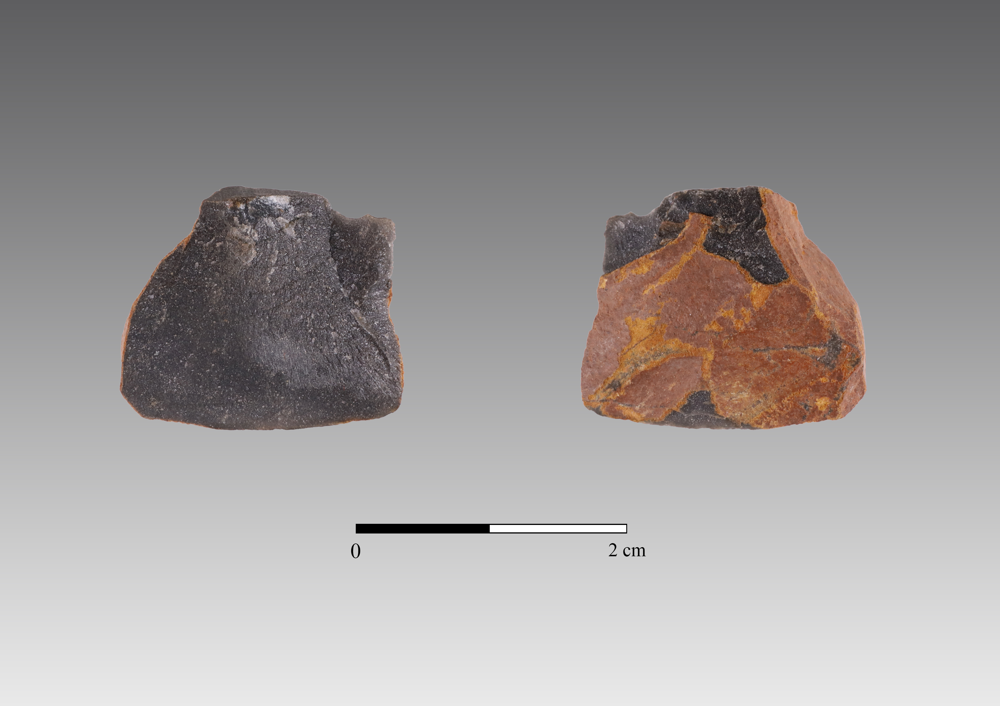

```{r setup, include=FALSE}

# Call packages
library(readr)
library(dplyr)
library(stringr)
library(tidyr)
library(knitr)
library(tab)
library(ggplot2)
library(FactoMineR)
library(factoextra)
library(RcmdrMisc)
library(IDPmisc)
library(forcats)
library(kableExtra)
library(float)
library(janitor)
library(ggpubr)
library(ggExtra)
library(ggsci)
library(ggalluvial)

knitr::opts_chunk$set(echo = FALSE, warning=FALSE)

```

```{r VB_analysis_setup, include=FALSE}

# Read db
context <- read_csv("data/context.csv") #Field DB
xyz <- read_csv("data/xyz.csv") #Field DB
lithics <- read_csv("data/Basedados_VB.csv") #Analysis DB

# Df cleaning and uniformizing
cols_to_concat <- c("Unit", "ID")
context$ID <- str_squish(context$ID) #remove empty spaces from ID field
xyz$ID <- str_squish(xyz$ID) #remove empty spaces from UNIT field

# Concatenate ID and UNIT variables in one single variable (e.g. A6-100)
context <- context %>%
  unite_(col='id', cols_to_concat, sep="-", remove=FALSE) %>%
  select(id, Spit, Level, Code) %>%
  distinct(id, .keep_all = TRUE)

xyz <- xyz %>%
  dplyr::rename(Unit = UNIT) %>%
  unite_(col='id', cols_to_concat, sep="-", remove=FALSE) %>%
  filter(Suffix == 0) %>%
  select(id, X, Y, Z) %>%
  distinct(id, .keep_all = TRUE)

# Classify complete blanks (into flake or elongated) according to W and L ratio
lithics <- lithics %>%
  dplyr::rename(Unit = UNIT) %>%
  unite_(col='id', cols_to_concat, sep="-", remove=FALSE) %>% 
  mutate(elong = MaxWidth*2-Length) %>% 
  mutate(BlankType = case_when(
    Class == "Blank" & elong > 0 ~ "Flake",
    Class == "Blank" & elong <= 0 ~ "ElongatedProd")) %>% 
  as.data.frame()

# Join both tables and (optionally) write csv with final result
field_data <- full_join(xyz, context, by = "id")

# Join field and lithic tables
dataset <- left_join(lithics, field_data, by = "id")

# Force transform 'dataset' into a data.frame
dataset <- as.data.frame(dataset)

# Attribute phase based on depth (Z)
dataset <- dataset %>% 
  mutate(Phase = case_when(
    Z > 24.1 ~ "Upper 5/4E",
    Z < 24.1 ~ "Lower 5"))


```

```{r lp_analysis_setup, include=FALSE}

lithicslp <- read_csv("data/Basedados_LP.csv")
xyzlp <- read_csv("data/xyzlp.csv")
cols_to_concat <- c("UNIT", "ID")
xyzlp$ID <- str_squish(xyzlp$ID)

lithicslp <- lithicslp %>% 
  dplyr::rename("UNIT" = "X5") %>% 
  unite_(col='ID', cols_to_concat, sep="-", remove=FALSE)

xyzlp <- xyzlp %>%
  unite_(col='ID', cols_to_concat, sep="-", remove=FALSE) %>%
  filter(SUFFIX == 0) %>%
  select(ID, X, Y, Z) %>%
  distinct(ID, .keep_all = TRUE)

# Classify complete blanks (into flake or elongated) according to W and L ratio
lithicslp <- lithicslp %>%
  mutate(elong = MaxWidth*2-Length) %>% 
  mutate(BlankType = case_when(
    Class == "Blank" & elong > 0 ~ "Flake",
    Class == "Blank" & elong <= 0 ~ "ElongatedProd")) %>% 
  select(-elong)

datasetlp <- left_join(lithicslp, xyzlp, by = "ID")

datasetlp <- as.data.frame(datasetlp)

# Attribute phase based on depth (Z)
datasetlp <- datasetlp %>% 
  mutate(Phase = case_when(
    Z >= 566.9 | Level == "T1" | Level == "T2" | Level == "T3" | Level == "T4" | Level == "T5" ~ "Middle T",
    Z < 566.9 | Level == "T6" | Level == "T7" | Level == "T8" | Level == "U" | Level == "U1" ~ "U/Lower T"))

```

# Results

## Assemblages

### Vale Boi

As mentioned in previous chapters, the lithic assemblages analysed in this study come from layers 4E and 5 of the Terrace area. The present study only considered materials from rows H, I and J, excavated between 2012 and 2019.

Artifact distribution across layers 5 and 4E confirms an interesting pattern, already evidenced in previous works (*e.g.*, Belmiro, 2017). As seen in Figure \@ref(fig:spatialdistributionVB), the distribution of artifacts (excluding chips), clearly shows a concentration of materials in the top of the sequence, corresponding to the totality of Layer 4E and the first c. 10 cm of Layer 5. The discard rates of artifacts then gradually diminish in the middle and bottom sections of Layer 5.

A preliminary visual analysis of the artifact distribution presented in Figure \@ref(fig:spatialdistributionVB) does not seem to show concentrations of specific raw materials along the stratigraphy. 

However, when calculating the percentages of the three most important raw materials by cubic meter of excavated sediment (Figure \@ref(fig:rmdispersion)) and plotting them by depth, there are significant differences in raw material distribution over time. From around 24.1 m of depth upwards, there is an important shift in quartz and chert frequencies, the latter increasing more than 10%, and quartz dropping from c. 50% to nearly 30%. Greywacke frequencies follow those of quartz.

```{r spatialdistributionVB, fig.cap="Vale Boi. Spatial distribution of lithic artefacts (without chips) by raw material, on unit H.", echo=FALSE, out.width = '80%', fig.align='center'}

# Setup filters for graph
spatial <- dataset %>% 
  filter(Code != "Bucket") %>% 
  filter(Class != "Chip") %>% 
  filter(Unit%in%c("H18","H19","H20","H21")) %>% 
  filter(Y > 1) %>% 
  filter(Z < 25) %>% 
  filter(Z > 1) 

# Plot graph
spatial %>%   
mutate(RawMaterial = factor(RawMaterial, levels = c("Quartz", # order y axis
                                                      "Chert", "Greywacke", "Chalcedony",
                                                      "Dolerite", "Other"))) %>%
  ggplot(aes(Y, Z, colour = RawMaterial)) +
  geom_point() +
  theme_minimal() + 
  theme(legend.title = element_blank()) + 
  theme(axis.title = element_text(size = 10, vjust = -1)) + 
  scale_color_jco() 

```

\  

This shift seems to be associated with other significant changes in the Terrace sequence, such as the aforementioned increase in the amount of lithic materials in top of Layer 5 and Layer 4E, but also the appearance of Vale Comprido technology (Figure \@ref(fig:spatialvbfig)). Additionally, these two moments are stratigraphically correlated with two different chronological horizons, the first, dated to c. 26 ka cal BP, at c. 23.9 m depth, and associated with higher frequencies of quartz, and the second, dated to c. 24.7 ka cal BP, at around 24.1 m depth, associated with higher frequencies of chert and a reduction in quartz presence.

As such, and given the chronological data, density of artifacts, and raw material preference patterns, it was decided that for this study the materials would be subdivided in two analytical units, to better understand any possible technological differences: **Lower 5**, including all artifacts with Z values under 24.1; **Upper 5/4E**, including all artifacts with Z values of 24.1 and above. The value 24.1 is arbitrary and was chosen for the reasons aforementioned: it seems to be where the separation between higher and lower densities of lithic materials occurs and, also, where the inversion of quartz and chert frequencies happens.

```{r rmdispersion, fig.cap = "Vale Boi. Raw material discard rates over time. Each point is an excavation unit (spit). The lines are locally weighted regression lines (span ¼ 0.4) to aid in visualising the trend of increased discard in the upper part of the deposit.", echo = FALSE, message=FALSE, warning=FALSE, out.width = '80%', fig.align='center', fig.pos="H"}

# Calulate spit volumes
cols_to_concat <- c("Level", "Spit")

buckets_by_spit <- context %>%
  filter(Level %in% c("4E", "5", "5B", "5C") & Code == "BUCKET" & !Spit %in% c("limp_corte", "profile", " ", NA)) %>%
  unite_(col='depth', cols_to_concat, sep=".", remove=FALSE)

buckets_by_spit$depth <- str_replace(buckets_by_spit$depth, "B", "")
buckets_by_spit$depth <- str_replace(buckets_by_spit$depth, "C", "")

spit_vol <- buckets_by_spit %>%
  dplyr::group_by(depth) %>%
  dplyr::count(Code) %>%
  mutate(spit_vol = (n*10)/1000)

# Calculate average depth of spits

spit_depths <- field_data %>%
  filter(Level %in% c("4E", "5", "5B", "5C") & !Spit %in% c("limp_corte", "LIMP_CORTE", "profile", " ", NA, "0")) %>%
  unite_(col='depth', cols_to_concat, sep=".", remove=FALSE)

spit_depths$depth <- str_replace(spit_depths$depth, "B", "")
spit_depths$depth <- str_replace(spit_depths$depth, "C", "")

spit_aver_depths <- spit_depths %>%
  dplyr::group_by(depth) %>%
  dplyr::summarise(avg = mean(Z)) %>%
  mutate_if(is.numeric, format, 3)

## Data classes per spit

cols_to_concat <- c("Level.y", "Spit")

lithics_by_spit <- dataset %>%
  filter(Level.y %in% c("4E", "5", "5B", "5C") & !Spit %in% c("limp_corte", "profile", " ", NA)) %>%
  select(id, Z, Spit, Level.y, Code, Class, ChipQuantity, RetouchedPieceTypology, PieceCompleteness, RawMaterial) %>%
  unite_(col='depth', cols_to_concat, sep=".", remove=FALSE)

lithics_by_spit$depth <- str_replace(lithics_by_spit$depth, "B", "")
lithics_by_spit$depth <- str_replace(lithics_by_spit$depth, "C", "")

#Debitage by spit

cols_to_concat <- c("Level.y", "Spit")

rm_by_spit <- dataset %>%
  filter(Level.y %in% c("4E", "5", "5B", "5C") & !Spit %in% c("limp_corte", "profile", " ", NA)) %>%
  select(id, Z, Spit, Level.y, Code, RawMaterial, QuartzQuality, Class) %>%
  unite_(col='depth', cols_to_concat, sep=".", remove=FALSE) %>% 
  filter(Class %in% c("Blank","Core","RetouchedPiece"))

rm_by_spit$depth <- str_replace(rm_by_spit$depth, "B", "")
rm_by_spit$depth <- str_replace(rm_by_spit$depth, "C", "")

rm_by_spit <- rm_by_spit %>% 
  dplyr::group_by(depth) %>%
  dplyr::count(RawMaterial) %>%
  mutate(freq = n / sum(n)*100)

quartz_by_spit <- rm_by_spit %>%
  filter(RawMaterial == "Quartz")

chert_by_spit <- rm_by_spit %>% 
  filter(RawMaterial == "Chert")

grey_by_spit <- rm_by_spit %>% 
  filter(RawMaterial == "Greywacke")

quartz_by_spit$spit_vol <- spit_vol$spit_vol[match(quartz_by_spit$depth, spit_vol$depth)]
quartz_by_spit <- quartz_by_spit %>%
  mutate(artifacts_by_cubic_meter = n/spit_vol)
quartz_by_spit$spit_aver_depth <- spit_aver_depths$avg[match(quartz_by_spit$depth, spit_aver_depths$depth)]
quartz_by_spit$spit_aver_depth <- as.numeric(as.character(quartz_by_spit$spit_aver_depth))

chert_by_spit$spit_vol <- spit_vol$spit_vol[match(chert_by_spit$depth, spit_vol$depth)]
chert_by_spit <- chert_by_spit %>%
  mutate(artifacts_by_cubic_meter = n/spit_vol)
chert_by_spit$spit_aver_depth <- spit_aver_depths$avg[match(chert_by_spit$depth, spit_aver_depths$depth)]
chert_by_spit$spit_aver_depth <- as.numeric(as.character(chert_by_spit$spit_aver_depth))

grey_by_spit$spit_vol <- spit_vol$spit_vol[match(grey_by_spit$depth, spit_vol$depth)]
grey_by_spit <- grey_by_spit %>%
  mutate(artifacts_by_cubic_meter = n/spit_vol)
grey_by_spit$spit_aver_depth <- spit_aver_depths$avg[match(grey_by_spit$depth, spit_aver_depths$depth)]
grey_by_spit$spit_aver_depth <- as.numeric(as.character(grey_by_spit$spit_aver_depth))

rm_by_cubic_meter <- bind_rows(quartz_by_spit, chert_by_spit, grey_by_spit)

rm_by_cubic_meter <- filter(rm_by_cubic_meter, spit_vol > 0.10) # removes low volumetric levels


# Plot

rm_cubic_meter <- ggplot(rm_by_cubic_meter, (aes(spit_aver_depth, freq, colour = RawMaterial))) +
  geom_point() +
  stat_smooth(span = 0.5, se = FALSE) +
  xlab("Depth (m)") +
  ylab("Artefact relative frequency by cubic meter of sediment (log10)") +
  theme(axis.text=element_text(size=12),
        axis.title.x = element_text(size = 14),
        axis.title.y = element_text(size = 14),
        legend.text = element_text(size= 12),
        legend.title = element_text(size = 14)) +
  scale_y_log10()+
  coord_flip() +
  scale_color_jco()

rm_cubic_meter
```

\  

A total of 26,703 pieces were analysed for both groups, 11,094 from Lower 5 group (Table \@ref(tab:general1)) and 15,609 for the Upper 5/4E (Table \@ref(tab:general2)). Most of these are chips (70.62% from Lower 5 and 65.68% from Upper 5/4E), followed by shatters, which make up c. 21% and c. 24% of the groups, respectively. These extremely high numbers for debris are mostly the result of quartz use, which can be explained not only by on-site knapping of this raw material but mostly by its breakage patterns (especially when coarser), which typically produces more waste than in other raw materials.

For Lower 5, cores and debitage products represent a cumulative frequency of c. 8%. For Upper 5/4E, debitage products represent nearly 10% of the group's assemblage. Complete blanks are the most represented class for both groups, with 1,474 identified pieces, 4.59% for Lower 5 and 6.18% for Upper 5/4E, followed by blank fragments, with an absolute count of 248 for Lower 5 and 336 for Upper 5/4E. Cores are also relatively frequent within these assemblages, with an absolute count of 123 cores, 46 for Lower 5 and 77 for Upper 5/4E, while core fragments appear in much smaller numbers (n=11 and n=14, respectively).

During the analysis, 167 retouched pieces were identified, 55 on Lower 5, representing 0.5% of the group, and 112 on Upper 5/4E, with a frequency of 0.72%. Retouched piece fragments appear in much smaller numbers (n=7 for Lower 5 and n=16 for Upper 5/4E).

```{r general1, echo=FALSE}


### General table Lower 5
db_phase1 <- dataset %>% 
  filter(Phase=="Lower 5")

table1 <- db_phase1 %>% 
  select(RawMaterial, Class) %>% 
  filter(Class != "Chip") %>% 
  dplyr::group_by(RawMaterial) 


chip_table1 <- db_phase1 %>% 
  filter(Class == "Chip") %>%
  select(RawMaterial, ChipQuantity) %>% 
  na.omit() %>% 
  dplyr::group_by(RawMaterial) %>% 
  dplyr::summarise(ChipQuantity = sum(ChipQuantity)) %>% 
  tidyr::spread(RawMaterial, ChipQuantity) %>% 
  mutate(Class = "Chip") %>% 
  select(Class, Quartz, Chert, Greywacke, 
         Dolerite, Chalcedony, Other)

general_table1 <- table(table1$Class, table1$RawMaterial)
general_table1 <- as.data.frame.matrix(general_table1)
general_table1 <- general_table1 %>% 
  select(Quartz, Chert, Greywacke, 
         Dolerite, Chalcedony, Other) %>% 
  tibble::rownames_to_column()
general_table1 <- dplyr::rename(general_table1, "Class" = "rowname")
general_table1 <- union(general_table1, chip_table1)


general_table1 <- general_table1 %>% 
  mutate("Quartz (%)" = paste0(round(100 * Quartz/sum(Quartz), 2), "%")) %>% 
  mutate("Chert (%)" = paste0(round(100 * Chert/sum(Chert), 2), "%")) %>% 
  mutate("Greywacke (%)" = paste0(round(100 * Greywacke/sum(Greywacke), 2), "%")) %>% 
  mutate("Dolerite (%)" = paste0(round(100 * Dolerite/sum(Dolerite), 2), "%")) %>% 
  mutate("Chalcedony (%)" = paste0(round(100 * Chalcedony/sum(Chalcedony), 2), "%")) %>% 
  mutate("Other (%)" = paste0(round(100 * Other/sum(Other), 2), "%")) %>% 
  select("Class", "Quartz", "Quartz (%)", "Chert", "Chert (%)", "Greywacke", "Greywacke (%)", "Dolerite",
         "Dolerite (%)", "Chalcedony", "Chalcedony (%)", "Other", "Other (%)") %>% 
  dplyr::rename("Quartz (n)" = "Quartz", "Chert (n)" = "Chert", "Greywacke (n)" = "Greywacke", "Dolerite (n)" = "Dolerite",
                "Chalcedony (n)" = "Chalcedony", "Other (n)" = "Other") %>% 
  adorn_totals(where = "col", name = "Total") %>% 
  mutate("Total (%)" = paste0(round(100 * Total/sum(Total), 2), "%")) %>% 
  adorn_totals(where = "row", name = "Total")
  
knitr::kable(head(general_table1[1:15], 12), booktabs=TRUE,caption="Vale Boi - Lower 5. Technological class by raw material.") %>% 
  column_spec(1, bold = T) %>% 
  kable_styling(latex_options = "scale_down") %>% 
  kableExtra::landscape() %>% 
  column_spec(2:5, width = "1cm") %>% 
  column_spec(6:7, width = "2cm") %>% 
  column_spec(8:9, width = "1.5cm") %>% 
  column_spec(10:11, width = "2cm") %>% 
  column_spec(12:15, width = "1cm")

```

```{r general2, fig.cap="General table Upper 5/4E.", echo=FALSE}

### General table for Upper 5/4E

db_phase2 <- dataset %>% 
  filter(Phase=="Upper 5/4E")

table2 <- db_phase2 %>% 
  select(RawMaterial, Class) %>% 
  filter(Class != "Chip") %>% 
  dplyr::group_by(RawMaterial) 


chip_table2 <- db_phase2 %>% 
  filter(Class == "Chip") %>%
  select(RawMaterial, ChipQuantity) %>% 
  na.omit() %>% 
  dplyr::group_by(RawMaterial) %>% 
  dplyr::summarise(ChipQuantity = sum(ChipQuantity)) %>% 
  tidyr::spread(RawMaterial, ChipQuantity) %>% 
  mutate(Class = "Chip")
chip_table2$Dolerite=0
chip_table2$Other=0
chip_table2 <- chip_table2 %>%
  select(Class,Quartz, Chert, Greywacke, 
         Dolerite, Chalcedony, Other)

general_table2 <- table(table2$Class, table2$RawMaterial)
general_table2 <- as.data.frame.matrix(general_table2)
general_table2 <- general_table2 %>% 
  select(Quartz, Chert, Greywacke, 
         Dolerite, Chalcedony, Other) %>% 
  tibble::rownames_to_column()
general_table2 <- dplyr::rename(general_table2, "Class" = "rowname")
general_table2 <- union(general_table2, chip_table2)


general_table2 <- general_table2 %>% 
  mutate("Quartz (%)" = paste0(round(100 * Quartz/sum(Quartz), 2), "%")) %>% 
  mutate("Chert (%)" = paste0(round(100 * Chert/sum(Chert), 2), "%")) %>% 
  mutate("Greywacke (%)" = paste0(round(100 * Greywacke/sum(Greywacke), 2), "%")) %>% 
  mutate("Dolerite (%)" = paste0(round(100 * Dolerite/sum(Dolerite), 2), "%")) %>% 
  mutate("Chalcedony (%)" = paste0(round(100 * Chalcedony/sum(Chalcedony), 2), "%")) %>% 
  mutate("Other (%)" = paste0(round(100 * Other/sum(Other), 2), "%")) %>% 
  select("Class", "Quartz", "Quartz (%)", "Chert", "Chert (%)", "Greywacke", "Greywacke (%)", "Dolerite",
         "Dolerite (%)", "Chalcedony", "Chalcedony (%)", "Other", "Other (%)") %>% 
  dplyr::rename("Quartz (n)" = "Quartz", "Chert (n)" = "Chert", "Greywacke (n)" = "Greywacke", "Dolerite (n)" = "Dolerite",
                "Chalcedony (n)" = "Chalcedony", "Other (n)" = "Other") %>% 
  adorn_totals(where = "col", name = "Total") %>% 
  mutate("Total (%)" = paste0(round(100 * Total/sum(Total), 2), "%")) %>% 
  adorn_totals(where = "row", name = "Total")


knitr::kable(head(general_table2[1:15], 12), booktabs=TRUE,caption="Vale Boi - Upper 5/4E. Technological class by raw material.") %>% 
  column_spec(1, bold = T) %>% 
  kable_styling(latex_options = "scale_down") %>% 
  kableExtra::landscape() %>% 
  column_spec(2:5, width = "1cm") %>% 
  column_spec(6:7, width = "2cm") %>% 
  column_spec(8:9, width = "1.5cm") %>% 
  column_spec(10:11, width = "2cm") %>% 
  column_spec(12:15, width = "1cm")

```

### Lapa do Picareiro

The materials from Lapa do Picareiro selected for this study come exclusively from Levels U and T. Based on chronological data and artifact distribution along the sequence, these levels had been previously organized into two distinct cultural horizons [@hawsetal2019], somehow similar to the Terminal Gravettian and Proto-Solutrean phases in the traditional transition model [@zilhao1997; @zilhaoetal1999].

Given this geo-archaeological background, for the present analysis the materials were separated into two assemblages: **U/Lower T**, which included all artifacts with depths inferior to 566.9 m or (in case of artifacts lacking 3D coordinates) from all spits from Level U and spits 6 through 8 from Level T [@hawsetal2019]; **Middle T**, including all artifacts with depths equal or superior to 566.9 m, or from the top five spits of Level T. Any other artifact in the assemblage which did not have a depth value or level/spit was not considered in these results since it lacked the needed information to contextualize its technological attributes. Also excluded from this study are the materials found on top of Level T, undoubtedly attributable to the Solutrean [@hawsetal2019; @benedettietal2019].

A total of 376 pieces were analyzed, 196 coming from the U/Lower T phase and 180 from the Middle T group. In both groups, debitage waste is mostly composed of chips, which represents 49.5% of the U/Lower T group and 37.2% of the Middle T group. As in Vale Boi, these values for chippage can be mostly explained by quartz breakage patterns.

The second most present class for both assemblages are complete blanks, which represent 13.7% of the U/Lower T group and 37.2% of the Middle T group, followed by blank fragments (13.7% and 15.5%, respectively). Retouched pieces have relatively small frequencies, representing c. 3% in both U/Lower T and Middle T. Cores are very scarce in both groups, 1% in the U/Lower T group (n=2) and c. 3% in the Middle T (n=5).

\  

\  

```{r general1lp, echo=FALSE}

## General table for U/Lower T
db_phaseTG <- datasetlp %>% 
  filter(Phase == "U/Lower T")

table_TG <- db_phaseTG %>% 
  select(RawMaterial, Class) %>% 
  filter(Class != "Chip") %>% 
  dplyr::group_by(RawMaterial) 

chip_table_TG <- db_phaseTG %>% 
  filter(Class == "Chip") %>%
  select(RawMaterial, ChipQuantity) %>% 
  na.omit() %>% 
  dplyr::group_by(RawMaterial) %>% 
  dplyr::summarise(ChipQuantity = sum(ChipQuantity)) %>% 
  tidyr::spread(RawMaterial, ChipQuantity) %>% 
  mutate(Class = "Chip") %>% 
  select(Class, Quartz, Chert, Other)

general_table_TG <- table(table_TG$Class, table_TG$RawMaterial)
general_table_TG <- as.data.frame.matrix(general_table_TG)
general_table_TG <- general_table_TG %>% 
  select(Quartz, Chert, Other) %>% 
  tibble::rownames_to_column()
general_table_TG <- dplyr::rename(general_table_TG, "Class" = "rowname")
general_table_TG <- union(general_table_TG, chip_table_TG)

general_table_TG <- general_table_TG %>% 
  mutate("Quartz (%)" = paste0(round(100 * Quartz/sum(Quartz), 2), "%")) %>% 
  mutate("Chert (%)" = paste0(round(100 * Chert/sum(Chert), 2), "%")) %>% 
  mutate("Other (%)" = paste0(round(100 * Other/sum(Other), 2), "%")) %>% 
  select("Class", "Quartz", "Quartz (%)", "Chert", "Chert (%)", "Other", "Other (%)") %>% 
  dplyr::rename("Quartz (n)" = "Quartz", "Chert (n)" = "Chert", "Other (n)" = "Other") %>% 
  adorn_totals(where = "col", name = "Total") %>% 
  mutate("Total (%)" = paste0(round(100 * Total/sum(Total), 2), "%")) %>% 
  adorn_totals(where = "row", name = "Total (RM)")

knitr::kable(head(general_table_TG[1:9], 9), booktabs=TRUE,caption="Lapa do Picareiro - U/Lower T. Technological class by raw material.") %>% 
  column_spec(1, bold = T) %>% 
  kable_styling(latex_options = c("scale_down", "hold_position"))

```

```{r general2lp, echo=FALSE}

### Middle T table
db_phasePR <- datasetlp %>% 
  filter(Phase == "Middle T")

table_PR <- db_phasePR %>% 
  select(RawMaterial, Class) %>% 
  filter(Class != "Chip") %>% 
  dplyr::group_by(RawMaterial) 

chip_table_PR <- db_phasePR %>% 
  filter(Class == "Chip") %>%
  select(RawMaterial, ChipQuantity) %>% 
  na.omit() %>% 
  dplyr::group_by(RawMaterial) %>% 
  dplyr::summarise(ChipQuantity = sum(ChipQuantity)) %>% 
  tidyr::spread(RawMaterial, ChipQuantity) %>% 
  mutate(Class = "Chip") %>% 
  select(Class,Quartz, Chert, Other)

general_table_PR <- table(table_PR$Class, table_PR$RawMaterial)
general_table_PR <- as.data.frame.matrix(general_table_PR)
general_table_PR <- general_table_PR %>% 
  select(Quartz, Chert, Other) %>% 
  tibble::rownames_to_column()
general_table_PR <- dplyr::rename(general_table_PR, "Class" = "rowname")
general_table_PR <- union(general_table_PR, chip_table_PR)

general_table_PR <- general_table_PR %>% 
  mutate("Quartz (%)" = paste0(round(100 * Quartz/sum(Quartz), 2), "%")) %>% 
  mutate("Chert (%)" = paste0(round(100 * Chert/sum(Chert), 2), "%")) %>% 
  mutate("Other (%)" = paste0(round(100 * Other/sum(Other), 2), "%")) %>% 
  select("Class", "Quartz", "Quartz (%)", "Chert", "Chert (%)", "Other", "Other (%)") %>% 
  dplyr::rename("Quartz (n)" = "Quartz", "Chert (n)" = "Chert", "Other (n)" = "Other") %>% 
  adorn_totals(where = "col", name = "Total") %>% 
  mutate("Total (%)" = paste0(round(100 * Total/sum(Total), 2), "%")) %>% 
  adorn_totals(where = "row", name = "Total (RM)")

knitr::kable(head(general_table_PR[1:9], 7), booktabs=TRUE,caption="Lapa do Picareiro - Middle T. Technological class by raw material.") %>% 
  column_spec(1, bold = T) %>% 
  kable_styling(latex_options = c("scale_down", "hold_position"))

```

## Raw materials

Raw material use and availability, specifically abundance and quality, stand as important factors for understanding the organization of technology, as it may affect decisions regarding tool design and conservation of such tools [@andrefsky1994], as well as mobility and niche expansion [@cascalheira2013]. This quality is connected to both the raw material’s fracture mechanics and their intrinsic mineral characteristics, such as the size of their grain, homogeneity [@andrefsky1994], or even hardness [@kempson2011], which allow the knapper predictability over the outcome [@andrefsky2005].

There are a number of stones that are constant throughout the stone age archaeological record for having the necessary properties described above. Stones or minerals characterized by high frequencies of silica, such as chert or quartz, allow for good fracture predictability, while other materials with less homogeneity may progressively result in less predictable characteristics [@andrefsky2005]. Thus, despite the raw material variability within the pre-historic archaeological record, linked to its availability and geomorphological contexts of the sites, the selection is often coherent regarding fracture mechanics, where predictable conchoidal fractures are preferred [@inizan1999; @tixier1980; @andrefsky2005].

This pattern is also observable at Vale Boi and Lapa do Picareiro as shown below. Previous studies have shown that throughout most levels of human occupation at both sites, chert, fine quartz and greywacke (the latter in the case of Vale Boi only) or quartzite (in the case of Lapa do Picareiro) (all characterized by conchoidal fracture, although greywacke and quartzite are often coarse and more unpredictable) were the most frequently used [@bichoetal2012; @cascalheira2010; @marreiros2009; @hawsetal2019; @benedettietal2019; @pereira2016; @marreirosetal2009]. While at Vale Boi all the materials are available at a regional and local scale, at Lapa do Picareiro a more detailed analysis is needed to assess raw material provenance. Also, although the presence of the main raw materials is documented across all archaeological levels in Vale Boi, with each occupation differing in the frequency of their use, chert is always the primary material used for knapping [@cascalheira2010]. At Lapa do Picareiro, the use of chert is not always a preference, such as in the case of Level FF, where quartzite is clearly dominant. The characteristics of Lapa do Picareiro and the potential functional specificities of each occupation must have had a significant impact on the type and quality of the discarded materials.

For the present study, criteria used for raw material analysis focused on the identification of broader groups of stones and minerals, based on their general observable characteristics, without focusing on particular features within each raw material. Two exceptions were made, however. At both sites, quartz was subdivided into different categories regarding the size of the grain, to isolate and better understand the different uses of quartz over time. At Lapa do Picareiro, chert was organized based on color to evaluate the integrity of the deposits and, preliminarly, explore the spatial organization of levels U and T. Both of these exceptions are presented in the following sections where the patterns of exploitation of the more relevant raw materials are discussed for each site and phase.

### Vale Boi

One of the most relevant raw materials in both of Vale Boi's analytical units used for this study is quartz (encompassing rock crystal, fine, medium and coarse qualities), which represents c. 43% of the total assemblage for the Upper 5/4E group, and c. 51% for Lower 5. Chert, on the other hand, represents c. 46% of the Upper 5/4E phase and 38% of the Lower 5. Finally, greywacke, dolerite, chalcedony, and other raw materials that due to their low frequencies were collapsed in the category “Other”, together represent c. 11% of both assemblages (Figure \@ref(fig:rmvb)).

```{r rmvb, fig.cap="Vale Boi. Frequencies of raw materials by phase. Chips and shatters not included.", echo=FALSE, out.width = '80%', fig.align='center'}

dfRM_vb <- dataset %>% 
  filter(Class!="Chip") %>% 
  filter(Class!="Shatter") %>% 
  drop_na(Phase)

dfRM_vb %>%
  mutate(RawMaterial = factor(RawMaterial, levels = c("Quartz","Chert","Greywacke","Dolerite","Chalcedony","Other"))) %>%
  dplyr::group_by(Phase, RawMaterial) %>% 
  dplyr::summarise(n = n()) %>%
  mutate(percent = n/sum(n)) %>% 
  ggplot(aes(x=Phase, y = percent, fill = RawMaterial)) +
  geom_bar(stat = "identity", width = 0.5) +
  scale_y_continuous(labels = scales::percent_format()) +
  theme_minimal() + #type of theme
  labs(x = "Phases", y = NULL) +# change labels
  guides(fill=guide_legend(title=NULL)) + # remove legend title
  geom_text(aes(label=ifelse(percent >= 0.07, paste0(sprintf("%.0f", percent*100),"%"),"")),
                position=position_stack(vjust=0.5), colour="white") +
  theme(axis.title.x = element_text(size = 10, vjust = -1)) +
  scale_fill_jco()

```

#### Quartz

The number of chips and shatter in quartz are, as seen in Tables \@ref(tab:general1) and \@ref(tab:general2), extremely high, both in its representativity within the raw material, with c. 94% for both Lower 5 and Upper 5/4E, and when compared to the relative frequencies of other raw materials.

Despite the low frequencies presented on the table, there is a large number of quartz blanks (n=281 for Lower 5 and n=438 for Upper 5/4E) compared to the rest of the classes, as well as cores (n=18 for Lower 5 and n=32 for Upper 5/4E) and retouched pieces (n=15 for Lower 5 and n=34 for Upper 5/4E). 

Most of the quartz artifacts do not show the presence of cortex, with nearly 95% of all artifacts having 0% cortex (Figure \@ref(fig:rmcortex)). When cortex is present, around 72% of the artifacts indicate the exploitation of cobbles or pebbles. These patterns are similar for both Lower 5 and Upper 5/4E (Table \@ref(tab:cortextab1)).

As mentioned before, quartz was organized into groups regarding grain size. Analyzing the artifact class frequency through the different identified types of quartz confirmed an already expected pattern: the production of blanks was largely accomplished using fine and medium quality quartz (52.1% and 32.7% for Lower 5, Table \@ref(tab:quartzquality1) and 49.3% and 32.1% for Upper 5/4E, Table \@ref(tab:quartzquality2), respectively). 

\  

```{r quartzquality1, echo=FALSE}

quartzp1 <- dataset %>% 
  filter(RawMaterial == "Quartz") %>% 
  filter(Phase=="Lower 5") %>% 
  filter(Class!="Chip") %>% 
  filter(Class!="Shatter") %>% 
  select(QuartzQuality, Class, Phase) %>% 
  na.omit()

quartztab1 <- tabmulti(quartzp1, "Class", c("QuartzQuality"),
                      ymeasures = c("freq"),
                      p.include = FALSE,
                      n.headings = FALSE,
                      bold.varnames = TRUE,
                      bold.colnames = TRUE,
                      listwise.deletion = FALSE,
                      variable.colname = "Quartz quality")

quartztab1 <- quartztab1 %>% 
  as.data.frame() %>% 
    dplyr::rename("Total" = "Overall") %>% 
  select("Quartz quality", "Blank", "Core", 
         "CorePreparProd", "RetouchedPiece", "Total")

knitr::kable(quartztab1, booktabs=TRUE, caption = "Vale Boi - Lower 5. Frequencies of technological classes by quartz quality.") %>% 
  column_spec(1, bold = T) %>% 
  kable_styling(latex_options = "hold_position", font_size = 9) 

```

```{r quartzquality2, echo=FALSE}

quartzp2 <- dataset %>% 
  filter(RawMaterial == "Quartz") %>% 
  filter(Phase=="Upper 5/4E") %>% 
  filter(Class!="Chip") %>% 
  filter(Class!="Shatter") %>% 
  filter(Class!="BlankFrag") %>% 
  select(QuartzQuality, Class) %>% 
  na.omit()

quartztab2 <- tabmulti(quartzp2, "Class", c("QuartzQuality"),
                      ymeasures = c("freq"),
                      p.include = FALSE,
                      n.headings = FALSE,
                      bold.varnames = TRUE,
                      bold.colnames = TRUE,
                      listwise.deletion = FALSE,
                      variable.colname = "Quartz quality")

quartztab2 <- quartztab2 %>% 
  as.data.frame() %>% 
    dplyr::rename("Total" = "Overall") %>% 
  select("Quartz quality", "Blank", "Core", 
         "CorePreparProd", "RetouchedPiece", "Total")


knitr::kable(quartztab2, booktabs=TRUE, caption = "Vale Boi - Upper 5/4E. Frequencies of technological classes by quartz quality.") %>% 
  column_spec(1, bold = T) %>% 
  kable_styling(latex_options = c("hold_position"), font_size = 9)

```

\  

Most of the retouched tools were also recorded for these two types of quartz quality (66.7% and 26.7% for Lower 5, and 55.9% and 44.1% for Upper 5/4E). No retouched pieces were identified in coarse quartz and rock crystal. The latter type represents, also, a rather small fraction of the assemblage. In accordance with previous studies on Vale Boi lithic industries (e.g. Cascalheira 2009, Marreiros 2009) coarse quartz appears mostly as knapping shatters, or as other type of fragments not related to human knapping (see Manne et al. 2012 for more information).

#### Chert

Chert shows high frequencies of blanks (15.8% for Lower 5 and 19.6% for Upper 5/4E) when compared to every other class, excluding chips (Tables \@ref(tab:general1) and \@ref(tab:general2)). The latter represents more than 50% of the chert assemblages, with an absolute frequency of 649 chips for Lower 5 and 1,158 for Upper 5/4E.

Although chert shows smaller absolute numbers for blanks (n=171 for Lower 5 and n=407 for Upper 5/4E) and blank fragments (n=90 for Lower 5 and n=155 for Upper 5/4E) compared to quartz, there is a large quantity of cores representing 2.1% of total chert in Lower 5 and 2% in Upper 5/4E. However, tables  \@ref(tab:general1) and \@ref(tab:general2) show a noticeable difference in the ratio between chert blanks and quartz blanks in Lower 5 and Upper 5/4E, with the latter showing a higher frequency of chert blanks compared to Upper 5/4E.

Regarding retouched pieces, these represent more than 3% of chert for both phases, a number far higher than those in other raw materials. This shows that chert, although less present than quartz in blank absolute count (although barely in Upper 5/4E), might have been preferentially used for formal tool production.

Chert also shows the most prominent variability of cortex frequencies in both phases (Figure \@ref(fig:rmcortex)), although there is a clear dominance of artifacts with 0% cortex, a pattern that was already expected, following the process of the knapping sequence, where only the first blanks removed from an unmodified block will be entirely cortical, showing increasingly less cortex for posterior removals  [@andrefsky2005]. It is noteworthy, however, that for both phases, a significant number of chert artifacts (c. 25%) presented cortical surfaces, confirming that chert nodules were imported to the site and thus all phases of the reduction sequences are likely represented.

This variability in cortex presence is accompanied by some diversity of cortex types, with the presence of both cobble and outcrop sources, even though for almost 85% of the artifacts it was not possible to identify a specific type of cortex (Table \@ref(tab:cortextab1)).

#### Greywacke

Greywacke is a variety of sandstone, often characterized by its hardness, dark color and poorly sorted grains of quartz and feldspar [@haldar2013]. At Vale Boi, this raw material is highly heterogeneous, showing a wide variety of grain sizes and colors.

Within the studied assemblage, greywacke is best represented by debitage waste, with around 25% of shatter and 70% of chips, for both Lower 5 and Upper 5/4E. In contrast, relatively low numbers for blanks (n=44 for Lower 5 and n=80 for Upper 5/4E) and cores (n=3 for Lower 5 and 1 for Upper 5/4E) were recorded. The same applies to the retouched tools category, with three artifacts recorded, one of which is a Vale Comprido piece, in the Upper 5/4E phase.

When chips and shatters are removed, greywacke has a representation of less than 10% in both assemblages making it the third most used raw material (Figure \@ref(fig:rmvb)).

Similarly to the other raw materials, there is, for both phases, the predominance of debitage without cortex (Figure \@ref(fig:rmcortex)). There is, however, some variability in cortex presence, even if in smaller frequencies than the patterns observed for chert. As in the case of quartz, most of the identified cortex presented water-worned surfaces, indicating the exploitation of cobbles or, most likely, slabs.

#### Dolerite

Dolerite is a volcanic igneous rock, occurring mostly in dikes, varying between coarse and fine textures, and often having a dark, grey or greyish-green coloration [@haldar2013; @kempson2011]. Its presence is registered in the Algarve, through occasional outcrops in the southwest [@oliveira1984], also appearing as outcrops within the Messejana fault [@belmiro2018].

At Vale Boi, this raw material was first identified as jasper when excavating the levels referring to the proto-solutrean occupation in the Terrace area (units J-L), before 2012 [@marreiros2009]. The material has a very characteristic reddish-brown color and fine texture, with a conchoidal fracture. Despite this coloration, which is also present in jasper (a red-colored variety of chalcedony), the raw material was later identified as dolerite, and its coloration explained by the presence of a reddish patina which would have altered the original rock by processes of iron mineral oxidation through contact with the terra rossa [@belmiro2018].

The analysis of a thin section obtained from a dolerite fragment from the present assemblage allowed the characterization of this raw material, through its visible features and petrography. The reddish coloration was confirmed to be an exterior patina, no more than 1 mm thick, completely covering the artifacts. The actual rock still displays a fine texture but with an opaque black color (Figure \@ref(fig:doleritephoto)).

Results from the petrographic analysis done through the observation of the thin section using a polarizing microscope revealed the presence of several minerals (Figure \@ref(fig:doleritemicro), Appendix A), such as feldspar, plagioclase, quartz, small quantities of silica, little presence of mica and iron oxide, which are in concordance with the mineral composition of dolerite or possibly hornfels [@kempson2011]. The feldspar minerals showed the presence of undulatory extinction, a deformation that takes place whenever certain minerals are exposed to high temperatures [@frost2019], thus indicating that the raw material is highly metamorphized.

Regarding the differentiation between dolerite and hornfels, although these two rocks have different origins, the latter being of volcanic igneous origin, considered a contact metamorphic rock [@haldar2013], they share enough visual and mineral characteristics (whenever the dolerite has a fine texture) to hinder their precise identification. Literature most often uses other methods to differentiate them, such as FTIR or XRF, by understanding not the mineral composition (which is essentially the same) but the ratio of components presence. This matter is further complexified by understanding that hornfels might originate from metamorphized igneous rocks, several sources of hornfels attributed to dolerite dikes [@hallinan2015; @kempson2011].

Given this difficulty, although the present analysis will use the term dolerite, for their reported similarities in terms of texture, grain size and fracture, further chemical studies need to be done in order to confirm whether the raw material is dolerite or possibly hornfels. Regarding the latter, there is also the presence of hornfels outcrops and rounded pebbles in the Algarve, near the southwestern coast, thus strengthening the hypothesis that this raw material, whether dolerite or hornfels, is available regionally.

Looking at the interior of dolerite allowed, during the second moment of analysis, to identify other products in the same raw material, which were not previously identified due to the lack of the same reddish patina. This patina also appears throughout the assemblage, mostly on greywacke, although without forming the same 1 mm thick layer visible on the dolerite pieces. This may be explained by the inherent mineral characteristics of this type of raw material and their reaction with the surrounding sediment.

The presence of this patina in several degrees of intensity, preferentially in dolerite and greywacke, its presence in both finished complete artifacts and flake fragments or shatters, and its occurrence also reported in the literature as a process frequently affecting raw materials like hornfels (*e.g.*, Hallinan and Shaw 2015), suggests that it is, in fact, the result of geological and chemical processes affecting these raw materials. Its absence from other raw materials, like chert or quartz, may reflect the inherent mineral properties of these rocks.

Dolerite is a rather unusual raw material in the site of Vale Boi, appearing only in layers 4E and 5 of the Terrace and proto-solutrean levels of the Slope area. The most striking characteristic of this raw material in the assemblages under study is the low presence of chips or shatter (n=1 each), but high frequencies of blanks (50% in Lower 5 and 60.8% in Upper 5/4E) and blank fragments (16.6% in Lower 5 and 13% in Upper 5/4E) (Tables \@ref(tab:general1) and \@ref(tab:general2)). Unlike Lower 5, in Upper 5/4E dolerite is represented by five retouched tools, some of which are Vale Comprido points. This raw material seems to have been used preferentially at Vale Boi for the production of these types of points, a pattern already observed in previous works [@marreiros2009], where three out of five Vale Comprido points were identified as dolerite (originally jasper).

The absence of cores, with only one core fragment identified in the Lower 5 group, and low quantity of debitage waste may be explained by the importation of finished pieces or blanks to the site, suggesting that, most likely, no knapping activities occurred with this raw material at the site. This interpretation is, however, truncated by this study’s phase analysis. As the identification of the inner aspect of dolerite was only achieved at the start of the second phase, which as referred before, consisted of the analysis of all cores and debitage products with a more complete database, shatter, chips and fragments were not revisited, thus not allowing for the possible identification of unpatinated dolerite within those classes, which might have been mistaken for fine-grained greywacke. This caveat does not, however, seem to influence the patterns regarding complete blank and retouched tools frequency. 

\  

```{r doleritephoto, fig.cap="Dolerite flake removed from a debitage waste piece. Left: ventral side with interior colour and texture of the raw material; Right: dorsal side with patina.", fig.scap="Dolerite flake removed from a debitage waste piece.", out.width = '70%', fig.align='center', echo=FALSE}



```

\newpage

#### Chalcedony

Chalcedony is a type of cryptocrystalline quartz, characterized by a waxy and glossy appearance, ranging from a variety of possible colors [@haldar2013], although white is the only present variety in the studied assemblages. The chalcedony in levels 5 and 4E is also characterized by the frequent presence of inclusions, making this raw material poorly homogeneous.

Results indicate it may have been mainly used for the production of blanks, which represent 37.5% of chalcedony in Lower 5 (Table \@ref(tab:general1)) and 32.1% in Upper 5/4E (Table \@ref(tab:general2)), with a rather small representation of retouched pieces (n=2), which include a Vale Comprido point in the Upper 5/4E group. The presence of a core in Lower 5, as well as the presence of shatter and chips (in small numbers, n<5 each for Lower 5 and n=15 each for Upper 5/4E, respectively) may indicate, contrary to the dolerite, onsite knapping of this raw material.

Compared to other raw materials, chalcedony has the lowest frequencies of cortex, in both phases, with almost 100% of all artifacts (except shatter and chips) having 0% cortex (Figure \@ref(fig:rmcortex)).

```{r rmcortex, fig.cap="Vale Boi. Frequencies of cortex by raw material and phase. Chips and shatters not included.", echo=FALSE, out.width = '70%', fig.align='center', fig.pos="H"}

dfRM_vb1 <- dfRM_vb %>% 
  filter(Phase=="Lower 5")

dfRM_vb2 <- dfRM_vb %>% 
  filter(Phase=="Upper 5/4E")

dfRM_vb %>% 
  select(RawMaterial, Cortex, Phase) %>% 
  na.omit() %>% 
  mutate(RawMaterial = factor(RawMaterial, levels = c("Quartz", # order y axis
                                                      "Chert", "Greywacke", "Chalcedony",
                                                      "Dolerite", "Other"))) %>% 
  mutate(Cortex = factor(Cortex, levels = c("0%", "1-30%", "31-60%", "61-99%",
                                            "100%"))) %>% # order x axis
  ggplot(aes(RawMaterial)) +
  geom_bar(position =  "fill", aes(fill = Cortex)) + 
  scale_y_continuous(labels = scales::percent_format()) + 
  theme_minimal() + #type of theme
  labs(x = NULL, y = NULL) +# change labels
  guides(fill=guide_legend(title=NULL)) + # remove legend title
  theme(axis.text.x = element_text(angle = 50, hjust = 1)) +
  scale_fill_jco() +
  facet_wrap( ~ Phase, ncol = 2)# set colours


```

```{r cortextab1, echo=FALSE}

dfRM3p1 <- dfRM_vb1 %>% 
  select(RawMaterial, Cortex, CortexType, CortexLocation)

cortextabp1 <- tabmulti(dfRM3p1, "RawMaterial", "CortexType",
                      p.include = FALSE,
                      n.headings = FALSE,
                      bold.varnames = TRUE,
                      bold.colnames = TRUE,
                      variable.colname = "Cortex attributes")

cortextabp1 <- as.data.frame(cortextabp1)

cortextabp1 <- cortextabp1 %>% 
  select("Cortex attributes", "Quartz", "Chert", 
         "Greywacke", "Overall") %>% 
 dplyr::rename("Total" = "Overall")

dfRM3p2 <- dfRM_vb2 %>% 
  select(RawMaterial, Cortex, CortexType, CortexLocation)

knitr::kable(cortextabp1, booktabs=TRUE, caption = "Vale Boi - Lower 5. Frequencies of cortex type by raw material.") %>% 
  column_spec(1, bold = T, width = "5cm") %>% 
  column_spec(2, width = "2cm") %>%
  column_spec(3, width = "2cm") %>%
  column_spec(4, width = "2cm") %>% 
  column_spec(5, width = "2cm") %>% 
  kable_styling(font_size = 9, latex_options = "hold_position")

```

\  

```{r cortextab2, echo=FALSE}

cortextabp2 <- tabmulti(dfRM3p2, "RawMaterial", "CortexType",
                      p.include = FALSE,
                      n.headings = FALSE,
                      bold.varnames = TRUE,
                      bold.colnames = TRUE,
                      variable.colname = "Cortex attributes")

cortextabp2 <- as.data.frame(cortextabp2)

cortextabp2 <- cortextabp2 %>% 
  select("Cortex attributes", "Quartz", "Chert", 
         "Greywacke", "Dolerite", 
         "Other", "Overall") %>% 
  dplyr::rename("Total" = "Overall")

knitr::kable(cortextabp2, booktabs=TRUE, caption = "Vale Boi - Upper 5/4E. Frequencies of cortex type by raw material.") %>% 
  column_spec(1, bold = T) %>% 
  kable_styling(font_size = 9, latex_options = "hold_position")

```

\  

### Lapa do Picareiro

Comparatively to Vale Boi, Lapa do Picareiro shows less raw material variability, which might be explained by the lithological characteristics of the area, already explored in other studies that showed similar raw material presence patterns [@almeida2000; @zilhao1997], but can also be related to the location of the site in a high altitude environment with significant implications to the functional nature of the occupations (see Cascalheira and Bicho 2017). 

```{r rmlp, fig.cap = "Lapa do Picareiro. Frequencies of raw material by phase. Chips and shatters not included.", echo=FALSE, out.width = '70%', fig.align='center', fig.pos="H"}
dfRM_lp <- datasetlp %>% 
  filter(Class!="Chip") %>% 
  filter(Class!="Shatter") %>% 
  drop_na(Phase)
dfRM_lp %>%
  dplyr::group_by(Phase, RawMaterial) %>% 
  dplyr::summarise(n = n()) %>%
  mutate(percent = n/sum(n)) %>% 
  ggplot(aes(x=Phase, y = percent, fill = RawMaterial)) +
  geom_bar(stat = "identity", width = 0.5) +
  scale_y_continuous(labels = scales::percent_format()) +
  theme_minimal() + #type of theme
  labs(x = "", y = NULL) +# change labels
  guides(fill=guide_legend(title=NULL)) + # remove legend title
  theme(axis.text.x = element_text(hjust = 1)) + 
  geom_text(aes(label=ifelse(percent >= 0.07, paste0(sprintf("%.0f", percent*100),"%"),"")),
                position=position_stack(vjust=0.5), colour="white") +
  scale_fill_jco()
```

The main raw materials identified were quartz and chert (Figure \@ref(fig:rmlp)). Quartz is dominant in the U/Lower T phase, representing c. 60% of the assemblage, while chert is dominant in the Middle T phase, representing c. 59%. The sporadic occurrence of other raw materials is the result of the identification of some quartzite artifacts on both phases.

#### Quartz

The number of chips in quartz, as seen on Tables \@ref(tab:general1lp) and \@ref(tab:general2lp), is extremely high, representing nearly 60% of this raw material in both phases. Other waste products, i.e. shatters, show much smaller numbers (n=4 for U/Lower T and n=3 for Middle T). Comparatively, complete blanks are the second most present class in quartz, with a frequency of 20% (n=30) for the U/Lower T group, followed by blank fragments which represent 15.2% of that assemblage (Figure \@ref(fig:quartzbladelet). For the Middle T group, complete blanks and blank fragments show similar frequencies, representing c. 19% each. Although in small numbers, quartz shows the highest number of cores (n=4, 2 in each group) from all raw materials, but a small number of retouched tools (n=1).

\  

```{r quartzbladelet, fig.cap="Lapa do Picareiro - U/Lower T - Fine quartz and rock crystal blanks and blank fragments.", out.width = '60%', fig.align='center', echo=FALSE, fig.pos="H"}

knitr::include_graphics("figure/prancha_bladelets.jpg")

```

Regarding cortex, quartz shows frequencies as low as 6% for cortex presence on the U/Lower T group, 12.5% on the Middle T, being mostly composed of pieces with no cortex on their dorsal surfaces. When present, cortical surfaces are all water-worned, indicating the exploitation of cobbles/pebbles (Tables \@ref(Tab:cortextabtg) and \@ref(tab:cortextabpr)).

As in Vale Boi, quartz was categorized regarding grain quality and color (Tables \@ref(tab:quartzqualityTG) and \@ref(tab:quartzqualityPR)). For both the U/Lower T group and Middle T, it is possible to observe a majority of fine quality quartz and rock crystal for both cores and blanks, with barely any presence of medium and coarse quality quartz. The latter category is completely absent in the Middle T group. 

One observable difference between the two groups is in the percentage of rock crystal and fine quality: in the U/Lower T, fine quality quartz represents c. 56% of quartz, while rock crystal has a frequency of nearly 41%; for Middle T, these percentages change, as fine quality quartz represents c. 38%, against c. 57% of rock crystal. Finally, the single identified retouched tool in U/Lower T was made in fine quality quartz.

\  

```{r quartzqualityTG, echo=FALSE}

quartzp1lp <- datasetlp %>% 
  filter(RawMaterial == "Quartz") %>% 
  filter(Phase =="U/Lower T") %>% 
  filter(!Class %in% c("Chip", "Shatter")) %>%
  select(QuartzQuality, Class, Phase) %>% 
  na.omit()

quartztab1lp <- tabmulti(quartzp1lp, "Class", c("QuartzQuality"),
                      ymeasures = c("freq"),
                      p.include = FALSE,
                      n.headings = FALSE,
                      bold.varnames = TRUE,
                      bold.colnames = TRUE,
                      listwise.deletion = FALSE,
                      variable.colname = "Quartz quality")
quartztab1lp <- as.data.frame(quartztab1lp)
quartztab1lp <- quartztab1lp %>% 
  select("Quartz quality", "Blank", "Core", "RetouchedPiece", "Overall") %>% 
  dplyr::rename("Total" = "Overall")

knitr::kable(quartztab1lp, booktabs=TRUE, caption = "Lapa do Picareiro - U/Lower T. Frequencies of technological classes by quartz quality.") %>% 
  column_spec(1, bold = T) %>% 
  kable_styling(font_size = 9, latex_options = "hold_position")


```

\  

```{r quartzqualityPR, echo=FALSE}

quartzp2lp <- datasetlp %>% 
  filter(RawMaterial == "Quartz") %>% 
  filter(Phase=="Middle T") %>% 
  filter(!Class %in% c("Chip", "Shatter")) %>% 
  filter(Class!="BlankFrag") %>% 
  select(QuartzQuality, Class) %>% 
  na.omit()

quartztab2lp <- tabmulti(quartzp2lp, "Class", c("QuartzQuality"),
                      ymeasures = c("freq"),
                      p.include = FALSE,
                      n.headings = FALSE,
                      bold.varnames = TRUE,
                      bold.colnames = TRUE,
                      listwise.deletion = FALSE,
                      variable.colname = "Quartz quality")

quartztab2lp <- quartztab2lp %>% 
  as.data.frame() %>% 
  select("Quartz quality", "Blank", "Core", "Overall") %>% 
  dplyr::rename("Total" = "Overall")

knitr::kable(quartztab2lp, booktabs=TRUE, caption = "Lapa do Picareiro - Middle T. Frequencies of technological classes by quartz quality.") %>% 
  column_spec(1, bold = T) %>% 
  kable_styling(font_size = 9, latex_options = "hold_position")

```

\newpage

#### Chert

Chert is characterized by a high frequency of complete blanks (c. 53% for U/Lower T and c. 63% for Middle T), with frequencies of cumulative c. 22% and c. 15% for chips and shatters in the U/Lower T (Table \@ref(tab:general1lp)) and Middle T (Table \@ref(tab:general2lp)) phases, respectively. Blank fragments are poorly represented comparatively to quartz, with an absolute count of 4 elements for U/Lower T and 9 for the Middle T phase, representing c. 9% and c. 12% of the whole chert assemblage. Although there are few cores (n=2), retouched pieces have a relatively high frequency within chert (c. 11% on U/Lower T and c. 7% on Middle T) but also across all materials, suggesting that chert was preferentially used for the manufacture of formal tools.

Regarding cortex, chert shows mostly non-cortical pieces, particularly in the Middle T group where only 0% or 1-30% cortex frequencies were detected (Figure \@ref(fig:cortexlp)). The low frequencies of cortex resulted in a low rate of identification of cortex types across the assemblage. In fact, only two pieces for U/Lower T phase allowed to track its provenience to an outcrop source (Tables \@ref(tab:cortextabtg) and \@ref(tab:cortextabpr)).

Although chert was not initially subdivided regarding its visible characteristics, throughout the analysis, it became apparent that there were several groups with identical colors and grains, which might have belonged to the same nodule. As such, these groups were posteriorly individualized, adding a variable to the database called “ChertType” which included codes for each identified type of chert (Table \@ref(tab:cherttable), Appendix A). 

After the classification of the chert types, it was attempted to refit the pieces in each group, but due to the high level of modification/edge damage of each piece and the fragmentation of the reduction sequences, no reffits were possible. Additionally, using the spatial information of artifact distribution, each group was plotted in order to understand any spatial restriction or relationship that could help to identify specific clusters throughout the stratigraphy (Figure \@ref(fig:chertspatial)).

Most groups seem to show no particular spatial constraint or pattern when plotted. The exception are RM1 and RM6 that seem to have a significant concentration of materials, both around the 567 m of depth, which corresponds to the second spit of what is considered the Middle T phase, matching also with the highest quantity of chert in the whole stratigraphic sequence, and potentially indicating the isolation of that section of the sequence as a particularly undisturbed occupation episode. Further analyses will be, however, needed to better understand the meaning of clusters like these inside the cave.

```{r chertspatial, fig.cap="Lapa do Picareiro. Spatial dispersion (Z vs Y) by chert type using total station data (countors represent a 2D Kernel density estimation).", out.width = '70%', fig.align='center', echo=FALSE, fig.pos="H"}

## Types of chert spatial analysis
spatialRM <- datasetlp %>% 
  filter(RawMaterial == "Chert") %>% 
  filter(Y > 1) %>%
  filter(Z > 1) %>% 
  select(ChertType,Z,Y) %>% 
  filter(ChertType %in% c("RM1","RM2","RM3","RM4","RM5","RM6","RM7"))

spatialRM %>%
  ggplot(aes(Y, Z, colour = ChertType)) +
  geom_point(size = 2) +
  facet_wrap( ~ ChertType, ncol = 2) +
  geom_density_2d() +
  theme_minimal() + 
  theme(legend.title = element_blank(), panel.grid.minor = element_blank()) + 
  theme(axis.title = element_text(size = 10, vjust = -1)) +
  scale_color_jco()

```

```{r cortexlp, echo = FALSE, fig.cap = "Lapa do Picareiro. Frequencies of cortex by raw material and by phase. Chips and shatters not included", out.width = '70%', fig.align='center', fig.pos="H"}

# Cortex frequencies

dfRM_lp %>% 
  select(RawMaterial, Cortex, Phase) %>% 
  na.omit() %>% 
  mutate(RawMaterial = factor(RawMaterial, levels = c("Quartz", # order y axis
                                                      "Chert", "Other"))) %>% 
  mutate(Cortex = factor(Cortex, levels = c("0%", "1-30%", "31-60%", "61-99%",
                                            "100%"))) %>% # order x axis
  ggplot(aes(RawMaterial)) +
  geom_bar(position =  "fill", aes(fill = Cortex)) + 
  scale_y_continuous(labels = scales::percent_format()) + 
  theme_minimal() + #type of theme
  labs(x = "", y = NULL) +# change labels
  guides(fill=guide_legend(title=NULL)) + # remove legend title
  theme(axis.title.x = element_text(size = 10, vjust = -1)) + # x axis size
  scale_fill_jco() + 
  facet_wrap( ~ Phase, ncol = 2)


```

```{r cortextabtg, echo=FALSE}

cortex_TG <- dfRM_lp %>%
  filter(Phase == "U/Lower T") %>% 
  select(RawMaterial, Cortex, CortexType, CortexLocation)
  cortex_tabTG <- tabmulti(cortex_TG, "RawMaterial", "CortexType",
                      p.include = FALSE,
                      n.headings = FALSE,
                      bold.varnames = TRUE,
                      bold.colnames = TRUE,
                      variable.colname = "Cortex attributes")

cortex_tabTG <- cortex_tabTG %>% 
  as.data.frame() %>% 
  select("Cortex attributes", "Quartz", "Chert", "Overall") %>% 
  dplyr::rename("Total" = "Overall")

knitr::kable(cortex_tabTG, booktabs=TRUE, caption = "Lapa do Picareiro - U/Lower T. Frequencies of cortex type by raw material.") %>% 
  column_spec(1, bold = T) %>%
  kable_styling(font_size = 9, latex_options = "hold_position")
```

```{r cortextabpr, echo=FALSE}

cortex_PR <- dfRM_lp %>% 
  filter(Phase == "Middle T") %>% 
  select(RawMaterial, Cortex, CortexType)
  cortex_tabPR <- tabmulti(cortex_PR, "RawMaterial", "CortexType",
                      p.include = FALSE,
                      n.headings = FALSE,
                      bold.varnames = TRUE,
                      bold.colnames = TRUE,
                      variable.colname = "Cortex attributes")

cortex_tabPR <- cortex_tabPR %>% 
  as.data.frame() %>% 
  select("Cortex attributes", "Quartz", "Chert", 
         "Other", "Overall") %>% 
  dplyr::rename("Total" = "Overall")


knitr::kable(cortex_tabPR, booktabs=TRUE, caption = "Lapa do Picareiro - Middle T. Frequencies of cortex type by raw material.") %>% 
  column_spec(1, bold = T) %>% 
  kable_styling(font_size = 9, latex_options = "hold_position")

```


## Technological analysis

### Cores

#### Vale Boi

The core assemblage from Vale Boi totals 123 pieces, with 46 total pieces coming from the Lower 5 levels, and 77 from the Upper 5/4E group (Tables \@ref(tab:general1) and \@ref(tab:general2)).

Excluding inform cores, which were not considered here because they do not possess all the recordable attributes, there is a clear dominance of single platform cores, for most raw materials and in both phases. Chert presents the highest variability of core types, with high frequencies for single platform (50% for Lower 5 and 33.3% in Upper 5/4E), but also prismatic (37.5% on Lower 5). On Upper 5/4E, there are also opposed, pyramidal, two single platforms and other types of platforms in percentages higher than 10%. In the Lower 5 group chert unidirectional prismatic cores are more frequent (Figure \@ref(fig:coretypeVB)).

This variability can be seen in Figures \@ref(fig:corelower) and \@ref(fig:coreupper), where vectorized scar cores from Upper 5/4E show a wider variety of scar directionalities and higher scar counts. Comparatively, vectorized cores from Lower 5 all show unidirectional patterns, with a general smaller scar count, thus showing somewhat more homogeneous results.

\  

```{r corelower, echo = FALSE, fig.cap = "Vale Boi - Lower 5. Chert and iron oxide (upper right) cores with vectorized scar negatives and scar directionality.", fig.align= 'center', out.width = '80%', fig.pos="H"}


```

```{r coreupper, echo = FALSE, fig.cap = "Vale Boi - Upper 5/4E. Chert cores with vectorized scar negatives and scar directionality.", fig.align= 'center', out.width = '80%', fig.pos="H"}


```

\  

Most of the cores were used for the extraction of flakes, although blade and bladelet scars also show relatively high frequencies associated with the exploitation of unidirectional prismatic cores in Lower 5 and Upper 5/4E groups (Figure \@ref(fig:coretypeVB)).

Most of the analyzed core platforms are plain or cortical. On Upper 5/4E there is a small frequency of faceted platforms on both quartz and chert (3.4% and 18.5% respectively). Platforms width and thickness means show smaller platforms for chert on both phases, while greywacke shows the highest means for platform measurements (Tables \@ref(tab:coremetricsVB1) and \@ref(tab:coremetricsVB2), Appendix B). This pattern is similar for other measurements, for which chert and quartz exhibit the smaller means.


```{r coretypeVB, echo = FALSE, fig.cap = "Vale Boi. Interaction of core type with type of extracted products by raw material and phase.", fig.align= 'center', out.width = '90%', fig.pos="H"}
cores <- dataset %>% 
  filter(Class == "Core" & !CoreType %in% c("Inform", "Other") & RawMaterial %in% c("Chert", "Quartz")) %>% 
  dplyr::group_by(Phase, RawMaterial, CoreType, MainFaceCoreUse) %>% 
  dplyr::summarise(N = n())
ggplot(data = cores,
       aes(axis1 = CoreType, axis2 = MainFaceCoreUse,
           y = N)) +
  scale_x_discrete(limits = c("Class", "MainFaceCoreUse"), expand = c(.1, .05)) +
  xlab("") +
  geom_alluvium(aes(fill = Phase)) +
  geom_stratum() + 
  geom_text(stat = "stratum", infer.label = TRUE, size = 2) +
  theme_minimal() +
  scale_fill_jco() +
  facet_wrap("RawMaterial") +
  ggtitle("")  +
  theme(legend.position="bottom")
```

```{r ttestcoresVB, include = FALSE}

# CORE ELONGATION TESTING

cores_chert <- dataset %>% 
  filter(Class == "Core" & RawMaterial == "Chert" & CoreType != "Inform") %>% 
  mutate(CoreElongation=Length/MaxWidth) %>% 
  mutate(CoreFlattening=MaxWidth/Thickness) %>% 
  mutate(CoreConvergence=MedWidth/DistWidth)

var.test(CoreElongation ~ Phase, data = cores_chert)

ttest_elong_cores_chert <- t.test(CoreElongation ~ Phase, var.equal = TRUE, data = cores_chert)

cores_quartz <- dataset %>% 
  filter(Class == "Core" & RawMaterial == "Quartz" & CoreType != "Inform") %>% 
  mutate(CoreElongation=Length/MaxWidth) %>% 
  mutate(CoreFlattening=MaxWidth/Thickness) %>% 
  mutate(CoreConvergence=MedWidth/DistWidth)

var.test(CoreElongation ~ Phase, data = cores_quartz)

ttest_elong_cores_quartz <- t.test(CoreElongation ~ Phase, var.equal = FALSE, data = cores_quartz)


# CORE FLATTENING TESTING


var.test(CoreFlattening ~ Phase, data = cores_chert)

ttest_flat_cores_chert <- t.test(CoreFlattening ~ Phase, var.equal = TRUE, data = cores_chert)


var.test(CoreFlattening ~ Phase, data = cores_quartz)

ttest_flat_cores_quartz <- t.test(CoreFlattening ~ Phase, var.equal = FALSE, data = cores_quartz)


```


Regarding elongation, Figure \@ref(fig:corebloxplotVB) shows wider range and higher elongation values for chert cores in both phases. Upper 5/4E seems to have less elongated cores in both chert and quartz, but the t-test results indicate no significant difference between the sets (Chert p-value = `r round(ttest_elong_cores_chert$p.value, 2)`, Quartz p-value = `r round(ttest_elong_cores_quartz$p.value, 2)`. Other raw materials, including greywacke, show the lower values for elongation.

Core flattening (Figure \@ref(fig:corebloxplotVB)), calculated by dividing maximum width by thickness) reveals that greywacke and other raw materials show higher values, while quartz and chert cores have similar values for both phases (Chert t-test p-value = `r round(ttest_flat_cores_chert$p.value,2)`, Quartz t-test p-value = `r round(ttest_flat_cores_quartz$p.value, 2)`), with flattening median values of around 1.5, centered in between the second and third quartiles of the distribution.


```{r corebloxplotVB, fig.cap="Vale Boi. Boxplots of core elongation and flattening by raw material and phase.", out.width='80%', fig.align='center', echo=FALSE}

coreB <- dataset %>% 
  filter(Class=="Core") %>% 
  mutate(CoreElongation=Length/MaxWidth) %>% 
  mutate(CoreFlattening=MaxWidth/Thickness) %>% 
  mutate(CoreConvergence=MedWidth/DistWidth) %>% 
  filter(RawMaterial!="Chalcedony") %>% ##filter out low representitivity 
  filter(RawMaterial!="Greywacke" | Phase!="Upper 5/4E") %>% 
  filter(RawMaterial!="Other" | Phase!="Lower 5")

core_elongation <- coreB %>% 
  mutate(RawMaterial = factor(RawMaterial, levels = c("Quartz", "Chert","Chalcedony", 
                                                      "Greywacke", "Other"))) %>%
  ggplot(aes(x=RawMaterial, y=CoreElongation, fill = Phase)) + 
  geom_boxplot(outlier.shape = NA) +
  theme_minimal() + #type of theme
  theme(legend.title = element_blank()) +
  labs(x = " ", y = "Elongation") +
  theme(axis.title = element_text(size = 10, vjust = -1)) + # x axis size
  scale_fill_jco()+
  geom_point(pch = 21, position = position_jitterdodge(jitter.width = 0.2))


core_flattening <- coreB %>% 
  mutate(RawMaterial = factor(RawMaterial, levels = c("Quartz", "Chert","Chalcedony", 
                                                      "Greywacke", "Other"))) %>%
  ggplot(aes(x=RawMaterial, y=CoreFlattening, fill = Phase)) + 
  geom_boxplot(outlier.shape = NA) +
  theme_minimal() + #type of theme
  theme(legend.title = element_blank()) +
  labs(x = " ", y = "Flattening") +
  theme(axis.title = element_text(size = 10, vjust = -1)) + # x axis size
  scale_fill_jco()+
  geom_point(pch = 21, position = position_jitterdodge(jitter.width = 0.2))

ggarrange(core_elongation, core_flattening,
          widths = c(8, 8),
          heights = c(10, 10),
          nrow = 2,
          common.legend = TRUE,
          legend = "right")
```

#### Lapa do Picareiro

A total of 7 cores were recorded on the Lapa do Picareiro assemblages, two in the U/Lower T group (both in quartz) and five in the Middle T, of which 3 are in chert and 2 are in quartz.

Single platform, prismatic and pyramidal cores were identified in the Middle T group (Table \@ref(tab:coreattributesLP2), Appendix B). These were mainly used to remove flakes (Figure \@ref(fig:coretypeLP)) and only prismatic cores showed evidence for the production of mixed blanks. Platforms tend to be unfacetted, although a small number of cores presented dihedral platforms (2 in Middle T, in quartz and chert). The number of debitage surfaces is greater on chert cores for the Middle T group, while quartz varies between single and three faces (Tables \@ref(tab:coreattributesLP1) and \@ref(tab:coreattributesLP2), Appendix B).

```{r coretypeLP, echo = FALSE, fig.cap="Vale Boi. Interaction of core type with type of extracted products by raw material and phase.", fig.align= 'center', out.width = '60%', fig.pos="H"}
cores_lp <- datasetlp %>% 
  filter(Class == "Core" & !CoreType %in% c("Inform", "Other") & RawMaterial %in% c("Chert", "Quartz")) %>% 
  dplyr::group_by(Phase, RawMaterial, CoreType, MainFaceCoreUse) %>% 
  dplyr::summarise(N = n())
ggplot(cores_lp,
       aes(axis1 = CoreType, axis2 = MainFaceCoreUse,
           y = N)) +
  scale_x_discrete(limits = c("Class", "MainFaceCoreUse"), expand = c(.1, .05)) +
  xlab("") +
  geom_alluvium(aes(fill = Phase)) +
  geom_stratum() + geom_text(stat = "stratum", infer.label = TRUE) +
  theme_minimal() +
  scale_fill_jco() +
  facet_wrap("RawMaterial") +
  ggtitle("") +
  theme(legend.position="bottom")
```

Metrically, chert has smaller mean values for all core measurements when compared to other raw materials (Tables \@ref(tab:coremetricsLP1) and \@ref(tab:coremetricsLP2), Appendix B), showing, however, higher elongation ratios (Figure \@ref(fig:corebloxplotLP)). Regarding quartz cores, the differences between the U/Lower T phase and the Middle T phase are very obvious, with the first group showing more elongated cores with low flattening values. However, these differences may simply be the result of the rather small number of cores present in the assemblage and a consequent low intra-assemblage variability.

```{r corebloxplotLP, fig.cap="Lapa do Picareiro. Boxplots of core elongation and flattening by raw material and phase.", echo=FALSE, fig.align= 'center', out.width = '60%', fig.pos="H"}
coreB_LP <- datasetlp %>% 
  filter(Class=="Core") %>% 
  mutate(CoreElongation=Length/MaxWidth) %>% 
  mutate(CoreFlattening=MaxWidth/Thickness) %>% 
  mutate(CoreConvergence=MedWidth/DistWidth) %>% 
  filter(RawMaterial %in% c("Quartz", "Chert"))
core_elongation_LP <- coreB_LP %>% 
  mutate(RawMaterial = factor(RawMaterial, levels = c("Quartz", "Chert"))) %>%
  ggplot(aes(x=RawMaterial, y=CoreElongation, fill = Phase)) + 
  geom_boxplot(outlier.shape = NA) +
  theme_minimal() + #type of theme
  theme(legend.title = element_blank()) +
  labs(x = " ", y = "Elongation") +
  theme(axis.title = element_text(size = 10, vjust = -1)) + # x axis size
  geom_point(pch = 21, position = position_jitterdodge(jitter.width = 0.2)) +
  scale_fill_jco()
core_flattening_LP <- coreB_LP %>% 
  mutate(RawMaterial = factor(RawMaterial, levels = c("Quartz", "Chert","Chalcedony", 
                                                      "Greywacke", "Other"))) %>%
  ggplot(aes(x=RawMaterial, y=CoreFlattening, fill = Phase)) + 
  geom_boxplot(outlier.shape = NA) +
  theme_minimal() + #type of theme
  theme(legend.title = element_blank()) +
  labs(x = " ", y = "Flattening") +
  theme(axis.title = element_text(size = 10, vjust = -1)) + # x axis size
  geom_point(pch = 21, position = position_jitterdodge(jitter.width = 0.2)) +
  scale_fill_jco()
ggarrange(core_elongation_LP, core_flattening_LP,
          widths = c(8, 8),
          heights = c(10, 10),
          nrow = 2,
          common.legend = TRUE,
          legend = "right")
```

### Core maintenance products

Core maintenance products are very scarce in the assemblages from both sites, with a single identified piece at Lapa do Picareiro's U/Lower T phase (a chert core tablet), and a total of seven pieces for Vale Boi's assemblages, of which six artifacts come from the Upper 5/4E levels.

At Vale Boi core maintenance products are of two types, core fronts and core tablets (Table \@ref(tab:corepreptypeVB)). Most core maintenance products are on chert (n=5) with only two quartz core tablets identified, one for each phase.

No cortex was present in the dorsal surfaces of all core maintenance products. This pattern reveals that maintenance operations were performed at advanced stages of the reduction sequence.

Finally, it is rather interesting the absence of crested pieces from both assemblages, mostly at Vale Boi, where this type of core maintenance product has been referenced for both solutrean and gravettian occupations [@cascalheira2013; @marreiros2009].

```{r corepreptypeVB, echo=FALSE}

CP_table_1 <- dataset %>% 
  filter(Class=="CorePreparProd") %>% 
  filter(Phase=="Lower 5") %>% 
  select(RawMaterial, CorePreparProd, Cortex) %>% 
  dplyr::group_by(RawMaterial, Cortex)

CP_table_2 <- dataset %>% 
  filter(Class=="CorePreparProd") %>% 
  filter(Phase=="Upper 5/4E") %>% 
  select(RawMaterial, CorePreparProd, Cortex) %>% 
  dplyr::group_by(RawMaterial, Cortex)

CP_table2 <- table(CP_table_2$CorePreparProd, CP_table_2$RawMaterial)
CP_table2 <- as.data.frame.matrix(CP_table2)
CP_table2 <- CP_table2 %>% 
  tibble::rownames_to_column() %>% 
  adorn_totals(where = "col", name = "Total") %>% 
  adorn_totals(where = "row", name = "Total") %>% 
  dplyr::rename("Core maintenance product" = "rowname")

knitr::kable(CP_table2, booktabs=TRUE, caption = "Vale Boi - Upper 5/4E. Core maintenance products by raw material.") %>% 
  column_spec(1, bold = T) %>% 
  kable_styling(font_size = 9, latex_options = "hold_position")

```

\   

### Flakes

#### Vale Boi

A total of 1255 flakes were analysed from Vale Boi, 427 of those belonging to Lower 5 group, and 828 to the Upper 5/4E group. This increase was somehow expected according to the aforementioned general intensity of occupation and material density in the transition from one phase to the other. Although there are generally more flakes in quartz, it is obvious the difference in ratios between chert and quartz, when comparing Lower 5 to Upper 5/4E results.

```{r ttestflakesVB, include = FALSE}

# flake ELONGATION TESTING

flake_chert <- dataset %>% 
  filter(BlankType == "Flake" & RawMaterial == "Chert")  %>% 
  mutate(FlakeElongation=Length/MaxWidth) %>% 
  mutate(FlakeFlattening=MaxWidth/Thickness) %>% 
  mutate(FlakeConvergence=MedWidth/DistWidth)

var.test(FlakeElongation ~ Phase, data = flake_chert)

ttest_elong_flake_chert <- t.test(FlakeElongation ~ Phase, var.equal = TRUE, data = flake_chert)


flake_quartz <- dataset %>% 
  filter(BlankType == "Flake" & RawMaterial == "Quartz") %>% 
  mutate(FlakeElongation=Length/MaxWidth) %>% 
  mutate(FlakeFlattening=MaxWidth/Thickness) %>% 
  mutate(FlakeConvergence=MedWidth/DistWidth)

var.test(FlakeElongation ~ Phase, data = flake_quartz)

ttest_elong_flake_quartz <- t.test(FlakeElongation ~ Phase, var.equal = FALSE, data = flake_quartz)


# CORE FLATTENING TESTING


var.test(FlakeFlattening ~ Phase, data = flake_chert)

ttest_flat_flake_chert <- t.test(FlakeFlattening ~ Phase, var.equal = TRUE, data = flake_chert)


var.test(FlakeFlattening ~ Phase, data = flake_quartz)

ttest_flat_flake_quartz <- t.test(FlakeFlattening ~ Phase, var.equal = FALSE, data = flake_quartz)


```

Morphologically, Lower 5 flakes seem to have mostly irregular shapes, with frequencies over 45% for most raw materials, followed by convergent and parallel shapes in much lower frequencies (under 15%) (Table \@ref(tab:flakeattributeVB1), Appendix B). Dolerite, unlike other raw materials, shows only convergent and parallel shapes even if with low representativity (n=3). Cross sections are mostly irregular and triangular, varying slightly in frequency regarding each raw material. All raw materials, with exception of quartz, show high frequencies of straight profiles (over 40%), chert showing a similar percentage between straight and curved profiles (44.3% and 42.9% respectively). Quartz, however, has a frequency of 65% of straight profiles, showing much smaller frequencies for other types.

On Upper 5/4E (Table \@ref(tab:flakeattributeVB2), Appendix B), irregular shapes are still frequent, representing over 25% on all raw materials. Convergent and parallel shapes show higher frequencies (over 20%) for quartz, chert and dolerite. Alike Lower 5, cross sections are mostly irregular (over 35% for most raw materials) or triangular (over 25% for all raw materials), and profile type show the same patterns and similar percentages as Lower 5.

Unidirectional scar patterns are dominant in both phases and all raw materials, with frequencies over 80%. Bidirectional patterns are slightly more relevant in chert (9.3%), and also in dolerite and chalcedony during Upper 5/4E. Dorsal patterns also show on both phases a dominance of 1, 2 and 3 scars for most raw materials, although chert shows higher scar counts.

Flakes have mostly plain platforms, although for certain raw materials, like quartz, there is a relevant presence of crushed platforms (33.3% for Lower 5 and 35.9% for Upper 5/4E). Faceted platforms are present in both phases but in low frequencies, in chert for both Lower 5 (1.4%) and Upper 5/4E (2.4%), but in no other raw material. Platforms are also mostly non-cortical (between 80% and 100% depending on raw material) in both phases.

Blank metrics, including platform measurements, show for Lower 5 (Table \@ref(tab:flakemetricsVB1), Appendix B), the smallest means in chalcedony and dolerite, followed by chert and quartz, where greywacke mean values show bigger Flakes in this raw material. On Upper 5/4E (Table \@ref(tab:flakemetricsVB2), Appendix B), however, the smallest flakes are in chert, followed by quartz and chalcedony, where dolerite mean values are fairly closer to those of greywacke, thus making these the flakes with highest metric mean values.

Regarding elongation (Figure \@ref(fig:flakeboxplot)), quartz, chert and chalcedony show the highest values, although the latter raw material shows a bigger concentration of similar elongation flakes in the third quartil, thus showing less general elongation. Despite having similar elongation ranges in both groups, quartz shows relatively different medians, on Lower 5 showing a less variability in the lower quartil, while Upper 5/4E shows lower variability in the upper quartil, hinting at a bigger number of consistently elongated quartz flakes in Upper 5/4E (Chert t-test p-value = `r round(ttest_elong_flake_chert$p.value,2)`, Quartz t-test p-value = `r round(ttest_elong_flake_quartz$p.value, 2)`). For chert, Upper 5/4E also seems to show higher elongation values for flakes, though once again, there is a wide range of variability within regarding elongation in the assemblage.

```{r flakeboxplot, fig.cap="Vale Boi. Boxplots of flake elongation and flattening by raw material and phase.", echo=FALSE, fig.align= 'center', out.width = '80%', fig.pos="H"}
  
flakeB <- dataset %>%
  filter(BlankType=="Flake") %>%
  mutate(FlakeElongation=Length/MaxWidth) %>% 
  mutate(FlakeFlattening=MaxWidth/Thickness) %>% 
  select(Phase, RawMaterial, FlakeFlattening, FlakeElongation) %>% 
  filter(FlakeFlattening < 15) %>% # removing 3 outliers which pull the tails up distorting the graph 
  na.omit()

flake_elongation <- flakeB %>% 
  mutate(RawMaterial = factor(RawMaterial, levels = c("Quartz", "Chert", 
                                                      "Greywacke","Dolerite","Chalcedony", "Other"))) %>%
  ggplot(aes(x=RawMaterial, y=FlakeElongation, fill = Phase)) + 
  geom_boxplot() +
  theme_minimal() + #type of theme
  theme(legend.title = element_blank()) +
  labs(x = " ", y = "Elongation") +
  theme(axis.title = element_text(size = 10, vjust = -1)) + # x axis size
  scale_fill_jco() +
  scale_color_jco() 
#  geom_point(pch = 21, position = position_jitterdodge(jitter.width = 0.3))

flake_flattening <- flakeB %>% 
  mutate(RawMaterial = factor(RawMaterial, levels = c("Quartz", "Chert",   "Greywacke","Dolerite","Chalcedony", "Other"))) %>%
  ggplot(aes(x=RawMaterial, y=FlakeFlattening, fill = Phase)) + 
  geom_boxplot() +
  theme_minimal() + #type of theme
  theme(legend.title = element_blank()) +
  labs(x = " ", y = "Flattening") +
  theme(axis.title = element_text(size = 10, vjust = -1)) + # x axis size
  scale_fill_jco()+
  scale_color_jco() 
#  geom_point(pch = 21, position = position_jitterdodge(jitter.width = 0.3))

ggarrange(flake_elongation, flake_flattening,
          widths = c(8, 8),
          heights = c(10, 10),
          nrow = 2,
          common.legend = TRUE,
          legend = "right")
```

\  

As for flattening (Figure \@ref(fig:flakeboxplot)), quartz shows very low values for flake flattening, compared to other raw materials. The data, however, also shows the existance of a wide variability within each raw material, with the existance of several outliers which fall from the statistical groupings and quartils. As such, it seems that for all raw materials, perhaps with the exception of quartz, flake flattening is extremely variable in the assemblage. With the exception of dolerite, there doesn't seem to be much difference in elongation ratios between phases (Chert t-test p-value = `r round(ttest_flat_flake_chert$p.value, 2)`, Quartz t-test p-value = `r round(ttest_flat_flake_quartz$p.value, 2)`)

#### Lapa do Picareiro

There are a total of plotted 122 Flakes, 46 attributed to the U/Lower T group, more than 50% being in quartz, and 67 attributed to the Middle T group, its vast majority in chert. On both groups, attributes are very similar.

On the U/Lower T phase, for quartz, there seems to be the predominance of parallel shapes (35%) (Table \@ref(tab:flakeattributesLP1), Appendix B), followed by convergent ones (30%). Chert, however, shows higher percentages for irregular (28.6%) and divergent (42.9%) shapes. Cross sections are mostly triangular for all raw materials (over 40%), although chert also shows high frequencies of trapezoidal cross sections (42.9%). Profiles are, for all raw materials, mostly straight (60% on quartz and 85.7% on chert) and terminations show relevant raw material differences, with quartz having bigger frequencies of feathered and hinged terminations (35% and 40% respectively) and chert having a frequency of 42.9% on pointed terminations. For all raw materials, there is the predominance of unidirectional dorsal patterns, high frequencies over 85%. Dorsal scars show higher frequencies for 2 and 3 scars on quartz (35% and 40% respectively), while other raw materials show higher frequencies for 3 dorsal scars only (42.9% on chert).

On the Middle T phase (Table \@ref(tab:flakeattributesLP2), Appendix B), quartz shows higher frequencies for irregular shapes (53.8%), followed by convergent ones (38.5%). Contrary to the patterns seen on the previous group, chert shows higher frequencies for parallel shapes (40.6%). For all raw materials, cross sections are predominantly triangular (over 40%) with straight profiles (over 50%) and feathered terminations for chert (40.6%), whereas quartz shows higher values for hinged terminations (46.2%) followed by feathered (38.5%). Alike the U/Lower T group, there is the predominance of unidirectional dorsal scar patterns (over 90% for all raw materials), with high frequencies for 2 dorsal scars in quartz (61.5%) and 2-3 dorsal scars in chert (34.4% both).

Regarding platforms, for both groups, they are mostly plain for all raw materials (over 40%), followed by relatively high values of crushed platforms in quartz, with the presence of 1 faceted platform for quartz and chert in each group. Chert on the Middle T group also shows dihedral platforms (18.8%). Platforms seem to have barely any cortex, for all raw materials in both groups.

Measurements, including platform width and thickness, show larger means for the chert flakes (19.5 mm width and 27.3 mm length), comparatively to the quartz ones (16.7 mm width and 21.8 mm length), for Lower 5 (Table \@ref(tab:flakemetricsLP1), Appendix B) and for Upper 5/4E (Table \@ref(tab:flakemetricsLP2), Appendix B) (chert with 17.2 mm width and 20.9 mm length, and quartz with 13 mm width and 16.3 mm length). There also seems to be a size difference between groups, with the U/Lower T flakes showing bigger means (although with high standard deviation values), while Middle T means show smaller values and smaller standard deviation values, the only constant seeming to be the thickness of flakes on chert (5-5.3 mm), wich seem to show little variability (standard deviations of 3.1 for the U/Lower T group and 2.3 for the Middle T group).

```{r ttestflakesLP, include = FALSE}

# flake ELONGATION TESTING

flake_chertlp <- datasetlp %>% 
  filter(BlankType == "Flake" & RawMaterial == "Chert")  %>% 
  mutate(FlakeElongation=Length/MaxWidth) %>% 
  mutate(FlakeFlattening=MaxWidth/Thickness) %>% 
  mutate(FlakeConvergence=MedWidth/DistWidth)

var.test(FlakeElongation ~ Phase, data = flake_chertlp)

ttest_elong_flake_chertlp <- t.test(FlakeElongation ~ Phase, var.equal = TRUE, data = flake_chertlp)


flake_quartzlp <- datasetlp %>% 
  filter(BlankType == "Flake" & RawMaterial == "Quartz") %>% 
  mutate(FlakeElongation=Length/MaxWidth) %>% 
  mutate(FlakeFlattening=MaxWidth/Thickness) %>% 
  mutate(FlakeConvergence=MedWidth/DistWidth)

var.test(FlakeElongation ~ Phase, data = flake_quartzlp)

ttest_elong_flake_quartzlp <- t.test(FlakeElongation ~ Phase, var.equal = FALSE, data = flake_quartzlp)


# CORE FLATTENING TESTING


var.test(FlakeFlattening ~ Phase, data = flake_chertlp)

ttest_flat_flake_chertlp <- t.test(FlakeFlattening ~ Phase, var.equal = TRUE, data = flake_chertlp)


var.test(FlakeFlattening ~ Phase, data = flake_quartzlp)

ttest_flat_flake_quartzlp <- t.test(FlakeFlattening ~ Phase, var.equal = FALSE, data = flake_quartzlp)


```

Regarding elongation (Figure \@ref(fig:flakeboxplotLP)), values between quartz and chert and even between groups seem to be fairly similar, all with elongation ratios which seem skewed above, thus showing less elongation variability above the 1.5 threshold (Chert t-test p-value = `r round(ttest_elong_flake_chertlp$p.value, 2)`, Quartz t-test p-value = `r round(ttest_elong_flake_quartzlp$p.value, 2)`). 

Flake flattening, however, shows more apparent differences between raw materials, with quartz showing lower flattening ratios than chert. Within chert, however, there also seems to be a difference in general flattening variability and interquartil skewness, showing a larger number of flakes with similar flattening values (at around 4). Flattening seems to be higher in U/Lower T, although without much representation (Chert t-test p-value = `r round(ttest_flat_flake_chertlp$p.value,2)`, Quartz t-test p-value = `r round(ttest_flat_flake_quartzlp$p.value, 2)`).

```{r flakeboxplotLP, fig.cap="Lapa do Picareiro. Flake elongation and flattening by phase and raw material.", echo=FALSE, fig.align= 'center', out.width = '80%'}
  
flakeB_LP <- datasetlp %>%
  filter(BlankType=="Flake") %>% 
  filter(RawMaterial %in% c("Quartz", "Chert")) %>% 
  mutate(FlakeElongation=Length/MaxWidth) %>% 
  mutate(FlakeFlattening=MaxWidth/Thickness) %>% 
  select(Phase, RawMaterial, FlakeFlattening, FlakeElongation) %>% 
  na.omit()

flake_elongation_LP <- flakeB_LP %>% 
  mutate(RawMaterial = factor(RawMaterial, levels = c("Quartz", "Chert", 
                                                      "Greywacke","Dolerite","Chalcedony", "Other"))) %>%
  ggplot(aes(x=RawMaterial, y=FlakeElongation, fill = Phase)) + 
  geom_boxplot() +
  theme_minimal() + #type of theme
  theme(legend.title = element_blank()) +
  labs(x = " ", y = "Elongation") +
  theme(axis.title = element_text(size = 10, vjust = -1)) + # x axis size
  scale_fill_jco()+
  scale_color_jco()

flake_flattening_LP <- flakeB_LP %>% 
  mutate(RawMaterial = factor(RawMaterial, levels = c("Quartz", "Chert",   "Greywacke","Dolerite","Chalcedony", "Other"))) %>%
  ggplot(aes(x=RawMaterial, y=FlakeFlattening, fill = Phase)) + 
  geom_boxplot() +
  theme_minimal() + #type of theme
  theme(legend.title = element_blank()) +
  labs(x = " ", y = "Flattening") +
  theme(axis.title = element_text(size = 10, vjust = -1)) + # x axis size
  scale_fill_jco()+
  scale_color_jco()

ggarrange(flake_elongation_LP, flake_flattening_LP,
          widths = c(8, 8),
          heights = c(10, 10),
          nrow = 2,
          common.legend = TRUE,
          legend = "right")
```

### Elongated blanks

#### Vale Boi

A total of 219 elongated products were recorded in the Vale Boi's assemblages. 82 of these blanks are from Lower 5, while 137 are from the Upper 5/4E group. Comparatively to the whole group of blanks, there is a more significant number of chert pieces (n=106), this number only changing in Lower 5, where quartz elongated blank numbers (n=44) supersede chert ones (n=31). Figures \@ref(fig:elongdisp1) and \@ref(fig:elongdisp2) show the scatterplots for width and length of elongated blanks of the two main raw materials present at both phases identified at Vale Boi. Following the traditional subdivision between blade and bladelet, both charts clearly show that the main goal of the reduction sequences for elongated products were bladelets. Only in the Upper 5/4E group, there seems to be a bimodal distribution in the width variable for chert artifacts. 

```{r fishertestelongVB, include=FALSE}

elongAT <- dataset %>% 
  filter(BlankType=="ElongatedProd")

elong_groups_AT2 <- elongAT %>% 
  mutate(elong_group = case_when(MedWidth < 12.5 ~ "Bladelet",
                                  MedWidth >= 12.5 ~ "Blade")) %>% 
  filter(RawMaterial == "Chert" & Phase == "Upper 5/4E")


plat <- fisher.test(table(elong_groups_AT2$PlatformType, elong_groups_AT2$elong_group))
prof <- fisher.test(table(elong_groups_AT2$Profile, elong_groups_AT2$elong_group))
cross <- fisher.test(table(elong_groups_AT2$CrossSection, elong_groups_AT2$elong_group))
shape <- fisher.test(table(elong_groups_AT2$BlankShape, elong_groups_AT2$elong_group))

```

Testing this apparent division (artifacts wider than 12.5 mm and those with less than 12.5 mm in width) against all other relevant morphological variables revealed, however, no significant difference between the two groups for almost all variables (Table \@ref(tab:fisherelongVB2)). 

```{r elongdisp1, fig.cap="Vale Boi - Lower 5. Elongated products width and length dispersion by raw material.", echo=FALSE, fig.align= 'center', out.width = '80%', fig.pos='H'}
elongAT1 <- elongAT %>% 
  filter(Phase=="Lower 5") 
elong_disp1 <- elongAT1 %>% 
  filter(RawMaterial %in% c("Chert","Quartz")) %>% 
  mutate(RawMaterial = factor(RawMaterial, levels = c("Quartz",
                                                    "Chert", "Greywacke")))
disp_1 <- ggplot(elong_disp1, aes(MedWidth, Length, color = RawMaterial)) +
  geom_point() +
  theme_minimal() + #type of theme
  labs(x = "Width (mm)", y = "Length (mm)") + # change labels
  theme(axis.title = element_text(size = 10, vjust = -1), legend.position="bottom") +
  labs(color = "Raw Material") + # x axis size
  scale_color_jco() + # set colours
  geom_smooth(method = "lm", se = FALSE)
ggMarginal(disp_1, type = "density", groupColour = TRUE, groupFill = TRUE)
```

```{r elongdisp2,fig.cap="Vale Boi - Upper 5/4E. Elongated product width and length dispersion by raw material.", echo=FALSE, fig.align= 'center', out.width = '80%', fig.pos='H'}
elongAT2 <- elongAT %>% 
  filter(Phase=="Upper 5/4E")
elong_disp2 <- elongAT2 %>% 
  filter(RawMaterial %in% c("Chert","Quartz")) %>% 
  mutate(RawMaterial = factor(RawMaterial, levels = c("Quartz",
                                                      "Chert", "Greywacke")))
disp_2 <- ggplot(elong_disp2, aes(MedWidth, Length, color = RawMaterial)) +
  geom_point() +
  theme_minimal() + #type of theme
  labs(x = "Width (mm)", y = "Length (mm)") + # change labels
  theme(axis.title = element_text(size = 10, vjust = -1), legend.position="bottom") +
  labs(color = "Raw Material") + # x axis size
  scale_color_jco() +  # set colours
  geom_smooth(method = "lm", se = FALSE)
ggMarginal(disp_2, type = "density", groupColour = TRUE, groupFill = TRUE)
```

The exception to this pattern were the tests for scar count, scar pattern and cortex presence. In the first case, due to a more substantial presence of three scars on the blade products and two scars on the bladelet products. In the second case because of the higher frequency (c. 13% vs. c. 2%) of bidirectional removals on the dorsal surfaces of blades and bladelets, respectively. Finally, in the third case, as a result of the higher frequencies of cortical surfaces recorded for blades (c. 67%) vs. bladelets (c. 18%). Altogether, these results seem to indicate that the difference between the two classes is likely not related with the existence of two distinct reduction sequences but of a single reduction sequence with cortical or partially cortical elongated products at the beginning of core exploitation, when bidirectional strategies were used to perform decortication and core configuration. Together with the reasonably linear positive correlation showed by the chert tendency line displayed in Figure \@ref(fig:elongdisp2), the results seem enough to do the technological description of all elongated products as a single category.

```{r fisherelongVB2, echo = FALSE, warning=FALSE, message=FALSE}

elongAT <- dataset %>% 
  filter(BlankType=="ElongatedProd")

elong_groups_AT2 <- elongAT %>% 
  mutate(elong_group = case_when(MedWidth < 12.5 ~ "Bladelet",
                                  MedWidth >= 12.5 ~ "Blade")) %>% 
  filter(RawMaterial == "Chert" & Phase == "Upper 5/4E")


elong_test_AT2 <- tabmulti(elong_groups_AT2, "elong_group", c("CrossSection",
                                                              "BlankShape", "Profile",
                                                              "BlankTip", 
                                                              "PlatformType", 
                                                         "PlatformCortex", "Cortex",
                                                         "ScarCount", "ScarPattern"),
                        ymeasures = c("freq", "freq", "freq",
                                      "freq","freq","freq","freq","freq", "freq"),
                        p.include = TRUE,
                        freq.tests = 'fisher',
                        n.headings = FALSE,
                        bold.varnames = TRUE,
                        bold.colnames = TRUE,
                        overall.column = FALSE,
                        variable.colname = "Attributes")
elong_test_AT2 <- as.data.frame(elong_test_AT2)
elong_test_AT2 <- elong_test_AT2 %>% 
  filter(Attributes %in% c("CrossSection, n (%)", "BlankShape, n (%)", "2	Profile, n (%)", "BlankTip, n (%)", "PlatformType, n (%)",
                           "PlatformCortex, n (%)", "Cortex, n (%)", "ScarCount, n (%)", "ScarPattern, n (%)"))
elong_test_AT2 <- elong_test_AT2 %>% 
  select(1,4)


knitr::kable(elong_test_AT2,booktabs=TRUE, caption = "Vale Boi - Upper5/4E. Results of Fisher exact tests to evaluate whether the distribution of technological variables differed across metric groups (blades and bladelets) of chert elongated artifacts.") %>% 
  kable_styling(font_size = 9, latex_options = "hold_position")

```

\  

Regarding morphology, elongated blanks have mostly parallel and convergent shapes, on both phases, although Lower 5 shows significant differences across the different raw materials, since c. 64% of quartz has parallel shapes, whereas c. 52% of chert has convergent ones. Cross sections are mostly triangular, with straight and curved profiles. Differences in profile types are rather significant between both phases, but only for quartz artifacts. While in Lower 5, quartz elongated blanks present a percentage of curved profiles of c. 23%, in Upper 5/4E, this percentage drops to c. 12%. Curved and twisted profiles in bladelets are usually associated with the exploitation of carinated cores, particularly in the Gravettian-Solutrean transition as presented by @almeida2000 for the Terminal Gravettian of Estremadura. Although no carinated cores were identified in the Lower 5 assemblage, the presence of a significant number of bladelets with curved profiles might indicate the use of such a type of reduction strategy.

Scar patterns show an evident tendency for unidirectional knapping strategies on all raw materials. For Lower 5, however, bidirectional scar patterns are present on two chert artifacts (c. 13%). Upper 5/4E shows much lower values for this type of scar pattern, with c. 2% on quartz and c. 4% on chert. Scar count shows a tendency for 1 to 3 dorsal scars on both phases and all raw materials.

Elongated blanks on both phases seem to be obtained without platform preparation, although quartz also shows a significant presence of crushed platforms. Only two faceted platforms were identified, in Upper 5/4E, on chert and dolerite pieces. The general tendency for both phases is for the absence of cortical platforms. Only chert and greywacke on Lower 5 (c. 10% and c. 17% respectively) and chert on Upper 5/4E (c. 13%) show completely cortical platforms.

Finally, elongated products metrics, including platform measurements, show a tendency on both phases for smaller blanks on quartz, followed by chert, whereas greywacke, dolerite and chalcedony show the biggest blanks and widest platforms. On both phases, means for width, length and thickness for quartz and chert are around 9 mm, 21-26 mm, and 5 mm, respectively. Higher standard deviation values are observed for length. Despite this, chert elongated blanks seem to show means which hint for higher elongation ratios than quartz.

#### Lapa do Picareiro

A total of 47 elongated blanks were recorded for Lapa do Picareiro. U/Lower T phase contains 27 in total, of which more than 50% are on chert. For the Middle T phase, 20 elongated blanks were recorded, with also more than 50% on chert.

When plotting width and length for elongated blanks, for chert and quartz, there seem to be two groups of different dimensions in both phases. Concerning the U/Lower T (Figure \@ref(fig:elongdisp1LP)), there is a group of smaller blanks, ranging between 2-10 mm of width and 5-25 mm of length, thus falling into the traditional category of bladelet, and a group that although more disperse is composed mostly of chert, with width and length ranging between 13-26 mm and 40-60 mm, respectively, and that may be classified, according to the traditional definition, as blades.

For the Middle T (Figure \@ref(fig:elongdisp2LP)), there is also a group of smaller blanks, with widths ranging from 3 to 10 mm, and highly variable length values, ranging from between 5 to 30 mm, from which the higher values represent mostly chert artifacts. Even so, these pieces may be characterized through the traditional classification as bladelets. The second group is made up entirely of chert, although it has fewer blanks and is very disperse in terms of width (>15 mm), and length (>45 mm), and thus classified as blades.

These patterns may represent different production strategies for specific chert elongated blank sizes, although, given the location of the site, it might merely reflect the truncated nature of the reduction sequences present at the site, only showing the presence of two groups of bladelets and blades.

Tables \@ref(tab:fisherelongLP1) and \@ref(tab:fisherelongLP2) show the results of Fisher exact tests to evaluate whether the distribution of all the relevant technological variables differed across groups of chert artifacts. No significant statistical differences were detected in any of the technological variables for both phases.

In fact, both blades and bladelets show a majority of parallel and convergent edge shapes, straight and curved profiles. Dorsal scars are unidirectional on the dorsal surfaces of all artifacts, with a majority of two previous removals for quartz and two to four scars for chert. Platforms are mostly plain, with no cortex (Tables \@ref(tab:elongtableLP1) and \@ref(tab:elongtableLP2), Appendix B).

\  

```{r elongdisp1LP, fig.cap="Lapa do Picareiro - U/Lower T. Elongated product width and length dispersion by raw material.", echo=FALSE, fig.align= 'center', out.width = '80%'}

elongATlp <- datasetlp %>% 
  filter(BlankType=="ElongatedProd")

elongAT1lp <- elongATlp %>% 
  filter(Phase=="U/Lower T") 

elong_disp1_LP <- elongAT1lp %>% 
  filter(RawMaterial %in% c("Chert","Quartz")) %>% 
  mutate(RawMaterial = factor(RawMaterial, levels = c("Quartz",
                                                      "Chert")))

disp_1_LP <- ggplot(elong_disp1_LP, aes(MedWidth, Length, color = RawMaterial)) +
  geom_point() +
  theme_minimal() + #type of theme
  labs(x = "Width", y = "Length") + # change labels
  theme(axis.title = element_text(size = 10, vjust = -1), legend.position="bottom") +
  labs(color = "Raw Material") + # x axis size
  scale_color_jco()  + # set colours
  geom_smooth(method = "lm", se = FALSE)

ggMarginal(disp_1_LP, type = "density", groupColour = TRUE, groupFill = TRUE)


```

\newpage

```{r elongdisp2LP,fig.cap="Lapa do Picareiro - Middle T. Elongated product width and length dispersion by raw material.", echo=FALSE, fig.align= 'center', out.width = '80%', fig.pos="H"}

elongAT2lp <- elongATlp %>% 
  filter(Phase=="Middle T")

elong_disp2_LP <- elongAT2lp %>% 
  filter(RawMaterial %in% c("Chert","Quartz","Greywacke")) %>% 
  mutate(RawMaterial = factor(RawMaterial, levels = c("Quartz",
                                                      "Chert", "Greywacke")))

disp_2_LP <- ggplot(elong_disp2_LP, aes(MedWidth, Length, color = RawMaterial)) +
  geom_point() +
  theme_minimal() + #type of theme
  labs(x = "Width", y = "Length") + # change labels
  theme(axis.title = element_text(size = 10, vjust = -1), legend.position="bottom") +
  labs(color = "Raw Material") + # x axis size
  scale_color_jco() + # set colours
  geom_smooth(method = "lm", se = FALSE)

ggMarginal(disp_2_LP, type = "density", groupColour = TRUE, groupFill = TRUE)

```

\  

```{r fisherelongLP1, echo = FALSE, warning=FALSE, message=FALSE}

elong_groups_LP1 <- elongATlp %>% 
  mutate(elong_group = case_when(MedWidth < 12.5 ~ "Bladelet",
                                  MedWidth >= 12.5 ~ "Blade")) %>% 
  filter(RawMaterial == "Chert" & Phase == "U/Lower T")


elong_test_LP1 <- tabmulti(elong_groups_LP1, "elong_group", c("CrossSection", "BlankShape", 
                                                           "Profile", "BlankTip",
                                                         "PlatformType", 
                                                         "PlatformCortex","Cortex", "ScarCount",
                                                         "ScarPattern"),
                        ymeasures = c("freq", "freq", "freq",
                                      "freq","freq","freq","freq", "freq", "freq"),
                        p.include = TRUE,
                        freq.tests = 'fisher',
                        n.headings = FALSE,
                        bold.varnames = TRUE,
                        bold.colnames = TRUE,
                        overall.column = FALSE,
                        variable.colname = "Attributes")
elong_test_LP1 <- as.data.frame(elong_test_LP1)
elong_test_LP1 <- elong_test_LP1 %>% 
  filter(Attributes %in% c("CrossSection, n (%)", "BlankShape, n (%)", "2	Profile, n (%)", "BlankTip, n (%)", "PlatformType, n (%)",
                           "PlatformCortex, n (%)", "Cortex, n (%)", "ScarCount, n (%)", "ScarPattern, n (%)"))
elong_test_LP1 <- elong_test_LP1 %>% 
  select(1,4)


knitr::kable(elong_test_LP1, booktabs = TRUE, longtable = TRUE, caption = "Lapa do Picareiro - U/Lower T. Results of Fisher exact tests to evaluate whether the distribution of technological variables differed across metric groups (blades and bladelets) of chert elongated artifacts.") %>% 
  row_spec(1, bold = T) %>%
  kable_styling(position = "center", font_size = 9, latex_options = "hold_position")

```

```{r fisherelongLP2, echo = FALSE, warning=FALSE, message=FALSE}

elong_groups_LP2 <- elongATlp %>% 
   mutate(elong_group = case_when(MedWidth < 12.5 ~ "Bladelet",
                                  MedWidth >= 12.5 ~ "Blade")) %>%
  filter(RawMaterial == "Chert" & Phase == "Middle T")


elong_test_LP2 <- tabmulti(elong_groups_LP2, "elong_group", c("CrossSection", "BlankShape", 
                                                           "Profile", "BlankTip",
                                                         "PlatformType", 
                                                         "PlatformCortex", "Cortex", "ScarCount",
                                                         "ScarPattern"),
                        ymeasures = c("freq", "freq", "freq",
                                      "freq","freq","freq","freq","freq", "freq"),
                        p.include = TRUE,
                        freq.tests = 'fisher',
                        n.headings = FALSE,
                        bold.varnames = TRUE,
                        bold.colnames = TRUE,
                        overall.column = FALSE,
                        variable.colname = "Attributes")

elong_test_LP2 <- as.data.frame(elong_test_LP2)
elong_test_LP2 <- elong_test_LP2 %>% 
  filter(Attributes %in% c("CrossSection, n (%)", "BlankShape, n (%)", "2	Profile, n (%)", "BlankTip, n (%)", "PlatformType, n (%)",
                           "PlatformCortex, n (%)", "Cortex, n (%)", "ScarCount, n (%)", "ScarPattern, n (%)"))
elong_test_LP2 <- elong_test_LP2 %>% 
  select(1,4)

knitr::kable(elong_test_LP2, longtable= TRUE, booktabs = TRUE, caption = "Lapa do Picareiro - Middle T. Results of Fisher exact tests to evaluate whether the distribution of technological variables differed across metric groups (blades and bladelets) of chert elongated artifacts.") %>% 
  row_spec(1, bold = T) %>% 
  kable_styling(position = "center", font_size = 9, latex_options = "hold_position")

```

### Retouched tools

#### Vale Boi

As seen before, retouched pieces make up a small percentage of the assemblage, with 167 identified pieces, from which 55 can be inserted in the Lower 5 group (Table \@ref(tab:general1)), while 112 in the Upper 5/4E group (Table \@ref(tab:general2)).

Lower 5 is comprised of several types, from which a few stand out by their high numbers, such as retouched flakes, corresponding to c. 27% of all retouched pieces, splintered pieces, with c. 25% of representativity, followed by notches with a frequency of 12.7%, the latter two occurring in similar numbers in chert (n=6 and n=4, respectively) and quartz (n=8 and n=3) (Table \@ref(tab:retouchVB1)).

There is also the presence of endscrapers (c. 10%) and burins (c. 7%), mostly on chert.

For Upper 5/4E, splintered pieces are still very frequent (c. 24%), in both chert and quartz, followed by endscrapers, which represent c. 22% of the total retouched pieces assemblage. Most of the endscapers are chert, although it may be relevant to point out that two of them are made of dolerite. Notches are, once again, the third most frequent retouched typology, representing c. 12%. Every other retouched tool type has frequencies under 10% (Table \@ref(tab:retouchVB2)).

Upper 5/4E thus shows not only a more significant number of retouched pieces, which might be the result of a more intensive occupation or series of occupations but also a wider variety of types, probably as a result of a more diverse set of activities occurring at the site. While Lower 5 shows 11 different retouched piece types, Upper 5/4E shows 15 types, introducing six new different types.

One of these newly introduced retouched types is the Vale Comprido point, although only representing c. 5% of retouched pieces for Upper 5/4E. As mentioned before, Vale Comprido points have been identified as a Proto-Solutrean only technological solution, which seems to appear during the Proto-Solutrean in the Two-phase and Three-phase model. Thus, its presence in Upper 5/4E not only conforms to the data already presented for the Portuguese Estremadura (Zilhão 1997), and it further strengthens the separation of the two defined phases as two discrete temporal and cultural occupation horizons.

The analyzed Vale Comprido points have been identified in chert (n=1), greywacke (n=1), dolerite (n=3) and chalcedony (n=1, which makes up 100% of retouched pieces made in this raw material). In fact, dolerite had already been identified as a preferred means for making these products (Marreiros 2009), a fact only strengthened by the fact this raw material has more Vale Comprido points than any other and only appears in one other typology: endscrapers. Comparatively, dolerite does not seem to be used for the production of any retouched piece in Lower 5.

```{r retouchVB1, echo=FALSE}

retouch1 <- dataset %>% 
  filter(Class == "RetouchedPiece") %>%
  filter(Phase=="Lower 5") %>% 
  select(RawMaterial, RetouchedPieceTypology) %>% 
  dplyr::group_by(RawMaterial)

retouch_table1 <- table(retouch1$RetouchedPieceTypology, retouch1$RawMaterial)
retouch_table1 <- as.data.frame.matrix(retouch_table1)
retouch_table1 <- retouch_table1 %>% 
  select(Quartz, Chert, Greywacke, 
        Chalcedony) %>% 
  tibble::rownames_to_column()
retouch_table1 <- dplyr::rename(retouch_table1, "Typology" = "rowname")

retouched_order <- c("Typology","Endscraper", "Dihedral Burin", "Burin on truncation", "Truncation", "Notch", "Denticulate", "Splintered piece", "Double backed bladelet", "Retouched blade", "Retouched bladelet", "Retouched flake", "Total")

retouch_table1 <- retouch_table1 %>% 
  mutate("Quartz (%)" = paste0(round(100 * Quartz/sum(Quartz), 2), "%")) %>% 
  mutate("Chert (%)" = paste0(round(100 * Chert/sum(Chert), 2), "%")) %>% 
  mutate("Greywacke (%)" = paste0(round(100 * Greywacke/sum(Greywacke), 2), "%")) %>% 
  mutate("Chalcedony (%)" = paste0(round(100 * Chalcedony/sum(Chalcedony), 2), "%")) %>% 
  select("Typology", "Quartz", "Quartz (%)", "Chert", "Chert (%)", "Greywacke", "Greywacke (%)", 
         "Chalcedony", "Chalcedony (%)") %>% 
  dplyr::rename("Quartz (n)" = "Quartz", "Chert (n)" = "Chert", "Greywacke (n)" = "Greywacke",
         "Chalcedony (n)" = "Chalcedony") %>% 
  adorn_totals(where = "col", name = "Total") %>% 
  mutate("Total (%)" = paste0(round(100 * Total/sum(Total), 2), "%")) %>% 
  adorn_totals(where = "row", name = "Total", fill = "100%") %>% 
  as_tibble() %>% 
  slice(match(retouched_order, Typology))

knitr::kable(head(retouch_table1[1:11], 13), booktabs=TRUE, caption = "Vale Boi - Lower 5. Retouched piece typology by raw material.") %>% 
  row_spec(0, bold = T, align = "c") %>%
  kable_styling(font_size = 9, latex_options = "scale_down") %>%
  column_spec(2:5, width = "1cm") %>% 
  column_spec(6:9, width = "2cm") %>% 
  column_spec(10:11, width = "1cm") %>% 
  landscape()

```

```{r retouchVB2, echo=FALSE}

retouch2 <- dataset %>% 
  filter(Class == "RetouchedPiece") %>%
  filter(Phase=="Upper 5/4E") %>% 
  select(RawMaterial, RetouchedPieceTypology) %>% 
  dplyr::group_by(RawMaterial)

retouch_table2 <- table(retouch2$RetouchedPieceTypology, retouch2$RawMaterial)
retouch_table2 <- as.data.frame.matrix(retouch_table2)
retouch_table2 <- retouch_table2 %>% 
  select(Quartz, Chert, Greywacke, Dolerite,
        Chalcedony) %>% 
  tibble::rownames_to_column()
retouch_table2 <- dplyr::rename(retouch_table2, "Typology" = "rowname")

retouched_order2 <- c("Typology","Endscraper","Carinated endscraper","Perforator-endscraper","Perforator", "Dihedral Burin", "Burin on truncation", "Truncation", "Vale Comprido Point", "Notch", "Denticulate", "Splintered piece","Backed bladelet","Backed bladelet parcial", "Retouched blade", "Retouched bladelet", "Retouched flake", "Total")

retouch_table2 <- retouch_table2 %>% 
  mutate("Quartz (%)" = paste0(round(100 * Quartz/sum(Quartz), 2), "%")) %>% 
  mutate("Chert (%)" = paste0(round(100 * Chert/sum(Chert), 2), "%")) %>% 
  mutate("Greywacke (%)" = paste0(round(100 * Greywacke/sum(Greywacke), 2), "%")) %>%
  mutate("Dolerite (%)" = paste0(round(100 * Dolerite/sum(Dolerite), 2), "%")) %>% 
  mutate("Chalcedony (%)" = paste0(round(100 * Chalcedony/sum(Chalcedony), 2), "%")) %>% 
  select("Typology", "Quartz", "Quartz (%)", "Chert", "Chert (%)", "Greywacke", "Greywacke (%)", "Dolerite", "Dolerite (%)",
         "Chalcedony", "Chalcedony (%)") %>% 
  dplyr::rename("Quartz (n)" = "Quartz", "Chert (n)" = "Chert", "Greywacke (n)" = "Greywacke", "Dolerite (n)" = "Dolerite",
         "Chalcedony (n)" = "Chalcedony") %>% 
  adorn_totals(where = "col", name = "Total") %>% 
  mutate("Total (%)" = paste0(round(100 * Total/sum(Total), 2), "%")) %>% 
  adorn_totals(where = "row", name = "Total", fill = "100%") %>% 
  as_tibble() %>% 
  slice(match(retouched_order2, Typology))

knitr::kable(retouch_table2, booktabs=TRUE, caption = "Vale Boi - Upper 5/4E. Retouched piece typology by raw material.") %>% 
  row_spec(0, bold = T, align = "c") %>% 
  kable_styling(font_size = 9, latex_options = "scale_down") %>% 
  column_spec(2:5, width = "1cm") %>% 
  column_spec(6:7, width = "2cm") %>% 
  column_spec(8:9, width = "1.5cm") %>% 
  column_spec(10:11, width = "2cm") %>% 
  column_spec(12:13, width = "1cm") %>% 
  landscape()

```

\newpage

#### Lapa do Picareiro

The total number of retouched pieces from Lapa do Picareiro with spatial information, allowing the identification of phase is 11, of which 6 belong to the U/Lower T group and 5 to the Middle T group.

The analysis of retouched pieces at Lapa do Picareiro is, however, possibly truncated by the edge damage of the assemblage. In all levels, many pieces, both quartz, and chert, although in larger quantities in the latter, show variable degrees of edge damage, from light to extensive. Although some edges were damaged by either trampling or impact of clasts coming from roof collapsing, since there was no homogeneity in its distribution or directionality, some other edges show dubious marks. As such, the present study opted for a more reserved approach regarding the classification of retouch, understanding the caveats of the decision. Thus, retouched pieces, especially the retouched flakes, were only identified as such whenever they displayed homogeneous, localized and unidirectional retouch, which could not be mistaken for edge damage.

As seen in Table \@ref(tab:retouchLP1), the U/Lower T shows four types of retouched piece types, the most present being the retouched flakes (n=3) all in chert, and the only quartz retouched piece is a splintered piece.

For the Middle T group (Table \@ref(tab:retouchLP2)), there is a smaller variety of retouched pieces, all in chert: a notch, two retouched flakes, one truncation, and possibly a Vale Comprido point, although the thinning retouch at the platform questionable.

\  

```{r retouchLP1, echo=FALSE}

retouch1lp <- datasetlp %>% 
  filter(Class == "RetouchedPiece") %>%
  filter(Phase=="U/Lower T") %>% 
  select(RawMaterial, RetouchedPieceTypology) %>% 
  dplyr::group_by(RawMaterial)


retouch_table1lp <- table(retouch1lp$RetouchedPieceTypology, retouch1lp$RawMaterial)
retouch_table1lp <- as.data.frame.matrix(retouch_table1lp)
retouch_table1lp <- retouch_table1lp %>% 
  select(Quartz, Chert) %>% 
  tibble::rownames_to_column()
retouch_table1lp <- dplyr::rename(retouch_table1lp, "Typology" = "rowname")

retouched_order3 <- c("Typology","Dihedral angle burin", "Notch", "Splintered piece", "Retouched flake")


retouch_table1lp <- retouch_table1lp %>% 
  mutate("Quartz (%)" = paste0(round(100 * Quartz/sum(Quartz), 2), "%")) %>% 
  mutate("Chert (%)" = paste0(round(100 * Chert/sum(Chert), 2), "%")) %>% 
  select("Typology", "Quartz", "Quartz (%)", "Chert", "Chert (%)") %>% 
  dplyr::rename("Quartz (n)" = "Quartz", "Chert (n)" = "Chert") %>% 
  adorn_totals(where = "col", name = "Total") %>% 
  mutate("Total (%)" = paste0(round(100 * Total/sum(Total), 2), "%")) %>% 
  adorn_totals(where = "row", name = "Total") %>% 
  as_tibble() %>% 
  slice(match(retouched_order3, Typology))


knitr::kable(retouch_table1lp, booktabs=TRUE, caption = "Lapa do Picareiro - U/Lower T. Retouched piece typology by raw material.") %>% 
  row_spec(0, bold = T, align = "c") %>% 
  kable_styling(font_size = 9, latex_options = "hold_position")

```

```{r retouchLP2, echo=FALSE}

retouch2lp <- datasetlp %>% 
  filter(Class == "RetouchedPiece") %>%
  filter(Phase=="Middle T") %>% 
  select(RawMaterial, RetouchedPieceTypology) %>% 
  dplyr::group_by(RawMaterial)

retouch_table2lp <- table(retouch2lp$RetouchedPieceTypology, retouch2lp$RawMaterial)
retouch_table2lp <- as.data.frame.matrix(retouch_table2lp)
retouch_table2lp <- retouch_table2lp %>% 
  select(Chert) %>% 
  tibble::rownames_to_column()
retouch_table2lp <- dplyr::rename(retouch_table2lp, "Typology" = "rowname")

retouched_order4 <- c("Typology","Concave truncation", "Vale Comprido point (?)", "Notch", "Retouched flake")

retouch_table2lp <- retouch_table2lp %>% 
  mutate("Chert (%)" = paste0(round(100 * Chert/sum(Chert), 2), "%")) %>% 
  select("Typology", "Chert", "Chert (%)") %>% 
  dplyr::rename("Chert (n)" = "Chert") %>% 
  adorn_totals(where = "col", name = "Total") %>% 
  adorn_totals(where = "row", name = "Total") %>% 
  as_tibble() %>% 
  slice(match(retouched_order4, Typology))

knitr::kable(retouch_table2lp, booktabs=TRUE, caption = "Lapa do Picareiro - Middle T. Retouched piece typology by raw material.") %>% 
  row_spec(0, bold = T, align = "c") %>% 
  kable_styling(font_size = 9, latex_options = "hold_position")

```

### Vale Comprido technology
```{r VC_setup, include=FALSE}
# Read df
VCdb <- read_csv("data/ValeComprido_table.csv") #Vale comprido points and blanks db

# Df cleaning and uniformizing
cols_to_concat <- c("Unit", "ID")
VCdb$ID <- str_squish(VCdb$ID) #remove empty spaces from ID field

# Classify complete blanks (into flake or elongated) according to W and L ratio
VCdb <- VCdb %>%
  dplyr::rename(Unit = UNIT) %>%
  unite_(col='id', cols_to_concat, sep="-", remove=FALSE) %>% 
  mutate(elong = MaxWidth*2-Length) %>% 
  mutate(BlankType = case_when(
    elong > 0 ~ "Flake",
    elong <= 0 ~ "ElongatedProd")) %>% 
  select(-elong)

# Force transform 'dataset' into a data.frame
VCdb <- as.data.frame(VCdb)

# Convert mm to cm + create new variables
VCdb <- VCdb %>% 
  mutate(LengthCM = Length/10) %>% 
  mutate(WidthCM = MedWidth/10) %>% 
  mutate(ThicknessCM = Thickness/10) %>% 
  mutate(PlatformWidthCM = PlatformWidth/10) %>% 
  mutate(PlatformThicknessCM = PlatformThickness/10) %>% 
  mutate(ElongationCM=LengthCM/WidthCM) %>% 
  mutate(FlatteningCM=WidthCM/ThicknessCM) %>% 
  mutate(PlatformFlatteningCM=PlatformWidthCM/PlatformThicknessCM) %>% 
  mutate(PlatformArea=PlatformWidthCM*PlatformThicknessCM) %>% 
  dplyr::rename(Type = ValeComprido) %>% 
  select(Site,RawMaterial, Type, BlankType, PlatformType, LengthCM, WidthCM, 
         ThicknessCM, ElongationCM, FlatteningCM, PlatformThicknessCM, PlatformWidthCM, Class,
         PlatformFlatteningCM, PlatformArea, BlankShape, CrossSection, Profile)

# Create groups based on site and type
VCdb <- VCdb %>%
  mutate(Group = case_when(
    Site == "VB" & Class == "RetouchedPiece" ~ "VB - Points",
    Site == "LP" & Class == "RetouchedPiece" ~ "LP - Points",
    Site == "VB" & Type == "VCblank" ~ "VB - Blanks",
    Site == "LP" & Type == "VCblank" ~ "LP - Blanks"))


```

Throughout the analysis, some blanks, both in Vale Boi and Lapa do Picareiro, have been identified possibly as the result of Vale Comprido technology. These types of blanks have been identified in the Estremadura, as part of a specific reduction sequence with the end goal of producing convergent elongated flakes or blades, often characterized by plain platforms and unidirectional dorsal patterns (Zilhão 1997).

Values referring to Vale Comprido points in Vale Boi include not only the points from units H, I and J from the Terrace. For this part of the study, all Vale Comprido points found in Vale Boi were analysed (Figures \@ref(fig:vct) and \@ref(fig:vct2)).

In Vale Boi (Table \@ref(tab:VCvb), these blanks seem to be equally flakes and blades (50%), a pattern closely followed by the points (46.7% elongated blanks and 53.3% flakes). Blank attributes seem relatively similar, with high frequencies of straight profiles (66.7%), triangular cross sections (66.7%) and plain platforms (83.3%). Regarding shape, Vale Boi shows equal percentages of convergent and parallel shapes. The points show similar patterns, with differences in blank shape with 86.7% of convergent shapes, and cross section with 53.3% of trapezoidal types and 46.7% of triangular types.

Lapa do Picareiro blanks (Figure \@ref(fig:lpblades)) which have similarities to Vale Comprido technology show the same patterns as Vale Boi, without with less variability (Table \@ref(tab:VClpAT)). As such, blanks are all elongated products, with straight profiles and plain platforms. Regarding shape, 40% are convergent and 60% parallel. The majority of these pieces have triangular cross sections (80%) with 1 trapezoidal cross section.

Regarding measurements, Vale Boi (both blanks and points, Table \@ref(tab:VCvb) and Lapa do Picareiro, Table \@ref(tab:VClpmean)) seem to show fairly similar results, where the only relevantly differing values seem to be the length, flattening (mesial width/thickness) and platform flattening (platform width/platform thickness).

Although length for Vale Boi shows high standard deviation values, it seems that blanks have smaller lengths compared to both points and Lapa do Picareiro blanks. From these, Lapa do Picareiro shows the highest values for length (5.20 mm).

The same seems to happen for flattening, where Lapa do Picareiro has a flattening ratio of nearly 4, comparared to Vale Boi's points (3.05) and blanks (3.77 although having high standard deviation values). Platform flattening is also higher for Lapa do Picareiro (2.85).

\  

```{r VClpAT, echo = FALSE}

VCblanks_vb <- VCdb %>% 
  filter(RawMaterial %in% c("Chert", "Dolerite"))

VCblanks_lp <- VCdb %>% 
  filter(Site == "LP") 

## LP VC blanks (attributes)

VC_attributesLP <- rbind(tabfreq(x = VCblanks_lp$RawMaterial, y = VCblanks_lp$BlankType),
                      tabfreq(x = VCblanks_lp$RawMaterial, y = VCblanks_lp$BlankShape),
                      tabfreq(x = VCblanks_lp$RawMaterial, y = VCblanks_lp$Profile),
                      tabfreq(x = VCblanks_lp$RawMaterial, y = VCblanks_lp$CrossSection),
                      tabfreq(x = VCblanks_lp$RawMaterial, y = VCblanks_lp$PlatformType))
VC_attributesLP <- as.data.frame(VC_attributesLP)
VC_attributesLP <- VC_attributesLP %>% 
  dplyr::rename("Blank technology n (%)" = "n (%)")


knitr::kable(VC_attributesLP, booktabs=TRUE, caption = "Lapa do Picareiro - Middle T. Technological attributes from blanks with similarities to Vale Comprido technology.") %>% 
  row_spec(0, bold = T, align = "c") %>% 
  kable_styling(font_size = 9, latex_options = "hold_position")

```

```{r VClpmean, echo = FALSE}

## LP VC blanks (means)
meansLP <- rbind( tabmeans(x = VCblanks_lp$RawMaterial, y = VCblanks_lp$WidthCM, p.include = FALSE),
                      tabmeans(x = VCblanks_lp$RawMaterial, y = VCblanks_lp$LengthCM, p.include = FALSE),
                      tabmeans(x = VCblanks_lp$RawMaterial, y = VCblanks_lp$FlatteningCM, p.include = FALSE),
                      tabmeans(x = VCblanks_lp$RawMaterial, y = VCblanks_lp$PlatformWidthCM, p.include = FALSE),
                      tabmeans(x = VCblanks_lp$RawMaterial, y = VCblanks_lp$PlatformThicknessCM, p.include = FALSE),
                      tabmeans(x = VCblanks_lp$RawMaterial, y = VCblanks_lp$PlatformFlatteningCM, p.include = FALSE),
                      tabmeans(x = VCblanks_lp$RawMaterial, y = VCblanks_lp$PlatformArea, p.include = FALSE))
meansLP <- as.data.frame(meansLP)
meansLP <- meansLP %>% 
  select(-"Overall (n = 5)") %>% 
  dplyr::rename("Blank technology (n=5)" = "Chert (n = 5)")

knitr::kable(meansLP, booktabs=TRUE, caption = "Lapa do Picareiro - Middle T. Mean and standard deviation for measurements from blanks with similarities to Vale Comprido technology.") %>% 
  row_spec(0, bold = T, align = "c") %>% 
  kable_styling(font_size = 9, latex_options = "hold_position")

```

```{r VCvb, echo = FALSE}

VC_blanks_tabVB <- tabmulti(VCblanks_vb, "Class", c("BlankType", "BlankShape", 
                                                           "Profile", "CrossSection",
                                                           "PlatformType", "WidthCM", "LengthCM","FlatteningCM","PlatformWidthCM","PlatformThicknessCM","PlatformFlatteningCM", "PlatformArea"),
                        ymeasures = c("freq", "freq", "freq", "freq","freq","mean","mean","mean","mean","mean", "mean", "mean"),
                        p.include = FALSE,
                        n.headings = FALSE,
                        bold.varnames = TRUE,
                        bold.colnames = TRUE,
                        variable.colname = "Attributes")
VC_blanks_tabVB <- as.data.frame(VC_blanks_tabVB)
VC_blanks_tabVB<- VC_blanks_tabVB %>% 
  select(Attributes, Blank, RetouchedPiece, Overall) %>% 
  dplyr::rename("Points" = "RetouchedPiece")

knitr::kable(VC_blanks_tabVB, booktabs=TRUE, caption = "Vale Boi - Upper 5/4E. Vale Comprido blank and points attributes and measurement means by raw material.") %>% 
  row_spec(0, bold = T, align = "c") %>% 
  kable_styling(font_size = 9, latex_options = "hold_position")

```

```{r vct, fig.cap="Vale Boi - Vale Comprido points in dolerite, chert and chalcedony.", out.width = '70%', fig.align='center', echo=FALSE}


```

```{r vct2, fig.cap="Vale Boi - Vale Comprido points in dolerite.", out.width = '70%', fig.align='center', echo=FALSE}


```

```{r lpblades, fig.cap="Lapa do Picareiro - Middle T - Chert blades with similarities to Vale Comprido technology.", out.width = '60%', fig.align='center', echo=FALSE}

knitr::include_graphics("figure/prancha_blades.jpg")

```

