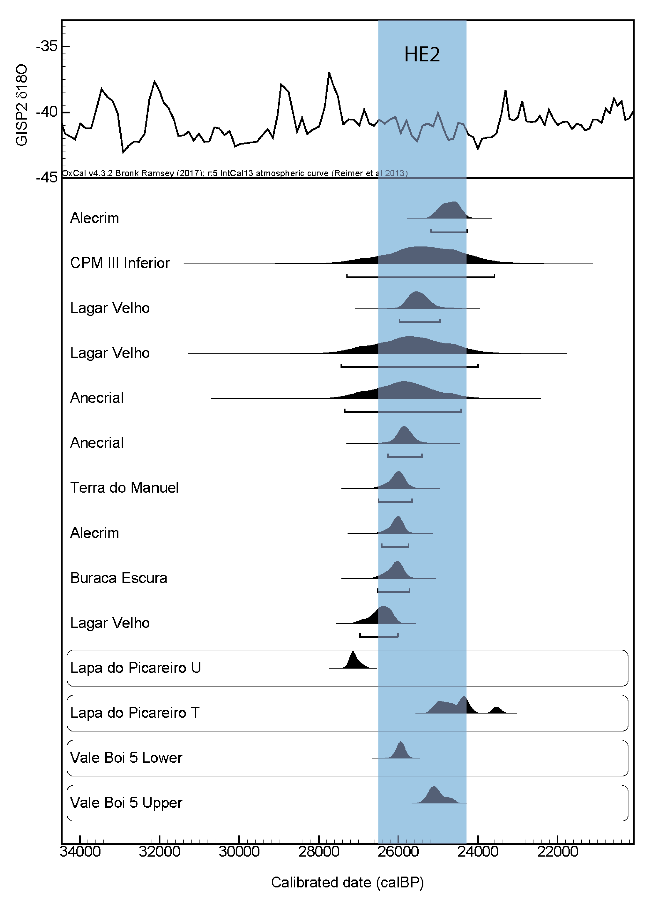

```{r vcsetup, include=FALSE, message=FALSE, warning=FALSE}

blades <- datasetlp %>% 
  filter(BlankType == "ElongatedProd" & MedWidth >= 12 & Phase == "Proto-Solutrean") %>% 
  select(Length, MedWidth, Thickness, BlankShape, PlatformThickness, PlatformWidth, OtherNotes, RawMaterial) %>% 
  mutate(Elongation = Length/MedWidth, Flattening = MedWidth/Thickness, PlatFlattening = PlatformWidth/PlatformThickness)

measur <- blades %>% 
  dplyr::summarise(Elongmean = mean(Elongation), ElongSD = sd(Elongation),
            Flattmean = mean(Flattening), FlattSD = sd(Flattening),
            PlatFlatmean = mean(PlatFlattening), PlatFlatSD = sd(PlatFlattening),
            n = n())

shape <- blades %>% 
  group_by(BlankShape) %>% 
  dplyr::summarise(n = n()) %>% 
  ungroup() %>% 
  mutate(freq = n/sum(n)*100)


VC <- dataset %>% 
  filter(OtherNotes == "TVC?") %>% 
  select(Length, MedWidth, Thickness, BlankShape, PlatformThickness, PlatformWidth, OtherNotes) %>% 
  mutate(Elongation = Length/MedWidth, Flattening = MedWidth/Thickness, PlatFlattening = PlatformWidth/PlatformThickness)


VCmeasur <- VC %>% 
  dplyr::summarise(Elongmean = mean(Elongation), ElongSD = sd(Elongation),
            Flattmean = mean(Flattening), FlattSD = sd(Flattening),
            PlatFlatmean = mean(PlatFlattening), PlatFlatSD = sd(PlatFlattening),
            n = n())

VCshape <- VC %>% 
  group_by(BlankShape) %>% 
  dplyr::summarise(n = n()) %>% 
  ungroup() %>% 
  mutate(freq = n/sum(n)*100)

```

# Discussion

The primary goal of this study was to better understand the technological organization at the onset of the LGM in westermost Europe, when the climatic conditions became abruptly harsh due to the Heinrich Event 2 (HE 2). 

To do so, assemblages from the archaeological sites of Vale Boi and Lapa do Picareiro, which had been previously attributed to the Gravettian-Solutrean transition, were described and characterized. Different scales of analysis are important to evaluate the techno-cultural dynamics at both sites. The current chapter first describes intra-site specific patterns, critically evaluating the differences and similarities between the chrono-cultural phases identified; it then presents a comparison of the general patterns emerging from both sites; and, finally, the results are integrated in what is already known for the Central Portugal, as an attempt of testing and improving the existing models.

The two phases identified in Vale Boi, Lower 5 and Upper 5/4E, show essentially the same technological patterns, characterized by the exploitation of simple or prismatic cores, with plain platforms and the use of unidirectional strategies for the production of bladelets and flakes.

The differences between the two groups are essentially in raw material frequency and the presence of elements related to the production of Vale Comprido points and blanks. Raw material frequency differences happen mainly between quartz and chert. In Lower 5 a frequency of quartz higher than 50% is attested, which lowers to 30% on Upper 5/4E, where chert becomes the dominant raw material. The presence of quartz across the Terrace sequence of Vale Boi was highlited in previous works [@marreiros2009], and contrasts significantly with the results for other areas and chronologies of the site, such as the Solutrean occupations in the rockshelter, where quartz knapped materials do not reach more than 25% of the whole assemblage [@cascalheira2010]. While this difference could be related to the functional nature of each *loci*, the high presence of quartz (c. 40%) also attested for the madgalenian occupation in the rockshelter area [@mendonca2009] seems to indicate that quartz fluctuation may be a result of cultural preferences over time.

What is rather interesting from the results presented before is that similar reduction strategies seem to have been used for both quartz and chert.

The aforementioned differing frequencies between quartz and chert can also be identified at Lapa do Picareiro. Level U/Lower T is characterized by high percentages of quartz (mainly for the production of bladelets), whereas Middle T shows a higher frequency of chert blanks. Although quartz bladelets are still present in Middle T, these are not the predominant blanks in the group.

Like at Vale Boi, Lapa do Picareiro also shows similar technological patterns between groups, following the attributes already described: plain platforms, unidirectional strategies through prismatic cores, presence of a large frequency of bladelets, most of which are in quartz in U/Lower T. However, the presence of blades seems relatively stable in both groups, which might not be the result of production preferences or reduction sequences, but rather site functionality.

Such aspects as the high exploitation of quartz and application of similar reduction strategies to both chert and quartz can be integrated in a perspective of cultural diversification and techno-economical intensification as suggested elsewhere [@cascalheiraandbicho2013]. For the Gravettian-Solutrean transition these patterns have been interpreted as preferences resulting from tradition, more than technical or economic reasons [@almeida2006]. This interpretation steams from the understanding that, for the Estremadura, there is not a lack of good quality chert [@zilhao1997] since, even during times when quartz was highly used, chert continued to frequently appear in the archaeological record as a preference for formal tool production [@almeida2006]. The same seems to apply for Vale Boi and Lapa do Picareiro, where the assemblages of both phases show the existence of fairly good quality chert, that was used to produce a great majority of the retouched tools.

Consequently, when framing the transition as occuring during an abrupt climate event and at the onset of global environmental transformations, these patterns and preferences may be better explained by growing pressures in the cultural system, and the ability for such a system to cope by expanding the economical options. This may have been achieved using a previously secondary raw material, present in close proximity to the site (even if ranging between coarse to fine quality) as a primary one.

Understanding the Proto-Solutrean transition as a Three-phase model, and thus separating the Terminal Gravettian from the Proto-Solutrean, also separating quartz use from very frequent to frequent, forces us to admit that this technological diversification happened only in a “short” moment before the Solutrean. This may be explained through the Panarchy framework [@holling2001] and RRM [@bradtmoller2012]. In this framework, moments of higher climatic instability provoke system breakdowns. In this case, such breakdown may be seen through the different raw material use and procurement choices, which correspond to a moment of rapid reorganization and recombination which lead to innovations. These innovations, however, are tested, used and, while some fail and disappear, others survive and adapt, starting the loop once again. As such, the rapid climatic changes brought by the HE 2 at the onset of LGM may have triggered weaknesses in the previous economic system, forcing the hunter-gatherer communities to expand their technology to the use of raw materials such as quartz. This may have been an innovative response, which was highly used during the Terminal Gravettian, following a progressive reduction during the Proto-Solutrean. Finally, its failure and adaptation led to a new raw material use and procurement system during the Solutrean, where quartz is, once again a secondary raw material, initiating a new cycle.

The same model may be applied to another raw material in the Vale Boi’s archaeological record which only appears in the Proto-Solutrean levels, which is dolerite. Thus, using the panarchy framework, dolerite may be an innovative response in the upper occupational phase to system breakdowns onset by climatic pressures and ecological changes. However, this response may have failed, thus disappearing from the archaeological record during the following Solutrean levels. However, the failure of this raw material may be related to the failure of a technology for which it was preferentially used, as are the Vale Comprido points, which fits equally in the model, and during the same phase. On the other hand, the presence of dolerite at Vale Boi might also be explained by either changes in the visibility of raw material sources at the onset of the LGM (see Pereira and Benedetti 2013 for a model of raw material management as a response to environmental constraints), or the presence of different influences at the site, either through its occupation by different populations (Pereira et al. 2016) or as a result of an expansion of social networks and consequent exchange of knowledge and materials (as suggested by Marreiros 2009 and Cascalheira et al. 2012). Both of these alternative options are, however, always connected with changes in the human ecodynamics as a result of environmental and climatic change.

The group specific patterns, which seem to set the differences between the two phases, allowed the identification of homologous phases at Lapa do Picareiro and Vale Boi, which seem to correlate well with the patterns already identified in the Portuguese Estremadura.

In fact, the technological and raw material patterns observed in both U/Lower T and Lower 5 seem to correspond to the Terminal Gravettian as described for Central Portugal [@almeida2000]. Perhaps one of the most striking differences between both Vale Boi and Lapa do Picareiro assemblages and the other Terminal Gravettian sites, is the notourious lack of carinated elements. These have been described as a dominant element in the tool kits, serving as core for bladelets [@almeida2000; @zilhao1997]. In fact, in neither levels U/Lower T nor Lower 5 carinated elements have been identified, although the presence of curved bladelets may indicate the use of this reduction sequence in both sites. Their absence may be either explained through site functionality (given the high altitude location of Picareiro and the rather sparse occupation at Vale Boi) or exportation of those carinated elements, since the bladelet component, primarily in quartz, seems to be present in high frequencies, without a clearly associated core type.

Likewise, the Middle T horizon from Lapa do Picareiro and Upper 5/4E phase from Vale Boi seem to follow homologous shifts in raw material frequency, which correlate to the third stage of the Three-phase model, where there seems to be a decrease in quartz, although many technological patterns remain the same [@zilhao1997]. The presence of Vale Comprido technology in Vale Boi strengthens further this association, since Vale Comprido reduction strategies do not seem be present in Terminal Gravettian assemblages [@almeida2000], but are found in high numbers in other sites, likely dated to the transition, without a strong Aurignacian V component.

Notwithstanding, despite the technological and raw material similarities between Lapa do Picareiro and Vale Boi in the more recent phase, the identification of the blade products in Middle T as part of a Vale Comprido technology is more problematic (see Haws *et al.*, 2019). The identified pieces do reveal the presence of convergent edge shapes, mostly with plain platforms and with unidirectional dorsal scars. Yet, there are sufficient morphological differences, between Middle T’s blanks and Upper 5/4E’s Vale Comprido points, to question the identification of these products from Lapa do Picareiro as part of a Vale Comprido technological strategy.

To further explore and understand this variation, below is presented a comparison of the morphological data from Vale Comprido technology with that of unretouched blades coming from other sites in the Portuguese Estremadura, either from the same assumed chronology, such as the site of Vale Comprido - Encosta, or attributed to preceding and succeeding chronologies, such as Casal do Felipe and Vale de Porcos (Gravettian), Casal do Cepo and Vale Almoinha (Solutrean). The comparisons are presented in Figure \@ref(fig:plotsVCelong) and \@ref(fig:plotVCconverge), following the comparisons showed by @zilhao1997 and @zilhaoetal1995, which use metrical and morphological attributes. Since the data available from those publications is restricted to the means and standard deviations of the metric variables, the approach is rather limited, not allowing any statistical testing.

Elongation means (Figure \@ref(fig:plotsVCelong)) of points and blades show similar ratios across all assemblages. The exception seems to be the Vale Comprido points for both Vale Boi and Vale Comprido - Encosta, presenting in average low elongation values, when compared with the remaining blanks and *pointe à face plan* assemblages. 

Regarding flattening (mesial width/thickness - Figure \ref{fig: plotVCflat}) there seems to be a group of sites with smaller values, and thus with blades and points which are less flat: Vale Boi, Vale Comprido – encosta and Vale de Porcos. This seems to be in concordance with the already established patterns for Proto-Solutrean assemblages, where the production strategies seem to focus thick blanks which are then thinned at the platform. However, it is possible to notice the association between the Lapa do Picareiro blanks with assemblages with a point à face plan component, with blades and points with higher levels of flattening, thus showing that the Vale Comprido blades show some morphological differences in the flattening ratios from Vale Boi and Vale Comprido – encosta, both with Proto-Solutrean assemblages.

```{r plotsVCelong, fig.cap="Blades, points a face plane and Vale Comprido points elongation (in cm) by site.", echo=FALSE,fig.align='center', out.width= '70%', message=FALSE, warning=FALSE, fig.pos="H"}
blades_meas <- read_csv("data/blade_VC_measurements.csv")
elong <- ggplot(blades_meas, aes(x=Assemblage, y=ElongMean, fill=Class)) + 
  geom_bar(stat="identity", color="black", 
           position=position_dodge()) +
  geom_errorbar(aes(ymin=ElongMean-ElongSD, ymax=ElongMean+ElongSD), width=.2,
                position=position_dodge(.9))+
  scale_fill_jco()+
  theme_minimal() +
  theme(axis.text.x = element_text(angle = 50, hjust = 1)) +
  labs(title = "Elongation", x = "", y = "Elongation (cm)")
plot(elong)
```

```{r plotVCflat,fig.cap="Blades, points a face plane and Vale Comprido points elongation (in cm) by site.", echo=FALSE, fig.align='center', out.width= '70%', message=FALSE, warning=FALSE, fig.pos="H"}
flat <- ggplot(blades_meas, aes(x=Assemblage, y=FlatMean, fill=Class)) + 
  geom_bar(stat="identity", color="black", 
           position=position_dodge()) +
  geom_errorbar(aes(ymin=FlatMean-FlatSD, ymax=FlatMean+FlatSD), width=.2,
                position=position_dodge(.9))+
  scale_fill_jco()+
  theme_minimal() +
  theme(axis.text.x = element_text(angle = 50, hjust = 1))+
  labs(title = "Flattening", x = "", y = "Flattening (cm)")
plot(flat)
```

A different pattern can be observed for platform flattening means (Figure \@ref(fig:plotVCplatflat)), where, despite the large standard deviations presented for the materials of Lapa do Picareiro, it seems that those blanks are more similar to the ones from Vale Boi and Vale Comprido – Encosta. Using this metric variable, both Casal do Felipe and Vale de Porcos show, in average, higher values for platform flattening than the Proto-Solutrean, while the other groups seems rather similar.

Finally, an analysis to the percentage of covergent edges in the assemblages is presented in Figure \@ref(fig:plotVCconverge). This variable is one of the important factors in Vale Comprido technology, since that "the triangular geometry of the debitage surface is formed by the detachment of core edge removals
with an oblique orientation (...) [and] these removals determine the convergence of the predetermined blank removed from the centre of the debitage surface" [@renard2011, p. 730]. There is a significant similarity in the percentage of convergent edges between Lapa do Picareiro, Vale Boi (blades) and Vale Comprido – encosta (blades). The blanks from these sites show the highest percentages of convergent edges (always above 25%) from all the groups considered, only surpassed by the values from Vale Comprido points, which reach 100% in Vale Boi and are 50% in Vale Comprido – Encosta. All the blades from other sites show values under 20%.

```{r plotVCplatflat, fig.cap="Blades and Vale Comprido points platform flattening (in cm) by site.", echo=FALSE,fig.align='center', echo=FALSE, out.width= '70%', message=FALSE, warning=FALSE}

plat_flat <- blades_meas %>% 
  filter(!Assemblage %in% c("Casal do Cepo", "Vale Almoinha"))

plat_flat <- ggplot(plat_flat, aes(x=Assemblage, y=PflatMean, fill=Class)) + 
  geom_bar(stat="identity", color="black", 
           position=position_dodge()) +
  geom_errorbar(aes(ymin=PflatMean-PflatSD, ymax=PflatMean+PflatSD), width=.2,
                position=position_dodge(.9))+
  scale_fill_jco()+
  theme_minimal() +
  theme(axis.text.x = element_text(angle = 50, hjust = 1)) +
  labs(title = "Platform flattening", x = "", y = "Platform flattening (cm)")

plot(plat_flat)

```

```{r plotVCconverge, fig.cap="Blades and Vale Comprido points edge convergence by site.", echo=FALSE, fig.align='center', out.width= '70%', message=FALSE, warning=FALSE}

converg <- blades_meas %>% 
  filter(Class != "Points a face plan")

converge <- ggplot(converg, aes(Assemblage, ConvergentEdges, fill = Class)) +
  geom_bar(stat = "identity", color = "black", position = position_dodge()) + 
  scale_y_continuous(labels = scales::percent_format(accuracy = 1)) +
  scale_fill_jco() +
  theme_minimal() +
  theme(axis.text.x = element_text(angle = 50, hjust = 1))+
  labs(title = "Edge convergence", x = "", y = "Convergent edges")

plot(converge)

```

\  

In brief, it seems that only some of the analyzed indicators are good for understanding the technological nature of the Lapa do Picareiro Middle T blanks. All assemblages seem to have a wide variability regarding metrical attributes, which creates difficulties in understanding specific groups based on the means of those variables. This is especially noticeable with the elongation ratio average values, which do not show clear differences between the blade assemblages from the different technocomplexes.

From all of the attributes analyzed, it was the frequency of convergent edges that showed the biggest differences between the Proto-Solutrean assemblages and Lapa do Picareiro, against the other assemblages with lesser percentages of convergent edges.

Despite this similarity, Lapa do Picareiro, especially within the flattening ratios, showed values which were closer to those from the sSolutrean assemblages, with less robust blades than those from Vale Boi and Vale Comprido – Encosta.

These differences, along with the ambiguity in classifying Middle T's chert blades as part of a Vale Comprido strategy, for the similarities with the type but lack of defining characteristics such as the thickness of the platform or of the blank, and the fairly late chronology attributed to Middle T in Lapa do Picareiro (see below), are clearly not enough to determine this assemblage as Proto-Solutrean, as traditionally defined. Alternatively, and given the mix of similarities between Lapa do Picareiro blades with both Proto-Solutrean and Solutrean elongated blanks, the assemblage of Middle T could be classified as a "transitional" assemblage, chronologically located somewhere between the Proto-Solutrean and the Middle Solutrean of the Portuguese Estremadura. Alternatively, given the location and consequent functional characteristics of Lapa do Picareiro, the blade component of Middle T phase may represent a truncated Proto-Solutrean assemblage, showing only the presence of a specific reduction sequence for elongated blanks, identified by Zilhão [-@zilhao1997], but also by Renard [-@renard2011] at the site of Marseillon (Landes, France) that suggests that "a few proximal fragments of small regular blades with a straight profile suggest the existence of a secondary and autonomous production scheme [...] realized with direct soft organic hammer percussion" (p. 731).

As seen on Chapter 2, the Proto-Solutrean has been explained as a transitional phase model based on the technological characteristics of specific assemblages in the Portuguese Estremadura, set by a rather small set of radiocarbon dates coming from some of the sites. When comparing those dates with those obtained in Vale Boi and Lapa do Picareiro, it seems apparent that what looked like a streamlined range for the Estremadura results (consequence of the rather small amount of dates for sites with Vale Comprido technology) is, in fact, less smooth.

Figure \@ref(fig:datesall) shows all radiocarbon dates first presented in Chapter 2 (Table \@ref(tab:protodates)). For Vale Boi and Lapa do Picareiro, there seem to be two groups of dates: a group of older dates, at around 27 ka cal BP for Lapa do Picareiro and 26 ka cal BP for Vale Boi; and a second group of younger dates, starting in Vale Boi and Estremadura at around 25 ka cal BP. The latter seems to extend into younger dates at Lapa do Picareiro. All the Estremadura dates seem to either overlap with the older date for Vale Boi or fits in between the two groups.

Observing this information, it seems obvious that there is a well-defined moment at c. 26 and c. 25.5 ka cal BP in the Estremadura and Vale Boi (Lower 5), corresponding well with the start of the HE 2 [@cascalheiraandbicho2013]. Some dates from the Estremadura seem to fall out of the HE 2, although this may be explained by the high standard deviations, with exception from the oldest date from Lagar Velho (Zilhão and Trinkaus 2002).

The second phase seems to happen around 25 ka cal BP, reaching close to 24 ka cal BP, in Vale Boi (upper 5/4E), Lapa do Picareiro (middle T) and Alecriam (excluding, once again, the three dates which show high standard deviations from Lagar Velho, Anecrial and CPM III Inferior). When observing Figure \@ref(fig:datesall), Lapa do Picareiro's dates for Middle T do not seem to be as isolated from Vale Boi's Upper 5/4E. It is, however, true that while Vale Boi's dates peak is centered in the second half of the HE 2, Middle T dates seem to extended to the 24 ka cal BP mark.

Thus, these two groups of dates, combined with the differences in technology and raw material use, reflect discrete phases within the Gravettian-Solutrean transition models. As such, the older group of dates, concomitant with high use of quartz, may be representative of a Terminal Gravettian moment. The younger group, accompanied by a decrease in quartz and the emergence of Vale Comprido points at Vale Boi, represent a Proto-Solutrean occupation.

```{r datesall, fig.cap="Sum of calibrated radiocarbon dates (IntCal13 and Marine13, using OxCal 4.1.7 online) for each studied archaeological context and results from the Estremadura (Zilhão 1997), with application of a Bayesian model.", out.width = '70%', fig.align='center', echo=FALSE}

```

\newpage

This interpretation, however, has some problems which lack a viable solution. The problem lies in the nonexistance of a higher resolution method for dating, which does not allow for the understanding of smaller scale chronological changes [@zilhao2013]. This, allied with various context and stratigraphic problems, hampers any chronological interpretation and organization.

Even so, it is possible to understand some curious temporal particularities (Figure \@ref(fig:datesall)). U/Lower T from Lapa do Picareiro, corresponding to the patterns for the Terminal Gravettian [@almeida2000], seems to occur at much older dates than other sites, although some sites show some probability of overlapping (such as the case of Lagar Velho). However, U/Lower T is the only context which at a two sigma probably falls completely out of the HE 2 time period. This may question the dominant use of quartz as an environmental response.

Furthermore, Lapa do Picareiro shows an obvious occupational gap of around two thousand years, with both phases marked by raw material use differences, but similar technological patterns, making viable that some cultural continuity occurs despite the cave was not in use (or perhaps a different area of the site is being used) during tha temporal gap which roughly corresponds to the first half of the HE 2.

Another particularity is the concomitance of Vale Boi's dates (Lower 5) with other sites. It would be expected that Vale Boi either showed different chronologies and technological patterns from those observed in other sites, since it appears isolated from the cluster at Estremadura due to the geographic distance, as has been noted in the gravettian horizons [@marreiros2009]. Instead, what we find is a high level of similarity. This seems to corroborate the idea that the Terminal Gravettian/Proto-Solutrean was a moment of expansion of social networks, thus leading to a higher degree of homogeneity within assemblages throughout the territory [@cascalheiraandbicho2013] which occurred simultaneously. This seems to be the case for other sites outside of the Iberian Peninsula as well, where Proto-Solutrean assemblages have been recognized with similar techno-typological characteristics as those identified in the Estremadura [@renard2011]. Once again, understanding the Proto-Solutrean as a moment of cultural breakage onset by abrupt harsh environmental conditions, the expansion of these networks and spread of the same techno-economic solutions across a larger territory may have functioned as a new adaptative behavior [@cascalheiraandbicho2013].

At Lapa do Picareiro, alongside the technological differences and nonexistence of a Vale Comprido technology, there is also the association of Middle T with dates of around 24 ka cal BP. Although they seem to roughly match those of Vale Boi Upper 5/4E, it is true that the summed probability results also extend that phase into slightly younger dates. As such, it may be possible to understand the previously referred techno-typological and chronological characteristics of Middle T of Lapa do Picareiro, not as the result of a Proto-Solutrean occupation, but perhaps as a succeeding moment of the transition. This stage might correspond (but not necessarily) to the Lower Solutrean phase presented by Zilhão [-@zilhao1994; -@zilhao1997; -@zilhao2013], for which no other sites in Portugal are currently known. This stage would be characterized by flatter/thinner blanks and technology, alike those to be expected in early Solutrean technology [@renard2011], but also resembling Vale Comprido technology in what concerns to certain blank morphology indicators.

Still, the blades from Middle T may be alternatively understood as a product of a reduction sequence for the production of blades with thinner platforms, which has been identified in association with the Vale Comprido strategies in Vale Comprido - Encosta [@zilhao1997]. In favor of this argument is the fact that the Middle T assemblage does not show specific characteristics of the Solutrean technocomplex, such as the presence of the typical flat invasive retouch, present in other regions right from the early stages of the technocomplex [@renard2011].

Despite the uncertainty of this attribution, the technological data obtained from this study and its correlation with the available radiocarbon dates seems to show that there are, in fact, two phases within the transition between the Final Gravettian and Solutrean (more obviously so at Lapa do Picareiro and Vale Boi). 

Instead of understanding the Terminal Gravettian as a functional facies, in both Vale Boi and Lapa do Picareiro, this cultural horizon seems to have chronological significance, indicating that the model which best applies, not only for the Portuguese Estremadura (as suggested by Almeida 2000), but also for the south of Portugal, is the Three-phase model. Here, the evolution from the Terminal Gravettian to the Proto-Solutrean is best explained not by overall technological changes, but by raw material frequency shifts and the addition of a reduction sequence, which brings an innovation into the tool kit of the Proto-Solutrean assemblages.
