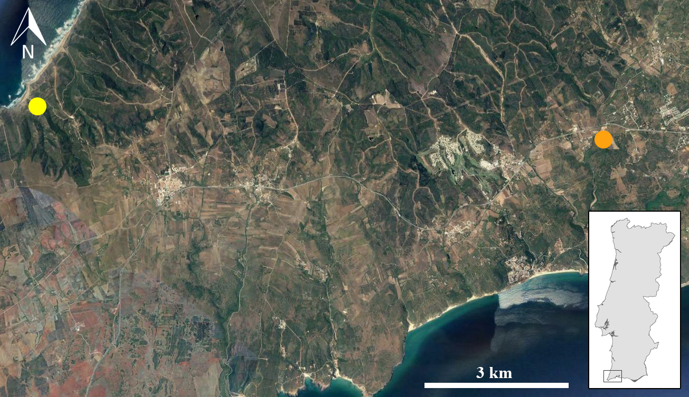

`r if(knitr:::is_latex_output()) '\\appendix'`

`r if(!knitr:::is_latex_output()) '# (APPENDIX) Appendix {-}'` 

<!--
If you feel it necessary to include an appendix, it goes here.
-->


# Appendix

```{r appendixsetup, include=FALSE}

# Call packages
library(readr)
library(dplyr)
library(stringr)
library(tidyr)
library(knitr)
library(tab)
library(ggplot2)
library(FactoMineR)
library(factoextra)
library(RcmdrMisc)
library(IDPmisc)
library(forcats)
library(kableExtra)
library(float)
library(janitor)
```

```{r echo=FALSE}
basic_db <- tibble(Items = c("Site","Area", "Lot", "ID", "Raw material", "Class", "Cortex presence (%)", "Max length", "Max width", "Mesial thickness", "Weight", "Type of fracture", "Retouched type", "Alteration", "Count", "Other notes"),
                    Text_1 = c("All", "All", "All", "All", "All", "All", "All except shatter and chips", "All except fragments, shatter and chips", "All except shatter and chips","All except shatter and chips", "All except chips", "Debitage fragments", "Retouched pieces", "All except shatter and chips", "Chips", "All"))

knitr::kable(head(basic_db[1:2],15), booktabs = TRUE, col.names = c("Recorded variables","Class conditions"),caption = "Basic database attributes recorded. Class conditions represent the classes/artefacts which were considered for each variable, given the programmed system of conditions.") %>% 
  column_spec(1:2, width = "5cm") %>%
  row_spec(0, bold = T, align = "c") %>% 
  kable_styling(position = "center")
```

```{r echo=FALSE}
package_list <- tibble(Items = c("Bchron","readr","dplyr","stringr","tidyr","knitr","tab","ggplot2","FactoMineR","factoextra","RcmdrMisc","IDPmisc","forcats","kableExtra","float","janitor"),
                    Text_1 = c("4.3.0","1.3.1","0.8.3","1.4.0","1.0.0","1.26","3.1.2","3.2.1","2.0","1.0.6","2.5.1","1.1.19","0.4.0","1.1.0","0.2.3","1.2.0"))

knitr::kable(head(package_list[1:2],16), booktabs = TRUE, col.names = c("Packages","Used version"),caption = "List of all R packages and respective versions used in the thesis.")
```

```{r echo=FALSE}
data_dictionary <- read.csv("data/data_dictionary.csv")
data_dictionary <- data_dictionary %>% 
  dplyr::rename("Measurement units" = "Measurement.units") %>% 
  dplyr::rename("Allowed values" = "Allowed.values") %>% 
  dplyr::rename("Variable" = "ï..Variable")
knitr::kable(head(data_dictionary [1:4],46),longtable = TRUE, booktabs=TRUE, caption = "Data Dictionary with variables considered in the attributes analysis, including measurement units, allowed vallued, definitions and/or references.", caption.short = "Lithic analysis Data Dictionary") %>% 
  landscape() %>%
  kable_styling(latex_options = "repeat_header") %>% 
  column_spec(1, width = "2cm") %>% 
  column_spec(2, width = "3cm") %>%
  column_spec(3, width = "6cm") %>% 
  column_spec(4, width = "9cm") 

```

```{r fig.cap="Dolerite thin section under seen through a polarized microscope.", out.width = '100%', echo=FALSE}
knitr::include_graphics("figure/thin_section.png")
```

```{r fig.cap="Location of recovered dolerite sample (yellow) comparatively to Vale Boi (orange).", out.width = '100%', echo=FALSE}

```

```{r core attributes and measurements tables setup, echo=FALSE}
# Subset cores and phases
coreAT <- dataset %>% 
  filter(Class=="Core")
coreAT1 <- coreAT %>% 
  filter(Phase=="Phase 1")
coreAT2 <- coreAT %>% 
  filter(Phase=="Phase 2")


core_tablep1 <- tabmulti(coreAT1, "RawMaterial", c("CoreType","NumberCoreFaces", 
                                               "CorePlatform","PlatformWidth","PlatformThickness",
                                              "MainFaceCoreUse","MainFacePlatformAngle"),
                        ymeasures = c("freq","freq","freq","mean","mean","freq","mean"),
                        p.include = FALSE,
                        n.headings = FALSE,
                        bold.varnames = TRUE,
                        bold.colnames = TRUE,
                        variable.colname = "Tecnological attributes")
core_tablep1 <- as.data.frame(core_tablep1)
core_tablep1 <- core_tablep1 %>% 
  select("Tecnological attributes", "Quartz", "Chert","Greywacke","Other")

core_metp1 <- tabmulti(coreAT1, "RawMaterial", c("MaxWidth", 
                                              "Length", 
                                              "Thickness"),
                      ymeasures = c("mean", "mean", "mean"),
                      p.include = FALSE,
                      n.headings = FALSE,
                      bold.varnames = TRUE,
                      bold.colnames = TRUE,
                      variable.colname = "Core metrics")
core_metp1 <- as.data.frame(core_metp1)
core_metp1 <- core_metp1 %>% 
  select("Core metrics", "Quartz", "Chert","Greywacke","Other")


core_tablep2 <- tabmulti(coreAT2, "RawMaterial", c("CoreType","NumberCoreFaces",
                                               "CorePlatform","PlatformWidth","PlatformThickness",
                                               "MainFaceCoreUse","MainFacePlatformAngle"),
                        ymeasures = c("freq","freq", "freq","mean","mean","freq","mean"),
                        p.include = FALSE,
                        n.headings = FALSE,
                        bold.varnames = TRUE,
                        bold.colnames = TRUE,
                        variable.colname = "Tecnological attributes")
core_tablep2 <- as.data.frame(core_tablep2)
core_tablep2 <- core_tablep2 %>% 
  select("Tecnological attributes", "Quartz", "Chert","Other")

core_metp2 <- tabmulti(coreAT2, "RawMaterial", c("MaxWidth", 
                                              "Length", 
                                              "Thickness"),
                      ymeasures = c("mean", "mean", "mean"),
                      p.include = FALSE,
                      n.headings = FALSE,
                      bold.varnames = TRUE,
                      bold.colnames = TRUE,
                      variable.colname = "Core metrics")
core_metp2 <- as.data.frame(core_metp2)
core_metp2 <- core_metp2 %>% 
  select("Core metrics", "Quartz", "Chert","Greywacke","Other")

```

```{r echo=FALSE}
knitr::kable(core_tablep1, longtable= TRUE, booktabs = TRUE, caption = "Phase 1 Core attributes (frequencies) and platform measurements (mean and standard deviation) table.") %>% 
  row_spec(0, bold = T, align = "c") %>% 
  kable_styling(position = "center")

```

```{r echo=FALSE}
knitr::kable(core_tablep2, longtable= TRUE, booktabs = TRUE, caption = "Phase 2 Core attributes (frequencies) and platform measurements (mean and standard deviation) table.") %>% 
  row_spec(0, bold = T, align = "c") %>% 
  kable_styling(position = "center")

```

```{r echo=FALSE}
knitr::kable(core_metp1, booktabs=TRUE, caption = "Phase 1 Core measurements (width, length and thickness) with mean and standard deviation values.") %>% 
  row_spec(0, bold = T, align = "c") %>% 
  kable_styling(position = "center", latex_options = "hold_position")

```

```{r echo=FALSE}
knitr::kable(core_metp2, booktabs=TRUE, caption = "Phase 2 Core measurements (width, length and thickness) with mean and standard deviation values.") %>% 
  row_spec(0, bold = T, align = "c") %>% 
  kable_styling(position = "center", latex_options = "hold_position")

```

```{r blank attribute table setup, echo=FALSE}

blanksAT <- dataset %>% 
  filter(BlankType=="Flake")
blanksAT1 <- blanksAT %>% 
  filter(Phase=="Phase 1")
blanksAT2 <- blanksAT %>% 
  filter(Phase=="Phase 2")

blank_tablep1 <- tabmulti(blanksAT1, "RawMaterial", c("CrossSection", "BlankShape", 
                                                           "Profile", "BlankTip",
                                                           "PlatformType", "PlatformCortex", "PlatformWidth", "PlatformThickness",
                                                           "ScarCount", "ScarPattern"),
                        ymeasures = c("freq", "freq", "freq", "freq","freq","freq","mean","mean","freq","freq"),
                        p.include = FALSE,
                        n.headings = FALSE,
                        bold.varnames = TRUE,
                        bold.colnames = TRUE,
                        variable.colname = "Attributes")
blank_tablep1 <- as.data.frame(blank_tablep1)
blank_tablep1<- blank_tablep1 %>% 
  select(`Attributes`, `Quartz`, `Chert`, 
         `Greywacke`, `Dolerite`, `Chalcedony`, 
         `Other`)

blank_metp1 <- tabmulti(blanksAT1, "RawMaterial", c("MaxWidth", "Length", "Thickness"),
                          ymeasures = c("mean", "mean", "mean"),
                          p.include = FALSE,
                          n.headings = FALSE,
                          bold.varnames = TRUE,
                          bold.colnames = TRUE,
                          variable.colname = "Measurements")
blank_metp1 <- as.data.frame(blank_metp1)
blank_metp1 <- blank_metp1 %>% 
  select(Measurements, Quartz, Chert, Greywacke, Dolerite, Chalcedony, Other)


blank_tablep2 <- tabmulti(blanksAT2, "RawMaterial", c("CrossSection", "BlankShape", 
                                                           "Profile", "BlankTip",
                                                           "PlatformType", "PlatformCortex", "PlatformWidth", "PlatformThickness",
                                                           "ScarCount", "ScarPattern"),
                        ymeasures = c("freq", "freq", "freq", "freq","freq","freq","mean","mean","freq","freq"),
                        p.include = FALSE,
                        n.headings = FALSE,
                        bold.varnames = TRUE,
                        bold.colnames = TRUE,
                        variable.colname = "Attributes")
blank_tablep2 <- as.data.frame(blank_tablep2)
blank_tablep2<- blank_tablep2 %>% 
  select(`Attributes`, `Quartz`, `Chert`, 
         `Greywacke`, `Dolerite`, `Chalcedony`, 
         `Other`)

blank_metp2 <- tabmulti(blanksAT2, "RawMaterial", c("MaxWidth", "Length", "Thickness"),
                          ymeasures = c("mean", "mean", "mean"),
                          p.include = FALSE,
                          n.headings = FALSE,
                          bold.varnames = TRUE,
                          bold.colnames = TRUE,
                          variable.colname = "Measurements")
blank_metp2 <- as.data.frame(blank_metp2)
blank_metp2 <- blank_metp2 %>% 
  select(Measurements, Quartz, Chert, Greywacke, Dolerite, Chalcedony, Other)

## cortex tab

cortexblank1 <- tabmulti(blanksAT1, "RawMaterial", c("Cortex","CortexLocation"),
                      ymeasures = c("freq", "freq"),
                      p.include = FALSE,
                      n.headings = FALSE,
                      bold.varnames = TRUE,
                      bold.colnames = TRUE,
                      variable.colname = "Cortex attributes")
cortexblank1 <- as.data.frame(cortexblank1)
cortexblank1 <- cortexblank1 %>% 
  select("Cortex attributes", "Quartz", "Chert", 
         "Greywacke", "Overall") %>% 
  dplyr::rename("Total" = "Overall")


cortexblank2 <- tabmulti(blanksAT2, "RawMaterial", c("Cortex","CortexLocation"),
                      ymeasures = c("freq", "freq"),
                      p.include = FALSE,
                      n.headings = FALSE,
                      bold.varnames = TRUE,
                      bold.colnames = TRUE,
                      variable.colname = "Cortex attributes")
cortexblank2 <- as.data.frame(cortexblank2)
cortexblank2 <- cortexblank2 %>% 
  select("Cortex attributes", "Quartz", "Chert", 
         "Greywacke","Dolerite", "Other", "Overall") %>% 
  dplyr::rename("Total" = "Overall")

```

```{r echo=FALSE}
knitr::kable(blank_tablep1, longtable= TRUE, booktabs = TRUE, caption = "Phase 1 Blank attributes (frequencies) and platform measurements (mean and standard deviation) table.") %>% 
  row_spec(0, bold = T, align = "c") %>% 
  kable_styling(position = "center") %>% 
  column_spec(1:7, width = "1cm")

```

```{r echo=FALSE}
knitr::kable(blank_tablep2, longtable= TRUE, booktabs = TRUE, caption = "Phase 2 Blank attributes (frequencies) and platform measurements (mean and standard deviation) table.") %>% 
  row_spec(0, bold = T, align = "c") %>% 
  kable_styling(position = "center") %>% 
  column_spec(1:7, width = "1cm")

```


```{r echo=FALSE}
knitr::kable(blank_metp1, booktabs=TRUE, caption = "Phase 1 Blank measurements (width, length and thickness) with mean and standard deviation values.") %>% 
  row_spec(0, bold = T, align = "c") %>% 
  kable_styling(position = "center", latex_options = c("hold_position", "scale_down"))

```

```{r echo=FALSE}
knitr::kable(blank_metp2, booktabs=TRUE, caption = "Phase 2 Blank measurements (width, length and thickness) with mean and standard deviation values.") %>% 
  row_spec(0, bold = T, align = "c") %>% 
  kable_styling(position = "center", latex_options = c("hold_position", "scale_down"))

```


```{r echo=FALSE}
knitr::kable(elong_tablep1, longtable= TRUE, booktabs = TRUE, caption = "Phase 1 Elongated product attributes (frequencies) and platform measurements (mean and standard deviation) table.") %>% 
  row_spec(0, bold = T, align = "c") %>% 
  kable_styling(position = "center") %>% 
  column_spec(1:6, width = "0.8cm")

```

```{r echo=FALSE}
knitr::kable(elong_tablep2, longtable= TRUE, booktabs = TRUE, caption = "Phase 2 Elongated product attributes (frequencies) and platform measurements (mean and standard deviation) table.") %>% 
  row_spec(0, bold = T, align = "c") %>% 
  kable_styling(position = "center") %>% 
  column_spec(1:8, width = "0.8cm")

```

```{r echo=FALSE}
knitr::kable(elong_metp1, booktabs=TRUE, caption = "Phase 1 Elongated product measurements (width, length and thickness) with mean and standard deviation values.") %>% 
  row_spec(0, bold = T, align = "c") %>% 
  kable_styling(position = "center", latex_options = c("hold_position","scale_down"))

```

```{r echo=FALSE}
knitr::kable(elong_metp2, booktabs=TRUE, caption = "Phase 2 Elongated product measurements (width, length and thickness) with mean and standard deviation values.") %>% 
  row_spec(0, bold = T, align = "c") %>% 
  kable_styling(position = "center", latex_options = c("hold_position","scale_down"))

```

```{r lp core attributes and measurements tables setup, echo=FALSE}
# Subset cores and phases
coreATlp <- datasetlp %>% 
  filter(Class=="Core")
coreAT1lp <- coreATlp %>% 
  filter(Phase=="Terminal Gravettian")
coreAT2lp <- coreATlp %>% 
  filter(Phase=="Proto-Solutrean")


core_tablep1lp <- tabmulti(coreAT1lp, "QuartzQuality", c("CoreType","NumberCoreFaces",                                             "CorePlatform","PlatformWidth","PlatformThickness",
                                              "MainFaceCoreUse"),
                        ymeasures = c("freq","freq","freq","mean","mean","freq"),
                        p.include = FALSE,
                        n.headings = FALSE,
                        bold.varnames = TRUE,
                        bold.colnames = TRUE,
                        variable.colname = "Tecnological attributes")
core_tablep1lp <- as.data.frame(core_tablep1lp)
core_tablep1lp <- core_tablep1lp %>% 
  select("Tecnological attributes", "RockCrystal", "Fine","Overall") %>% 
  dplyr::rename("Quartz" = "Overall")

core_metp1lp <- coreAT1lp %>% 
  select(MaxWidth,Length,Thickness)


core_tablep2lp <- tabmulti(coreAT2lp, "RawMaterial", c("CoreType", "NumberCoreFaces",
                                               "CorePlatform","PlatformWidth","PlatformThickness",
                                               "MainFaceCoreUse","MainFacePlatformAngle"),
                        ymeasures = c("freq","freq", "freq","mean","mean","freq","mean"),
                        p.include = FALSE,
                        n.headings = FALSE,
                        bold.varnames = TRUE,
                        bold.colnames = TRUE,
                        variable.colname = "Tecnological attributes")
core_tablep2lp <- as.data.frame(core_tablep2lp)
core_tablep2lp <- core_tablep2lp %>% 
  select("Tecnological attributes", "Quartz", "Chert","Other")

core_metp2lp <- tabmulti(coreAT2lp, "RawMaterial", c("MaxWidth", 
                                              "Length", 
                                              "Thickness"),
                      ymeasures = c("mean", "mean", "mean"),
                      p.include = FALSE,
                      n.headings = FALSE,
                      bold.varnames = TRUE,
                      bold.colnames = TRUE,
                      variable.colname = "Core metrics")
core_metp2lp <- as.data.frame(core_metp2lp)
core_metp2lp <- core_metp2lp %>% 
  select("Core metrics", "Quartz", "Chert","Other")

```


```{r echo=FALSE}
knitr::kable(core_tablep1lp, booktabs = TRUE, caption = "Terminal Gravettian Core attributes (frequencies) and platform measurements (mean and standard deviation) table.") %>% 
  row_spec(0, bold = T, align = "c") %>% 
  kable_styling(position = "center") %>% 
  kable_styling(latex_options = "HOLD_position")

```


```{r echo=FALSE}
knitr::kable(core_tablep2lp, booktabs = TRUE, caption = "Proto-Solutrean Core attributes (frequencies) and platform measurements (mean and standard deviation) table.") %>% 
  row_spec(0, bold = T, align = "c") %>% 
  kable_styling(position = "center")

```


```{r echo=FALSE}
knitr::kable(core_metp1lp, booktabs=TRUE, caption = "Terminal Gravettian Core measurements (width, length and thickness) 
             on quartz (with quartz type).") %>% 
  row_spec(0, bold = T, align = "c") %>% 
  kable_styling(position = "center")

```

```{r echo=FALSE}
knitr::kable(core_metp2lp, booktabs=TRUE, caption = "Proto-Solutrean Core measurements (width, length and thickness) with mean and standard deviation values.") %>% 
  row_spec(0, bold = T, align = "c") %>% 
  kable_styling(position = "center")

```

```{r echo=FALSE}
knitr::kable(blank_tablep1lp, longtable= TRUE, booktabs = TRUE, caption = "Terminal Gravettian Blank attributes (frequencies) and platform measurements (mean and standard deviation) table.") %>% 
  row_spec(0, bold = T, align = "c") %>% 
  kable_styling(position = "center")

```

```{r echo=FALSE}
knitr::kable(blank_tablep2lp, longtable= TRUE, booktabs = TRUE, caption = "Proto-Solutrean Blank attributes (frequencies) and platform measurements (mean and standard deviation) table.") %>% 
  row_spec(0, bold = T, align = "c") %>% 
  kable_styling(position = "center") 

```


```{r echo=FALSE}
knitr::kable(blank_metp1lp, booktabs=TRUE, caption = "Terminal Gravettian Blank measurements (width, length and thickness) with mean and standard deviation values.") %>% 
  row_spec(0, bold = T, align = "c") %>% 
  kable_styling(position = "center", latex_options = "scale_down")

```


```{r echo=FALSE}
knitr::kable(blank_metp2lp, booktabs=TRUE, caption = "Proto-Solutrean Blank measurements (width, length and thickness) with mean and standard deviation values.") %>% 
  row_spec(0, bold = T, align = "c") %>% 
  kable_styling(position = "center", latex_options = "scale_down")

```

```{r echo=FALSE}
knitr::kable(elong_tablep1lp, longtable= TRUE, booktabs = TRUE, caption = "Terminal Gravettian Elongated product attributes (frequencies) and platform measurements (mean and standard deviation) table.") %>% 
  row_spec(0, bold = T, align = "c") %>% 
  kable_styling(position = "center")

```

```{r echo=FALSE}
knitr::kable(elong_tablep2lp, longtable= TRUE, booktabs = TRUE, caption = "Proto-Solutrean Elongated product attributes (frequencies) and platform measurements (mean and standard deviation) table.") %>% 
  row_spec(0, bold = T, align = "c") %>% 
  kable_styling(position = "center")

```

```{r echo=FALSE}
knitr::kable(elong_metp1lp, booktabs=TRUE, caption = "Terminal Gravettinan Elongated product measurements (width, length and thickness) with mean and standard deviation values.") %>% 
  row_spec(0, bold = T, align = "c") %>% 
  kable_styling(position = "center", latex_options = "scale_down")

```

```{r echo=FALSE}
knitr::kable(elong_metp2lp, booktabs=TRUE, caption = "Proto-Solutrean Elongated product measurements (width, length and thickness) with mean and standard deviation values.") %>% 
  row_spec(0, bold = T, align = "c") %>% 
  kable_styling(position = "center", latex_options = "scale_down")

```


